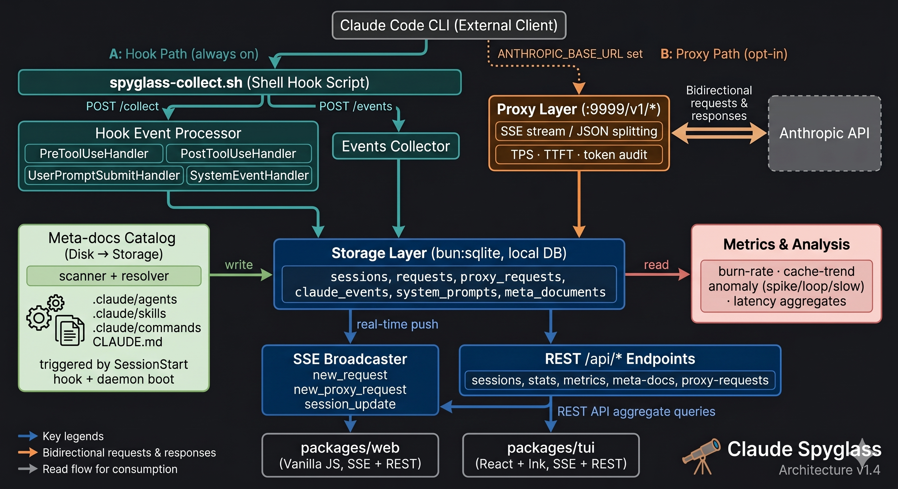

# 🔭 Spyglass

`claude-spyglass` helps you inspect what actually happens inside Claude Code sessions:

* hidden system prompt growth
* rule, skill, and agent injection propagation
* context inflation
* runtime anomalies (spike · loop · slow)
* session structure and tool activity
* API token usage, cost, and latency

Unlike most Claude tooling focused on productivity, `claude-spyglass` focuses on visibility.

---

## Why this exists

One day, a non-engineer on our team suddenly started hitting 80% context usage with a single prompt.

The prompt itself was small.
No large attachments were used.
The session was nearly empty.

Something inside the runtime had changed.

Using `claude-spyglass`, we traced the issue to:

* ~30 rule documents
* accidentally committed without proper scoping metadata
* globally injected into Claude Code system prompts

The system prompt had silently exploded.

Without runtime visibility, finding the root cause would have been extremely difficult.

---

## What spyglass helps you see

### Hidden system prompt growth

See how rules, CLAUDE.md files, hooks, and runtime injections affect the actual prompt size.

### Context inflation sources

Identify which files or runtime components consume context budget.

### Runtime tracing

Hook path — inspect:

* tool call flow and timing (PreToolUse / PostToolUse)
* session structure and event sequence
* turn-level token accumulation

Proxy path (opt-in) — inspect:

* full API request and response metadata
* input / output / cache tokens and estimated cost
* tokens per second (TPS) and time to first token (TTFT)
* system prompt content and hash

### Behavior definition catalog

Understand which agents, skills, and commands are active in a session.
Spyglass scans `.claude/agents`, `.claude/skills`, and `.claude/commands` across the project
chain and global `~/.claude`, resolves priority, and shows the effective catalog per workspace.

### Rule propagation

Understand how CLAUDE.md files and rules are injected and propagated across sessions.
See which rules are active in each project and where they originate.

### Runtime anomaly detection

Detect three categories of runtime anomaly:

* **spike** — prompt token input exceeds 200% of the session average
* **loop** — the same tool is called 3 or more times consecutively within a turn
* **slow** — tool call duration exceeds the P95 threshold across all calls

---

## Local-first by design

`claude-spyglass` runs entirely on your machine.

No hosted backend.
No remote telemetry.
No prompt uploads.

Your:

* prompts
* source code
* internal rules
* session artifacts
* runtime metadata

never leave your local environment.

---

## How it works

`claude-spyglass` collects runtime data from Claude Code through two independent paths.

**Hook path** (always active): Claude Code fires events at each turn via registered hooks.
The hook script pushes raw payloads to the local server, which normalizes and stores them.

**Proxy path** (opt-in): When `ANTHROPIC_BASE_URL` is pointed at the local server,
all API traffic is intercepted. This unlocks full request/response capture, TPS, and TTFT.

Both paths write to the same local SQLite database and stream updates to clients via SSE.

```text
── Hook Path ─────────────────────────────────────────
Claude Code CLI  →  spyglass-collect.sh  →  /collect
                                         →  /events
── Proxy Path ────────────────────────────────────────
Claude Code CLI  →  Spyglass Server :9999/v1/*  →  Anthropic API
```

This enables:

* runtime tracing
* prompt inspection
* context analysis
* token and latency telemetry
* meta-document catalog (rules, skills, CLAUDE.md)
* runtime diffing

---

## Architecture



---

## Use cases

* Investigating sudden context inflation
* Understanding hidden prompt and rule injections
* Debugging Claude Code runtime behavior
* Auditing active agents, skills, and commands per workspace
* Analyzing session structure and tool call patterns
* Measuring real API cost and token burn rate
* Detecting prompt spikes, tool loops, and slow calls
* Team-level Claude Code governance

---

## Philosophy

AI coding assistants are becoming increasingly complex runtime systems.

But most of their behavior remains invisible.

`claude-spyglass` exists to make Claude Code observable.
