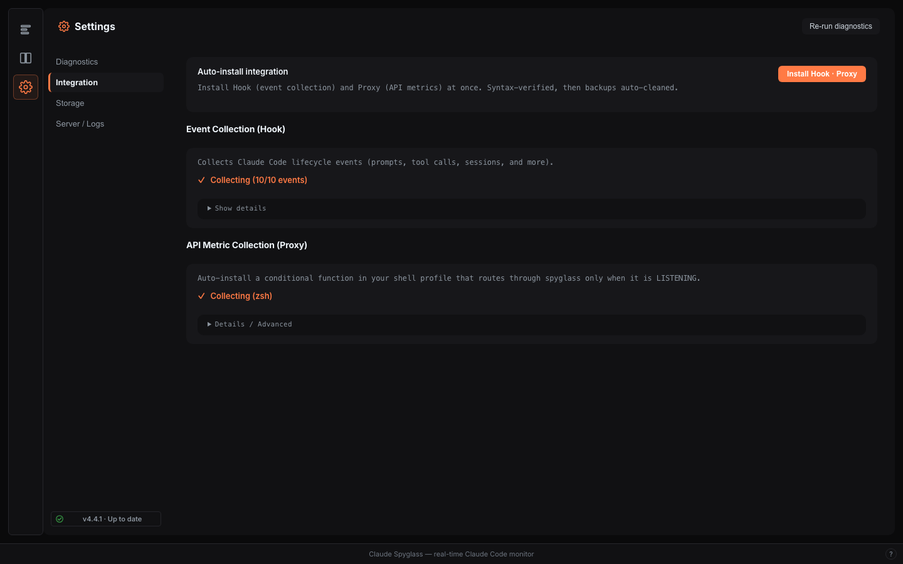
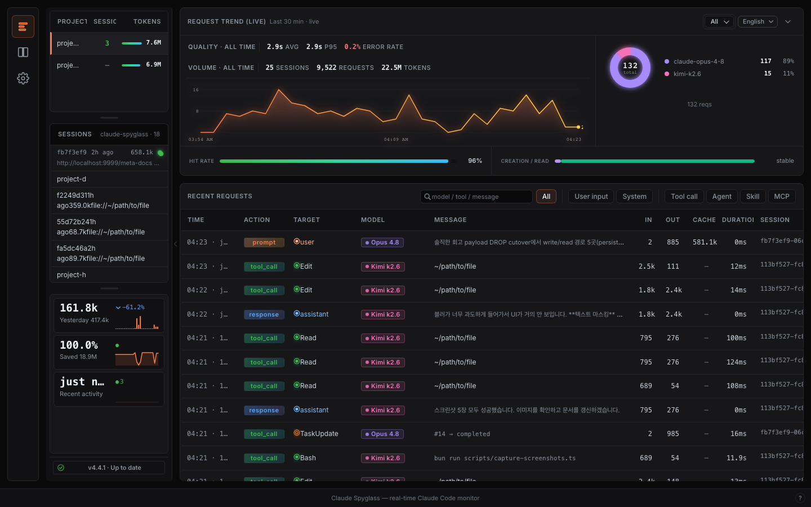
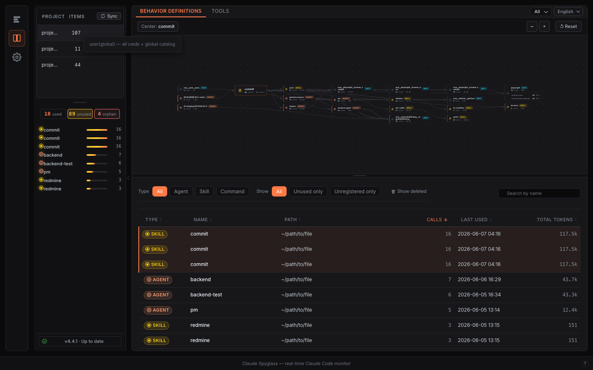

# 🔭 Spyglass

[English](README.md) | [한국어](README_ko.md) | [日本語](README_ja.md) | **简体中文**

`claude-spyglass` 帮助你观察 Claude Code 会话内部实际发生的事情:

* 隐藏的系统提示词增长
* rule、skill、agent 的注入传播
* 上下文膨胀
* 运行时异常（spike · loop · slow）
* 会话结构与工具活动
* 上下文流图（turn → tool → 元文档关系）
* API token 用量、成本与延迟

与大多数专注于生产力的 Claude 工具不同，`claude-spyglass` 专注于**可见性（visibility）**。

---

## 安装

Spyglass 支持两种部署模式 — 两者均完全受支持，并共享 `~/.spyglass/` 状态。

### 1. Headless 模式 — Homebrew Formula（推荐）

Bun standalone 服务器 + CLI + 浏览器仪表盘。

```bash
brew tap gmoon92/spyglass
brew install spyglass

# 常驻（登录时自动启动）:
brew services start spyglass
spyglass open

# 或手动模式（仅当前会话）:
spyglass start
spyglass open

# 更新:
brew upgrade spyglass
```

打包的二进制文件已内嵌 Bun 运行时 — **无需在系统中单独安装 Bun。**

### 2. Local agent 模式 — Electron 应用

将相同的后端包裹在感知 dock 的外壳中。当 dock 可见性与操作系统集成很重要时（日常在本机使用）使用它。请从 GitHub Releases 下载 DMG。

### 卸载

```bash
brew uninstall spyglass
rm -rf ~/.spyglass    # 可选 — 彻底清除本地数据
```

### 从源码构建（贡献者）

```bash
git clone https://github.com/gmoon92/claude-spyglass.git
cd claude-spyglass
bun install
bun run dev
```

服务器运行后，在仪表盘中打开 **Settings → Integration**，点击
**"Hook · Proxy 한 번에 설치"**，即可一键完成 hook 与 proxy 的设置。



---

## 为什么会有这个项目

有一天，团队里一位非工程师突然仅凭一条提示词就达到了 80% 的上下文用量。

提示词本身很小。
没有使用大型附件。
会话几乎是空的。

运行时内部发生了某些变化。

我们使用 `claude-spyglass` 将问题追踪到:

* 约 30 个 rule 文档
* 在没有适当作用域元数据的情况下被误提交
* 被全局注入到 Claude Code 的系统提示词中

系统提示词在无声中爆炸了。

如果没有运行时的可见性，找到根本原因将极其困难。

---

## spyglass 能让你看到什么



### 隐藏的系统提示词增长

查看 rule、CLAUDE.md 文件、hook 以及运行时注入如何影响实际的提示词大小。

### 上下文膨胀来源

识别哪些文件或运行时组件在消耗上下文预算。

### 运行时追踪

Hook 路径 — 可观察:

* 工具调用的流程与时序（PreToolUse / PostToolUse）
* 会话结构与事件顺序
* turn 级别的 token 累积

Proxy 路径（opt-in）— 可观察:

* 完整的 API 请求与响应元数据
* input / output / cache token 与估算成本
* 每秒 token 数（TPS）与首 token 时间（TTFT）
* 系统提示词内容与哈希

### 上下文流图

查看会话如何作为关系图实际展开，而不仅仅是一份扁平的日志。
turn → 工具调用 → 元文档的边由后台 sync worker 从 SQLite 流式传输到本地嵌入式
Ladybug 图中，因此仪表盘可以展示祖先/后代流、hot path，以及某次工具调用
拉入了哪些 rule 或 agent。

### Behavior definition 目录

了解会话中有哪些 agent、skill、command 处于活动状态。
Spyglass 会在项目链与全局 `~/.claude` 范围内扫描 `.claude/agents`、`.claude/skills`、
`.claude/commands`，解析优先级，并按工作区展示有效的目录。



### Rule 传播

了解 CLAUDE.md 文件与 rule 如何在会话之间被注入和传播。
查看每个项目中哪些 rule 处于活动状态，以及它们源自何处。

### 运行时异常检测

检测三类运行时异常:

* **spike** — 提示词输入 token 超过会话平均值的 200%
* **loop** — 同一工具在一个 turn 内连续被调用 3 次或以上
* **slow** — 工具调用耗时超过所有调用的 P95 阈值

---

## 设计原则: Local-first

`claude-spyglass` 完全运行在你自己的机器上。

没有托管后端。
没有远程遥测。
没有提示词上传。

你的:

* 提示词
* 源代码
* 内部 rule
* 会话产物
* 运行时元数据

绝不会离开你的本地环境。

---

## 工作原理

`claude-spyglass` 通过两条独立的路径从 Claude Code 收集运行时数据。

**Hook 路径**（始终活动）: Claude Code 通过已注册的 hook 在每个 turn 触发事件。
hook 脚本将原始 payload 推送到本地服务器，服务器对其进行归一化并存储。

**Proxy 路径**（opt-in）: 当 `ANTHROPIC_BASE_URL` 指向本地服务器时，
所有 API 流量都会被拦截。这将解锁完整的请求/响应捕获、TPS 与 TTFT。

两条路径都写入同一个本地 SQLite 数据库。更新通过 SSE（`GET /events`）流式推送到
客户端，后台 sync worker 将数据投影到 Ladybug 图中。

```text
── Hook Path (always on) ──────────────────────────────
Claude Code CLI
  →  spyglass-collect.sh
        →  POST /collect   (UserPromptSubmit · Pre/PostToolUse)
        →  POST /events    (SessionStart · Stop · SessionEnd · …)
── Proxy Path (opt-in) ────────────────────────────────
Claude Code CLI  →  Spyglass Server :9999/v1/*  →  Anthropic API
── Storage & streaming ────────────────────────────────
both paths  →  ~/.spyglass/spyglass.db (SQLite)
            →  SSE  GET /events                (live dashboard push)
            →  graph sync worker  →  Ladybug context-flow graph
```

这使得以下成为可能:

* 运行时追踪
* 提示词检查
* 上下文分析
* token 与延迟遥测
* 元文档目录（rule、skill、CLAUDE.md）
* 运行时 diffing

---

## 架构


---

## 使用场景

* 调查突发的上下文膨胀
* 理解隐藏的提示词与 rule 注入
* 调试 Claude Code 运行时行为
* 审计每个工作区中活动的 agent、skill、command
* 分析会话结构与工具调用模式
* 测量真实的 API 成本与 token 消耗速率
* 检测提示词 spike、工具 loop 与 slow 调用
* 团队级别的 Claude Code 治理

---

## 理念

AI 编程助手正变得越来越像复杂的运行时系统。

但它们的大部分行为仍然是不可见的。

`claude-spyglass` 的存在，就是为了让 Claude Code 变得可观测（observable）。
