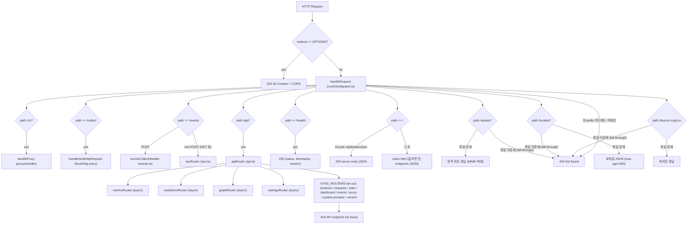

# claude-spyglass HTTP API & SSE 레퍼런스

claude-spyglass 서버(`packages/server`)가 제공하는 모든 HTTP 엔드포인트와 SSE 스트림을 정리한 문서입니다. 본 문서는 실제 코드(`packages/server/src/runtime/dispatch.ts`, `api.ts`, `routes/*`, `metrics/router.ts`, `sse.ts`, `events.ts`, `hook/http-entry.ts`, `proxy/handler/index.ts`)를 기반으로 작성되었습니다.

> 연관 문서: [아키텍처 개요](./architecture.md) · [데이터 흐름](./data-flow.md) · [Hook 연동](./hooks-integration.md) · [메트릭/분석](./metrics-analytics.md) · [설정/환경변수](./configuration.md)

### 이 문서 읽는 법

- **빠른 조회**: §2 엔드포인트 인덱스에서 카테고리별 표로 경로를 찾고, 상세 명세는 §3 이후 해당 절로 이동합니다.
- **연동/실험**: §20에 모든 cURL 예제가 한 곳에 모여 있습니다.
- **에러 처리**: §18에 표준 응답 envelope와 상태 코드를 정리했습니다.

### 약어

- **SSE**: Server-Sent Events. 서버가 클라이언트에 단방향으로 이벤트를 푸시하는 HTTP 스트리밍 프로토콜.
- **CORS**: Cross-Origin Resource Sharing. 브라우저의 동일 출처 정책을 완화하는 HTTP 헤더 규약.
- **REST**: REpresentational State Transfer. 자원 단위 URL과 HTTP 메서드 의미론을 따르는 API 스타일.
- **TTFT**: Time To First Token. 모델 응답의 첫 토큰까지 걸린 시간.
- **SSoT**: Single Source of Truth. 단일 진실 공급원.

---

## 1. 개요

이 절은 서버 런타임 정보, 공통 응답 포맷, CORS 정책을 다룹니다.

### 1.1 서버 정보

| 항목 | 값 | 비고 |
| --- | --- | --- |
| 런타임 | **Bun** (`Bun.serve`) | |
| 진입점 | `packages/server/src/index.ts` → `runtime/daemon.ts#dispatchDaemonCommand()` → `runtime/lifecycle.ts#startServer()` | |
| 메인 라우터 | `packages/server/src/runtime/dispatch.ts` → `handleRequest()` | |
| 기본 포트 | **9999** | `SPGLASS_PORT` 환경변수로 변경 |
| 기본 호스트 | **127.0.0.1** | `SPGLASS_HOST` 환경변수로 변경 |
| 기본 DB 경로 | `~/.spyglass/spyglass.db` | `SPGLASS_DB_PATH` 환경변수로 변경 |
| 인증 | **없음** | 로컬 데몬 가정. 모든 라우트가 인증 없이 응답 |
| SSE 유지 | `idleTimeout: 0` | Bun 기본 10초 비활성화 |

`handleRequest()`는 최상위 경로 prefix로 도메인 핸들러를 라우팅하고, `/api/*`는 `apiRouter()`가 다시 도메인별 라우터로 fan-out합니다.



`apiRouter()`는 async 라우터(metrics → meta-docs → graph → settings)를 먼저 차례로 await한 뒤, 동기 `SYNC_ROUTERS` 배열(sessions, requests, stats, dashboard, events, proxy, system-prompts, version)을 fan-out하여 첫 non-null 응답을 반환합니다.

### 1.2 Base URL

```
http://127.0.0.1:9999
```

### 1.3 응답 포맷

대부분의 `/api/*` 라우트는 다음 공통 envelope를 따릅니다 (`packages/server/src/routes/_shared.ts`).

```jsonc
{
  "success": true,
  "data": <T>,
  "meta": {            // 선택, 라우트별 상이
    "total": 100,
    "limit": 100,
    "offset": 0,
    "p95DurationMs": 1234,
    "prologue_count": 0,
    "implicit_turn": false
  },
  "error": "string"    // success=false 일 때
}
```

`/api/metrics/*`는 같은 envelope에 `meta` 필드가 시간 윈도우 정보로 채워집니다 (`MetricMeta`: `range`, `from`, `to`, `generated_at`).

모든 응답은 `Access-Control-Allow-Origin: *` 헤더를 포함합니다.

### 1.4 CORS / OPTIONS

`OPTIONS` 메서드는 모든 경로에서 `204 No Content`로 응답하며 다음 헤더를 반환합니다.

```
Access-Control-Allow-Origin: *
Access-Control-Allow-Methods: GET, POST, OPTIONS
Access-Control-Allow-Headers: Content-Type
```

---

## 2. 엔드포인트 인덱스

전체 라우트를 카테고리별로 분류한 빠른 조회 표입니다. **모든 라우트는 인증이 없으며 로컬 루프백 가정으로 동작**하므로 인증 컬럼은 생략했습니다.

### 2.1 시스템 / 정적 파일

| Method | Path | 설명 |
| --- | --- | --- |
| GET | `/` | Accept 헤더에 따라 웹 대시보드 HTML 또는 서버 메타 JSON |
| GET | `/health` | 헬스체크 |
| GET | `/assets/*` | 정적 자산 (`packages/web/assets/`) |
| GET | `/locales/*` | i18n 로케일 JSON (캐시 300s) |
| GET | `/favicon.svg`, `/favicon.ico` | 파비콘 |

### 2.2 데이터 수집 (Hook & Wildcard)

| Method | Path | 설명 |
| --- | --- | --- |
| POST | `/collect` | Claude Code 훅 raw payload 수신 (PreToolUse / PostToolUse / UserPromptSubmit) |
| POST | `/events` | Wildcard 훅 raw payload 수신 (SessionStart/End, Stop, Notification, …) |

### 2.3 SSE 스트림

| Method | Path | 설명 |
| --- | --- | --- |
| GET | `/events` | Server-Sent Events 스트림 (실시간 broadcast) |

### 2.4 Proxy

| Method | Path | 설명 |
| --- | --- | --- |
| ANY | `/v1/*` | Anthropic API 프록시 (모델 prefix별 upstream 자동 라우팅) |

### 2.5 대시보드

| Method | Path | 설명 |
| --- | --- | --- |
| GET | `/api/dashboard` | 대시보드 종합 데이터 (캐시 30s + 5s debounce 무효화) |

### 2.6 통계 (`/api/stats/*`)

| Method | Path | 설명 |
| --- | --- | --- |
| GET | `/api/stats/sessions` | 세션 집계 |
| GET | `/api/stats/requests` | 요청 집계 |
| GET | `/api/stats/projects` | 프로젝트 Top-N |
| GET | `/api/stats/tools` | 도구 사용 Top-N (`has_low_confidence` 파생) |
| GET | `/api/stats/by-type` | 요청 타입별 집계 |
| GET | `/api/stats/strip` | 오늘 Command Center Strip (P95 / error rate) |
| GET | `/api/stats/cache` | 캐시 히트율 / 토큰 절감 |
| GET | `/api/stats/proxy` | proxy_requests hourly 사전 집계 |
| GET | `/api/stats/proxy/by-model` | 모델별 proxy hourly 집계 |

### 2.7 세션 / Request / Event

| Method | Path | 설명 |
| --- | --- | --- |
| GET | `/api/sessions` | 세션 목록 |
| GET | `/api/sessions/active` | 활성 세션 |
| GET | `/api/sessions/:id` | 세션 단건 |
| GET | `/api/sessions/:id/requests` | 세션별 요청 목록 (정규화) |
| GET | `/api/sessions/:id/stats` | 세션별 요청 통계 |
| GET | `/api/sessions/:id/turns` | 세션 turn 구조 (prologue 포함) |
| GET | `/api/sessions/:id/tool-stats` | 세션별 도구 성능 |
| GET | `/api/sessions/:id/events` | 세션별 raw 이벤트 |
| GET | `/api/projects/:name/sessions` | 프로젝트별 세션 |
| GET | `/api/projects/:name/tool-stats` | 프로젝트별 도구 통계 (ADR-004) |
| GET | `/api/requests` | 최근 요청 (정규화) |
| GET | `/api/requests/top` | 토큰 사용 Top-N |
| GET | `/api/requests/by-type/:type` | 타입별 요청 (정규화) |
| GET | `/api/events` | 최근 wildcard 이벤트 |
| GET | `/api/events/by-type/:type` | 이벤트 타입별 조회 |
| GET | `/api/events/stats` | 이벤트 타입 집계 |

### 2.8 Proxy 데이터

| Method | Path | 설명 |
| --- | --- | --- |
| GET | `/api/proxy-requests` | proxy 요청 목록 (전체 또는 session_id별) |
| GET | `/api/proxy-requests/stats` | proxy 요청 집계 (since 기반) |
| GET | `/api/proxy-requests/:id/messages` | payload(zstd) 복호 후 messages 추출 |

### 2.9 System Prompts 카탈로그

| Method | Path | 설명 |
| --- | --- | --- |
| GET | `/api/system-prompts` | dedup 카탈로그 목록 |
| GET | `/api/system-prompts/:hash` | 본문 lazy-fetch (SHA-256 hex 64자) |
| GET | `/api/system-prompts/:hash/refs` | 이 hash를 참조한 proxy_requests 목록 |

### 2.10 Meta Documents (Behavior Definitions)

| Method | Path | 설명 |
| --- | --- | --- |
| GET | `/api/meta-docs` | agent / skill / command 카탈로그 + 사용 집계 |
| POST | `/api/meta-docs/refresh` | 동기화 수동 재실행 |

### 2.11 Metrics (시계열 / 시각 지표 `/api/metrics/*`)

| Method | Path | 설명 |
| --- | --- | --- |
| GET | `/api/metrics/model-usage` | 모델 사용량 비율 (Donut) |
| GET | `/api/metrics/cache-matrix` | 모델별 캐시 적중률 |
| GET | `/api/metrics/context-usage` | 컨텍스트 사용률 분포 히스토그램 |
| GET | `/api/metrics/activity-heatmap` | 7×24 활동 격자 |
| GET | `/api/metrics/turn-distribution` | 세션당 turn 수 + Compaction |
| GET | `/api/metrics/agent-depth` | 에이전트 깊이 분포 |
| GET | `/api/metrics/tool-categories` | Tool 카테고리 분포 |
| GET | `/api/metrics/anomalies-timeseries` | Anomaly 시계열 |
| GET | `/api/metrics/burn-rate` | 24h × 1h burn rate |
| GET | `/api/metrics/cache-trend` | 24h × 1h cache hit rate |
| GET | `/api/metrics/proxy-trend` | 24h × 1h proxy 응답시간 / 에러율 / 비용 |

### 2.12 Graph Projection (`/api/graph/*`)

Ladybug 그래프 DB 단일 SoT. 모든 라우트는 GET이며 비-GET은 `405`.

| Method | Path | 설명 |
| --- | --- | --- |
| GET | `/api/graph/status` | 그래프 운영 상태 (mode / circuit / sync worker) |
| GET | `/api/graph/sessions/:id/initial` | 세션 초기 hydrate (`recentTurns` 쿼리) |
| GET | `/api/graph/turns/:id/neighbors` | BFS depth hop |
| GET | `/api/graph/turns/:id/path` | placeholder |
| GET | `/api/graph/unified-flow` | 메타 문서 통합 flow (ancestor+center+descendant+after) |
| GET | `/api/graph/dlq` | Dead Letter Queue 목록 (sync 실패 행) |
| POST | `/api/graph/dlq/resurrect` | DLQ 행 재처리 |

### 2.13 Settings (`/api/settings/*`)

웹 대시보드 설정 패널용. 진단 / Hook 자동 병합 / Graph DB 설치·모드 / Proxy 셸 함수 설치 / 로그 조회.

| Method | Path | 설명 |
| --- | --- | --- |
| GET | `/api/settings/diag` | 전체 진단 (binary 버전 + hooks + graph + ports) |
| GET | `/api/settings/hooks/preview` | Hook 병합 미리보기 (diff, 파일 미수정) |
| POST | `/api/settings/hooks/apply` | 백업 + 병합 + atomic write |
| POST | `/api/settings/hooks/restore` | 백업에서 복원 |
| POST | `/api/settings/graph/mode` | 그래프 모드 전환 (`persistent` 기본 true → `server-config.json` 영속 저장, `persistent:false`만 런타임-only) |
| GET | `/api/settings/graph-db/status` | Ladybug 설치/설정 상태 |
| POST | `/api/settings/graph-db/install` | Ladybug 의존성 설치 (auto 전략: bun.lock 존재 + bun 가용 시 bun → npm 폴백 → brew) |
| GET | `/api/settings/sqlite/info` | sqlite3 바이너리 / 최신 마이그레이션 파일 정보 |
| GET | `/api/settings/proxy/snippet` | claude() 조건부 프록시 함수 스니펫 (`shell` 쿼리) |
| GET | `/api/settings/proxy/status` | 셸 프로파일의 proxy 함수 설치 여부 |
| POST | `/api/settings/proxy/install` | proxy 함수 셸 프로파일 설치 |
| POST | `/api/settings/proxy/restore` | proxy 함수 제거/복원 |
| GET | `/api/settings/logs` | `~/.spyglass/logs/` 디렉토리 스캔 |

### 2.14 버전 / 업데이트

| Method | Path | 설명 |
| --- | --- | --- |
| GET | `/api/version` | 현재 / 최신 버전 + 업데이트 가용 여부 |
| POST | `/api/update` | `git pull --ff-only` 수행 후 캐시 갱신 |

---

## 3. 시스템 / 정적 파일

웹 대시보드 진입점, 헬스체크, 정적 자산(`assets/`, `locales/`, 파비콘)을 제공합니다.

### 3.1 `GET /`

`Accept: application/json`이 포함되면 메타 JSON, 그 외에는 `packages/web/index.html`을 반환합니다.

**JSON 응답 (Accept: application/json)**

```json
{
  "name": "spyglass",
  "version": "0.1.0",
  "endpoints": [
    "/health",
    "/api/dashboard",
    "/api/stats/sessions",
    "/api/stats/requests",
    "/api/stats/cache",
    "/api/stats/proxy",
    "/api/stats/proxy/by-model",
    "/api/metrics/cache-trend",
    "/events",
    "/collect"
  ]
}
```

### 3.2 `GET /health`

```json
{
  "status": "ok",
  "timestamp": 1715840000000,
  "version": "0.1.0"
}
```

### 3.3 정적 자산

- `/assets/<path>` → `packages/web/assets/<path>` 서빙. 확장자별 MIME: `.js` → `application/javascript`, `.css` → `text/css`, `.svg` → `image/svg+xml`, `.ico` → `image/x-icon`.
- `/locales/<path>` → `packages/web/locales/<path>`. `Cache-Control: public, max-age=300` 헤더 동봉.
- `/favicon.svg`, `/favicon.ico` → `packages/web/favicon.*` 직접 경로로 파비콘 서빙.

존재하지 않는 정적 경로는 최종 fall-through로 `404 {"error":"Not found","path":"..."}`.

---

## 4. 데이터 수집 (Hook ingest)

클라이언트 측 hook 스크립트(`spyglass-collect.sh`)가 stdin으로 받은 raw payload를 그대로 보내면, 서버는 이벤트 종류별 핸들러로 라우팅하여 DB에 적재하고 SSE로 브로드캐스트합니다. 두 진입점이 있습니다 — `/collect`(도구 사용 hook), `/events`(wildcard 이벤트).

### 4.1 `POST /collect` — 도구 사용 hook

`packages/server/src/hook/http-entry.ts` → `handleHookHttpRequest()`가 처리하고 `dispatcher.ts`가 hook event 이름으로 핸들러를 선택합니다.

**Body 예시 (`ClaudeHookPayload`)**

```json
{
  "hook_event_name": "PostToolUse",
  "session_id": "abc-1234",
  "transcript_path": "/Users/x/.claude/projects/.../transcript.jsonl",
  "cwd": "/Users/x/workspace/foo",
  "tool_name": "Read",
  "tool_use_id": "toolu_01ABC",
  "tool_input": { "file_path": "/tmp/example.ts" },
  "tool_response": { "type": "text", "text": "..." },
  "permission_mode": "default",
  "agent_id": null,
  "agent_type": null,
  "duration_ms": 123
}
```

지원되는 `hook_event_name`:

- `PreToolUse` → `handlers/pre-tool-use.handler.ts` (`event_type='pre_tool'`로 임시 INSERT, SSE broadcast는 하지 않음)
- `PostToolUse` → `handlers/post-tool-use.handler.ts` (같은 `tool_use_id`의 pre_tool 행 UPDATE → `event_type='tool'`)
- `UserPromptSubmit` → `handlers/user-prompt-submit.handler.ts` (`request_type='prompt'`)
- 매칭되지 않으면 fallback `SystemEventHandler`가 `request_type='system'`으로 보존.

**응답 (`HookProcessResult`)**

```json
{
  "success": true,
  "request_id": "post-1715840000000-deadbeef",
  "session_id": "abc-1234",
  "saved": true
}
```

실패: `400` + `{ "success": false, "error": "Invalid JSON payload" }`.

성공 시 서버는 `invalidateDashboardCache()`를 호출하여 다음 대시보드 요청에서 fresh 응답을 보장합니다.

### 4.2 `POST /events` — Wildcard hook (claude_events)

`packages/server/src/events.ts` → `eventsCollectHandler()`. SessionStart / SessionEnd / Stop / Notification 등 도구 호출이 아닌 wildcard 이벤트를 `claude_events` 테이블에 저장합니다.

**Body 예시 (`RawHookPayload`)**

```json
{
  "hook_event_name": "SessionEnd",
  "session_id": "abc-1234",
  "transcript_path": "/Users/x/.claude/projects/.../transcript.jsonl",
  "cwd": "/Users/x/workspace/foo",
  "permission_mode": "default",
  "source": "user",
  "reason": "user_exit"
}
```

특수 처리:

- `SessionStart` → 세션 reactivate + `syncMetaDocsCwd()` 호출 + SSE `session_update` 브로드캐스트
- `SessionEnd` → `endSession()` + SSE `session_update {action:'ended'}` 브로드캐스트
- `Stop` (with `last_assistant_message`) → transcript 백필 + `requests` 테이블에 `type='response'` 레코드 INSERT + SSE `new_request` 브로드캐스트

**응답**

```json
{ "success": true, "event_id": "uuid-..." }
```

JSON 파싱 실패 시 `400 {"error":"Invalid JSON"}`, 필수 필드 누락 시 `400 {"error":"Missing required fields: hook_event_name, session_id"}`, DB 저장 실패 시 `500 {"error":"Failed to save event"}`.

---

## 5. SSE 스트림

실시간 이벤트(`new_request`, `new_proxy_request`, `session_update`)를 브로드캐스트하는 단일 엔드포인트입니다. 연결은 무한 유지되며 8초 간격으로 ping이 송출됩니다.

### 5.1 `GET /events`

`packages/server/src/sse.ts` → `sseRouter()`. Content-Type은 `text/event-stream`이며 8초 간격으로 ping이 송출됩니다.

```bash
curl -N http://127.0.0.1:9999/events
```

**연결 직후 송신 이벤트**

```
event: ping
data: {"type":"ping","timestamp":1715840000000,"data":{"message":"Connected to spyglass"}}

```

### 5.2 이벤트 타입 (`SSEEventType`)

| Type | 발행 조건 | 핵심 필드 |
| --- | --- | --- |
| `ping` | 연결 시 / 8초 주기 keep-alive | `data.message` 또는 `data.connections` |
| `new_request` | hook 채널에서 requests 테이블에 INSERT/UPDATE 발생 | `NormalizedRequest` + `session_total_tokens` + `event_phase` (§5.3) |
| `new_proxy_request` | proxy_requests 테이블에 INSERT 발생 | 별도 정리 (§5.2.1) |
| `session_update` | SessionStart / SessionEnd / 토큰 증가 | `session_id, total_tokens?, request_count?, action: 'started'\|'ended'\|'token_update', started_at?, ended_at?, project_name?` |
| `token_update` | (예약) `SSEEventType`에 정의됨 | - |
| `stats_update` | (예약) `SSEEventType`에 정의됨 | - |

#### 5.2.1 `new_proxy_request` 핵심 필드

```text
id, timestamp, method, path, status_code, response_time_ms,
model, tokens_input, tokens_output,
cache_creation_tokens, cache_read_tokens, tokens_per_second,
is_stream, messages_count, max_tokens, tools_count,
request_preview, stop_reason, response_preview,
error_type, error_message,
first_token_ms, api_request_id,
system_hash, system_byte_size,
source: 'proxy'
```

### 5.3 `new_request` 페이로드 구조

`buildNewRequestEvent()` 결과는 `NormalizedRequest` 본문에 두 메타 필드를 합칩니다.

```jsonc
{
  "type": "new_request",
  "timestamp": 1715840000000,
  "data": {
    "id": "post-1715840000000-deadbeef",
    "session_id": "abc-1234",
    "timestamp": 1715840000000,
    "type": "tool_call",
    "tool_name": "Read",
    "tool_detail": "/tmp/example.ts",
    "turn_id": "turn-...",
    "tokens_input": 0,
    "tokens_output": 0,
    "tokens_total": 0,
    "duration_ms": 123,
    "model": "claude-sonnet-4-5",
    "sub_type": null,
    "trust_level": "trusted",
    "model_fallback_applied": false,
    "event_type": "tool",
    "tool_use_id": "toolu_01ABC",
    "api_request_id": "msg_01...",
    "permission_mode": "default",
    "agent_id": null,
    "agent_type": null,
    "tool_interrupted": null,
    "tool_user_modified": null,
    "session_total_tokens": 12345,
    "event_phase": "created"
  }
}
```

`event_phase`:
- `created` — 첫 INSERT (또는 pre_tool→tool 병합 첫 노출).
- `updated` — 기존 행이 backfill/UPDATE로 갱신됨. 클라이언트는 `data-request-id`로 in-place 갱신해야 합니다 (ADR-002/ADR-007).

### 5.4 클라이언트 사용 예 (브라우저 JS)

```js
const es = new EventSource('http://127.0.0.1:9999/events');
es.addEventListener('new_request', e => {
  const ev = JSON.parse(e.data);
  console.log(ev.data.id, ev.data.event_phase);
});
es.addEventListener('new_proxy_request', e => {
  const ev = JSON.parse(e.data);
  console.log('proxy', ev.data.api_request_id);
});
es.addEventListener('session_update', e => {
  const ev = JSON.parse(e.data);
  console.log('session', ev.data.action, ev.data.session_id);
});
```

---

## 6. Anthropic Proxy

`/v1/*` 경로로 들어오는 모든 요청을 **무조건** Anthropic 또는 모델 prefix별 upstream으로 포워딩하는 투명 프록시입니다. 경로 매칭만으로 활성화되며, 조건부 헤더나 별도 활성화 플래그는 없습니다(`runtime/dispatch.ts: path.startsWith('/v1/')`).

### 6.1 `ANY /v1/*`

`packages/server/src/proxy/handler/index.ts` → `handleProxy()`가 경로 prefix `/v1/` 에 매칭된 모든 요청을 upstream으로 포워딩하면서 메트릭/SSE를 수집합니다.

upstream 선택은 `selectUpstreamUrl()`이 request body의 `model` 필드 prefix별로 처리합니다.

| 모델 prefix | Upstream (기본) | 환경변수 |
| --- | --- | --- |
| `kimi-*` | `https://api.moonshot.ai/anthropic` | `MOONSHOT_UPSTREAM_URL` |
| 커스텀 prefix | `prefix1=url1,prefix2=url2` 매핑 | `CUSTOM_UPSTREAMS` |
| 그 외 (기본) | `https://api.anthropic.com` | `ANTHROPIC_UPSTREAM_URL` |

`selectUpstreamUrl(model)`은 model 이름의 prefix가 매칭되는 첫 커스텀 upstream(`kimi-` + `CUSTOM_UPSTREAMS` 항목)을 반환하고, 매칭이 없으면 기본 upstream을 사용합니다.

**동작 흐름**

1. `buildInboundContext()` — body buffer 추출, `parseRequestBody()`, zstd 압축, `x-claude-code-session-id` 헤더에서 hook 매칭 키 추출.
2. `diagInbound()` — 진단 jsonl(`hook-payload`/`proxy-inbound`)에 기록.
3. `forwardToUpstream()` — hop-by-hop 헤더 제거 후 fetch. 연결 실패 시 `502 {"error":"proxy_connection_failed","message":"..."}`.
4. `text/event-stream` 응답 → `handleStreamResponse()` (스트리밍 통과 + clone 분석), 그 외 → `handleJsonResponse()`.
5. 최종 단계에서 `proxy_requests` 테이블에 INSERT + `broadcastNewProxyRequest()` SSE 브로드캐스트 + `invalidateDashboardCache()`.

**cURL 예시**

```bash
curl -X POST http://127.0.0.1:9999/v1/messages \
  -H "Content-Type: application/json" \
  -H "anthropic-version: 2023-06-01" \
  -H "x-api-key: $ANTHROPIC_API_KEY" \
  -H "x-claude-code-session-id: abc-1234" \
  -d '{
    "model": "claude-sonnet-4-5",
    "messages": [{"role":"user","content":"Hello"}],
    "max_tokens": 1024
  }'
```

응답은 Anthropic 원본 그대로 (streaming 포함). 응답 헤더에서 `content-encoding`/`content-length`는 제거되며 `Access-Control-Allow-Origin: *`가 추가됩니다.

---

## 7. 대시보드

웹 대시보드 초기 로딩에 필요한 종합 데이터를 한 번에 반환하는 통합 엔드포인트입니다.

### 7.1 `GET /api/dashboard`

`packages/server/src/routes/dashboard.ts`. 응답 캐시 TTL **30초**, 무효화는 **5초 debounce**로 적용됩니다.

**Query**

| 이름 | 타입 | 설명 |
| --- | --- | --- |
| `from` | ms | 범위 시작 (옵션) |
| `to` | ms | 범위 끝 (옵션) |

**응답 (`data`)**

```jsonc
{
  "summary": {
    "totalSessions": 123,
    "totalRequests": 4567,
    "totalTokens": 1234567,
    "activeSessions": 2,
    "avgDurationMs": 1432,
    "p95DurationMs": 8200,
    "errorRate": 0.012
  },
  "sessions":  { /* getSessionStats */ },
  "requests":  { /* getRequestStats */ },
  "projects":  [ /* getProjectStats top 5 */ ],
  "tools":     [ /* getToolStats top 5 */ ],
  "types":     [ /* getRequestStatsByType */ ],
  "active":    [ /* getActiveSessions */ ]
}
```

`summary`는 `getSessionStats` / `getRequestStats` / `getStripStats` / `getAvgPromptDurationMs` / `getActiveSessions` 결과만 합성하며 proxy 관련 지표는 포함하지 않습니다. proxy hourly 집계(`getProxyHourlyStats`)는 본 엔드포인트가 아니라 `/api/stats/proxy`(§8.8)에서 제공됩니다.

`activeSessions`는 `LIVE_STALE_THRESHOLD_MS`(storage 상수)를 기준으로 판정하며, 캐시 키에 `floor(now / LIVE_STALE_THRESHOLD_MS)`가 포함되어 시간 경과만으로 자연 무효화됩니다.

---

## 8. 통계 (`/api/stats/*`)

세션·요청·도구·캐시·프록시 등 도메인별 집계를 제공합니다. 구현은 `packages/server/src/routes/stats.ts`이며 캐시는 적용되지 않습니다.

### 8.1 `GET /api/stats/sessions`

`getSessionStats()` 결과를 그대로 반환합니다: `{ total_sessions, total_tokens, ... }`.

### 8.2 `GET /api/stats/requests`

`getRequestStats()` 결과를 그대로 반환합니다: `{ total_requests, total_tokens, avg_duration_ms, ... }`.

### 8.3 `GET /api/stats/projects`

**Query**: `limit` (기본 10)

배열로 반환: `[{ project_name, session_count, request_count, total_tokens, ... }]`.

### 8.4 `GET /api/stats/tools`

**Query**: `limit` (기본 10)

`getToolStats()` 결과에 `has_low_confidence: boolean`(confidence_low_count + confidence_error_count > 0) 파생 필드를 추가하여 반환.

### 8.5 `GET /api/stats/by-type`

`getRequestStatsByType()` — `[{ type, count, total_tokens, ... }]`.

### 8.6 `GET /api/stats/strip`

오늘(자정 ~ 현재)의 Command Center Strip 지표. `{ p95_duration_ms, error_rate, ... }`. 비용($) 환산은 노출하지 않습니다.

### 8.7 `GET /api/stats/cache`

**Query**: `from`, `to` (ms, 옵션)

`getCacheStats()` — 캐시 히트율 / 토큰 절감.

### 8.8 `GET /api/stats/proxy`

**Query**: `from`, `to` (ms, 옵션)

`getProxyHourlyStats()` — 응답시간, TTFT, 비용, 에러율.

### 8.9 `GET /api/stats/proxy/by-model`

**Query**: `from`, `to` (ms, 옵션)

`getProxyHourlyStatsByModel()` — 모델별 cost / latency 비교.

---

## 9. 세션 (`/api/sessions/*`, `/api/projects/*`)

세션 단건 조회, 세션 안의 요청·turn·도구 통계·이벤트, 프로젝트 단위 세션 목록을 다룹니다. 구현은 `packages/server/src/routes/sessions.ts`이며 라우트 매칭 우선순위 보존을 위해 catch-all `:id`는 항상 마지막에 매칭됩니다.

### 9.1 `GET /api/sessions`

**Query**: `limit` (기본 100), `from`, `to`.

```jsonc
{
  "success": true,
  "data": [/* Session[] */],
  "meta": { "total": 50, "limit": 100 }
}
```

### 9.2 `GET /api/sessions/active`

진행 중 세션 (last_activity_at이 stale threshold 내).

### 9.3 `GET /api/sessions/:id`

세션 단건. 없으면 `404 {"success":false,"error":"Session not found"}`.

### 9.4 `GET /api/sessions/:id/requests`

**Query**: `limit` (기본 100)

`NormalizedRequest[]`로 반환 (ADR-001).

### 9.5 `GET /api/sessions/:id/stats`

세션별 요청 통계.

### 9.6 `GET /api/sessions/:id/turns`

ADR-006: turn 단위로 인터리빙된 `NormalizedTurnItem[]`. `turn_id`가 NULL인 orphan 행은 첫 turn에 흡수되거나, prompt 0건이면 implicit turn `T1`로 합성됩니다.

```jsonc
{
  "success": true,
  "data": [/* NormalizedTurnItem */],
  "prologue": [],
  "meta": { "total": 5, "prologue_count": 0, "implicit_turn": false }
}
```

### 9.7 `GET /api/sessions/:id/tool-stats`

세션 안에서의 도구별 성능. 각 행에 `has_low_confidence` 파생.

### 9.8 `GET /api/sessions/:id/events`

**Query**: `limit` (기본 100)

`claude_events` 테이블의 wildcard 이벤트 시퀀스.

### 9.9 `GET /api/projects/:name/sessions`

**Query**: `limit` (기본 100), `from`, `to`.

### 9.10 `GET /api/projects/:name/tool-stats`

ADR-004 meta-docs-tool-stats. 프로젝트 단위 도구 매트릭스. `has_low_confidence` 파생 포함.

---

## 10. Request / Event 도메인

`requests` 테이블(정규화된 요청)과 `claude_events` 테이블(wildcard 이벤트)을 조회하는 라우트 모음입니다.

### 10.1 `GET /api/requests`

`packages/server/src/routes/requests.ts`.

**Query**: `limit` (기본 100), `from`, `to`.

```jsonc
{
  "success": true,
  "data": [/* NormalizedRequest[] */],
  "meta": { "total": 100, "limit": 100, "p95DurationMs": 8200 }
}
```

### 10.2 `GET /api/requests/top`

토큰 사용량 상위 N개.

**Query**: `limit` (기본 10), `session_id` (옵션)

### 10.3 `GET /api/requests/by-type/:type`

`:type ∈ { prompt | tool_call | system | response }`.

**Query**: `limit` (기본 100), `offset` (기본 0), `from`, `to`.

### 10.4 `GET /api/events`

`packages/server/src/routes/events.ts`. `claude_events` 테이블의 최근 N건.

**Query**: `limit` (기본 100)

### 10.5 `GET /api/events/by-type/:type`

**Query**: `limit` (기본 100). `:type` 예: `SessionStart`, `Stop`, `Notification` 등.

### 10.6 `GET /api/events/stats`

`getEventStats()` — 이벤트 타입별 카운트.

---

## 11. Proxy 데이터 (`/api/proxy-requests/*`)

`/v1/*` 프록시가 적재한 `proxy_requests` 테이블을 조회합니다. payload는 zstd 압축 BLOB이므로 본문 추출은 별도 엔드포인트(`/:id/messages`)에서 처리합니다. 구현은 `packages/server/src/routes/proxy.ts`.

### 11.1 `GET /api/proxy-requests`

**Query**: `limit` (기본 50), `session_id` (옵션)

`session_id` 지정 시 해당 세션의 proxy 요청을 시간 오름차순으로 반환합니다 (LLM Input 선택기용).

### 11.2 `GET /api/proxy-requests/stats`

**Query**: `since` (ms, 기본 `Date.now() - 24h`)

집계: 응답시간/TTFT/비용/에러율.

### 11.3 `GET /api/proxy-requests/:id/messages`

`proxy_requests.payload`(zstd BLOB)를 복호하고 JSON body의 `messages` 배열을 추출합니다.

**응답**

```jsonc
{
  "success": true,
  "data": {
    "id": "uuid-...",
    "system_hash": "abc...64hex",
    "system_byte_size": 12345,
    "messages": [/* anthropic messages */],
    "decode_error": "..."  // 디코드 실패 시에만
  }
}
```

본문(system content)은 미동봉 — `/api/system-prompts/:hash`로 lazy-fetch합니다.

`404`: `{"success":false,"error":"proxy request not found"}`.

---

## 12. System Prompts 카탈로그

dedup된 system prompt 메타 목록과 본문 lazy-fetch를 제공합니다. 구현은 `packages/server/src/routes/system-prompts.ts`이며 ADR-004 옵션 B(라이브러리 패널) + ADR-005(28KB system 본문 미동봉) 규약을 따릅니다.

### 12.1 `GET /api/system-prompts`

**Query**

| 이름 | 값 | 설명 |
| --- | --- | --- |
| `limit` | int, 최대 500, 기본 100 | 페이지 크기 |
| `orderBy` | `last_seen_at` (default) \| `ref_count` \| `byte_size` \| `first_seen_at` | 정렬 |

본문(content)은 응답에 포함되지 않으며 메타만 반환합니다.

### 12.2 `GET /api/system-prompts/:hash`

`hash`는 SHA-256 hex 64자. 형식 위반 시 `400 {"success":false,"error":"Invalid hash format (expected 64-char hex)"}`. 미존재 시 `404`.

### 12.3 `GET /api/system-prompts/:hash/refs`

이 hash를 참조한 proxy_requests 목록 (payload BLOB 제외, 슬림 컬럼만). 최신순.

**Query**: `limit` (최대 500, 기본 100)

---

## 13. Meta Documents (Behavior Definitions)

Claude Code의 동작을 정의하는 agent / skill / command 카탈로그를 사용 집계와 함께 노출합니다. 구현은 `packages/server/src/routes/meta-docs.ts`이며, `meta_documents` 카탈로그에 사용 카운트를 LEFT JOIN으로 결합합니다.

### 13.1 `GET /api/meta-docs`

**Query**

| 이름 | 값 | 설명 |
| --- | --- | --- |
| `type` | `agent` \| `skill` \| `command` | 종류 필터 |
| `source_root` | absolute path \| `null` | `'null'`/빈 문자열이면 글로벌만 |
| `project` | string | 프로젝트(이름) 필터. `null`/빈 값이면 미적용 |
| `includeDeleted` | `1` | soft-deleted 포함 (기본 false) |
| `fromTs`, `toTs` | ms | 사용 집계 시간 윈도우 (옵션) |

```jsonc
{
  "success": true,
  "data": [/* MetaDocWithUsage[] */],
  "meta": { "total": 42 }
}
```

### 13.2 `POST /api/meta-docs/refresh`

**Body**

```jsonc
{
  "scope": "global" | "project" | "all",   // 기본 "all"
  "cwd": "/abs/path",                       // scope=project 시 필수
  "includeKnownCwds": false,                // true 시 알려진 모든 cwd 일괄 동기화
  "force": false                            // 5s throttle 우회
}
```

**응답**

```jsonc
{
  "success": true,
  "data": {
    "global":  { /* SyncResult */ },
    "project": { /* SyncResult */ },     // body.cwd가 있을 때
    "cwds":    [ { "cwd": "/x", "result": {...}, "error": "..." } ]
  }
}
```

`scope=project`인데 `cwd`가 없으면 `400 {"success":false,"error":"cwd is required for scope=project"}`.

---

## 14. Metrics (`/api/metrics/*`)

대시보드 차트(도넛·히트맵·시계열 등)에 사용되는 사전 집계 시각화 지표 라우트 모음입니다. 모든 라우트는 `meta` 필드에 시간 윈도우 정보(`MetricMeta`)를 동봉합니다. 구현은 `packages/server/src/metrics/router.ts`.

### 14.1 공통 쿼리 파라미터

| 이름 | 값 | 설명 |
| --- | --- | --- |
| `range` | `24h` (default) \| `7d` \| `30d` \| `all` | 시간 범위 라벨 |
| `from`, `to` | ms | 명시 시 range보다 우선 (라벨은 `custom`) |

### 14.2 공통 응답 envelope

```jsonc
{
  "success": true,
  "data": <T>,
  "meta": {
    "range": "24h",
    "from": 1715840000000,
    "to":   1715926400000,
    "generated_at": 1715926400500
  }
}
```

가격(USD) 환산은 노출하지 않으며 토큰/카운트/비율(0~1) 단위만 사용합니다.

### 14.3 `GET /api/metrics/model-usage`

```jsonc
[
  { "model": "claude-sonnet-4-5", "request_count": 1234, "total_tokens": 567890, "avg_tokens": 460, "percentage": 73.5 }
]
```

### 14.4 `GET /api/metrics/cache-matrix`

```jsonc
[
  { "model": "claude-sonnet-4-5", "total_input": 12345, "cache_read": 5678, "cache_create": 901, "hit_rate": 0.3149 }
]
```

공식: `hit_rate = cache_read / (total_input + cache_read)` (소수 4자리).

### 14.5 `GET /api/metrics/context-usage`

```jsonc
{
  "buckets": [
    { "label": "<50%",   "range": [0, 0.5],   "session_count": 12 },
    { "label": "50-80%", "range": [0.5, 0.8], "session_count": 5 },
    { "label": "80-95%", "range": [0.8, 0.95],"session_count": 3 },
    { "label": ">95%",   "range": [0.95, null], "session_count": 1 }
  ],
  "total": 21,
  "model_limits": [/* getAllModelLimits */]
}
```

`anthropic-beta`를 반영하여 1M opt-in 세션의 사용률을 정확히 계산하며, `model_limits` 테이블을 윈도우 분모 SSoT로 사용합니다 (`getAllModelLimits(db)`).

### 14.6 `GET /api/metrics/activity-heatmap`

```jsonc
{
  "cells": [[0,0,...,12], [...], ...],            // 7행 × 24열
  "total": 4567,
  "weekday_labels": ["Sun","Mon","Tue","Wed","Thu","Fri","Sat"]
}
```

### 14.7 `GET /api/metrics/turn-distribution`

```jsonc
{
  "turn_distribution": [
    { "bucket": "1-3",   "session_count": 30 },
    { "bucket": "4-10",  "session_count": 20 },
    { "bucket": "11-25", "session_count": 8 },
    { "bucket": "26-50", "session_count": 2 },
    { "bucket": "51+",   "session_count": 1 }
  ],
  "compaction_rate": 0.0461,
  "compacted_sessions": 3,
  "total_sessions": 65
}
```

### 14.8 `GET /api/metrics/agent-depth`

```jsonc
{
  "distribution": [{ "depth": 0, "request_count": 50 }, { "depth": 1, "request_count": 10 }],
  "summary": { "no_agent": 50, "single_agent": 10, "multi_agent": 5, "total": 65 }
}
```

### 14.9 `GET /api/metrics/tool-categories`

`ALL_TOOL_CATEGORIES` 순서대로 모든 카테고리를 반환합니다 (0건 카테고리도 포함).

```jsonc
[
  { "category": "file", "request_count": 1234, "percentage": 53.2 },
  { "category": "shell", "request_count": 432, "percentage": 18.6 }
]
```

### 14.10 `GET /api/metrics/anomalies-timeseries`

**Query**: `bucket` = `hour` (default) \| `day`

`computeAnomalyTimeSeries()` 결과 (시계열).

### 14.11 `GET /api/metrics/burn-rate`

24h × 1h 버킷 burn rate. `computeBurnRate()` 결과 (slot 채워진 배열).

### 14.12 `GET /api/metrics/cache-trend`

24h × 1h 버킷 cache hit rate. `computeCacheTrend()`.

### 14.13 `GET /api/metrics/proxy-trend`

24h × 1h proxy 응답시간 / 에러율 / 비용 시계열. `computeProxyTrend()`.

---

## 15. 버전 / 업데이트

현재 버전과 GitHub 최신 태그를 비교해 업데이트 가용 여부를 반환하고, 서버 cwd에서 `git pull --ff-only`를 실행하는 자동 업데이트 엔드포인트를 제공합니다. 구현은 `packages/server/src/routes/version.ts`.

### 15.1 `GET /api/version`

```json
{
  "success": true,
  "data": {
    "currentVersion": "1.0.0",
    "latestTag": "v1.0.0",
    "updateAvailable": false
  }
}
```

캐시는 모듈 스코프 + 1시간 인터벌 (`startVersionCheckSchedule`).

### 15.2 `POST /api/update`

서버 프로세스의 `cwd`에서 `git status --porcelain` → `git pull --ff-only` → `bun install` 실행 후 캐시를 갱신하고 비동기 self-restart를 예약합니다.

**실패 응답**

| status | error | 의미 |
| --- | --- | --- |
| 500 | `git_status_failed` | `git status` 실행 실패 |
| 409 | `local_changes` | 로컬에 커밋되지 않은 변경 있음 |
| 500 | `pull_failed` | `git pull --ff-only` 실패. `data`에 stderr/stdout |
| 500 | `install_failed` | git pull 성공 후 `bun install` 실패. `data`에 stderr/stdout. self-restart 차단하여 옛 코드로 서비스 유지 |

성공 시 (`UpdateResponseData`):

```json
{
  "success": true,
  "data": {
    "currentVersion": "1.0.1",
    "latestTag": "v1.0.1",
    "updateAvailable": false,
    "restarting": true,
    "migrationsApplied": { "from": 45, "to": 45, "files": [] }
  }
}
```

`restarting`은 항상 `true`이며, 응답 송신 직후 비동기 self-restart가 예약됩니다. `migrationsApplied`(ADR-004)는 본 응답 작성 시점이 재기동 *전*이므로 `from === to && files.length === 0`으로 노출됩니다 — 실제 신규 마이그레이션 적용 결과는 클라이언트가 재기동 직후 `GET /api/version`을 폴링하여 `dbUserVersion` / `latestMigrationFile`로 회수합니다.

---

## 16. Graph Projection (`/api/graph/*`)

Ladybug 그래프 DB를 단일 SoT로 사용하는 projection 조회 라우트입니다. 응답은 모두 `{nodes, edges, ...}` 형태로 표준화되어 프론트엔드가 백엔드 swap에 영향받지 않습니다. 구현은 `packages/server/src/routes/graph.ts`. 모든 라우트는 GET이며 비-GET은 `405`. 회로 OPEN / Ladybug 미설치 시 SQLite fallback 없이 빈 응답 + 안내를 반환합니다. 그래프 도메인 상세는 [메트릭/분석](./metrics-analytics.md)·[데이터 흐름](./data-flow.md) 문서를 참조하세요.

### 16.1 `GET /api/graph/status`

그래프 운영 상태 — mode / circuit breaker / sync worker 상태를 반환합니다.

### 16.2 `GET /api/graph/sessions/:id/initial`

**Query**: `recentTurns` (기본 10)

세션의 최근 turn 그래프를 초기 hydrate용으로 반환합니다.

### 16.3 `GET /api/graph/turns/:id/neighbors`

지정 turn에서 BFS depth hop으로 인접 노드를 확장합니다 (`bfsTurnsNear`).

### 16.4 `GET /api/graph/turns/:id/path`

placeholder 라우트.

### 16.5 `GET /api/graph/unified-flow`

**Query**: `center_kind`, `center_name` (center 노드 지정). `project`는 파싱되지만 현재 미사용.

메타 문서 통합 flow. seed + descendant + ancestor + turn-after 4개 Cypher를 합성한 좌(ancestor) + center + 우(descendant) + turn-after 컬럼 구조. `getUnifiedFlow()`(storage-graph SoT)가 raw ToolCall 단위 결과를 만들고, 라우터의 `enrichUnifiedFlow()`가 (kind, name) 카드 단위로 합성(distinct turn count, MCP 그룹핑, HOT pill, edge strength)합니다.

---

## 17. Settings (`/api/settings/*`)

웹 대시보드 *설정 패널* 전용 라우트입니다. 사용자가 터미널 없이 진단 + Hook 자동 병합 + Graph DB 설치/모드 + Proxy 셸 함수 설치 + 로그 조회까지 클릭으로 끝낼 수 있게 합니다. 구현은 `packages/server/src/routes/settings.ts`. 모든 응답은 `{success, data}` 표준 envelope이며, 실패는 throw하지 않고 `{success:false, error}` 4xx/5xx로 응답합니다. 메서드/경로 미매칭은 `404`, 핸들러 예외는 `500`.

| Method | Path | 설명 |
| --- | --- | --- |
| GET | `/api/settings/diag` | binary 버전(bun/claude/git/curl/jq) + hook 등록 상태 + graph 상태 + 서버 메타를 한 번에 |
| GET | `/api/settings/hooks/preview` | `profile` 쿼리. Hook 병합 미리보기 (diff + merged, 파일 미수정) |
| POST | `/api/settings/hooks/apply` | 백업 + 병합 + atomic write |
| POST | `/api/settings/hooks/restore` | 가장 최근 백업에서 복원 |
| POST | `/api/settings/graph/mode` | 그래프 모드 전환. body `{mode, persistent?}` — `persistent` 기본 true면 런타임 캐시 갱신 + `server-config.json` 영속 저장, `persistent:false`면 현재 세션 캐시만 변경 |
| GET | `/api/settings/graph-db/status` | Ladybug 설치 감지 결과 (`detectLadybugInstall`) |
| POST | `/api/settings/graph-db/install` | Ladybug 의존성 설치 (`installLadybugStreaming`, auto 전략: bun.lock + bun 가용 시 bun → npm 폴백 → 최후에 brew) |
| GET | `/api/settings/sqlite/info` | sqlite3 바이너리 + 최신 마이그레이션 파일 정보 |
| GET | `/api/settings/proxy/snippet` | `shell` 쿼리. claude() 조건부 프록시 함수 스니펫 |
| GET | `/api/settings/proxy/status` | 셸 프로파일의 proxy 함수 설치 여부 |
| POST | `/api/settings/proxy/install` | proxy 함수 셸 프로파일 설치 |
| POST | `/api/settings/proxy/restore` | proxy 함수 제거/복원 |
| GET | `/api/settings/logs` | `~/.spyglass/logs/` 디렉토리 스캔 |

> 정책: 그래프 DB 데이터는 RDB retention과 동일 cutoff로만 정리되며, 폴더 자체를 자동/수동 삭제하는 API/UI는 존재하지 않습니다. graph mode 전환은 기본적으로 `server-config.json`에 영속 저장되어 다음 서버 시작에도 유지되며(`persistent` 기본 true), 현재 세션에만 적용하려면 `persistent:false`를 명시해야 합니다. 단 `SPYGLASS_GRAPH_MODE` env가 설정돼 있으면 파일에는 저장되더라도 env가 계속 우선합니다.

---

## 18. 에러 응답

표준 응답 envelope와 HTTP 상태 코드별 발생 위치를 정리합니다.

### 18.1 공통 포맷

`/api/*` 라우트의 표준 envelope:

```json
{ "success": false, "error": "<message>" }
```

최상위 디스패처(`runtime/dispatch.ts`의 `handleRequest`)에서 발생한 예기치 못한 예외는 try/catch로 흡수되어 다음을 반환합니다:

```json
{ "error": "Internal server error" }
```

### 18.2 주요 HTTP 상태 코드

| Status | 발생 위치 | 설명 |
| --- | --- | --- |
| 200 | 모든 정상 응답 | |
| 204 | OPTIONS preflight | |
| 400 | hook ingest, meta-docs/refresh, system-prompts hash 형식 | Invalid JSON / 누락 필드 / 형식 오류 |
| 404 | dispatch fall-through, session/proxy/system-prompt 단건 미존재, `/api/*` 미매칭 | Not found |
| 405 | `/collect` 비-POST 요청, `/api/graph/*` 비-GET 요청 | Method not allowed |
| 409 | `POST /api/update` | local_changes (커밋 안 된 변경) |
| 500 | dispatch 예외, `POST /api/update` git 실패, `/events` DB 저장 실패 | Internal server error |
| 502 | `/v1/*` upstream 연결 실패 | `{"error":"proxy_connection_failed", "message":"..."}` |

`/events`는 GET이면 SSE 스트림, POST면 wildcard 수집으로 분기하므로 405를 반환하지 않습니다.

### 18.3 라우트 미매칭

`/api/*` 안에서 매칭 실패 → `apiRouter()`가 `404 {"success":false,"error":"API endpoint not found"}` 반환.

`/api/*` 밖의 경로 미매칭 → `404 {"error":"Not found","path":"..."}`.

---

## 19. 보안 / 운영 주의사항

로컬 데몬을 전제로 설계된 서버이므로 다음 제약을 반드시 지켜야 합니다.

- 인증이 없으므로 데몬은 항상 **로컬 루프백(`127.0.0.1`)**에 바인딩됩니다. 외부 노출 금지.
- `POST /api/update`는 서버 프로세스 cwd에서 `git pull --ff-only`를 실행하므로, 신뢰할 수 있는 환경(로컬 개발자 머신)에서만 노출해야 합니다.
- `/v1/*` 프록시는 클라이언트가 보낸 `x-api-key` / `Authorization` 헤더를 그대로 upstream에 전달합니다 (hop-by-hop 헤더만 제거).
- SSE 연결은 `idleTimeout: 0`으로 무한 유지되며 8초 keep-alive ping을 송신합니다.

---

## 20. cURL 예제 모음

자주 쓰는 호출을 한 데 모았습니다. 각 엔드포인트의 상세 명세는 본문 해당 절을 참고하세요.

```bash
# 헬스체크
curl http://127.0.0.1:9999/health

# 대시보드 (오늘만)
TODAY=$(date -v0H -v0M -v0S +%s)000
curl "http://127.0.0.1:9999/api/dashboard?from=${TODAY}&to=$(date +%s)000"

# 최근 요청 100건
curl http://127.0.0.1:9999/api/requests?limit=100

# 세션 turn 구조
curl http://127.0.0.1:9999/api/sessions/abc-1234/turns

# 모델 사용량 (전체 기간)
curl "http://127.0.0.1:9999/api/metrics/model-usage?range=all"

# Proxy hourly trend (사용자 정의 윈도우)
curl "http://127.0.0.1:9999/api/metrics/proxy-trend?from=1715000000000&to=1715900000000"

# System Prompt 본문 lazy-fetch
HASH=$(curl -s http://127.0.0.1:9999/api/system-prompts?limit=1 | jq -r '.data[0].hash')
curl "http://127.0.0.1:9999/api/system-prompts/${HASH}"

# Meta Docs 글로벌만
curl "http://127.0.0.1:9999/api/meta-docs?source_root=null&type=agent"

# Meta Docs 동기화 강제 재실행
curl -X POST http://127.0.0.1:9999/api/meta-docs/refresh \
  -H "Content-Type: application/json" \
  -d '{"scope":"all","includeKnownCwds":true,"force":true}'

# SSE 스트림 구독
curl -N http://127.0.0.1:9999/events

# Hook ingest (claude-spyglass collect 스크립트가 호출)
curl -X POST http://127.0.0.1:9999/collect \
  -H "Content-Type: application/json" \
  -d '{"hook_event_name":"UserPromptSubmit","session_id":"abc","prompt":"hi"}'

# Wildcard hook (SessionEnd)
curl -X POST http://127.0.0.1:9999/events \
  -H "Content-Type: application/json" \
  -d '{"hook_event_name":"SessionEnd","session_id":"abc","reason":"user_exit"}'

# Anthropic 프록시 — 일반 메시지
curl -X POST http://127.0.0.1:9999/v1/messages \
  -H "Content-Type: application/json" \
  -H "anthropic-version: 2023-06-01" \
  -H "x-api-key: $ANTHROPIC_API_KEY" \
  -d '{"model":"claude-sonnet-4-5","messages":[{"role":"user","content":"hi"}],"max_tokens":256}'

# 그래프 운영 상태
curl http://127.0.0.1:9999/api/graph/status

# 메타 문서 통합 flow
curl http://127.0.0.1:9999/api/graph/unified-flow

# 설정 패널 전체 진단
curl http://127.0.0.1:9999/api/settings/diag

# 버전 확인
curl http://127.0.0.1:9999/api/version

# 업데이트 시도 (로컬 변경 없을 때)
curl -X POST http://127.0.0.1:9999/api/update
```

---

## 21. 참고 코드 위치

각 라우트·기능의 실제 구현 파일을 영역별로 매핑한 색인입니다.

| 영역 | 파일 |
| --- | --- |
| 메인 디스패처 | `packages/server/src/runtime/dispatch.ts` |
| 라이프사이클·환경 | `packages/server/src/runtime/lifecycle.ts`, `runtime/config.ts` |
| `/api/*` fan-out | `packages/server/src/api.ts` |
| 라우터 공유 | `packages/server/src/routes/_shared.ts` |
| 대시보드 | `packages/server/src/routes/dashboard.ts` |
| 통계 | `packages/server/src/routes/stats.ts` |
| 세션·프로젝트 | `packages/server/src/routes/sessions.ts` |
| 요청 | `packages/server/src/routes/requests.ts` |
| 이벤트 | `packages/server/src/routes/events.ts` |
| Proxy 데이터 | `packages/server/src/routes/proxy.ts` |
| System Prompts | `packages/server/src/routes/system-prompts.ts` |
| Meta Docs | `packages/server/src/routes/meta-docs.ts` |
| Graph Projection | `packages/server/src/routes/graph.ts`, `packages/storage-graph/src/queries/unified-flow.ts` |
| Settings | `packages/server/src/routes/settings.ts`, `packages/server/src/settings/*` |
| 버전/업데이트 | `packages/server/src/routes/version.ts` |
| Metrics | `packages/server/src/metrics/router.ts`, `metrics/_shared.ts` |
| SSE | `packages/server/src/sse.ts` |
| Hook ingest (`/collect`) | `packages/server/src/hook/http-entry.ts`, `hook/dispatcher.ts`, `hook/handlers/*` |
| Wildcard hook (`/events`) | `packages/server/src/events.ts` |
| Anthropic 프록시 (`/v1/*`) | `packages/server/src/proxy/handler/index.ts`, `proxy/upstream.ts` |
| 데이터 contract | `packages/types/src/request.ts`, `packages/types/src/turn.ts` |

