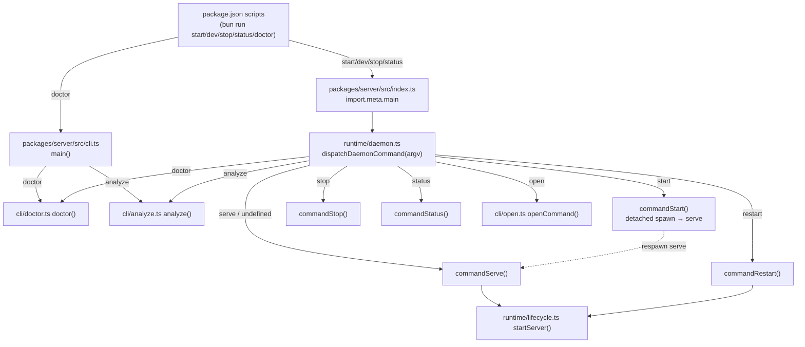
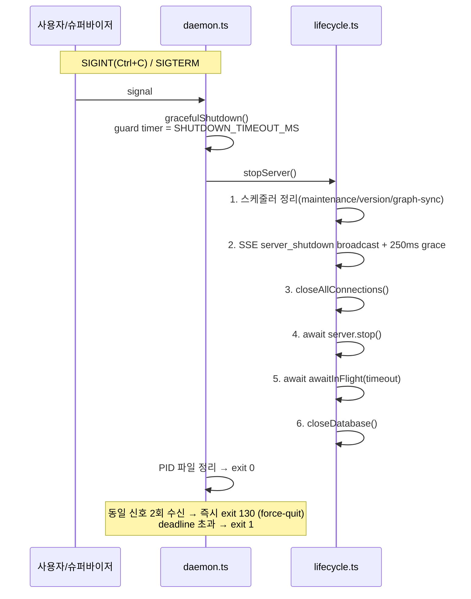

# claude-spyglass CLI

claude-spyglass CLI는 모니터링 서버 데몬 제어와 환경 진단을 담당합니다. 모든 명령은 Bun 런타임으로 실행되며, 별도 설치 없이 저장소 루트에서 호출합니다.

> 연관 문서: [설정 가이드](./configuration.md) · [배포 가이드](./deployment.md) · [문제 해결 가이드](./troubleshooting.md) · [데이터 흐름](./data-flow.md)

## 목차

- [개요](#개요)
- [실행 방식](#실행-방식)
- [명령 인덱스](#명령-인덱스)
- [명령별 상세](#명령별-상세)
  - [`start` — 서버 기동 (백그라운드 데몬)](#start--서버-기동-백그라운드-데몬)
  - [`serve` — 포그라운드 실행](#serve--포그라운드-실행)
  - [`stop` — 서버 중지](#stop--서버-중지)
  - [`restart` — 서버 재기동](#restart--서버-재기동)
  - [`status` — 상태 조회](#status--상태-조회)
  - [`open` — 대시보드 열기](#open--대시보드-열기)
  - [`doctor` — 진단](#doctor--진단)
  - [`doctor --fix` — 자동 수정](#doctor---fix--자동-수정)
  - [`analyze` — 운영자 수동 백필](#analyze--운영자-수동-백필)
- [doctor 체크 상세](#doctor-체크-상세)
- [데이터 보조 스크립트](#데이터-보조-스크립트)
  - [`rebuild-stats`](#rebuild-stats)
  - [`rebuild-stats-proxy`](#rebuild-stats-proxy)
  - [`backfill:system-prompts`](#backfillsystem-prompts)
  - [`backfill:subagent-parents`](#backfillsubagent-parents)
- [환경 변수](#환경-변수)
- [종료 코드](#종료-코드)
- [자주 쓰는 시나리오](#자주-쓰는-시나리오)

---

## 개요

CLI는 두 개의 진입점으로 나뉩니다. 데몬 제어 명령은 PID 파일이 아니라 `lsof -sTCP:LISTEN` 기반 포트 LISTEN 확인을 단일 식별 기준(SSoT)으로 삼아 싱글톤을 보장합니다. PID 파일은 stale 정리용 힌트일 뿐이며, stale + PID 재할당 시 무관한 프로세스(예: 작업 중인 Claude Code CLI)를 오탐·오살하지 않도록 신뢰하지 않습니다.

| 진입점 | 역할 | 파일 |
|--------|------|------|
| 데몬 디스패처 | `serve` / `start` / `stop` / `restart` / `status` / `open` / `doctor` / `analyze` | `packages/server/src/index.ts` → `runtime/daemon.ts#dispatchDaemonCommand` |
| 진단 CLI | `doctor` (옵션: `--fix`) / `analyze` | `packages/server/src/cli.ts#main` → `cli/doctor.ts` / `cli/analyze.ts` |

`doctor` / `analyze` 는 두 진입점 모두에서 호출 가능합니다. `package.json` 의 `scripts` 가 표준 엔트리입니다.



**기본값**

| 항목 | 값 | 결정 위치 |
|------|-----|-----------|
| 포트 | `9999` | `runtime/config.ts#DEFAULT_PORT` |
| 호스트 | `127.0.0.1` | `runtime/config.ts#HOST` |
| DB 파일 | `~/.spyglass/spyglass.db` | `getDefaultDbPath()` (`@spyglass/storage`) |
| PID 파일 | `~/.spyglass/server.pid` | `daemon.ts#getPidFile` |
| 미러 로그 (stdio) | `~/.spyglass/logs/server.log` | `runtime/stdio-mirror.ts` |
| 데몬 child 로그 (`start`) | `~/.spyglass/server.log` | `daemon.ts#commandStart` |

서버 stdout/stderr는 `installServerStdioMirror()` 로 미러 로그에 함께 기록되므로 비정상 종료를 사후 추적할 수 있습니다.

## 실행 방식

모든 명령은 Bun으로 실행합니다(`engines.bun >= 1.2.0`). 다음 두 호출 방식은 동등합니다.

```bash
# 권장 — npm-script 경유
bun run start

# 진입점 직접 호출
bun run packages/server/src/index.ts start
bun run packages/server/src/cli.ts doctor --fix
```

`start` 는 자기 자신을 `serve` 모드로 detached spawn 후 부모를 즉시 종료하므로, 호출자 셸이 종료되어도 서버는 백그라운드에서 살아남습니다. 포그라운드 실행(`serve` 또는 인자 없음)은 호스트 supervisor(launchd / brew services / docker) 가 직접 생명주기를 책임지며, `SIGINT`(Ctrl+C)·`SIGTERM` 수신 시 graceful shutdown 시퀀스를 거쳐 종료합니다.



## 명령 인덱스

카테고리별로 정리한 전체 명령 목록입니다.

**데몬 제어**

| 명령 | 설명 | 호출 예시 |
|------|------|-----------|
| `start` | LISTEN 확인 후 자신을 `serve` 모드로 detached spawn (백그라운드 데몬) | `bun run start` |
| `serve` / (인자 없음) | 포그라운드 blocking 실행. PID 파일 미생성 (`Ctrl+C` 종료) | `bun run packages/server/src/index.ts serve` |
| `stop` | LISTEN PID 탐색 후 SIGTERM 송신 | `bun run stop` |
| `restart` | LISTEN 프로세스를 SIGTERM(미종료 시 SIGKILL) 후 재기동 | `bun run dev` |
| `status` | 실제 LISTEN 여부 확인 | `bun run status` |
| `open` | `/health` 확인 후 시스템 브라우저로 대시보드 열기 | `bun run packages/server/src/index.ts open` |

**진단**

| 명령 | 설명 | 호출 예시 |
|------|------|-----------|
| `doctor` | 15개 환경/DB/서버/무결성 체크 실행 | `bun run doctor` |
| `doctor --fix` | 자동 수정 가능한 항목(권한, 데이터 정합성) 보정 | `bun run doctor --fix` |
| `analyze --backfill <범위>` | 기간 범위 지정 운영자 수동 백필 (system_byte_size 백필 + parent_tool_use_id 진단) | `bun run packages/server/src/cli.ts analyze --backfill 2026-05-01:2026-05-18` |

**데이터 보조 스크립트**

| 명령 | 설명 | 호출 예시 |
|------|------|-----------|
| `rebuild-stats` | `stats_hourly` 집계 테이블 재구축 | `bun run rebuild-stats` |
| `rebuild-stats-proxy` | `stats_proxy_hourly` 집계 테이블 재구축 | `bun run rebuild-stats-proxy` |
| `backfill:system-prompts` | 누락된 시스템 프롬프트 백필 | `bun run backfill:system-prompts` |
| `backfill:subagent-parents` | subagent transcript 의 `parent_tool_use_id` 백필 | `bun run backfill:subagent-parents` |

**TUI / 데스크톱**

| 명령 | 설명 | 호출 예시 |
|------|------|-----------|
| `tui` | 별도 TUI 패키지 실행 (`packages/tui/src/index.tsx`) | `bun run tui` |
| `desktop:dev` | Electron 데스크톱 앱 dev 실행 | `bun run desktop:dev` |

> `bun run dev` 는 `restart` 의 alias입니다(`packages/server/src/index.ts restart`). 점유된 포트를 정리한 뒤 새로 띄우므로 로컬 개발 루프에서 가장 자주 쓰입니다.

---

## 명령별 상세

### `start` — 서버 기동 (백그라운드 데몬)

LISTEN 확인 후, 자기 자신을 `serve` 모드로 detached spawn 하여 백그라운드 데몬으로 띄웁니다 (`runtime/daemon.ts#commandStart`). 사용자 편의 wrapper 이며, 실제 서버 프로세스는 child(`serve`) 입니다.

**동작 순서**

1. `findProcessesByPort(PORT)` (`lsof -sTCP:LISTEN`) 로 포트 9999 LISTEN PID 탐색.
   - LISTEN PID 가 있으면 `[Server] Already running (PID: …)` 출력 후 `exit 0`.
2. stale PID 파일이 남아 있으면 제거 (LISTEN 없음이 1번에서 확정).
3. `isPortAvailable(PORT)` 로 포트 가용성 재확인. TIME_WAIT 등으로 불가 시 `exit 1`.
4. child 로그 파일(`SPYGLASS_DAEMON_LOG` 또는 `~/.spyglass/server.log`)을 append 모드로 열고, 자기 자신을 `serve` 인자로 `detached: true` spawn 후 `unref()`.
5. child PID 를 PID 파일에 기록하고 부모 프로세스 즉시 `exit 0`. (child 는 `serve` 모드라 PID 파일을 만들지 않으므로 여기서만 기록.)

**옵션**: 없음. 동작은 [환경 변수](#환경-변수) 로 조정합니다.

**예시 출력**

```text
# 정상 기동 (부모 출력)
[Server] Started (PID: 28341) — manual mode
[Server] Endpoint: http://127.0.0.1:9999
[Server] Logs: /Users/me/.spyglass/server.log
Tip: `brew services start spyglass` for auto-start at login
```

```text
# 이미 실행 중인 경우
[Server] Already running (PID: 28341)
```

```text
# 포트가 점유된 경우 (TIME_WAIT 등)
[Server] Port 9999 is unavailable (likely TIME_WAIT)
[Server] Run 'spyglass restart' to retry with cleanup
```

서버 기동 로그(`[Server] Database connected`, `[Server] Running on …`, `[Server] Health check: …`)는 부모 stdout 이 아니라 child 의 로그 파일(`~/.spyglass/server.log`)에 기록됩니다.

**종료 코드**

| 코드 | 의미 |
|------|------|
| `0` | 정상 기동 또는 이미 실행 중 |
| `1` | 포트 점유 (TIME_WAIT 등) |

---

### `serve` — 포그라운드 실행

`startServer()` 를 호출하고 `SIGINT`/`SIGTERM` 핸들러를 설치한 뒤 foreground blocking 으로 동작합니다 (`runtime/daemon.ts#commandServe`). launchd / brew services / docker 같은 호스트 supervisor 가 직접 호출하는 명령으로, **PID 파일을 만들지 않고 stdout/stderr 를 그대로 유지**합니다. 인자 없이 호출(`dispatchDaemonCommand` 의 `case undefined`)해도 `serve` 와 동일하게 동작합니다.

```bash
bun run packages/server/src/index.ts serve
bun run packages/server/src/index.ts            # 동일 — 인자 없음 = serve
```

`startServer()` 부팅 절차: stdio 미러 설치 → 진단 로그 디렉터리 정리 → DB 연결 → graph sync worker 기동 → 유지보수/버전 체크 스케줄 등록 → `meta-docs` 부팅 동기화 → `Bun.serve` HTTP listen.

**예시 출력**

```text
[Server] Database connected: /Users/me/.spyglass/spyglass.db
[Server] meta-docs known cwds discovered: 4
[Server] Running on http://127.0.0.1:9999
[Server] Health check: http://127.0.0.1:9999/health
```

일시적 디버깅 외에는 `start` / `dev` 를 사용하세요. `package.json` 의 표준 script 에는 `serve` 가 노출되어 있지 않습니다.

---

### `stop` — 서버 중지

포트 9999 를 LISTEN 중인 spyglass server PID 만 찾아 SIGTERM을 보냅니다 (`runtime/daemon.ts#commandStop`). PID 파일은 신뢰하지 않습니다 — LISTEN 결과만이 종료 대상 결정의 SSoT.

**동작 순서**

1. `findProcessesByPort(PORT)` 로 LISTEN PID 탐색. 없으면 `[Server] Not running` 출력, 잔여 stale PID 파일 정리 후 `exit 0`.
2. 있으면 각 PID 에 `process.kill(pid, 'SIGTERM')` 송신. 성공 시 `[Server] Stopped (PID: …)`, 실패 시 `[Server] Failed to stop (PID: …):` 출력.
3. PID 파일 삭제 후, brew services 사용자 안내 출력.

서버(`serve`) 측은 `SIGTERM` 핸들러의 `gracefulShutdown` → `stopServer()` 에서 스케줄러 정리 → SSE `server_shutdown` 브로드캐스트(+250ms grace) → `closeAllConnections()` → `server.stop()` → in-flight 완료 대기 → `closeDatabase()` 를 거쳐 정상 종료합니다.

**예시 출력**

```text
# 정상 종료
[Server] Stopped (PID: 28341)
Note: brew services users — also run `brew services stop spyglass`

# 이미 정지 상태
[Server] Not running
```

**종료 코드**: 항상 `0`. (개별 PID 의 SIGTERM 실패는 stderr 로 보고하되 종료 코드를 바꾸지 않음.)

---

### `restart` — 서버 재기동

기존 인스턴스 유무와 무관하게 안전하게 재기동합니다 (`runtime/daemon.ts#commandRestart`). `start` 와 달리 이 명령은 child 를 spawn 하지 않고 **자신이 직접 `startServer()` 를 호출하여 foreground 로 동작**하므로, `bun run dev` 로 띄운 셸이 살아 있는 동안 서버가 유지됩니다.

**동작 순서**

1. `findProcessesByPort(PORT)` 로 LISTEN PID 탐색. 없으면 곧장 새 서버 기동.
2. LISTEN PID 들에 `SIGTERM`. `waitForProcessExit` 로 `SPYGLASS_SHUTDOWN_TIMEOUT_MS`(기본 10초) 내 종료를 기다리며 drain 진행도를 stderr 로 표시. deadline 초과 시 `SIGKILL`.
3. stale PID 파일 정리 후, `waitForPortRelease(PORT, 5000)` 로 OS 레벨 포트 해제를 최대 5초 대기 (TIME_WAIT 등). 실패 시 `exit 1`.
4. `startServer()` + PID 파일 기록 + 시그널 핸들러 설치.

LISTEN 필터(`-sTCP:LISTEN`)가 핵심입니다. 필터가 없으면 `9999` 포트로 ESTABLISHED 연결 중인 Claude Code/TUI 클라이언트 PID 까지 잡혀 사용자 세션이 함께 종료됩니다.

**예시 출력**

```text
# 점유 → 정리 → 재기동
[Server] Stopping listening server(s): PID 28341
[Server] Stopping process (PID: 28341)...
[Server] Draining PID 28341... (10s remaining)
[Server] Waiting for port 9999 to be released...
[Server] Port 9999 is now available
[Server] Running on http://127.0.0.1:9999
[Server] Restarted (PID: 28510)
```

```text
# 점유 없음 → 곧장 기동
[Server] Port 9999 is available (no listening server)
[Server] Running on http://127.0.0.1:9999
[Server] Restarted (PID: 28510)
```

**종료 코드**

| 코드 | 의미 |
|------|------|
| `0` | 재기동 성공 |
| `1` | 5초 내 포트 해제 실패 |

---

### `status` — 상태 조회

`lsof -sTCP:LISTEN` 으로 포트 점유를 실제로 확인합니다 (`runtime/daemon.ts#commandStatus`). PID 파일은 stale 정리 보조 용도에만 사용합니다.

**동작 순서**

1. `findProcessesByPort(PORT)` 로 LISTEN PID 탐색.
   - LISTEN PID 가 있으면 `[Server] Running (PID: …)` + 엔드포인트 출력. `getInFlightCount()` 가 0보다 크면 in-flight 백그라운드 태스크 건수도 표시.
   - 없으면 stale PID 파일이 있으면 삭제하고 `[Server] Not running (stale PID file — cleaned up)` 출력.
   - PID 파일도 없으면 `[Server] Not running` 출력.

**예시 출력**

```text
# 실행 중
[Server] Running (PID: 28510)
[Server] Endpoint: http://127.0.0.1:9999
[Server] In-flight background tasks: 2
```

```text
# PID 파일은 있으나 프로세스가 죽음
[Server] Not running (stale PID file — cleaned up)
```

```text
# PID 파일 자체가 없음
[Server] Not running
```

**종료 코드**: 항상 `0`.

---

### `open` — 대시보드 열기

로컬 데몬의 `/health` 를 확인한 뒤 시스템 브라우저로 대시보드를 엽니다 (`cli/open.ts#openCommand`). interactive prompt 없이 actionable guidance 만 출력합니다.

**동작 순서**

1. `waitForServer()` — `/health` 를 1초 timeout × 최대 15회(200ms 간격, 약 3초) probe. 첫 retry 직전 한 번 `[Open] Waiting for spyglass...` 출력. cold-start(첫 부팅 시 DB 생성 + 마이그레이션) buffer 용.
2. 200 OK 면 OS 별 명령(macOS `open` / Linux `xdg-open` / Windows `cmd /c start`)으로 `http://127.0.0.1:9999` 를 detached spawn.
   - 브라우저 실행 성공 → `[Open] Opened <url>`, `exit 0`.
   - 브라우저 실행 실패 → `[Open] spyglass is running, but browser open failed.` + URL fallback, `exit 0`.
3. probe 가 모두 실패하면 미실행 안내 후 `exit 1`.

**예시 출력**

```text
# 서버 미실행
[Open] spyglass is not running.

To start:
  brew services start spyglass
  spyglass start
```

**종료 코드**

| 코드 | 의미 |
|------|------|
| `0` | 대시보드 open (또는 URL fallback) |
| `1` | 서버 미실행 (probe 전부 실패) |

---

### `doctor` — 진단

설치/환경/DB/turn 무결성을 한 번에 점검합니다. `cli/doctor.ts` 가 15개 체크를 순차 실행하여 `✓` / `⚠` / `✗` 으로 출력합니다.

**호출**

```bash
bun run doctor
bun run packages/server/src/cli.ts doctor
```

**옵션**

| 옵션 | 의미 |
|------|------|
| `--fix` | 권한·데이터 정합성 자동 보정 후 결과 요약 (다음 절 참고) |

**예시 출력**

```text
# 모두 통과
🔍 spyglass 환경 검증

✓ Bun 1.2.5
✓ settings.json 정상
✓ 훅 등록됨 (SPYGLASS_DIR: /Users/me/IdeaProjects/claude-spyglass)
✓ 훅 스크립트 실행 권한 OK
✓ DB 권한: 600
✓ DB 스키마 v53
✓ 포트 3000 가용
✓ 최근 5분 내 수집 활동 있음
... (무결성 체크 7건 ok) ...

✓ 모든 검사 통과!
```

```text
# warn + fail 이 섞인 경우
⚠ DB 권한: 644 (권장: 600)
  → chmod 600 /Users/me/.spyglass/spyglass.db
⚠ 최근 수집: 42분 전
✗ 중복 response 7쌍 — 같은 메시지가 두 행으로 저장됨
  → ADR-001 P1-A 수정 후엔 0이어야 한다. 코드 회귀 가능성 — 변경 이력 확인

✗ 1개 항목 실패, 3개 항목 경고
  → 위의 힌트를 따라 문제를 해결하세요
```

**종료 코드**

| 코드 | 의미 |
|------|------|
| `0` | 실패(`fail`) 0건. 경고가 있어도 0으로 종료 |
| `1` | 실패(`fail`) 1건 이상. 또는 알 수 없는 서브명령(`cli.ts <unknown>`) |

---

### `doctor --fix` — 자동 수정

진단 출력 후 `cli/fix.ts#applyFixes()` 가 다음 항목을 시도합니다.

| 항목 | 보정 |
|------|------|
| DB 파일 권한 (`mode & 0o077 != 0`) | `chmod 600 <path>` |
| 훅 스크립트 권한 (실행 비트 없음) | `chmod +x <SPYGLASS_DIR>/hooks/spyglass-collect.sh` |
| 중복 response (같은 세션 · `preview` 동일 · 1초 이내) | `claude-code-hook` 소스 행 DELETE (transcript 행 보존) |
| mismatched turn_id | timestamp 이전 최신 prompt 의 `turn_id` 로 UPDATE |
| orphan turn_id (`= NULL`) | 같은 세션의 첫 prompt `turn_id` 로 retroactive 매핑 |

수정이 한 건이라도 적용되면 끝에 `✓ 자동 수정 완료. 다시 doctor를 실행하세요` 가 출력됩니다. 안내대로 `--fix` 없이 한 번 더 `doctor` 를 돌려 잔여 항목을 확인하세요.

`--fix` 는 권한·정합성만 건드립니다. Bun 설치, 훅 등록, 포트 해제는 사용자가 직접 처리해야 합니다.

---

### `analyze` — 운영자 수동 백필

`cli/analyze.ts` 가 기간 범위를 받아 두 가지 보정 작업을 수행합니다. **자동 실행이 금지된 수동 트리거 전용** 명령입니다.

**호출**

```bash
bun run packages/server/src/cli.ts analyze --backfill 2026-05-01:2026-05-18
bun run packages/server/src/cli.ts analyze --backfill 2026-05-01:2026-05-18 --dry-run
```

**옵션**

| 옵션 | 의미 |
|------|------|
| `--backfill <YYYY-MM-DD:YYYY-MM-DD>` | 처리 기간 지정 (필수). 시작일 00:00:00Z ~ 종료일 23:59:59.999Z |
| `--dry-run` | DB 변경 없이 처리 예상 건수만 출력 |
| `--help` / `-h` | 사용법 출력 |

**백필 대상**

| 대상 | 설명 |
|------|------|
| `proxy_requests.system_byte_size` | payload(zstd) 를 복호하여 body.system 정규화 후 `upsertSystemPrompt` + byte_size 채움. `system_hash IS NULL` 행만 대상 (멱등). 100건 단위 트랜잭션 배치 처리. |
| `requests.parent_tool_use_id` | `source='subagent-transcript'` 중 `parent_tool_use_id IS NULL` 행 수 진단만 보고 (`applied` 항상 0). 실제 transcript 재파싱 UPDATE 는 후속 패치 TODO. |

`--dry-run` 이 아닐 때만 `invalidateAnomalyThresholdsCache()` 로 anomaly 임계 캐시를 무효화합니다.

**예시 출력**

```text
spyglass analyze --backfill [DRY-RUN]
  range: 2026-05-01T00:00:00.000Z ~ 2026-05-18T23:59:59.999Z

[analyze] system_byte_size 백필 대상: 312 rows

=== analyze summary [DRY-RUN] ===
system_byte_size:
  eligible:       312
  processed:      312
  updated:        308
  decode_errors:  4
  null_system:    0
parent_tool_use_id:
  candidate(NULL): 0
  applied:        0  (TODO: transcript 재파싱은 후속 패치 — 신규 수집은 T-07로 자동 정상화)

actual changes were NOT written. Re-run without --dry-run to apply.
```

**종료 코드**

| 코드 | 의미 |
|------|------|
| `0` | 정상 완료 (도움말 출력 포함) |
| `1` | `--backfill` 범위 누락 또는 파싱 오류 |

---

## doctor 체크 상세

`doctor` 가 실행하는 체크는 네 묶음으로 정리됩니다. 위반 등급은 `fail`(실패) / `warn`(경고) / `ok`(통과) 입니다.

### 1. 환경 체크 (`cli/checks/environment.ts`)

런타임·설정·훅 등록 상태를 검사합니다.

| 함수 | 점검 내용 | 위반 시 |
|------|-----------|---------|
| `checkBunVersion` | `bun --version` major `>= 1` | `fail` |
| `checkSettingsJson` | `~/.claude/settings.json` 존재 + JSON 파싱 | `fail` |
| `checkHooksRegistered` | settings.json 6개 훅(`UserPromptSubmit`/`PreToolUse`/`PostToolUse`/`SessionStart`/`SessionEnd`/`Stop`) 중 하나라도 `spyglass-collect.sh` 를 가리키는지 + `env.SPYGLASS_DIR` 설정 여부 | 미등록 `fail`, `SPYGLASS_DIR` 만 없으면 `warn` |
| `checkHookExecutable` | `${SPYGLASS_DIR}/hooks/spyglass-collect.sh` 존재 + 실행 비트 | `fail` (`SPYGLASS_DIR` 없으면 `warn`) |

### 2. 데이터베이스 체크 (`cli/checks/database.ts`)

DB 파일 권한, 스키마 버전, 최근 수집 활동을 검사합니다.

| 함수 | 점검 내용 | 위반 시 |
|------|-----------|---------|
| `checkDbPermissions` | DB 파일 `mode & 0o077 == 0` (그룹/타인 권한 차단) | `warn` (`--fix` 가능) |
| `checkDbSchemaVersion` | `PRAGMA user_version >= 12` | `warn` |
| `checkRecentActivity` | 최근 5분 내 `requests` 수집 존재 (없으면 마지막 수집 시각 안내) | `warn` |

### 3. 서버 체크 (`cli/checks/server.ts`)

포트 가용성을 검사합니다.

| 함수 | 점검 내용 | 위반 시 |
|------|-----------|---------|
| `checkServerPort` | `127.0.0.1:3000` 에 `Bun.serve` 테스트 바인딩 가능 여부 (체크 전용 하드코딩 포트 — 실제 서버 포트 9999 와 무관) | `warn` |

### 4. Turn 무결성 체크 (`cli/checks/integrity.ts` · ADR-001 P1)

prompt-response 매핑과 통계 데이터 정합성을 검사합니다.

| 함수 | 점검 내용 | 임계 |
|------|-----------|------|
| `checkOrphanRows` | `requests.turn_id IS NULL` 행 수 | `> 0` → `warn` |
| `checkZeroResponseTurns` | prompt 있는데 response 0건인 turn 수 | `> 0` → `warn` |
| `checkLongProxyResponses` | `proxy_requests.response_time_ms > 120000` 행 수 | `> 0` → `warn` |
| `checkDuplicateResponses` | 같은 세션 · `preview` 동일 · `timestamp` 1초 이내 response 쌍 | `> 0` → **`fail`** (회귀) |
| `checkMismatchedTurnIds` | timestamp 기반 매핑과 실제 `turn_id` 불일치 행 | `> 0` → **`fail`** (회귀) |
| `checkUnlinkedToolCalls` | 최근 1시간 `tool_call` 중 `api_request_id IS NULL` 비율 (표본 `< 5` skip, `pct < 10%` 는 `ok`) | `pct >= 10%` → `warn` |
| `checkOrphanProxyToolUses` | 매칭 없는 `proxy_tool_uses` 행 (사용자 취소 가능, 정보성) | 항상 `ok` |

`fail` 로 분류되는 두 항목은 회귀 검출용입니다. 발생 시 우선 `--fix` 로 보정하고, 다시 잡히면 변경 이력을 확인하세요.

---

## 데이터 보조 스크립트

서버 라이프사이클과 별개로 동작하는 일회성 보정 스크립트입니다. 단일 트랜잭션으로 작성되어 서버를 멈추지 않고 안전하게 호출할 수 있습니다.

### `rebuild-stats`

`stats_hourly` 집계 테이블을 `requests` 원본에서 재구축합니다. 산식 변경, 외부 정정, 대량 DELETE 후 일관성 회복에 사용합니다. `DELETE + INSERT` 단일 트랜잭션이므로 멱등합니다.

```bash
# 전체 재집계
bun run rebuild-stats

# hour_ts >= sec 만 재집계
bun run rebuild-stats --since=<unix_s>
```

**예시 출력**

```text
[rebuild-stats] sinceTs=<all> rowsInserted=4218 elapsedMs=87
```

### `rebuild-stats-proxy`

`stats_proxy_hourly` 집계 테이블을 `proxy_requests` 원본에서 재구축합니다 (proxy-hourly ADR-005). 인자와 멱등성은 `rebuild-stats` 와 동일합니다.

```bash
bun run rebuild-stats-proxy
bun run rebuild-stats-proxy --since=<unix_s>
```

### `backfill:system-prompts`

`proxy_requests` 중 `system_hash IS NULL AND payload IS NOT NULL` 행을 순회하며 payload(zstd) 를 디코드 → `normalizeSystem(body.system)` → `upsertSystemPrompt` 후 `system_hash` / `system_byte_size` 를 채웁니다 (`packages/server/scripts/backfill-system-prompts.ts`). 이미 채워진 행은 재처리하지 않으며(멱등), 100건 단위 트랜잭션 배치로 처리합니다. v21 이전 payload BLOB 이 없는 행은 백필 불가(의도된 한계).

```bash
bun run backfill:system-prompts            # 전체 처리 (배치 100건씩)
bun run packages/server/scripts/backfill-system-prompts.ts --dry-run   # 변경 없이 대상 행 수만 보고
bun run packages/server/scripts/backfill-system-prompts.ts --limit 100 # 한 번에 100건 처리
```

### `backfill:subagent-parents`

메인 hook 경로(`source='claude-code-hook'`)로 적재된 서브에이전트 자식 도구 호출 중 `parent_tool_use_id IS NULL` 행을, 같은 세션의 직전 `Agent` ToolCall 을 휴리스틱으로 추적해 parent 를 복원합니다 (`packages/server/scripts/backfill-subagent-parents.ts`). UPDATE 직후 `kuzu_outbox` 에 `op='update'` row 를 발행해 그래프 sync 워커가 재동기화하여 flow chart 의 ancestor 단절을 복구합니다.

```bash
bun run backfill:subagent-parents
```

---

## 환경 변수

런타임 동작을 조정하는 환경 변수 목록입니다. 변수명에 `SPGLASS_` (약어) 와 `SPYGLASS_` 가 섞여 있으니 정확히 입력하세요.

**서버 런타임**

> 포트·호스트·DB 경로 변수는 `SPGLASS_` 접두사(축약형)를 씁니다. 그 외는 모두 `SPYGLASS_` 입니다. 정확히 입력하세요 (`runtime/config.ts`).

| 변수 | 기본값 | 설명 |
|------|--------|------|
| `SPGLASS_PORT` | `9999` | HTTP 포트 |
| `SPGLASS_HOST` | `127.0.0.1` | 바인딩 호스트 |
| `SPGLASS_DB_PATH` | `getDefaultDbPath()` (`~/.spyglass/spyglass.db`) | DB 파일 경로 |
| `SPYGLASS_PID_FILE` | `~/.spyglass/server.pid` | PID 파일 위치 (임시 인스턴스 분리용) |
| `SPYGLASS_SERVER_LOG` | `~/.spyglass/logs/server.log` | `serve`/`startServer` 의 stdout/stderr 미러 로그 (`runtime/stdio-mirror.ts`) |
| `SPYGLASS_DAEMON_LOG` | `~/.spyglass/server.log` | `start` 가 detached spawn 한 child 의 stdout/stderr 리다이렉트 경로 (`daemon.ts#commandStart`) |
| `SPYGLASS_SHUTDOWN_TIMEOUT_MS` | `10000` | graceful shutdown / `restart` drain deadline (`runtime/config.ts`) |
| `SPYGLASS_RETENTION_DAYS` | `30` | 일별 유지보수 보존 일수. 0/음수/non-numeric 은 기본값 폴백 (`storage/runtime/retention.ts`) |
| `SPYGLASS_LANG` | `--lang` → `SPYGLASS_LANG` → `LC_ALL`/`LANG` → `ko` | CLI 메시지 언어 (ko/en/ja/zh, `i18n.ts#detectLang`) |

**훅 / 프록시**

| 변수 | 기본값 | 설명 |
|------|--------|------|
| `SPYGLASS_DIR` | — | `settings.json` 의 `env` 값. 훅 스크립트 위치 |
| `ANTHROPIC_BASE_URL` | — | 설정 시 Claude Code 가 `/v1/*` 프록시로 요청을 라우팅 |

**진단 로그 (`diag-log.ts`)**

서버 재시작 시 플래그가 고정됩니다(모듈 로드 시점 1회 평가). 변경 후에는 서버를 재시작해야 반영됩니다.

| 변수 | 기본값 | 설명 |
|------|--------|------|
| `SPYGLASS_DIAG_ENABLED` | — (비활성) | `'1'` 또는 `'true'` 로 설정 시 진단 jsonl 로그 활성화. 기본값은 비활성(no-op) — 운영 시 디스크 사용량 0 |
| `SPYGLASS_DIAG_LOG_DIR` | `<cwd>/.claude/.tmp/logs` | 진단 로그 디렉터리 경로 override |
| `SPYGLASS_DIAG_RAW_SSE` | — (비활성) | `'1'` 로 설정 시 proxy SSE 응답 본문 raw 를 jsonl 에 포함 (최대 200KB, 파일 비대 주의) |

**출력 카테고리** (`SPYGLASS_DIAG_ENABLED=1` 활성 시):

| 파일 | 내용 |
|------|------|
| `model-trace.log` | 모델 추출/분기 추적 (사람-읽기 한 줄 trace) |
| `hook-payload.jsonl` | 훅 진입 시 raw payload (1줄/이벤트) |
| `proxy-payload.jsonl` | 프록시 진입+종료 시 raw 본문/헤더 (1줄/단계) |

**활성화 예시**

```bash
# inline prefix (권장 — 공백으로 연결, '&' 사용 금지)
SPYGLASS_DIAG_ENABLED=1 bun run dev

# 로그 위치 override
SPYGLASS_DIAG_ENABLED=1 SPYGLASS_DIAG_LOG_DIR=/tmp/spyglass-diag bun run dev

# SSE raw body 포함
SPYGLASS_DIAG_ENABLED=1 SPYGLASS_DIAG_RAW_SSE=1 bun run dev
```

---

## 종료 코드

모든 명령은 정상일 때 `0` 을 반환합니다. `1` 은 다음 상황에서 발생합니다.

| 명령 | `1` 발생 조건 |
|------|---------------|
| `start` | 포트 점유 (TIME_WAIT 등, 사용자 개입 필요) |
| `restart` | 5초 내 포트 해제 실패 |
| `open` | 서버 미실행 (probe 전부 실패) |
| `doctor` | `fail` 1건 이상 또는 알 수 없는 서브명령 |
| `analyze` | `--backfill` 범위 누락 또는 파싱 오류 |
| `dispatchDaemonCommand` | 알 수 없는 명령 (`Usage:` 출력 후 `exit 1`) |
| graceful shutdown | deadline(`SPYGLASS_SHUTDOWN_TIMEOUT_MS`) 초과 시 `exit 1`, 동일 신호 2회 수신 시 `exit 130` |
| `cli.ts` 공통 | 예외 발생 시 `오류:` prefix 와 함께 `exit 1` |

> `stop` 은 항상 `0` 으로 종료합니다 — 개별 PID 의 SIGTERM 실패는 stderr 로 보고하되 종료 코드를 바꾸지 않습니다.

---

## 자주 쓰는 시나리오

상황별 명령 조합을 "이럴 때 → 이렇게" 형태로 정리했습니다.

### 시나리오 1: 처음 시작하는 경우

**이럴 때**: 저장소를 클론하고 처음으로 spyglass 를 띄울 때.

**이렇게**:

```bash
bun install
bun run doctor          # Bun, settings.json, 훅, 포트, DB 한 번에 확인
bun run doctor --fix    # 권한·정합성 자동 보정 (필요 시)
bun run start
bun run status          # 다른 터미널에서 정상 기동 확인
```

### 시나리오 2: 개발 루프

**이럴 때**: 코드 수정 → 재기동을 반복하며 디버깅할 때.

**이렇게**:

```bash
# 포트 자동 정리 후 재기동 (가장 흔한 흐름, restart alias)
bun run dev

# 로그를 실시간으로 보며 디버깅 (포그라운드, Ctrl+C 로 종료)
bun run packages/server/src/index.ts serve
```

### 시나리오 3: 비정상 동작 디버깅

**이럴 때**: 데이터가 안 들어오거나, UI 가 비어 있거나, 통계가 어긋날 때.

**이렇게**:

```bash
bun run status                       # 1) 서버가 살아 있는지 확인
bun run doctor                       # 2) 무엇이 비정상인지 진단
tail -f ~/.spyglass/logs/server.log  # 3) 미러 로그로 최근 에러 확인
bun run rebuild-stats                # 4-A) 집계가 어긋난 경우
bun run rebuild-stats-proxy          # 4-B) 프록시 집계가 어긋난 경우
bun run backfill:system-prompts      # 4-C) 시스템 프롬프트가 비어 있을 때
```

### 시나리오 4: 깨끗한 상태로 되돌리기

**이럴 때**: DB 가 꼬였거나 PID 파일이 stale 상태가 반복되어 초기화하고 싶을 때.

**이렇게**:

```bash
bun run stop && rm -rf ~/.spyglass && bun run start
```

DB만 삭제해도 다음 기동 시 마이그레이션이 새로 돌지만, PID 파일과 로그까지 정리하려면 디렉터리 전체를 지우는 편이 단순합니다.

### 시나리오 5: 임시 인스턴스를 운영과 격리

**이럴 때**: 운영 데몬을 끄지 않고 별도 포트로 실험용 인스턴스를 띄우고 싶을 때.

**이렇게**:

```bash
# 포그라운드 — 별도 터미널에서 Ctrl+C 로 끝낼 수 있어 실험에 가장 단순
SPGLASS_PORT=9998 \
SPGLASS_DB_PATH=/tmp/spyglass-tmp.db \
SPYGLASS_SERVER_LOG=/tmp/spyglass-tmp.log \
bun run packages/server/src/index.ts serve

# 백그라운드 데몬으로 띄우려면 — child 로그 경로까지 분리해 운영 로그와 충돌 방지
SPGLASS_PORT=9998 \
SPGLASS_DB_PATH=/tmp/spyglass-tmp.db \
SPYGLASS_PID_FILE=/tmp/spyglass-tmp.pid \
SPYGLASS_DAEMON_LOG=/tmp/spyglass-tmp.log \
bun run packages/server/src/index.ts start
```

포트·DB(필요 시 PID·로그)를 모두 분리하면 운영 데몬과 충돌 없이 별도 인스턴스를 띄울 수 있습니다.
