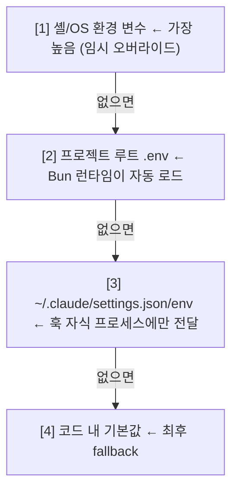
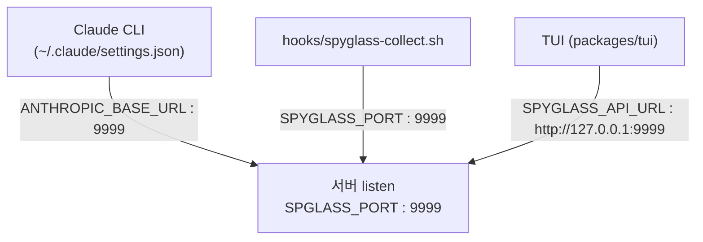
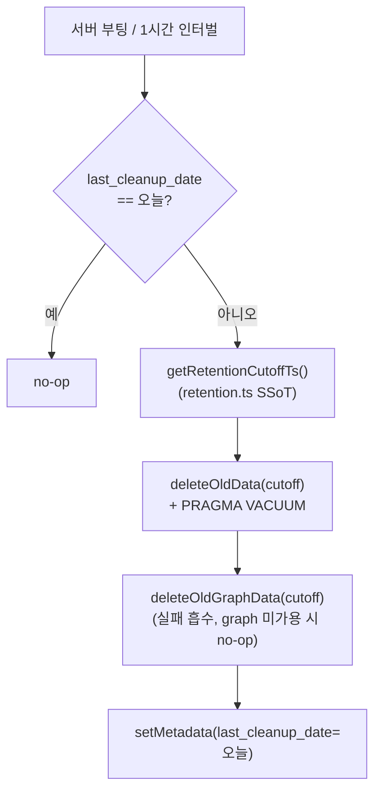

# claude-spyglass 설정 가이드

claude-spyglass의 모든 설정 옵션을 다룹니다. 환경 변수, `.env` 파일, `~/.claude/settings.json` 훅 등록, 데이터·로그 경로, 언어 설정까지 단일 문서에 정리합니다.

> 관련 문서: [훅 통합](./hooks-integration.md) · [데이터 흐름](./data-flow.md) · [CLI](./cli.md) · [데이터베이스](./database.md) · [배포](./deployment.md) · [트러블슈팅](./troubleshooting.md)

> [!WARNING]
> **`SPGLASS_*` vs `SPYGLASS_*` 표기에 주의하세요.**
> 일부 키(`SPGLASS_PORT`, `SPGLASS_HOST`, `SPGLASS_DB_PATH`)는 의도적으로 `Y`가 빠진 표기입니다. 코드 상수와 일치시키기 위해 표기 그대로 사용해야 하며, 오타로 인식해 `SPYGLASS_PORT`로 적으면 무시됩니다. 나머지 키는 모두 `SPYGLASS_` 접두사를 사용합니다.

## 개요 및 설정 우선순위

claude-spyglass는 별도의 JSON 설정 파일을 두지 않고 **환경 변수**를 단일 소스로 사용합니다. 값이 충돌할 때 적용 우선순위는 다음 그림과 같습니다 — 위쪽이 더 높습니다.



각 채널의 적용 범위:

1. **셸/OS 환경 변수** — 임시 오버라이드용 (`SPGLASS_PORT=18999 bun run dev`).
2. **프로젝트 루트 `.env`** — Bun 런타임이 프로세스 시작 시 자동 로드해 `process.env`로 노출.
3. **`~/.claude/settings.json`의 `env`** — Claude Code 훅이 호출하는 자식 프로세스(`spyglass-collect.sh`)에만 전달.
4. **코드 내 기본값** — 위 모든 채널이 비어 있을 때 사용.

> `.env`를 수정한 뒤에는 서버를 재시작해야 반영됩니다 (`bun run dev`).

---

## 환경 변수 레퍼런스

모든 표는 다음 컬럼을 공통으로 사용합니다 — **이름 · 타입 · 기본값 · 설명 · 사용처**.

### 서버 런타임

| 이름 | 타입 | 기본값 | 설명 | 사용처 |
|------|------|--------|------|--------|
| `SPGLASS_PORT` | number | `9999` | HTTP/SSE 서버 리스닝 포트 | `packages/server/src/runtime/config.ts` |
| `SPGLASS_HOST` | string | `127.0.0.1` | 서버 바인딩 주소 (외부 노출 시 `0.0.0.0`) | `packages/server/src/runtime/config.ts` |
| `SPGLASS_DB_PATH` | string | `$HOME/.spyglass/spyglass.db` | SQLite 파일 절대 경로 | `packages/server/src/runtime/config.ts` |
| `SPYGLASS_PID_FILE` | string | `$HOME/.spyglass/server.pid` | 서버 데몬 PID 파일 경로 | `packages/server/src/runtime/daemon.ts` |
| `SPYGLASS_SERVER_LOG` | string | `$HOME/.spyglass/logs/server.log` | 서버 stdout/stderr 미러링 파일 | `packages/server/src/runtime/stdio-mirror.ts` |
| `SPYGLASS_RETENTION_DAYS` | number | `30` | 일별 cleanup에서 보존할 세션 일수. `0`·음수·비숫자는 기본값 30으로 폴백 | `packages/storage/src/runtime/retention.ts` |
| `SPYGLASS_SHUTDOWN_TIMEOUT_MS` | number | `10000` | graceful shutdown 최대 대기 시간(ms). SIGTERM/SIGINT 핸들러 guard timer 및 in-flight 요청 완료 대기에 사용 | `packages/server/src/runtime/config.ts` |
| `SPYGLASS_APP_VERSION` | string | (미설정 — `package.json` 버전 자동 읽기) | DB 마이그레이션 기록(`_migrations.app_version`)에 주입할 버전 문자열. 테스트·CI에서 명시적으로 주입할 때 사용 | `packages/storage/src/migrator.ts` |

### TUI 런타임

| 이름 | 타입 | 기본값 | 설명 | 사용처 |
|------|------|--------|------|--------|
| `SPYGLASS_API_URL` | string | `http://127.0.0.1:9999` | TUI가 서버에 접근할 base URL | `packages/tui/src/app.tsx` |
| `SPYGLASS_PROJECT` | string | `basename(cwd)` | 필터링 대상 프로젝트명 (현재 디렉토리 이름으로 자동 추정) | `packages/tui/src/lib/current-project.ts` |
| `SPYGLASS_ALL_PROJECTS` | `0`/`1` | (미설정) | `1`이면 프로젝트 필터를 끄고 전체 세션 표시 | `packages/tui/src/lib/current-project.ts` |
| `SPYGLASS_NO_MOTION` | `0`/`1` | (미설정) | `1`이면 TUI 애니메이션·동적 리프레시를 비활성화. 터미널이 motion을 지원하지 않거나 접근성 설정이 필요할 때 사용 | `packages/tui/src/lib/capabilities.ts` |
| `DEBUG_ALIGN` | `0`/`1` | (미설정) | TUI 테이블 정렬 디버그 출력 (테스트 전용) | `packages/tui/src/__tests__/tool-row-alignment.test.ts` |

### 언어/로케일

| 이름 | 타입 | 기본값 | 설명 | 사용처 |
|------|------|--------|------|--------|
| `SPYGLASS_LANG` | string | (미설정) | 강제 언어 코드. `ko`/`en`/`ja`/`zh` 또는 `ko-KR` 같은 BCP-47 | `packages/server/src/i18n.ts` |
| `LC_ALL` | string | (시스템) | POSIX 로케일. `SPYGLASS_LANG` 미설정 시 fallback 1순위 | `packages/server/src/i18n.ts` |
| `LANG` | string | (시스템) | POSIX 로케일. fallback 2순위 | `packages/server/src/i18n.ts` |

지원 언어와 기본값은 `packages/types/src/i18n.ts`에 선언됩니다.

```ts
SUPPORTED_LANGS = ['ko', 'en', 'ja', 'zh']
DEFAULT_LANG    = 'ko'
```

`resolveLang()`은 `ko-KR`, `zh-Hans-CN` 같은 BCP-47 형식의 primary subtag(`ko`, `zh`)를 추출합니다.

### 업스트림 라우팅 (프록시)

| 이름 | 타입 | 기본값 | 설명 | 사용처 |
|------|------|--------|------|--------|
| `ANTHROPIC_UPSTREAM_URL` | URL | `https://api.anthropic.com` | 기본 Anthropic API 엔드포인트 | `packages/server/src/proxy/upstream.ts` |
| `MOONSHOT_UPSTREAM_URL` | URL | `https://api.moonshot.ai/anthropic` | `kimi-*` 모델 전용 엔드포인트 | `packages/server/src/proxy/upstream.ts` |
| `CUSTOM_UPSTREAMS` | string | (미설정) | `"prefix1=url1,prefix2=url2"` 형식의 추가 매핑 | `packages/server/src/proxy/upstream.ts` |
| `SPYGLASS_PROXY_DEBUG` | `0`/`1` | (미설정) | `1`이면 forward 헤더를 stdout으로 출력 | `packages/server/src/proxy/upstream.ts` |

### 진단(Diagnostic) 로깅

| 이름 | 타입 | 기본값 | 설명 | 사용처 |
|------|------|--------|------|--------|
| `SPYGLASS_DIAG_ENABLED` | `0`/`1`/`true` | `0` | 활성 시 raw hook/proxy payload를 jsonl로 기록 | `packages/server/src/diag-log.ts` |
| `SPYGLASS_DIAG_LOG_DIR` | string | `<cwd>/.claude/.tmp/logs` | 진단 로그 디렉토리 오버라이드 | `packages/server/src/diag-log.ts` |
| `SPYGLASS_DIAG_RAW_SSE` | `0`/`1` | `0` | SSE 응답 raw 본문을 200KB까지 jsonl에 포함 | `packages/server/src/proxy/handler/diag.ts` |

### 훅 스크립트 (`hooks/spyglass-collect.sh`)

훅은 Bash 변수로 환경 변수를 읽습니다.

| 이름 | 타입 | 기본값 | 설명 | 사용처 |
|------|------|--------|------|--------|
| `SPYGLASS_HOST` | string | `localhost` | 훅이 POST할 서버 호스트 | `hooks/spyglass-collect.sh` |
| `SPYGLASS_PORT` | number | `9999` | 훅이 POST할 서버 포트 | `hooks/spyglass-collect.sh` |
| `SPYGLASS_TIMEOUT` | number | `1` | `curl --max-time` 초 — 초과 시 포기 | `hooks/spyglass-collect.sh` |
| `SPYGLASS_DIR` | string | (미설정) | claude-spyglass 저장소 경로. `~/.claude/settings.json`의 `env.SPYGLASS_DIR`로 주입 | `hooks/spyglass-collect.sh` |

### 시스템

| 이름 | 타입 | 기본값 | 설명 | 사용처 |
|------|------|--------|------|--------|
| `HOME` | string | (시스템) | DB·PID·로그 파일의 기본 prefix | `packages/server/src/runtime/config.ts` |
| `USERPROFILE` | string | (시스템) | Windows 환경에서 `HOME` fallback | `packages/server/src/runtime/config.ts` |
| `ANTHROPIC_API_KEY` | string | (미설정) | i18n 자동 번역 스크립트 전용. 런타임과 무관 | `scripts/i18n-translate.ts` |

### 패키징 (Electron 데스크톱)

직접 설정하지 않습니다. Electron 메인(`packages/desktop/src/main/server-process.js`)이 서버 child 프로세스에 절대 경로를 주입합니다 — standalone 번들에서 `import.meta.url`이 가상 파일시스템 경로를 반환해 실제 파일에 도달하지 못하기 때문입니다.

| 이름 | 타입 | 기본값 | 설명 | 사용처 |
|------|------|--------|------|--------|
| `SPYGLASS_WEB_ROOT` | string | (미설정 — 워크스페이스 `packages/web` 상대 경로) | web 정적 자원 루트 | `packages/server/src/runtime/dispatch.ts` |
| `SPYGLASS_MIGRATIONS_ROOT` | string | (미설정 — 워크스페이스 `packages/storage/migrations` 상대 경로) | 마이그레이션 SQL 디렉토리 | `packages/storage/src/migrator.ts` |

---

## 포트 및 네트워크

기본 포트는 **9999** (`DEFAULT_PORT`, `packages/server/src/runtime/config.ts`). 아래 4곳이 모두 같은 포트를 가리켜야 정상 동작합니다 — 하나라도 어긋나면 데이터 수집이 중단됩니다.



| 역할 | 변수 | 위치 |
|------|------|------|
| 서버 listen | `SPGLASS_PORT` | 환경 변수 / `.env` |
| 훅 스크립트 | `SPYGLASS_PORT` | 환경 변수 / `.env` |
| TUI base URL | `SPYGLASS_API_URL` | 환경 변수 / `.env` |
| Claude Code 프록시 진입 | `ANTHROPIC_BASE_URL` | `~/.claude/settings.json` `env` |

```bash
# 다른 포트로 실행 — 네 변수를 함께 갱신
SPGLASS_PORT=18999 SPYGLASS_API_URL=http://127.0.0.1:18999 bun run dev

# 외부 노출 (컨테이너·LAN)
SPGLASS_HOST=0.0.0.0 bun run dev
```

> **보안 경고**: spyglass는 Claude Code의 모든 입출력(프롬프트, 응답, 도구 사용 내역, 토큰 비용)을 저장합니다. `0.0.0.0` 바인딩은 신뢰 가능한 네트워크에서만 사용하세요.

---

## 데이터 경로

`$HOME/.spyglass/`가 단일 데이터 루트입니다. DB 디렉토리 권한 `700`, DB 파일 권한 `600`이 서버 시작 시(DB 연결 시점) 자동 강제됩니다 (`packages/storage/src/connection.ts`, `chmodSync(dbDir, 0o700)` · `chmodSync(dbPath, 0o600)`).

```
$HOME/.spyglass/
├── spyglass.db          # SQLite (WAL 모드) — 모든 세션/요청/이벤트
├── spyglass.db-wal      # WAL journal
├── spyglass.db-shm      # WAL shared memory
├── server.pid           # 데몬 PID
├── logs/
│   ├── server.log       # 서버 stdout/stderr/FATAL 미러
│   ├── collect.log      # 훅 스크립트 INFO/ERROR
│   └── hook-raw.jsonl   # 훅이 받은 모든 raw payload (원장)
└── timing/              # install.sh가 생성하지만 비어 있음 — tool 실행 timing은 인메모리 Map으로 추적
```

| 대상 | 오버라이드 환경 변수 | 기본값 |
|------|---------------------|--------|
| SQLite DB | `SPGLASS_DB_PATH` | `$HOME/.spyglass/spyglass.db` |
| PID 파일 | `SPYGLASS_PID_FILE` | `$HOME/.spyglass/server.pid` |
| 서버 로그 | `SPYGLASS_SERVER_LOG` | `$HOME/.spyglass/logs/server.log` |
| 진단 로그 | `SPYGLASS_DIAG_LOG_DIR` | `<cwd>/.claude/.tmp/logs/` |

외부 도구로 권한이 변경되면 `bun run doctor --fix`로 복구할 수 있습니다 — DB 파일은 `600`, 훅 스크립트는 `+x`로 강제됩니다 (`applyFixes()`, `packages/server/src/cli/fix.ts`). 데이터 디렉토리 `700`은 `--fix`가 아니라 DB 연결 시점(`connection.ts`)에 강제됩니다. `--fix`는 또한 중복 response 제거·mismatched/orphan turn_id 재매핑 같은 데이터 정합성 문제도 함께 보정합니다.

---

## 언어 및 로케일

CLI(서버)와 TUI 모두 `i18next` 기반으로 4개 언어를 지원합니다 — `ko`(기본), `en`, `ja`, `zh`. `detectLang()`의 감지 우선순위(`packages/server/src/i18n.ts`):

1. `--lang ko` / `--lang=ko` CLI 플래그
2. `SPYGLASS_LANG` (BCP-47 허용, `ko-KR` → `ko`)
3. `LC_ALL` → `LANG`
4. `DEFAULT_LANG` (`ko`)

```bash
SPYGLASS_LANG=en bun run doctor
LANG=ja_JP.UTF-8 bun run dev
```

Locale 파일: 서버는 `packages/server/locales/{ko,en,ja,zh}.json`, TUI는 `packages/tui/locales/{ko,en,ja,zh}/{common,request,badges,session,ui}.json` (5개 namespace).

---

## Claude Code 훅 설정

claude-spyglass는 Claude Code의 hook 메커니즘으로 데이터를 수집합니다. `~/.claude/settings.json`에 6개 훅을 등록해야 합니다.

| 훅 키 | 시점 | 수집 대상 | 엔드포인트 |
|-------|------|----------|-----------|
| `UserPromptSubmit` | 사용자 메시지 제출 | prompt 원본 | `/collect` |
| `PreToolUse` | 도구 실행 직전 | tool_use payload (pre_tool 레코드) | `/collect` |
| `PostToolUse` | 도구 실행 종료 | tool result + duration | `/collect` |
| `SessionStart` | 세션 시작 | 세션 메타 | `/events` |
| `SessionEnd` | 세션 정상 종료 | 종료 통계 | `/events` |
| `Stop` | LLM turn 종료 | turn 완료 마커 | `/events` |

`spyglass-collect.sh`는 stdin payload의 `hook_event_name`을 읽어 위 표대로 엔드포인트를 분기합니다. `/collect`는 hook 정제·`requests` upsert 경로, `/events`는 raw 이벤트(`claude_events`) 수집 경로입니다 (`packages/server/src/runtime/dispatch.ts`).

### 자동 설치

`scripts/install.sh`가 위 6개 훅 + `env.SPYGLASS_DIR`을 한 번에 설정합니다.

```bash
bash scripts/install.sh
bun run doctor   # SPYGLASS_DIR · 훅 등록 · 권한 검증
```

### 수동 등록 (`~/.claude/settings.json`)

```json
{
  "env": {
    "SPYGLASS_DIR": "/Users/you/.spyglass-src",
    "ANTHROPIC_BASE_URL": "http://localhost:9999"
  },
  "hooks": {
    "UserPromptSubmit": [{ "hooks": [{ "type": "command", "command": "bash $SPYGLASS_DIR/hooks/spyglass-collect.sh", "async": true, "timeout": 1 }] }],
    "PreToolUse":       [{ "matcher": "*", "hooks": [{ "type": "command", "command": "bash $SPYGLASS_DIR/hooks/spyglass-collect.sh", "async": true, "timeout": 1 }] }],
    "PostToolUse":      [{ "matcher": "*", "hooks": [{ "type": "command", "command": "bash $SPYGLASS_DIR/hooks/spyglass-collect.sh", "async": true, "timeout": 1 }] }],
    "SessionStart":     [{ "hooks": [{ "type": "command", "command": "bash $SPYGLASS_DIR/hooks/spyglass-collect.sh", "async": true, "timeout": 1 }] }],
    "SessionEnd":       [{ "hooks": [{ "type": "command", "command": "bash $SPYGLASS_DIR/hooks/spyglass-collect.sh", "async": true, "timeout": 1 }] }],
    "Stop":             [{ "hooks": [{ "type": "command", "command": "bash $SPYGLASS_DIR/hooks/spyglass-collect.sh", "async": true, "timeout": 1 }] }]
  }
}
```

- `async: true` — 훅이 Claude Code 메인 흐름을 차단하지 않음.
- `timeout: 1` — 1초 안에 응답이 없으면 포기 (서버 다운 시 사용자 경험 보호).
- `ANTHROPIC_BASE_URL`을 spyglass 포트로 지정하면 Claude CLI의 모든 API 호출이 spyglass 프록시를 통과합니다. 이렇게 하면 훅만 사용할 때보다 token usage와 SSE timing을 더 완전하게 캡처할 수 있습니다.

---

## 업스트림 라우팅

기본 포워딩은 `https://api.anthropic.com`. 모델명 prefix에 따라 분기 가능 (`packages/server/src/proxy/upstream.ts`).

| 모델 prefix | 기본 upstream | 오버라이드 |
|-------------|---------------|------------|
| `kimi-*` | `https://api.moonshot.ai/anthropic` | `MOONSHOT_UPSTREAM_URL` |
| 그 외 | `https://api.anthropic.com` | `ANTHROPIC_UPSTREAM_URL` |

커스텀 prefix는 `CUSTOM_UPSTREAMS="prefix1=url1,prefix2=url2"` 형식으로 추가합니다. 여러 prefix가 매칭되면 **가장 먼저 일치한 prefix**가 적용됩니다.

`SPYGLASS_PROXY_DEBUG=1`은 forward 헤더를 stdout에 출력하여 라우팅 진단에 유용하지만, 인증 헤더가 함께 노출되므로 **운영 환경에서는 반드시 꺼야** 합니다.

---

## 로깅 및 진단 모드

claude-spyglass의 로깅은 4-tier 구조입니다. 별도 `LOG_LEVEL` 환경 변수는 없으며, 모든 console 출력이 항상 기록됩니다.

| 계층 | 파일 | 내용 | 활성 조건 |
|------|------|------|----------|
| 서버 stdio mirror | `$HOME/.spyglass/logs/server.log` | console.log/warn/error + uncaught error | 항상 |
| 훅 수집 로그 | `$HOME/.spyglass/logs/collect.log` | 훅 INFO/ERROR + HTTP 실패 코드 | 항상 |
| 훅 raw 원장 | `$HOME/.spyglass/logs/hook-raw.jsonl` | 훅이 받은 모든 payload (1줄/이벤트) | 항상 |
| 진단 jsonl | `<cwd>/.claude/.tmp/logs/*` | model trace + raw proxy payload | `SPYGLASS_DIAG_ENABLED=1` |

서버 로그 포맷(`packages/server/src/runtime/stdio-mirror.ts`):

```
[2026-05-16T10:23:45.123Z] [INFO] [Server] Listening on http://127.0.0.1:9999
[2026-05-16T10:30:00.789Z] [FATAL] uncaughtException Error: ...
```

훅 raw 원장은 자동 회전되지 않습니다. 장기 사용 시 cron으로 truncate를 권장합니다.

```bash
find ~/.spyglass/logs/hook-raw.jsonl -size +100M -exec truncate -s 0 {} \;
```

### 진단 모드

`SPYGLASS_DIAG_ENABLED=1` 활성 시 다음 파일이 `SPYGLASS_DIAG_LOG_DIR`(기본: `<cwd>/.claude/.tmp/logs/`)에 기록됩니다.

| 파일 | 내용 |
|------|------|
| `model-trace.log` | model 추출/분기 추적 (사람-읽기 한 줄) |
| `hook-payload.jsonl` | 훅 진입 시 raw payload |
| `proxy-payload.jsonl` | 프록시 진입(`phase=in`) + 종료(`phase=out-stream`/`out-json`) |

`SPYGLASS_DIAG_RAW_SSE=1`을 추가하면 SSE 응답 raw 본문이 200KB까지 jsonl에 포함됩니다. 디스크 사용량이 급증하므로 재현 시점에만 사용하세요.

진단 로그 디렉토리는 서버 시작 시 자동으로 0바이트 truncate되어, 직전 분석의 잔여물이 누적되지 않습니다 (`clearDiagLogs()`).

---

## 데이터 보존

보존 기간(일수)의 단일 SSoT는 `packages/storage/src/runtime/retention.ts`입니다 — RDB와 그래프 DB가 같은 cutoff를 보도록 한 곳에서 결정합니다. `getRetentionDays()`가 `SPYGLASS_RETENTION_DAYS`를 읽고, `getRetentionCutoffTs()`가 `now - days*24h`를 반환합니다.

`packages/server/src/runtime/maintenance.ts`가 매 시간(`MAINTENANCE_INTERVAL_MS = 1시간`) 조건을 체크하고 하루 1회 cleanup을 실행합니다. cleanup은 두 단계로 진행됩니다.



하루 1회 실행 멱등성은 metadata 키 `last_cleanup_date`(형식 `YYYY-MM-DD`)로 보장됩니다. RDB와 그래프 정리는 동일 cutoff를 사용하므로 두 저장소의 데이터가 항상 일치합니다.

```bash
SPYGLASS_RETENTION_DAYS=7    bun run dev   # 7일 보관
SPYGLASS_RETENTION_DAYS=3650 bun run dev   # 약 10년 보관
```

> `0`·음수·비숫자 값은 `getRetentionDays()`가 무시하고 기본값 `DEFAULT_RETENTION_DAYS`(30일)로 폴백합니다 — 잘못된 값으로 인한 전체 데이터 즉시 삭제 사고를 방지하기 위함입니다.

---

## 개발 모드 vs 프로덕션

spyglass는 별도의 `NODE_ENV` 분기를 두지 않습니다. 모든 코드 경로가 동일하며, 환경의 차이는 환경 변수 조합으로만 표현합니다.

```bash
# 개발 권장 조합
export SPYGLASS_DIAG_ENABLED=1       # raw payload 캡처
export SPYGLASS_PROXY_DEBUG=1        # forward 헤더 stdout
export SPYGLASS_RETENTION_DAYS=3     # 짧은 보존
bun run dev

# 프로덕션 권장 조합
unset SPYGLASS_DIAG_ENABLED          # 디스크 절약
unset SPYGLASS_PROXY_DEBUG           # 인증 헤더 노출 방지
export SPYGLASS_RETENTION_DAYS=30
bun run start
```

| 명령 | 동작 |
|------|------|
| `bun run start` | 포트가 비어있어야 시작. PID 파일 생성 |
| `bun run dev` | restart — 점유 프로세스 강제 종료 후 시작 |
| `bun run stop` | PID 파일로 SIGTERM |
| `bun run status` | 실행 여부 + endpoint 표시 |
| `bun run doctor` | 환경 변수 + 권한 + 데이터 정합성 검증 |
| `bun run doctor --fix` | 권한 + 데이터 정합성 자동 보정 |

---

## 샘플 `.env` 파일

프로젝트 루트(`/path/to/claude-spyglass/.env`)에 아래 내용을 두면 모든 기본 동작을 명시적으로 고정합니다. 필요 없는 줄은 삭제해도 동작에는 영향이 없습니다 — 코드 기본값으로 대체됩니다.

```bash
# ─── 서버 ────────────────────────────────────────────────────
# 주의: SPGLASS_*는 의도적으로 Y가 빠진 표기 (오타 아님)
SPGLASS_PORT=9999                                   # listen 포트 (포트 4곳 동기화 필요)
SPGLASS_HOST=127.0.0.1                              # 외부 노출 시 0.0.0.0 (보안 경고 참조)
SPGLASS_DB_PATH=/Users/you/.spyglass/spyglass.db    # SQLite 파일 절대 경로
SPYGLASS_PID_FILE=/Users/you/.spyglass/server.pid   # 데몬 PID
SPYGLASS_SERVER_LOG=/Users/you/.spyglass/logs/server.log  # stdout/stderr 미러

# ─── 언어 (ko | en | ja | zh) ────────────────────────────────
SPYGLASS_LANG=ko                                    # LC_ALL/LANG보다 우선

# ─── TUI ─────────────────────────────────────────────────────
SPYGLASS_API_URL=http://127.0.0.1:9999              # TUI → 서버 진입점 (SPGLASS_PORT와 동기화)
# SPYGLASS_ALL_PROJECTS=1                            # 프로젝트 필터 비활성 (전체 세션 표시)
# SPYGLASS_PROJECT=my-app                            # 자동 추정(basename(cwd)) 대신 명시

# ─── 업스트림 라우팅 ─────────────────────────────────────────
ANTHROPIC_UPSTREAM_URL=https://api.anthropic.com    # 기본 Anthropic API
MOONSHOT_UPSTREAM_URL=https://api.moonshot.ai/anthropic  # kimi-* 모델 전용
# CUSTOM_UPSTREAMS=claude-internal-=https://internal.example.com  # 사내 prefix 매핑

# ─── 데이터 보존 ─────────────────────────────────────────────
SPYGLASS_RETENTION_DAYS=30                          # 0/음수/비숫자는 30일로 폴백

# ─── 진단 (디버깅 시에만 1로 켜기, 운영 OFF 권장) ─────────────
# SPYGLASS_DIAG_ENABLED=1                            # raw payload jsonl 기록
# SPYGLASS_DIAG_RAW_SSE=1                            # SSE 본문 200KB까지 포함 (디스크 급증)
# SPYGLASS_DIAG_LOG_DIR=/tmp/spyglass-diag           # 기본은 <cwd>/.claude/.tmp/logs
# SPYGLASS_PROXY_DEBUG=1                             # forward 헤더 stdout (인증 헤더 노출)
```

---

## 트러블슈팅

| 증상 | 관련 변수 | 해결 |
|------|----------|------|
| 훅이 등록됐는데 데이터가 들어오지 않음 | `SPGLASS_PORT` / `SPYGLASS_PORT` / `ANTHROPIC_BASE_URL` | `bun run status`로 서버 기동 여부 확인 후 4곳 포트 일치 점검 |
| `doctor`에 `SPYGLASS_DIR not set` 경고 | `SPYGLASS_DIR` (`~/.claude/settings.json` `env`) | `bash scripts/install.sh` 재실행 |
| 훅 스크립트가 실행되지 않음 | (파일 권한) | `bun run doctor --fix` — `+x` 자동 부여 |
| DB 파일을 열 수 없음 | (파일 권한) | `bun run doctor --fix` — DB `600`, 디렉토리 `700`으로 보정 |
| 한국어 외 언어로 표시되지 않음 | `SPYGLASS_LANG` / `LC_ALL` / `LANG` | `SPYGLASS_LANG=en` 명시 (가장 높은 우선순위) |
| 진단 jsonl이 쌓이지 않음 | `SPYGLASS_DIAG_ENABLED` | `1`로 설정 후 **서버 재시작 필수** (부팅 시 1회만 읽음) |
| forward 헤더 디버그 로그가 보이지 않음 | `SPYGLASS_PROXY_DEBUG` | `1`로 설정 후 재시작 — 운영에서는 인증 헤더 노출되므로 끄기 |
| 보존 기간이 적용되지 않음 | `SPYGLASS_RETENTION_DAYS` | `0`·음수·비숫자는 30일로 폴백됨 — 의도한 양수 일수로 명시 후 재시작 |

---

## 참고 자료

- 서버 런타임 설정: `packages/server/src/runtime/config.ts`
- DB 연결/권한: `packages/storage/src/connection.ts`
- 환경 검증: `packages/server/src/cli/checks/environment.ts`
- 자동 수정: `packages/server/src/cli/fix.ts`
- 훅 스크립트: `hooks/spyglass-collect.sh`
- 설치 스크립트: `scripts/install.sh`
- i18n: `packages/server/src/i18n.ts`, `packages/types/src/i18n.ts`
- 진단 로깅: `packages/server/src/diag-log.ts`
- 일별 유지보수: `packages/server/src/runtime/maintenance.ts`
- 업스트림 라우팅: `packages/server/src/proxy/upstream.ts`
- 보존 기간 SSoT: `packages/storage/src/runtime/retention.ts`
- HTTP 디스패처(`/collect`·`/events` 분기): `packages/server/src/runtime/dispatch.ts`
