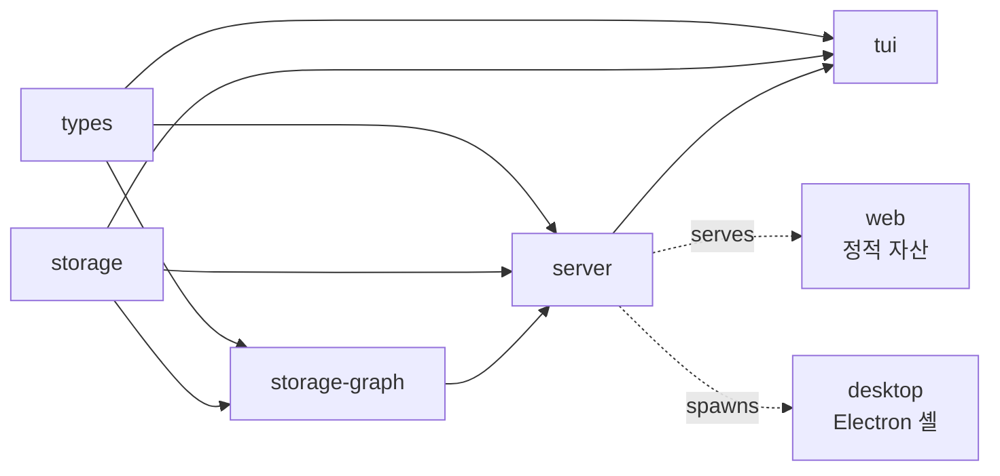
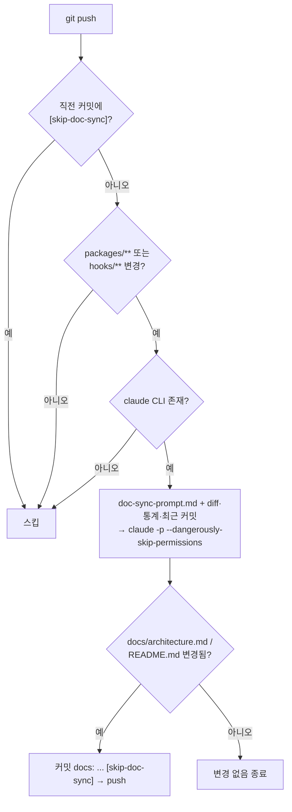

# Claude Spyglass 기여 가이드

Claude Spyglass 프로젝트에 기여해 주셔서 감사합니다. 이 문서는 코드·문서·디자인·DB 스키마 등 어떤 형태로든 기여하려는 분들을 위한 안내서입니다.

Claude Spyglass 는 **Claude Code 의 훅 이벤트를 수집해 토큰 사용량과 요청 흐름을 시각화**하는 모니터링 도구입니다.
**bun workspaces 모노레포** 위에 **TypeScript + React Ink (TUI) + React 18 (Web)** 스택을 사용하며, 저장소는 **SQLite WAL** 메인 DB 와 선택적 **Ladybug 그래프 DB** 로 구성됩니다.
워크스페이스 패키지는 `types` / `storage` / `storage-graph` / `metrics` / `meta-docs` / `server` / `tui` / `web` / `desktop` 9개입니다.
`.claude/` 메타 문서로 일부 워크플로우(커밋·데이터 작업)를 표준화합니다.

> 상위 개요는 [`index.md`](./index.md), 전체 아키텍처는 [`architecture.md`](./architecture.md) 를 참조하세요.

---

## 30초 안에 첫 PR 보내는 법

빠르게 시작하려면 다음 6단계만 따르세요. 자세한 내용은 아래 본문 섹션을 참조하세요.

```bash
# 1. Fork 후 clone
git clone https://github.com/<your-id>/claude-spyglass.git && cd claude-spyglass

# 2. 의존성 설치 (prepare 훅이 자동 등록됨)
bun install

# 3. 환경 점검
bun run doctor

# 4. 기능 브랜치 생성
git checkout -b feat/<short-name>

# 5. 변경 후 검증
bun test && bun run typecheck

# 6. 커밋·PR — Claude Code 안에서는 commit 스킬 사용
#    git commit -m "feat(scope): 설명"
```

> **Tip** — UI/UX 변경은 기존 렌더링 함수를 재사용하고 디자인 토큰만 사용하세요 ([§8](#8-uiux-변경)).
> DB 스키마 변경은 `data-analyst` 스킬을 통해 진행하세요 ([§7](#7-db-변경-마이그레이션-추가)).
> 머지 전에 [PR 체크리스트](#12-pr-체크리스트)를 반드시 확인하세요.

---

## 목차

1. [시작하기](#1-시작하기)
2. [개발 환경](#2-개발-환경)
3. [모노레포 작업](#3-모노레포-작업)
4. [코드 스타일](#4-코드-스타일)
5. [테스트](#5-테스트)
6. [타입 체크](#6-타입-체크)
7. [DB 변경 (마이그레이션 추가)](#7-db-변경-마이그레이션-추가)
8. [UI/UX 변경](#8-uiux-변경)
9. [문서 작업](#9-문서-작업)
10. [커밋과 Pull Request](#10-커밋과-pull-request)
11. [Claude Code 스킬·MCP](#11-claude-code-스킬mcp)
12. [PR 체크리스트](#12-pr-체크리스트)

---

## 1. 시작하기

### 1.1 저장소 Fork & Clone

GitHub 에서 본 저장소를 Fork 한 뒤, 본인 fork 를 clone 하고 upstream 을 등록합니다.

```bash
git clone https://github.com/<your-id>/claude-spyglass.git
cd claude-spyglass
git remote add upstream https://github.com/<원본-소유자>/claude-spyglass.git
```

### 1.2 의존성 설치 & 훅 등록

```bash
bun install
```

`bun install` 직후 `package.json`의 `prepare` 스크립트(`git config core.hooksPath .githooks`)가 자동 실행됩니다.
이로써 `post-push` 훅이 등록됩니다.
`packages/**` 또는 `hooks/**` 변경을 푸시한 직후 `claude -p` 가 호출되어 `docs/architecture.md` 와 `README.md` 가 자동 현행화됩니다 (자세한 동작은 [§9.4](#94-자동-문서-현행화-post-push) 참조).

`prepare` 가 실행되지 않은 환경에서는 `bun run prepare` 를 수동 실행하세요.
CI 등 훅이 불필요한 곳은 `git config --unset core.hooksPath` 로 해제합니다.

### 1.3 첫 실행

```bash
bun run doctor   # 환경·DB·서버 무결성 점검
bun start        # 서버 데몬 기동
bun run tui      # TUI 대시보드
# 웹 대시보드: http://localhost:9999 (기본)
```

서버가 떠 있는 상태에서 Claude Code 세션을 한 번 실행해 데이터를 적재하면 실제 데이터로 UI를 확인할 수 있습니다.

---

## 2. 개발 환경

### 2.1 런타임 요구사항

| 항목 | 버전 |
|------|------|
| **Bun** | `>=1.2.0` (`package.json#engines.bun`) |
| **Node.js** | LTS 20+ (도구·에디터 호환용; 실행은 Bun 권장) |
| **TypeScript** | `^5.0.0` (`tsc --noEmit`) |
| **SQLite** | Bun 내장 (`~/.spyglass/spyglass.db` WAL) |
| **Ladybug 그래프 DB** | `@ladybugdb/core` (선택, 런타임 lazy import — 미설치 시 SQLite 만으로 동작) |
| **Claude Code CLI** | post-push 자동 문서 현행화에 필요 (선택) |

### 2.2 권장 IDE 설정

**VS Code**
- *Biome*, *Bun for Visual Studio Code*, *vscode-styled-components* 확장 설치
- `"typescript.tsdk": "node_modules/typescript/lib"` 권장
- TUI 디버깅은 루트 의존성으로 포함된 `react-devtools-core` 활용

**IntelliJ IDEA / WebStorm**
- *Bun* 플러그인 설치 후 Runner 를 Bun 으로 지정
- *Languages & Frameworks → JavaScript → Code Quality Tools → Biome* 활성화
- `tsconfig.json` 의 `jsx = "react-jsx"` 에 맞춰 JSX 인식 활성화

### 2.3 데이터 디렉터리

런타임 데이터는 `~/.spyglass/` 하위에 저장됩니다.

| 파일/디렉터리 | 용도 |
|---------------|------|
| `spyglass.db` (WAL) | SQLite 메인 DB |
| `spyglass.db-wal`, `spyglass.db-shm` | WAL 모드 사이드카 파일 |
| `graph/` | Ladybug 그래프 DB 디렉터리 (선택, 없으면 자동 재구축) |
| `logs/server.log` | 서버 stdout/stderr 미러 |
| `logs/collect.log` | 훅 스크립트 호출·에러 로그 |
| `logs/hook-raw.jsonl` | 훅이 받은 raw 페이로드 (1줄/이벤트) |
| `server.pid` | 데몬 PID |

SQLite 만 초기화하려면 `spyglass.db*` 를, 그래프만 초기화하려면 `~/.spyglass/graph/` 를 지우면 됩니다 (그래프는 SQLite 로부터 자동 재구축). 통계 테이블만 재구성하려면 `bun run rebuild-stats` 또는 `bun run rebuild-stats-proxy` 를 실행합니다.

---

## 3. 모노레포 작업

### 3.1 워크스페이스 구조

루트 `package.json` 의 `workspaces: ["packages/*"]` 설정 아래, `package.json` 을 가진 디렉터리만 워크스페이스로 등록됩니다. 현재 9개 패키지입니다.

| 패키지 | 이름 | 책임 |
|--------|------|------|
| `packages/server` | `@spyglass/server` | HTTP API · SSE · CLI · 훅 수집/디스패치/처리 · proxy · routes · settings |
| `packages/storage` | `@spyglass/storage` | SQLite 연결·마이그레이션·쿼리·통계·retention·pricing |
| `packages/storage-graph` | `@spyglass/storage-graph` | Ladybug 그래프 client · queries(unified-flow/retention) · schema(ddl) · sync |
| `packages/metrics` | `@spyglass/metrics` | 관찰성 메트릭 라우터 + 계산기 (anomaly/burn-rate/cache-trend/proxy-trend) |
| `packages/meta-docs` | `@spyglass/meta-docs` | Behavior Definitions 스캐너 · 리졸버 · 동기화 |
| `packages/tui` | `@spyglass/tui` | React Ink 기반 터미널 대시보드 |
| `packages/web` | `@spyglass/web` | React 18 + Vite 웹 대시보드 (Zustand · React Router · react-i18next) |
| `packages/types` | `@spyglass/types` | 공용 도메인 타입 (request/session/turn) |
| `packages/desktop` | `@spyglass/desktop` | Electron 셸 (main/preload) |

각 워크스페이스 패키지는 `"@spyglass/<name>": "workspace:*"` 프로토콜로 서로를 참조합니다.

### 3.2 패키지 추가하기

1. `packages/<new-pkg>/` 디렉터리 생성 (**kebab-case**).
2. `package.json` 작성 — `name: "@spyglass/<name>"`, `type: "module"`, `main`, `exports` 필수.
3. 다른 패키지에서 참조한다면 해당 패키지의 `package.json` 에 `"@spyglass/<new-pkg>": "workspace:*"` 등록.
4. 루트에서 `bun install` 을 재실행해 심볼릭 링크 갱신.

### 3.3 패키지 간 의존성 원칙

실제 `package.json` 의존 관계입니다. 화살표 컨벤션은 [`architecture.md`](./architecture.md) §3.1 과 동일하게 **`A --> B` = `A` 가 `B` 에 import 됨 (`B` 가 `A` 에 의존)** 입니다.



- **단방향 의존** — 의존은 항상 `types → storage-graph → server → tui` 및 `storage → server → tui` 방향으로만 흐릅니다. 상위 패키지(`server`/`tui`)를 하위 패키지가 import 하지 않습니다 (순환 차단).
- `storage` 는 어떤 워크스페이스 패키지에도 의존하지 않습니다 — `packages/storage/package.json` 의 `dependencies` 가 비어 있고(`{}`), `src/` 전체에서 `@spyglass/types` import 가 없습니다.
- `storage-graph` 는 `storage`(`@spyglass/storage`) · `types`(`@spyglass/types`) 에 의존하며, `server` 가 `storage` · `storage-graph` · `types` 세 패키지를 모두 import 합니다. `tui` 는 `server` · `storage` · `types` 를 import 합니다(`storage-graph` 는 import 하지 않음).
- `desktop` 은 워크스페이스 `dependencies` 가 없는 Electron 셸로, 빌드된 `server` 바이너리를 런타임에 spawn 합니다 ([`architecture.md`](./architecture.md) §3.1 의 `SERVER -.-> DESKTOP` 와 동일).
- 공통 타입은 반드시 `@spyglass/types` 에 두고 각 패키지에서 import.

### 3.4 공통 스크립트

루트에서 실행 가능한 명령(모두 `bun run <name>`):

| 명령 | 동작 |
|------|------|
| `start` / `dev` / `stop` / `status` | 서버 데몬 라이프사이클 (`dev` 는 restart) |
| `doctor` | 환경·DB·서버 무결성 점검 (`cli.ts doctor`) |
| `tui` | TUI 실행 |
| `test` | `bun test` (모든 패키지 테스트 일괄) |
| `typecheck` | `tsc --noEmit` (전체 모노레포) |
| `backfill:system-prompts` | 과거 세션 system_prompt 백필 |
| `backfill:subagent-parents` | 서브에이전트 parent tool_use_id 백필 |
| `rebuild-stats`, `rebuild-stats-proxy` | 집계 테이블 재계산 |
| `web:dev` / `web:build` | Vite 웹 개발 서버 / production 빌드 |
| `desktop:dev` / `desktop:build:mac` / `desktop:pack:mac` | Electron 데스크톱 셸 개발·빌드·패키징 |

---

## 4. 코드 스타일

`CLAUDE.md` 의 개발 원칙을 그대로 따릅니다. 핵심 원칙은 다음과 같습니다.

### 4.1 파일·디렉터리 명명 (kebab-case)

> 모든 디렉토리명과 파일명은 **kebab-case**로 작성하세요. — `CLAUDE.md`

예: `tool-row-alignment.test.ts`, `cache-panel-tooltip.js`, `data-analyst/`. React 컴포넌트 파일도 `kebab-case.tsx` (PascalCase 컴포넌트명은 파일 내부에서만). 마이그레이션은 `NNN-<설명>.sql` (예: `021-proxy-payload-compression.sql`).

### 4.2 캡슐화 · 단일 책임 (Java식 사고)

> 사용자는 Java 개발자로 캡슐화·단일 책임을 중시합니다. — `CLAUDE.md`

#### 원칙 1. 동일 판단 로직은 한 곳에만

호출 측에서 `boolean` 을 재계산하지 말고, **raw data 를 함수에 전달**하고 판단은 함수 내부에서 처리합니다.

```ts
// ❌ Bad — 호출 측에서 boolean 을 미리 계산
//         같은 판단이 여러 호출 지점에 분산되어 버그 위험
const isRunning = r.event_type === 'pre_tool';
const html = toolIconHtml(r.tool_name, isRunning);
```

```ts
// ✅ Good — raw event_type 을 그대로 전달
//          판단 로직은 toolIconHtml 내부 한 곳에만 존재
const html = toolIconHtml(r.tool_name, r.event_type);
```

#### 원칙 2. 기존 렌더링 함수를 반드시 재사용

아이콘·배지·행 등 UI 요소는 직접 HTML 을 작성하지 말고 기존 함수를 거칩니다.

```js
// ❌ Bad — innerHTML 직접 작성, 아이콘·배지 로직이 분산됨
row.innerHTML = `<td><svg>...</svg> ${r.tool_name}</td>`;
```

```js
// ✅ Good — 기존 함수 재사용, 변경 시 한 곳만 수정
row.appendChild(makeRequestRow(r));
```

### 4.3 웹 대시보드 핵심 함수 (직접 작성 금지)

다음은 `CLAUDE.md` 가 "누락 방지" 함수로 지정한 것들입니다 — 모든 UI 요소는 이 함수들을 거쳐야 하며, 페이지 코드에서 `innerHTML = '<svg …>'` 같은 직접 HTML 작성은 금지입니다.

`packages/web/assets/js/renderers.js` 는 `render/*` 파일들의 re-export 진입점(호환 shim)으로, 각 모듈에 대해 개별 `export *` 구문 7줄로 re-export 합니다 — `export * from './render/badges.js'`, `'./render/model.js'`, `'./render/cells.js'`, `'./render/extract.js'`, `'./render/expand.js'`, `'./render/rows.js'`, `'./render/skeleton.js'` (ES Modules 는 glob import 를 지원하지 않으므로 파일별로 한 줄씩 명시). 함수 정의 자체는 아래 표의 `render/*` 파일에 있습니다. `prependRequest` 는 이 진입점에 포함되지 않으며 `views/default-view.js` 를 통해서만 re-export 됩니다.

| 함수 | 정의 파일 | 책임 |
|------|-----------|------|
| `toolIconHtml(toolName, eventType)` | `packages/web/assets/js/render/badges.js` | 툴 아이콘 + pulse(`pre_tool` 시 `.tool-icon-running`). **`r.event_type` 을 두 번째 인자로 반드시 전달** |
| `makeTargetCell(r)` | `packages/web/assets/js/render/cells.js` | Target 컬럼 전체(아이콘 + 이름 + 상태배지) |
| `makeRequestRow(r, opts)` | `packages/web/assets/js/render/rows.js` | 로그 피드 행 |
| `prependRequest(r)` | `packages/web/assets/js/views/default/feed-live.js` (main.js 는 `views/default-view.js` 경유 import 만, 정의·재수출 없음) | SSE 수신 레코드를 피드 상단에 prepend, 동일 `id` 는 인플레이스 업데이트 |

### 4.4 pre_tool / post_tool 이벤트 규칙

수집 훅과 SSE 처리는 다음 규칙을 깨면 안 됩니다.

| 이벤트 | 동작 | SSE |
|--------|------|-----|
| `pre_tool` | DB 레코드 생성 | **브로드캐스트 안 함** |
| `tool` | 동일 `tool_use_id` 의 pre_tool 레코드를 UPDATE | DB 의 실제 id (`pre-xxx`) 사용 |

쿼리 필터 규칙:

| 쿼리 종류 | 필터 |
|-----------|------|
| 조회 쿼리 | `event_type IS NULL OR event_type != 'pre_tool' OR tool_name = 'Agent'` |
| 통계 쿼리 | `event_type IS NULL OR event_type = 'tool'` (`'post_tool'` 아님) |

### 4.5 TypeScript · LSP 일반 규칙

- `tsconfig.json` 은 `strict: true`. 새 코드는 모두 strict 통과. `any` 금지(불가피하면 주석으로 사유 명시).
- `import type { ... }` 적극 활용. 외부 export 에는 JSDoc `@description` 한 줄 권장.
- 코드 탐색은 grep 보다 LSP("Find references", "Go to definition")를 우선 사용합니다 (`CLAUDE.md`).

---

## 5. 테스트

### 5.1 테스트 실행

```bash
# 모든 패키지 테스트
bun test

# 특정 패키지만
cd packages/storage && bun test
cd packages/server  && bun test
cd packages/tui     && bun test

# 단일 파일
bun test packages/storage/src/__tests__/request.test.ts

# 패턴 매칭
bun test --test-name-pattern="rebuild stats"
```

### 5.2 테스트 위치

모든 단위 테스트는 각 패키지의 `src/__tests__/` 디렉터리에 두며, 파일명은 `<대상>.test.ts` 형식입니다.

- `packages/server/src/__tests__/` — `server.test.ts`(라이프사이클·라우터), `collect.test.ts`(훅 수집), `requests-filter.test.ts`, `sse-payload.test.ts`, `read-endpoint-contract.test.ts`, `i18n-*.test.ts` 등
- `packages/server/src/hook/__tests__/` — `persist-merge-race.test.ts`, `slash-command.test.ts`
- `packages/storage/src/__tests__/` — `connection.test.ts`, `request.test.ts`, `session.test.ts`, `stats-integration.test.ts`, `stats-event-type-regression.test.ts`, `proxy-stats.test.ts`, `migrator.test.ts`, `retention-*.test.ts` 등 다수
- `packages/tui/src/__tests__/` — `tool-row-alignment.test.ts`, `detect-lang.test.ts`, `i18n.test.ts`
- `packages/web/assets/js/__tests__/` — `renderers.test.ts`(`__snapshots__/` 포함), `formatters.test.ts`, `sse.test.ts`, `state.test.ts` 등

### 5.3 새 테스트 추가 패턴

`bun:test` API 를 사용합니다. 표준 패턴:

```ts
import { describe, it, expect, beforeEach, afterEach } from 'bun:test';
import { SpyglassDatabase, closeDatabase } from '../index';

const TEST_DB_PATH = `/tmp/spyglass-my-feature-${Date.now()}.db`;

describe('My Feature', () => {
  let db: SpyglassDatabase;
  beforeEach(() => { db = new SpyglassDatabase({ dbPath: TEST_DB_PATH, autoInit: true }); });
  afterEach(() => {
    closeDatabase();
    try { require('fs').unlinkSync(TEST_DB_PATH); } catch {}
  });
  it('should …', () => { /* 준비 → 실행 → expect */ });
});
```

가이드라인:

- DB가 필요한 테스트는 `/tmp/spyglass-*-${Date.now()}.db` 로 격리. `closeDatabase()` + `unlinkSync` 로 정리.
- TUI 테스트는 `ink-testing-library` 의 `render()` 결과를 검증.
- Web 스냅샷이 변경되면 의도적 변경인지 PR 설명에 명시.

### 5.4 통합·회귀 테스트 컨벤션

- `*-integration.test.ts` — 여러 모듈을 함께 검증.
- `*-regression.test.ts` — 한 번 잘못 동작했던 케이스의 영구 잠금장치.
- **버그 수정에는 회귀 테스트 한 개 이상 추가**가 원칙입니다.

---

## 6. 타입 체크

```bash
bun run typecheck     # tsc --noEmit (전체 워크스페이스)
```

루트 `tsconfig.json` 의 `include: ["packages/**/*", "scripts/**/*"]` 가 모든 패키지를 일괄 검사합니다.
`strict: true` 이므로 implicit any, 미사용 변수, null·undefined 처리 누락은 빌드 실패입니다.
패키지별 별도 `tsconfig.json` (예: `packages/tui/tsconfig.json`) 이 있으면 그 설정이 우선됩니다.

> **PR 머지 전 반드시** `bun run typecheck` + `bun test` 가 모두 깨끗하게 통과해야 합니다.

---

## 7. DB 변경 (마이그레이션 추가)

DB 스키마·쿼리·집계·훅 데이터 흐름 변경은 모두 **`data-analyst` 스킬** 의 워크플로우를 따릅니다.

> "데이터 분석", "테이블 추가", "컬럼 추가", "쿼리 최적화", "스키마 변경",
> "마이그레이션 추가", "통계 개선" 등의 요청은 반드시 `data-analyst` 스킬을 사용합니다. — `CLAUDE.md`

스키마 전체와 마이그레이션 목록은 [`database.md`](./database.md) · [`migrations.md`](./migrations.md) 를 참조하세요.

### 7.1 마이그레이션 번호 규칙

`packages/storage/migrations/` 는 `001-init.sql` 부터 `053-kuzu-outbox-trigger-hardening.sql` 까지 SQL 파일로 관리됩니다. `migrator.ts` 가 파일명으로 정렬하고 파일명 앞 숫자 prefix 를 버전으로 사용합니다 (예: `035-add-migrations-meta-table.sql` → version 35).

| 규칙 | 내용 |
|------|------|
| 번호 | 마지막 번호 + 1 (현재 최신은 053). 정렬 기준이 숫자 prefix 라 번호가 단조 증가하기만 하면 됨 |
| 파일명 | `NNN-<kebab-case-설명>.sql` (3자리 zero-padded) |
| SQL | **idempotent** — `CREATE TABLE IF NOT EXISTS`, `ADD COLUMN IF NOT EXISTS` 등 |

### 7.2 마이그레이션 추가 절차

다음 6단계를 순서대로 진행합니다.

1. **SQL 파일 생성** — `packages/storage/migrations/NNN-<설명>.sql` 작성 (`migrator.ts` 가 자동 로드).
2. **쿼리 업데이트** — 영향받는 쿼리 파일(`packages/storage/src/queries/**`) 수정.
3. **회귀 테스트 추가** — 새 컬럼/테이블이 기존 통계 쿼리에 영향을 주지 않는지 검증.
4. **로컬 검증** — `~/.spyglass/spyglass.db` 를 백업한 뒤 `bun start` → 마이그레이션 적용 확인.
5. **집계 재계산 검증** — `bun run rebuild-stats` / `rebuild-stats-proxy` 가 깨지지 않는지 확인.
6. **문서 동기화** — `docs/architecture.md` 의 테이블 목록은 push 시 `post-push` 훅이 자동 현행화 ([§9.4](#94-자동-문서-현행화-post-push)).

### 7.3 훅 수집 스크립트 변경

훅 수집 스크립트 `hooks/spyglass-collect.sh` 와 사용자 `~/.claude/settings.json` 의 훅 등록(예제: `docs/examples/settings.hooks.full.json` · `settings.hooks.minimal.json`)은 한 세트로 묶여 있습니다.
이벤트 종류·페이로드를 변경할 때는 아래 다섯 곳을 모두 갱신해야 합니다. 훅 통합 흐름 전체는 [`hooks-integration.md`](./hooks-integration.md) 를 참조하세요.

1. `hooks/spyglass-collect.sh` — 수집 로직 (`/collect`, `/events` 로 POST)
2. `docs/examples/settings.hooks.*.json` — 훅 등록 예제
3. `packages/server/src/hook/` — 수신·디스패치·정제·영속화 (`http-entry`/`dispatcher`/`handlers`/`processor`/`persist`)
4. `packages/storage/src/schema.ts` + 새 마이그레이션 — 저장 스키마
5. `packages/server/src/__tests__/collect.test.ts` — 회귀 테스트

---

## 8. UI/UX 변경

웹·TUI 화면 구조 전체는 [`web-dashboard.md`](./web-dashboard.md) · [`tui.md`](./tui.md) 를 참조하세요.

### 8.1 기존 렌더링 함수 재사용 원칙

> 아이콘·배지·행 등 UI 요소는 기존 렌더링 함수를 거치지 않고 직접 HTML 을 작성하지 마세요. — `CLAUDE.md`

[§4.3](#43-웹-대시보드-핵심-함수-직접-작성-금지) 의 핵심 함수(`toolIconHtml` / `makeTargetCell` / `makeRequestRow` / `prependRequest`)를 반드시 경유합니다. 페이지 코드에서 `innerHTML = '<svg …>'` 같은 직접 HTML 작성은 금지입니다.

### 8.2 디자인 토큰 · 변수 사용

- CSS 변수 외 **하드코딩 색상 금지** (`#abc123` 직접 입력 금지).
- 토큰 위치
  - Web: `packages/web/assets/css/` (`--color-*`, `--space-*`)
  - TUI: `packages/tui/src/design-tokens.ts`


### 8.3 TUI 작업 시 주의

Ink 컴포넌트는 `packages/tui/src/components/`(`charts`/`display`/`feedback`/`layout`/`nav`/`overlays`/`primitives`/`signature`)와 `packages/tui/src/screens/` 로 분리되어 있습니다.
키바인딩을 변경할 때는 `packages/tui/src/components/overlays/HelpOverlay.tsx` 도 함께 업데이트하세요.
`bun run tui` 로 직접 띄워 검증한 뒤 `ink-testing-library` 로 스냅샷 테스트를 추가합니다.

---

## 9. 문서 작업

### 9.1 문서 트리

```
docs/                              ← 사용자·외부 대상 문서
├── install-guide.md
├── examples/                      ← 훅 settings.json 예제 (full / minimal)
├── prototypes/ · release-notes/ · research/
└── architecture/                  ← index.md, architecture.md, contributing.md,
                                      database.md, migrations.md, hooks-integration.md,
                                      data-flow.md, api-http.md, cli.md, configuration.md,
                                      deployment.md, metrics-analytics.md, tui.md,
                                      web-dashboard.md, troubleshooting.md, schema/, images/

.claude/                           ← Claude Code 메타
├── .tmp/logs/                     ← 진단 로그 (DIAG ON 시: model-trace.log,
│                                     hook-payload.jsonl, proxy-payload.jsonl)
├── docs/
│   ├── plans/<feature>/           ← 기능별 plan/adr/tasks
│   └── specs/<feature>/           ← 기능별 spec
├── skills/                        ← commit, data-analyst
├── worktrees/                     ← git worktree 작업 공간
├── settings.json                  ← 프로젝트 설정
└── settings.local.json            ← 로컬 설정 오버라이드 (git 미추적)
```

### 9.2 어떤 문서를 어디에 쓰는가

| 문서 종류 | 위치 |
|-----------|------|
| 아키텍처(전체) | `docs/architecture/architecture.md` (자동 현행화 대상은 `docs/architecture.md`, [§9.4](#94-자동-문서-현행화-post-push) 참조) |
| 기능별 plan / ADR / tasks | `.claude/docs/plans/<feature>/` |
| 기능별 spec | `.claude/docs/specs/<feature>/` |

### 9.3 작성 트리거 (`CLAUDE.md` 인용)

- **plan 문서 필수**: 3단계 이상 복잡 작업 / 다중 파일 변경 / 2개 이상 도구 호출.
- **prompts 문서 필수**: 2회 이상 재사용되는 시스템 프롬프트·작업 지시문·컨텍스트 템플릿.
- **feature 명**: 도메인/모듈/컴포넌트 단위(예: `auth`, `dashboard`, `cache-panel`) — 동일 기능의 plan/adr/tasks/prompts 는 같은 이름을 공유.

### 9.4 자동 문서 현행화 (post-push)

`packages/**` 또는 `hooks/**` 변경을 push 하면 `.githooks/post-push` 가 동작합니다.



- 변경 diff 는 `packages/**`·`hooks/**` 한정 최대 200줄, diff 통계는 최대 40줄까지 프롬프트에 삽입됩니다.
- 자동 커밋·push 대상 경로는 `docs/architecture.md` 와 `README.md` 입니다. `[skip-doc-sync]` 마커로 재귀 push 를 차단합니다.
- `doc-sync-prompt.md` 는 `docs/planning/` 하위를 절대 수정하지 말라고 명시합니다 (해당 디렉터리는 현재 리포에 존재하지 않음).
- 기능별 ADR / plan / tasks 는 자동화 대상이 아니며 `.claude/docs/plans/<feature>/` 에서 수동 관리합니다.

---

## 10. 커밋과 Pull Request

### 10.1 커밋은 항상 `commit` 스킬

> 모든 Git 커밋 요청은 `commit` 스킬을 사용하세요. — `CLAUDE.md`

Claude Code 안에서는 `Skill("commit")` 으로 위임합니다. 스킬이 다음 규칙으로 자동 분리합니다.

| 규칙 | 내용 |
|------|------|
| **Tidy First** | `refactor` 와 `feat`/`fix` 는 같은 커밋에 섞지 않음 (개발 소스 한정) |
| **커밋 순서** | `.claude/` 설정 → `refactor` → `feat`/`fix` → `docs` → `chore` |
| **스테이징 없이 커밋** | `git add` 대신 `git commit <path> -m …` 사용 |
| **메시지 언어** | 기본 **한국어** |

### 10.2 커밋 메시지 형식 (Conventional Commits)

```
<type>(<scope>): <description>

- <body item>
- <body item>
```

- **type**: `feat` | `fix` | `refactor` | `docs` | `test` | `style` | `chore`
- **description**: 동사·소문자 시작, 마침표 금지, 50자 이내.
- **body**: `-` 기호 사용, 최대 5개, 항목 사이 개행 금지.

예시:

```
feat(cache-donut): 캐시 비율 도넛에 호버 툴팁 추가

- read/creation 슬라이스에 마우스 오버 시 raw 토큰 표시
- 색상은 --color-cache-* 변수만 사용
- 회귀 테스트 추가 (cache-panel.test.ts)
```

### 10.3 브랜치 전략

- 기본 브랜치: `main`
- 기능 브랜치: `feat/<feature>`, `fix/<scope>-<요약>`, `docs/<scope>` 형태 권장
- 장기 작업은 `.claude/worktrees/` 의 git worktree 를 활용하면 main 과 격리됩니다.

### 10.4 .githooks 동작 요약

`post-push` 훅은 `git push` 직후 `packages/**` 또는 `hooks/**` 변경이 감지되면 `docs/architecture.md` · `README.md` 를 자동 현행화합니다 (상세 흐름은 [§9.4](#94-자동-문서-현행화-post-push)).

- 재귀 방지 마커: `[skip-doc-sync]`
- 일시 비활성화: `git -c core.hooksPath=/dev/null push` 또는 `git config --unset core.hooksPath`

### 10.5 Pull Request 절차

1. fork 의 feature 브랜치를 push.
2. PR 생성. 제목은 한국어 커밋 메시지와 동일 톤(50자 이내).
3. 본문에 **변경 요약(3~5줄)**, **동기/컨텍스트**, **테스트 결과**(`bun test`, `bun run typecheck`), **스크린샷/녹화**(UI 변경 시), **연관 plan/spec 링크**(예: `.claude/docs/plans/<feature>/plan.md`)를 포함.
4. 본문 끝에 [PR 체크리스트](#12-pr-체크리스트)를 복사·체크.
5. 머지 방식은 **squash merge** 권장(커밋 그래프 단순화).

---

## 11. Claude Code 스킬·MCP

이 저장소는 `.claude/skills/` 에 기여 워크플로우용 스킬을 두고 있습니다. 각 요청 유형에 매핑된 스킬을 그대로 따르는 것이 권장 절차입니다. (별도 `.claude/agents/` 서브에이전트 디렉터리는 두지 않습니다.)

### 11.1 스킬 (`.claude/skills/`)

| 스킬 | 트리거 예시 | 책임 |
|------|---------------|-----------|
| `commit` | "커밋해줘", "git 커밋해줘" | Conventional Commits + Tidy First 로 자동 분리 커밋 (model: haiku) |
| `data-analyst` | "테이블 추가", "마이그레이션", "쿼리 최적화", "통계 개선" | SQLite 스키마·집계·훅 데이터 흐름 분석 및 변경 |

### 11.2 매핑 가이드 (요청 유형 → 권장 워크플로우)

| 작업 유형 | 권장 흐름 |
|-----------|-----------|
| 새 컬럼/테이블 추가 · 마이그레이션 | `data-analyst` 스킬 |
| 통계 쿼리 개선 · 데이터 흐름 분석 | `data-analyst` 스킬 |
| 커밋 | 모든 경우 `commit` 스킬 |
| 기능별 plan/adr/tasks/spec | `.claude/docs/plans/<feature>/` · `.claude/docs/specs/<feature>/` 에 수동 작성 |

### 11.3 허용된 MCP 서버

`.claude/settings.json` 의 `permissions.allow` 에 다음 MCP 가 사전 허용되어 있습니다.

| MCP | 용도 |
|-----|------|
| `mcp__sequential-thinking__*` | 단계적 사고가 필요한 분석·리뷰 |
| `mcp__context7__*` | 라이브러리 문서 조회 |
| `mcp__playwright__*` | 웹 대시보드 브라우저 검증 |

---

## 12. PR 체크리스트

PR 을 열기 전에 항목을 확인하세요. **아래 코드 블록을 그대로 복사해 PR 본문 끝에 붙여넣으면 GitHub 에서 체크박스로 렌더링됩니다.**

### 12.1 미리보기 (렌더링된 모습)

**코드**

- [ ] 파일·디렉터리명이 모두 kebab-case
- [ ] 호출 측에서 boolean 재계산 없음 (raw data 전달, 판단은 함수 내부)
- [ ] 기존 렌더링 함수 (`toolIconHtml` / `makeTargetCell` / `makeRequestRow` / `prependRequest`) 재사용
- [ ] `event_type` (`pre_tool` / `tool`) 처리 규칙 준수
- [ ] (UI) 하드코딩 색상 없이 디자인 토큰만 사용

**테스트 · 타입**

- [ ] `bun test` 통과
- [ ] `bun run typecheck` 통과
- [ ] 새 기능에 단위 테스트 추가
- [ ] 버그 수정에 회귀 테스트 (`*-regression.test.ts`) 추가

**DB / 데이터 (해당 시)**

- [ ] 마이그레이션 번호가 마지막 + 1
- [ ] 새 SQL 이 idempotent (`IF NOT EXISTS` 등)
- [ ] 영향받는 쿼리·집계 테이블 재계산 검증
- [ ] `data-analyst` 스킬 사용

**UI / UX (해당 시)**

- [ ] 기존 렌더링 함수 재사용, 직접 HTML 작성 없음
- [ ] 하드코딩 색상 없이 디자인 토큰만 사용


**문서**

- [ ] `docs/architecture/architecture.md` 영향 영역이 정확함
- [ ] 새 메타 문서가 feature 명 컨벤션 준수

**커밋 · PR**

- [ ] `commit` 스킬 사용 또는 동일 규칙으로 분리
- [ ] Conventional Commits 형식 (`<type>(<scope>): <description>`)
- [ ] PR 본문에 요약·동기·테스트 결과·연관 plan 링크
- [ ] (UI) 스크린샷·녹화 포함

### 12.2 복사용 원본

```markdown
## PR 체크리스트

**코드**
- [ ] 파일·디렉터리명이 모두 kebab-case
- [ ] 호출 측에서 boolean 재계산 없음 (raw data 전달, 판단은 함수 내부)
- [ ] 기존 렌더링 함수(`toolIconHtml` / `makeTargetCell` / `makeRequestRow` / `prependRequest`) 재사용
- [ ] `event_type` (`pre_tool` / `tool`) 처리 규칙 준수
- [ ] (UI) 하드코딩 색상 없이 디자인 토큰만 사용

**테스트 · 타입**
- [ ] `bun test` 통과
- [ ] `bun run typecheck` 통과
- [ ] 새 기능에 단위 테스트 추가
- [ ] 버그 수정에 회귀 테스트(`*-regression.test.ts`) 추가

**DB / 데이터 (해당 시)**
- [ ] 마이그레이션 번호가 마지막 + 1
- [ ] 새 SQL 이 idempotent (`IF NOT EXISTS` 등)
- [ ] 영향받는 쿼리/집계 테이블 재계산 검증
- [ ] `data-analyst` 스킬 사용

**UI / UX (해당 시)**
- [ ] 기존 렌더링 함수 재사용, 직접 HTML 작성 없음
- [ ] 하드코딩 색상 없이 디자인 토큰만 사용


**문서**
- [ ] `docs/architecture/architecture.md` 영향 영역이 정확함
- [ ] 새 메타 문서가 feature 명 컨벤션 준수

**커밋 · PR**
- [ ] `commit` 스킬 사용 또는 동일 규칙으로 분리
- [ ] Conventional Commits 형식 (`<type>(<scope>): <description>`)
- [ ] PR 본문에 요약·동기·테스트 결과·연관 plan 링크
- [ ] (UI) 스크린샷/녹화 포함
```

---

## 참고 링크

- `CLAUDE.md` — 프로젝트 최상위 개발 원칙
- [`index.md`](./index.md) — 아키텍처 문서 인덱스
- [`architecture.md`](./architecture.md) — 현행 아키텍처 전체
- [`database.md`](./database.md) · [`migrations.md`](./migrations.md) — 스키마·마이그레이션
- [`hooks-integration.md`](./hooks-integration.md) · [`data-flow.md`](./data-flow.md) — 훅 수집·데이터 흐름
- [`web-dashboard.md`](./web-dashboard.md) · [`tui.md`](./tui.md) · [`cli.md`](./cli.md) — UI·CLI
- `docs/install-guide.md` — 사용자 설치 가이드
- `.claude/skills/` — 사용 가능한 스킬 카탈로그 (`commit`, `data-analyst`)
- `.githooks/post-push`, `.githooks/doc-sync-prompt.md` — 자동 문서 현행화 훅

기여 과정에서 막히는 부분이 있다면 PR 초안을 먼저 올리고 댓글로 질문해 주세요.
완벽한 PR 보다, 빠른 피드백 루프가 훨씬 가치 있습니다.
