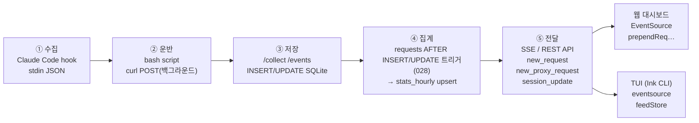
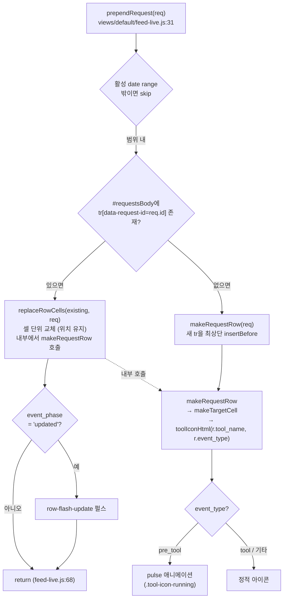
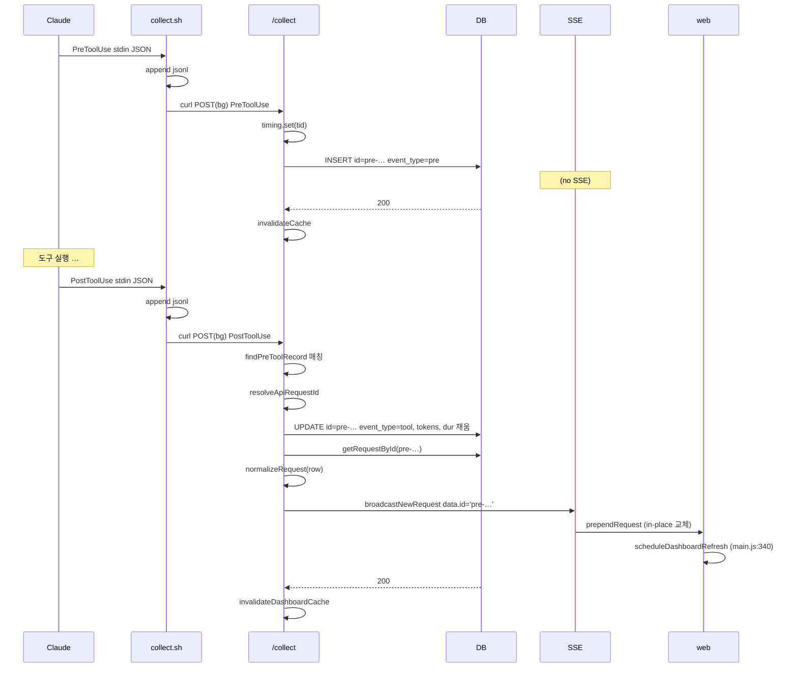
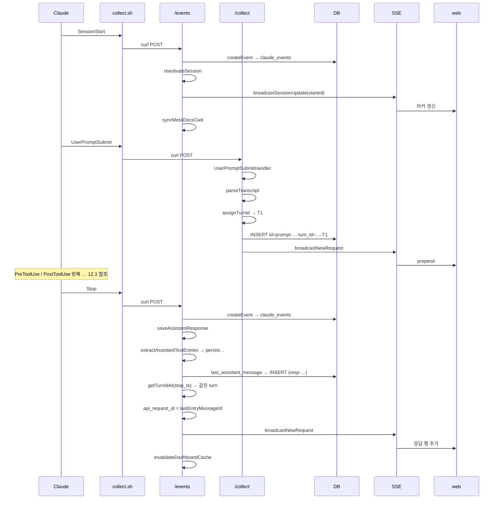

# claude-spyglass 데이터 흐름 (Data Flow)

> 문서 범위: Claude Code 훅에서 발생한 1건의 이벤트가 사용자 화면(웹 대시보드/TUI)에 표시되기까지 거치는 모든 단계.
> 참조 코드: `packages/server`, `packages/storage`, `packages/web`, `packages/tui`, `hooks/spyglass-collect.sh`.
>
> 연관 문서: [아키텍처 개요](architecture.md) · [데이터베이스 스키마](database.md) · [훅 통합](hooks-integration.md) · [API & HTTP](api-http.md) · [웹 대시보드](web-dashboard.md) · [TUI](tui.md) · [지표·분석](metrics-analytics.md) · [마이그레이션](migrations.md)

## 데이터 흐름 한눈 보기



용어 약어:

- **SSE (Server-Sent Events)**: HTTP 단방향 실시간 푸시 프로토콜.
- **SSoT (Single Source of Truth)**: 단일 진실 원천. 동일 데이터는 한 테이블에서만 권위 있게 보관.
- **ADR (Architecture Decision Record)**: 아키텍처 결정 기록 문서.
- **REST**: `/api/*` HTTP 폴링용 엔드포인트.

---

## 1. 개요 (Bird's-Eye)

claude-spyglass는 Claude Code 한 세션의 모든 행동(프롬프트, 도구 호출, 응답, 세션 라이프사이클)을 실시간으로 캡처해 SQLite에 영구 보존하고, 웹과 TUI 두 채널에 실시간 푸시하는 모니터링 도구다.

데이터 흐름은 다섯 단계 — 수집 → 운반 → 저장 → 집계 → 전달 — 로 압축된다. 단계별 상세는 §2~§9에서 다룬다.

> **핵심 원칙 세 가지**
>
> 1. **원장은 stdout/jsonl + raw `payload` 컬럼**. 정제 결과가 잘못돼도 원본은 항상 복원 가능.
> 2. **SSoT는 `requests`·`proxy_requests`·`stats_hourly` 세 테이블**. SSE 페이로드도 저장 행을 다시 SELECT해 송출(ADR-001/002).
> 3. **`pre_tool` 이벤트는 SSE에 절대 브로드캐스트하지 않는다**. UI 깜빡임 방지를 위해 PostToolUse가 `pre_tool` 행을 Upsert로 완성한 뒤에야 송출.

---

## 2. 수집 단계 (Claude Code Hook → Bash Script)

> Claude Code의 6종 훅이 발생할 때마다 `spyglass-collect.sh`가 stdin으로 raw JSON을 받아 spyglass 서버의 `/collect` 또는 `/events`로 비동기 POST한다. 서버 장애가 본체 동작을 막지 않도록 타임아웃과 백그라운드 실행을 강제한다.

### 2.1 Claude Code 훅 시스템

Claude Code는 사용자가 `~/.claude/settings.json` 또는 프로젝트 `.claude/settings.json`에 등록한 hook을 매 이벤트마다 호출한다. spyglass가 등록을 권장하는 hook은 다음 6종이다.

| hook 이름 | 발생 시점 | 운반 엔드포인트 |
| --------- | -------- | -------------- |
| `UserPromptSubmit` | 사용자가 프롬프트를 보냄 | `/collect` |
| `PreToolUse` | 도구 호출 시작 직전 | `/collect` |
| `PostToolUse` | 도구 호출 종료 직후 | `/collect` |
| `SessionStart` | 세션 시작 (신규/compact/resume) | `/events` |
| `Stop` | turn 종료 (사용자가 본 응답 직후) | `/events` |
| `SessionEnd` | 세션 종료 | `/events` |

훅은 모두 spyglass 입장에서 동일한 진입점 — `hooks/spyglass-collect.sh` 한 개를 stdin에 raw JSON을 흘려서 호출한다. 스크립트가 `hook_event_name` 필드를 보고 `/collect`와 `/events`로 라우팅한다.

### 2.2 STDIN JSON 페이로드 포맷

`/collect`로 가는 도구·프롬프트 훅의 raw JSON 형상은 `packages/server/src/hook/types.ts:33-49`의 `ClaudeHookPayload` 인터페이스. hook 종류마다 채워지는 필드가 다르다.

```jsonc
{
  // 공통
  "hook_event_name": "PreToolUse",      // 라우팅 키
  "session_id": "abc-123",
  "transcript_path": "~/.claude/...",
  "cwd": "/Users/.../project",          // → project_name 추출
  "permission_mode": "default",         // v20 감사 메타
  // Pre/PostToolUse
  "tool_name": "Bash", "tool_input": { "command": "ls" },
  "tool_use_id": "toolu_01XYZ",         // Upsert 매칭 키
  "tool_response": { ... },             // PostToolUse만
  "duration_ms": 134,                   // PostToolUse: Claude Code 실측 도구 실행 시간(ms)
  // 서브에이전트 내부 hook
  "agent_id": "subagent-uuid", "agent_type": "general-purpose",
  // UserPromptSubmit
  "prompt": "fix the bug..."
}
```

세션 라이프사이클(SessionStart/Stop/SessionEnd) 훅은 `/events`로 가며 `packages/server/src/events.ts:30-40`의 `RawHookPayload` 형상을 따른다. Stop 훅의 `last_assistant_message`(마지막 응답 본문)는 이 쪽에만 존재한다.

### 2.3 `hooks/spyglass-collect.sh` 동작

`hooks/spyglass-collect.sh:101-133`은 다음 순서로 동작한다.

1. **TTY가 아닐 때만 동작**(`[[ ! -t 0 ]]`) — Claude Code의 자동 호출인지 확인.
2. **원장 우선 기록**: `payload`를 `~/.spyglass/logs/hook-raw.jsonl`에 한 줄 append (서버 전송 전에, `spyglass-collect.sh:106`).
3. **`hook_event_name` 추출**: python3 한 줄 인라인 스크립트로 파싱.
4. **case 분기 라우팅**:
   - `UserPromptSubmit | PreToolUse | PostToolUse` → `/collect`
   - 빈 문자열(레거시 hook) → `/collect` 폴백
   - 그 외(`SessionStart`, `Stop`, `SessionEnd`, `Notification`, …) → `/events`
5. **비동기 curl POST**: `send_to_spyglass`는 `( ... ) &`로 백그라운드 서브셸을 띄워 즉시 0을 반환 → Claude Code가 spyglass 응답을 기다리지 않음.

핵심 안전 장치:

- 타임아웃 `SPYGLASS_TIMEOUT=1`초 — 서버 다운 시에도 hook 실행이 1초 이상 막히지 않음.
- HTTP 코드가 200/201/000(네트워크 실패) 외이면 `collect.log`에 에러 기록.
- 원장(`hook-raw.jsonl`)을 서버 전송 전에 쓰므로 — 서버가 죽어도 원본 보존.

### 2.4 환경 변수

오버라이드 가능한 환경 변수는 `${VAR:-default}` 패턴을 쓰는 다음 3종이다.

| 변수 | 위치 | 기본값 | 역할 |
| --- | --- | --- | --- |
| `SPYGLASS_HOST` | `spyglass-collect.sh:18` | `localhost` | 서버 호스트 |
| `SPYGLASS_PORT` | `spyglass-collect.sh:19` | `9999` | 서버 포트 |
| `SPYGLASS_TIMEOUT` | `spyglass-collect.sh:22` | `1` (초) | curl 타임아웃 |

`spyglass-collect.sh:20-21`의 `SPYGLASS_COLLECT_ENDPOINT`·`SPYGLASS_EVENTS_ENDPOINT`는 위 HOST/PORT에서 파생된 URL 상수로, `${VAR:-default}` 오버라이드 패턴이 없어 직접 주입할 수 없다.

로그 디렉토리는 `spyglass-collect.sh:25`에서 `SPYGLASS_LOG_DIR="${HOME}/.spyglass/logs"`로 **하드코딩**되어 있어 환경 변수로 주입할 수 없다(오버라이드 패턴 없음).

---

## 3. 운반 단계 (Bash → HTTP)

> bash 스크립트는 hook 종류에 따라 `/collect`(도구 흐름)와 `/events`(세션 라이프사이클) 두 엔드포인트로 라우팅한다. `/events`는 POST(수집)와 GET(SSE 구독) 두 의미를 동시에 갖는다.

스크립트는 두 종류의 엔드포인트로 데이터를 흘린다.

```
spyglass-collect.sh
   ├─ UserPromptSubmit / PreToolUse / PostToolUse  →  POST /collect
   └─ SessionStart / Stop / SessionEnd / Notification → POST /events
```

서버 최상위 디스패처 `packages/server/src/runtime/dispatch.ts`의 `handleRequest`(38-201)가 이 두 경로를 받아 도메인 핸들러에 위임한다.

```ts
// dispatch.ts:61-74
if (path === '/collect') {
  const result = await handleHookHttpRequest(req, db);
  if (result.status === 200) invalidateDashboardCache();
  return result;
}
if (path === '/events') {
  if (req.method === 'POST') return eventsCollectHandler(req, db.instance);
  return sseRouter(req);  // GET = SSE 스트림
}
```

`/events`는 **POST와 GET 두 의미**가 공존한다. POST는 hook 데이터 수집, GET은 브라우저/TUI가 구독하는 SSE 스트림.

---

## 4. `/collect` 서버 수집(Ingress)

> raw 페이로드를 받아 hook 종류별 Strategy 핸들러로 디스패치하고, 정제된 `NormalizedHookPayload`로 변환한 뒤 `processHookEvent`에 위임한다. 본문에서 "수집(Ingress)"은 "서버로 들어오는 데이터 진입"을 의미한다.

### 4.1 진입점

`packages/server/src/hook/http-entry.ts:45-89`의 `handleHookHttpRequest`가 진입점이다. 흐름:

1. `req.json()`으로 raw 파싱 (실패 시 400)
2. 진단 로그: `console.log("[RECV] PreToolUse session=...")` + `~/.spyglass/logs/hook-payload.jsonl` 한 줄 추가
3. `HookContext` 구성: `{ db, now: Date.now(), projectName: cwd.split('/').pop() }`
4. `dispatchHookEvent(raw, ctx)` 위임
5. 결과 `success` → 200, 실패 → 400

### 4.2 Strategy 디스패치

`packages/server/src/hook/dispatcher.ts:42-65`는 hook event를 핸들러로 라우팅한다. fallback `SystemEventHandler`의 `eventType`은 빈 문자열(`''`)이라 REGISTRY 매칭 키와 충돌하지 않고 별도 변수로 분리된다.

```ts
const HANDLERS: HookEventHandler[] = [
  new PreToolUseHandler(),
  new PostToolUseHandler(),
  new UserPromptSubmitHandler(),
];
const REGISTRY = new Map(HANDLERS.map(h => [h.eventType, h]));
const FALLBACK = new SystemEventHandler();  // eventType=''

export function dispatchHookEvent(raw, ctx) {
  const handler = REGISTRY.get(raw.hook_event_name) ?? FALLBACK;
  return handler.handle(raw, ctx);
}
```

각 핸들러는 raw payload를 `NormalizedHookPayload`로 정제한 뒤 `processHookEvent(db, payload)`에 위임한다.

### 4.3 정제(Normalization)에서 일어나는 일

| 핸들러 | 핵심 정제 작업 |
| ------ | -------------- |
| `PreToolUseHandler` (`pre-tool-use.handler.ts:37-83`) | `tool_use_id`별 시작 시각을 `toolTimingMap`에 기록. `extractToolDetail`로 도구 입력에서 한 줄짜리 요약 추출. **model은 의도적으로 NULL**(메인 세션) — proxy backfill이 채움. `event_type='pre_tool'` 부여, `id=pre-<ts>-<uuid8>`. |
| `PostToolUseHandler` (`post-tool-use.handler.ts:35-152`) | `duration_ms` 우선순위: raw payload → timing map fallback. transcript 파싱으로 tokens·model 확정. `event_type='tool'`. 후속으로 transcript의 모든 assistant text를 `persistAssistantTextResponses`로 저장, Agent 종료 시 서브 transcript에서 자식 tool_use 추출. |
| `UserPromptSubmitHandler` (`user-prompt-submit.handler.ts:28-78`) | transcript에서 tokens·model 추출. prompt 본문의 `<command-name>foo</command-name>` 패턴을 `slash_command` 컬럼에 정규화 저장(v24). |
| `SystemEventHandler` (fallback) | 미등록 이벤트를 `request_type='system'`으로 그대로 보존. 현재 spyglass에서는 `/collect`에 시스템 이벤트가 도달하지 않으므로 안전망 역할. |

`NormalizedHookPayload`의 정확한 형상은 `packages/server/src/hook/types.ts:57-88`을 참조.

---

## 5. 이벤트 모델 — `event_type` 처리 규칙

> **CLAUDE.md 핵심 규칙** — 도구 호출은 PreToolUse에서 `pre_tool`로 INSERT 후 PostToolUse에서 `tool`로 UPDATE(Upsert)된다. 별도의 `post_tool` event_type은 저장되지 않는다.
>
> - `event_type='pre_tool'`: 도구 실행 시작. DB INSERT만, SSE 브로드캐스트 **안 함**.
> - `event_type='tool'`: 도구 실행 완료. 같은 `tool_use_id`의 pre_tool 행을 UPDATE(Upsert). SSE 송출 시 **DB 실제 id(`pre-…`)** 그대로 사용.
> - 일반 조회 필터: `event_type IS NULL OR event_type != 'pre_tool' OR tool_name = 'Agent'` (`request/read.ts:30`).
> - 통계 조회 필터: `event_type IS NULL OR event_type = 'tool'` — stats_hourly에서는 NULL→'' 정규화로 `event_type IN ('tool','')`로 재현.

각 이벤트 타입의 동작은 다음 표로 정리된다.

| `event_type` | 발생 시점 | DB 동작 | SSE 브로드캐스트 |
| ------------ | -------- | ------- | --------------- |
| `pre_tool` | PreToolUse | INSERT (id=`pre-…`) | **안 함** (UI 깜빡임 방지) |
| `tool` | PostToolUse | 동일 `tool_use_id`의 pre_tool을 **UPDATE** (Upsert), 없으면 INSERT | **함** — 단, 송출 id는 DB 실제 id(`pre-…`) |
| `assistant_response` | Stop 훅 + transcript backfill | INSERT (id=`resp-…` / `resp-msg-<msgid>`) | 함 |
| `prompt` | UserPromptSubmit | INSERT + 새 `turn_id` 채번 | 함 |

### 5.1 Upsert 로직 (`saveRequest`, `persist.ts:123-277`)

PostToolUse가 도착하면 `findPreToolRecord`(`persist.ts:43-51`)가 같은 `session_id` + `tool_use_id` + `event_type='pre_tool'`인 행을 찾는다. 매칭에 성공하면 `mergePostToolIntoPreTool`(`persist.ts:62-95`)이 한 번의 UPDATE로 병합한다.

병합되는 컬럼은 다음과 같다.

- `duration_ms / tokens_* / cache_*_tokens / payload / event_type='tool'` — 신규 값으로 덮어쓴다.
- `model` — `COALESCE(?, model)`로 기존 값을 보존한다.
- `api_request_id` — `COALESCE(api_request_id, ?)`로 동시 backfill 충돌을 회피한다.

UPDATE 성공 시 `wasUpsert=true, savedId=<pre-xxx>`를 반환한다. 호출자(`processHookEvent`, `processor.ts:47-114`)는 `savedId ?? payload.id`로 `getRequestById` 재조회 후 `normalizeRequest`+`enrichRowWithAnomalies`로 정규화해 송출하므로 **SSE의 id가 fetchRequests의 id와 완전히 일치**한다.

### 5.2 조회 쿼리 기본 필터

CLAUDE.md 규칙대로 모든 조회 쿼리는 다음 필터를 기본으로 사용한다.

```sql
-- 일반 조회 (목록, 검색)
WHERE event_type IS NULL
   OR event_type != 'pre_tool'
   OR tool_name = 'Agent'

-- 통계 쿼리
WHERE event_type IS NULL OR event_type = 'tool'
```

`stats_hourly` 사전 집계 트리거(028)는 INSERT 시점에 이미 `pre_tool`을 제외하고 누적하므로, `stats_hourly`를 SELECT하는 쿼리는 별도 필터가 필요 없다(`aggregate-cache.ts:49` 주석 "pre_tool은 028 트리거가 이미 제외", `aggregate-general.ts:51-53`).

### 5.3 `tool_use_id` 매핑

`tool_use_id`는 Claude API가 발행하는 영속 식별자로, 다음 세 곳에서 동일한 키로 사용된다.

- `requests.tool_use_id` — pre/post Upsert 매칭 (위 5.1 참조).
- `requests.parent_tool_use_id` — Agent 자식 tool_use 트리 매핑 (Migration 017).
- `proxy_tool_uses.tool_use_id` — proxy SSE에서 추출한 tool_use_id → `api_request_id` 매핑 (Migration 023, ADR-001 P1-E). PostToolUse가 도착하면 `resolveApiRequestId`로 정확한 `api_request_id`를 즉시 조회한다(`persist.ts:101-105`).

---

## 6. `/events` 서버 수집 — 세션 라이프사이클

> 세션 라이프사이클(SessionStart/Stop/SessionEnd) 훅을 받아 `claude_events`에 원장 INSERT 후, 이벤트 타입별 후속 처리(세션 활성화, 응답 본문 저장, 세션 종료)를 수행한다.

`packages/server/src/events.ts:42-134`의 `eventsCollectHandler`가 처리한다. 흐름:

1. raw JSON 파싱 → `claude_events` 테이블에 한 행 INSERT (`createEvent`)
2. 이벤트 타입별 후속 처리:

| event_type | 추가 작업 |
| ---------- | --------- |
| `SessionStart` | `reactivateSession`으로 `ended_at`을 NULL로 클리어 (compact/resume 시 동일 session_id 재사용). `broadcastSessionUpdate({action:'started'})`. cwd가 있으면 `syncMetaDocsCwd`를 try/catch로 격리 실행(Behavior Definitions 카탈로그 동기화 — 실패해도 200 유지). |
| `SessionEnd` | `endSession`으로 `ended_at`을 timestamp로 채움. `broadcastSessionUpdate({action:'ended'})`. |
| `Stop` | `saveAssistantResponse` (`events.ts:145-303`) — 사용자가 본 마지막 응답 본문을 `requests`에 `type='response'`, `event_type='assistant_response'`로 INSERT. transcript의 모든 assistant text도 함께 backfill. `broadcastNewRequest` 송출. |

### 6.1 `Stop` 처리의 정밀도

`saveAssistantResponse`는 다음 우선순위로 응답 본문을 결정한다.

| 순위 | 소스 | 동작 |
| ---- | ---- | ---- |
| 1 | Transcript backfill | `extractAssistantTextEntries(transcript_path)`로 모든 assistant text를 idempotent INSERT(키: `resp-msg-<message_id>`). |
| 2 | `last_assistant_message` | Stop 훅 payload에서 직접 가져옴. |
| 3 | Proxy 폴백 | 위 두 곳이 비면 같은 세션의 최근 proxy 응답 본문을 120초 윈도우 내에서 조회(`getLatestProxyResponseBefore`). |
| 4 | (skip) | 이미 transcript backfill 행이 있으면 자체 INSERT 생략 — 백필 행이 토큰/모델 메타를 더 정확히 보유하므로 SSoT로 채택. |

`turn_id`도 시각 기반 매칭(`getTurnIdAt`, `hook/turn.ts:70-81`)을 우선 사용해, 다음 turn이 시작된 직후 도착한 Stop이 새 turn에 잘못 묶이는 것을 차단한다(ADR-001 P1).

---

## 7. 저장 단계 — SQLite 스키마와 데이터 분포

> SQLite 7개 테이블이 hook/proxy/집계 데이터를 분담한다. `requests`가 핵심 테이블이고 `stats_hourly`가 사전 집계 SSoT다.

### 7.1 주요 테이블

| 테이블 | 정의 | 어떤 데이터가 들어가는가 |
| ------ | ---- | ----------------------- |
| `sessions` | `schema.ts:15-30` | 세션 단위: `id`, `project_name`, `started_at`, `ended_at`, `total_tokens`. 세션 1건당 1행. |
| `requests` | `schema.ts:35-63` + Migration 008/016/017/019/020/024 | hook 흐름의 핵심 테이블. prompt / tool_call / response / system 모든 행이 여기로. `event_type`으로 세분(pre_tool, tool, prompt, assistant_response, …). |
| `claude_events` | Migration 006 | SessionStart / Stop / SessionEnd / Notification 등 와일드카드 hook의 raw payload 원장. |
| `proxy_requests` | Migration 014/015/019/020/021/022 | spyglass가 Anthropic API 프록시로도 사용될 때 캡처한 HTTP 요청/응답 메타. hook 채널과 `api_request_id`로 cross-link. |
| `proxy_tool_uses` | Migration 023 | proxy 응답에서 추출한 tool_use_id → api_request_id 매핑(시간 윈도우 의존 0초). |
| `system_prompts` | Migration 022 | proxy 측 system prompt 본문(최대 28KB)을 hash로 정규화 dedup. |
| `stats_hourly` | Migration 027/028 | 시간 버킷별 사전 집계 SSoT. AFTER INSERT/UPDATE 트리거가 자동 누적. |

### 7.2 `requests` 테이블 핵심 컬럼

전체 컬럼 정의는 `packages/storage/src/queries/request/write.ts:60-69`의 `SQL_CREATE_REQUEST` 참조. 핵심 컬럼 의미:

- `type` (스키마 CHECK): `'prompt' | 'tool_call' | 'system' | 'response'` 4가지만 허용.
- `event_type`: 더 세분된 운영 상태 — `'pre_tool'`, `'tool'`, `'prompt'`, `'assistant_response'`. (SystemEventHandler fallback은 미등록 이벤트명을 소문자로 보존하지만, 세션 라이프사이클 훅은 `/events`로 가므로 실무상 `/collect`에서 fallback이 발동하는 경우는 없다.)
- `turn_id`: `<session_id>-T<n>` (1-based). prompt 행이 채번, tool_call/response는 직전 prompt 값 재사용(`hook/turn.ts`).
- `tokens_confidence`: `'high' | 'low' | 'error'` — transcript 파싱 신뢰도. `stats_hourly`는 high 행만 별도 컬럼에 누적.
- `tokens_source`: `'transcript' | 'proxy' | 'unavailable'`.
- `payload`: raw hook payload JSON 전체 (Migration 021로 zstd 압축 컬럼 이전 가능).
- `api_request_id`: Anthropic API가 발급한 `msg_xxx` ID — proxy_requests cross-link 키.

### 7.3 토큰 누적 정책

`processor.ts:82-86` + `session.ts`의 `updateSessionTotalTokens`가 다음 규칙으로 `sessions.total_tokens`를 누적한다.

- Upsert merge(pre_tool → tool): pre_tool은 tokens=0이므로 post 토큰만 누적.
- 일반 INSERT 중 `event_type != 'pre_tool'`: 정상 누적.
- pre_tool 자체 INSERT: 누적 스킵.

### 7.4 활성 세션 캐시

`hook/session.ts:30`의 `activeSessions: Set<string>`은 매 hook 요청마다 `getSessionById` SELECT 비용을 피하기 위한 인메모리 캐시. 캐시 히트 시 DB 존재 검증(스테일 보호), 미스 시 `createSession(INSERT OR IGNORE)`. 서버 재시작 시 비워지지만 IGNORE로 안전하게 재구축.

---

## 8. 집계 단계 — aggregate-cache / aggregate-general / aggregate-strip

> 단일 책임 원칙에 따라 집계 모듈은 세 파일로 나뉘며, 각 모듈은 변경 이유(캐시 지표 / 헤더 카드 / Command Center Strip)가 서로 다르다.

세 파일은 각자 다른 UI 영역의 KPI를 담당한다.

### 8.1 역할 비교

| 파일 | 변경 이유 | 노출 함수 | 데이터 소스 |
| ---- | -------- | -------- | ----------- |
| `aggregate-cache.ts` | "캐시 히트율/절감 토큰 지표 정의 변경" | `getCacheStats(db, fromTs, toTs)` | `stats_hourly`만 사용 (사전 집계 SSoT) |
| `aggregate-general.ts` | "헤더/요약 카드의 지표 정의 변경" | `getRequestStats`, `getRequestStatsBySession`, `getRequestStatsByType` | `stats_hourly` + (세션별만 `requests` 직접) |
| `aggregate-strip.ts` | "Command Center Strip 노출 지표 변경" | `getStripStats(db, fromTs, toTs)` | `requests` 직접 (P95 정렬 + 오류 패턴 매칭) |

### 8.2 `aggregate-cache.ts` 산식 (`aggregate-cache.ts:88-103`)

```
totalBillableInput = tokens_input + cache_read + cache_creation
hitRate            = cache_read / totalBillableInput
savingsTokens      = cache_read  (캐시로 절감된 입력 토큰)
savingsRate        = cache_read / totalBillableInput
```

`cache_creation`을 분모에 포함해야 "전체 토큰 비용 중 캐시 처리 비율"의 옵저빌리티 의미가 정확하다(주석 `aggregate-cache.ts:42-46`).

### 8.3 `aggregate-general.ts` 핵심 (`getRequestStats`, `aggregate-general.ts:50-82`)

`stats_hourly`의 NULL→'' 정규화 컨벤션에 맞춰 `event_type IN ('tool','')` 필터를 적용한다(`aggregate-general.ts:53`). 토큰 합계는 `tokens_*_high_sum` 컬럼(`tokens_confidence='high'`만), avg_duration_ms는 `duration_ms_sum / duration_ms_count` 전체 평균이다(`aggregate-general.ts:72-77`).

### 8.4 `aggregate-strip.ts` 핵심 (`aggregate-strip.ts:32-86`)

- **P95 duration_ms**: `tool_call` + `event_type='tool'` + `duration_ms > 0` 행을 오름차순 정렬한 뒤 `aggregate-latency.computeP95` 헬퍼 사용.
- **오류율**: 같은 모집단에서 `tool_detail`에 `error / [오류] / エラー / 错误` 중 하나라도 포함된 행 비율.

### 8.5 캐시 무효화

`/api/dashboard` 응답은 `routes/dashboard.ts`가 in-memory로 캐시한다. 무효화 트리거는 두 곳:

- `dispatch.ts:64`: `/collect` 성공(status 200) 시 `invalidateDashboardCache()`.
- `events.ts:198, 287`: Stop 처리 후(backfill 행 존재로 조기 반환하는 경로 + 신규 응답 INSERT 경로) `invalidateDashboardCache()`.

SSE 브로드캐스트는 별도 채널이므로 캐시 무효화와 무관하게 즉시 송출된다.

---

## 9. SSE 브로드캐스트

> 저장된 행을 다시 SELECT해 정규화한 뒤 5개 SSE 채널(`new_request`, `new_proxy_request`, `session_update`, `ping`, `server_shutdown`)로 송출한다. 8초 주기 `ping`으로 Bun의 idleTimeout을 우회한다.

### 9.1 채널 구조

`packages/server/src/sse.ts:27-34`의 `SSEEventType`은 다음 7종을 정의하며, 실제로 송출되는 채널은 5종(`new_request`, `new_proxy_request`, `session_update`, `ping`, `server_shutdown`)이다.

| 채널 | 발신 함수 | 데이터 | 발생 케이스 |
| ---- | -------- | ------ | ----------- |
| `new_request` | `broadcastNewRequest` (`sse.ts:166-171`) | `NormalizedRequest + session_total_tokens + event_phase` | hook이 prompt/tool/response를 저장하면(단, `pre_tool` 제외). Stop 응답 INSERT 시. |
| `new_proxy_request` | `broadcastNewProxyRequest` (`sse.ts:215-220`) | `ProxyBroadcastPayload + source='proxy'` | proxy_requests 신규 행. |
| `session_update` | `broadcastSessionUpdate` (`sse.ts:232-245`) | `{session_id, action: 'started'|'ended'|'token_update', ...}` | SessionStart, SessionEnd, hook 후 토큰 갱신. |
| `ping` | `sseRouter` 내부 `setInterval(8s)` + 최초 연결 시 1회 | `{connections: N}` | 8초마다 keep-alive. Bun idleTimeout 회피. |
| `server_shutdown` | `broadcastUpdate` (`lifecycle.ts:192-195`) | `{reason: 'graceful', timeoutMs}` | graceful 종료 시 1회 — SSE 클라이언트(대시보드)에 종료 신호 후 250ms grace, `closeAllConnections`. |
| `token_update`, `stats_update` | (타입만 정의, 미발신) | — | 향후 확장용. |

### 9.2 `new_request` 페이로드 (`buildNewRequestEvent`, `sse.ts:142-154`)

```ts
{
  type: 'new_request',
  timestamp: Date.now(),
  data: {
    ...NormalizedRequest,             // id, session_id, type, event_type, tool_name, tokens_*, ...
    session_total_tokens: number,     // 사이드바 갱신용
    event_phase: 'created' | 'updated' // ADR-002 discriminator
  }
}
```

`event_phase` 규칙:

- `'created'` (default) — 첫 INSERT, 또는 pre_tool→tool 병합 첫 노출.
- `'updated'` — 기존 행이 backfill/UPDATE로 갱신됨 → 클라가 in-place 갱신.

### 9.3 송출 ID 일관성

`pre_tool → tool` Upsert가 발생하면 새로 만든 id가 아니라 **DB의 실제 id(`pre-<ts>`)**로 송출해야 한다(`processor.ts:92-104`). 호출자는 `savedId ?? payload.id`로 `broadcastId`를 정한 뒤 `getRequestById(db, broadcastId)`로 raw row를 다시 SELECT → `normalizeRequest` → `enrichRowWithAnomalies` → `broadcastNewRequest`. 이렇게 해야 `fetchRequests`로 받은 행과 SSE로 받은 행의 `id`가 일치하고, 웹 클라이언트가 `data-request-id` 셀렉터로 in-place 업데이트할 수 있다.

### 9.4 SSE 라우터 (`sseRouter`, `sse.ts:254-302`)

GET `/events` 요청을 받으면 ReadableStream을 구성하고 `connections: Set<Controller>`에 등록한다. 8초 주기 ping을 통해 Bun의 `idleTimeout`(기본 10초)을 무력화한다 — 서버 라이프사이클 시작 시 Bun 옵션에 `idleTimeout: 0`도 함께 설정(`lifecycle.ts:144`).

---

## 10. 웹 클라이언트 수신 흐름

> 브라우저는 EventSource로 SSE 3채널을 구독해 즉시 화면을 갱신하고, 보조 데이터(요약/세션 리스트/캐시 통계)는 디바운스된 REST 호출로 보강한다.

### 10.1 SSE 연결 (`sse.js`)

`packages/web/assets/js/sse.js:28-63`의 `connectSSE`는 다음 콜백을 받아 3개 채널을 구독한다.

```js
connectSSE({
  onNewRequest:        (e) => { /* hook 데이터 */ },
  onNewProxyRequest:   (e) => { /* proxy 데이터 */ },
  onSessionUpdate:     (e) => { /* 활성/비활성 전환 */ },
  onOpen, onError,
});
```

연결 실패 시 5초 후 재연결, 콜백 참조를 모듈 변수에 저장해 재연결 시 재등록.

### 10.2 `onNewRequest` 처리 (`main.js:358-389`)

이벤트 1건당 다음 5가지가 순서대로 발생한다.

1. `recordRequest() + drawTimeline()` — 차트의 1분 버킷에 1건 누적, 즉시 redraw.
2. 세션 토큰 즉시 반영 — `getAllSessions().find(s=>s.id===req.session_id)` 후 캐시 객체 갱신 + 부분 DOM 업데이트(`.sess-row-tokens`). 행 셀이 없으면 `renderBrowserSessions()`, 캐시에 세션 자체가 없으면 `fetchAllSessions()`로 전체 재요청.
3. `prependRequest(req)` — 로그 피드 최상단 추가(또는 in-place 갱신).
4. `getSelectedSession() === req.session_id`이면 `patchActiveTurnFromSSE(req)`로 활성 turn의 turn-spine·flow-head 카운터를 in-place 패치 시도. 패치 실패(비활성 turn, 새 turn 생성 등) 시에만 `refreshDetailSession(req.session_id)` 폴백.
5. `scheduleDashboardRefresh()` — 1초 디바운스로 통계 재요청.

### 10.3 `prependRequest`의 in-place vs prepend 분기

CLAUDE.md 규칙대로 `prependRequest(r)`(`packages/web/assets/js/views/default/feed-live.js:31`)는 동일 `id` 행이 있으면 **인플레이스 갱신(위치 보존)**, 없으면 최상단 prepend. 두 경로 모두 행 HTML은 `render/rows.js`의 `makeRequestRow`로 생성된다 — in-place 경로의 `replaceRowCells`(`feed-live.js:99`)도 내부에서 `makeRequestRow`를 호출해 fresh 행을 만든 뒤 셀 단위로 swap한다(`feed-live.js:102`). `makeRequestRow`는 `makeTargetCell`을 거쳐 `render/badges.js`의 `toolIconHtml(toolName, eventType)`를 호출하므로, `toolIconHtml`은 두 경로 모두 `makeRequestRow` **내부**에서 도달한다(별도 후속 단계가 아님).



### 10.4 통계 갱신 디바운스 (`main.js:330-354`)

매 SSE 이벤트(`onNewRequest`/`onNewProxyRequest`) 직후 `scheduleDashboardRefresh()` 호출. 단순 debounce(`REFRESH_DEBOUNCE_MS=1000`)는 활발한 세션에서 timer가 무한 reset되는 버그가 있어 `REFRESH_MAX_WAIT_MS=3000`으로 최대 대기 시간을 강제한다. 발화 시 `fetchDashboard()` 후 `autoActivateProject()`를 호출해 요약 카드와 차트, 사이드바를 동시 갱신.

### 10.5 REST 보조 호출 (`api.js`)

SSE 도착 시 `prependRequest`로 한 행은 즉시 추가되지만, 다음 데이터는 SSE에 포함되지 않아 별도 REST로 갱신된다.

| API | 호출 시점 | 책임 |
| --- | -------- | ---- |
| `GET /api/dashboard` | SSE debounce 1초 후 | 요약 카드 (총 세션/요청/토큰/평균 duration), p95, error_rate |
| `GET /api/requests` | 초기 로드, 필터/페이지 변경 | 로그 피드 page 단위 (`REQ_PAGE`=200) |
| `GET /api/sessions` (limit 500) | 30초 폴링 (`main.js:978`) | 좌측 사이드바 세션 리스트 |
| `GET /api/stats/cache` | 초기 로드, 날짜 필터 변경 | Cache panel |
| `GET /api/metrics/burn-rate`, `cache-trend`, `tool-categories` + `GET /api/sessions/active` | dashboard와 함께 4개 병렬 호출 (`api.js:332-335`) | 옵저빌리티 카드 + Live Pulse |

---

## 11. TUI 클라이언트 수신 흐름

> TUI(Terminal UI)는 React + Ink 기반이며, 실시간 데이터는 SSE → `feedStore`, 세션 디테일은 REST 폴링으로 분리해 수신한다.

TUI는 React + Ink로 구현되며 데이터 경로가 두 갈래로 나뉜다.

### 11.1 실시간 — SSE → `feedStore`

`packages/tui/src/hooks/useSSE.ts`는 Node `eventsource` 패키지(Bun에는 `globalThis.EventSource`가 없음)로 `${apiUrl}/events`에 연결한다. `new_request` 수신 시 raw payload에서 필드를 매핑한 `Request` 객체를 만들어 `feedStore.push(r)`로 외부 store에 누적.

`useSSE`가 동시에 관리하는 상태:

- `status: 'connecting' | 'open' | 'reconnecting' | 'closed'`.
- `eventsPerSec`: 1초마다 0으로 리셋되는 카운터.
- `pulseBuckets[180]`: 10초 버킷 × 180 = 30분치 토큰 히스토리.
- `requestBuckets[180]`: 같은 형태로 요청 건수.
- `flashOk`: 첫 이벤트 도착 시 400ms 깜빡임.

`useFeed`(`hooks/useFeed.ts:1-10`)는 `useSyncExternalStore`로 feedStore를 구독해 `LiveFeed.tsx` 등의 화면에 데이터를 흘린다.

### 11.2 폴링 — Session detail은 REST

`packages/tui/src/hooks/useSessionTurns.ts`는 `${apiUrl}/api/sessions/:id/turns`를 `POLL_INTERVAL_MS=10_000`(10초) 폴링으로 호출한다. SSE의 `new_request`는 세션 디테일의 turn 그룹화까지는 반영하지 않으므로 — turn 단위 집계는 서버에서 매번 다시 계산해 받는다.

다른 폴링 훅도 동일 패턴(`setInterval` + mount/파라미터 변경 시 즉시 refetch):

- `useStripStats.ts` — `/api/stats/strip` · `/api/sessions/active` · `/api/stats/tools` 병렬, 기본 `intervalMs=5000`(5초).
- `useToolsAnalytics.ts` — `/api/stats/tools` · `/api/stats/by-type` · `/api/stats/cache` 병렬, 5초 폴링.
- `useProxyRequests.ts` — `/api/proxy-requests?limit=20`, 인터벌 폴링 + `new_proxy_request` SSE 수신 시 즉시 refetch.

### 11.3 재연결 정책

`useSSE`는 exponential backoff (`retryDelay *= 2`, max 15초)로 자동 재연결한다. open 감지는 `addEventListener('open')` / `onopen` / `readyState === 1` 250ms 폴링 / `ping` / 임의 `message` 도착의 다중 fallback으로 견고하게 처리한다.

---

## 12. 시퀀스 다이어그램

> 한 건의 도구 호출과 한 차례의 turn 사이클이 어떻게 처리되는지 시간순으로 보여준다.

### 12.1 Bash 도구 호출 1회 (PreToolUse → PostToolUse)



### 12.2 SessionStart + UserPromptSubmit + Stop (turn 1건)



---

## 13. 엣지 케이스와 회복 전략

> 정상 흐름에서 벗어나는 8가지 시나리오(훅 누락, 멱등 재수신, 서버 장애, SSE 단절, 세션 compact/resume, transcript 미접근, 응답 본문 누락, 통계 stall)에 대한 회복 절차.

### 13.1 `pre_tool` 누락 (Upsert 매칭 실패)

PreToolUse는 도착하지 않고 PostToolUse만 도착하는 경우(Claude Code 재시작, 훅 일시 누락 등).

- `findPreToolRecord` null → 일반 INSERT 경로로 떨어져 새 `tool-<ts>` id로 `event_type='tool'` 행 생성.
- timing map 미스 → `duration_ms`는 raw payload(있으면) 또는 0.
- SSE 정상 송출. 시각적으로 pulse 애니메이션 없이 바로 완성 상태로 나타남.

### 13.2 동일 id 재수신 (멱등성)

- `requests.id`가 PRIMARY KEY → 두 번째 INSERT는 SQLite 단계에서 실패.
- `persistSubagentChildren`(`persist.ts:310-388`)은 같은 `tool_use_id` 행을 미리 SELECT해, 기존 행의 `parent_tool_use_id`가 비어 있으면 백필 후 skip한다(`persist.ts:321-348`).
- `persistAssistantTextResponses`는 `INSERT OR IGNORE`로 silent skip.
- SSE `event_phase` discriminator: hook 경로(`processor.ts`/`events.ts`)는 항상 `'created'`로 송출하고, proxy backfill 경로(`proxy/handler/broadcast.ts:59`)만 갱신된 행을 `'updated'`로 재브로드캐스트한다. 클라는 `data-request-id` 존재 검사로 in-place vs prepend를 분기하고, `'updated'`면 `row-flash-update` 펄스를 추가한다(`feed-live.js:60-64`).

### 13.3 서버 장애

- `SPYGLASS_TIMEOUT=1`이라 Claude Code 본체 동작은 1초 이상 막히지 않음.
- 백그라운드 서브셸이라 hook 종료 코드는 항상 0.
- 모든 raw payload는 `hook-raw.jsonl`에 보존 → 서버 복구 후 replay 가능.

### 13.4 SSE 연결 끊김

- 웹: `sse.js`가 5초 후 자동 재연결.
- TUI: `useSSE.ts`가 exponential backoff (1→15초) 재연결.
- 재연결 직후엔 새 데이터만 수신. 과거 데이터는 REST(`fetchRequests` / `/api/sessions/:id/turns`)로 부족분을 메움.
- 웹은 재연결 성공 시 `onOpen`에서 `fetchDashboard + fetchAllSessions`(이후 `autoActivateProject`)와 `fetchRequests`를 즉시 호출(`main.js:426-433`).

### 13.5 Compact / Resume

`SessionEnd` 후 같은 session_id로 `SessionStart` 재등장 시 `reactivateSession`이 `ended_at`을 NULL로 클리어. `broadcastSessionUpdate({action: 'started'})`로 UI 마커 즉시 갱신.

### 13.6 Transcript 미접근

transcript 파일 부재/권한 부족 → `parseTranscript`가 `confidence='error'` 반환 → `tokens_confidence='error'`, `tokens_source='unavailable'`로 INSERT. `stats_hourly`는 high 행만 별도 컬럼에 누적하므로 KPI에 영향 없음.

### 13.7 Stop 응답 본문 누락

`saveAssistantResponse`(`events.ts:145-303`)는 ① transcript의 모든 assistant text를 `extractAssistantTextEntries`로 먼저 idempotent backfill(`events.ts:159-172`) → ② Stop payload의 `last_assistant_message`(`events.ts:174-177`) → ③ 비면 120s 윈도우 내 proxy 응답(`getLatestProxyResponseBefore`, `events.ts:182-189`) 순으로 본문을 결정한다. 마지막 entry가 backfill로 이미 저장됐으면 자체 INSERT를 생략(SSoT로 채택). 모두 미스면 응답 INSERT 생략하고 claude_events만 저장.

### 13.8 활발한 세션의 통계 stall

`scheduleDashboardRefresh`의 단순 debounce가 무한 reset되어 통계가 멈추는 것을 `REFRESH_MAX_WAIT_MS=3000` 강제 발화로 방지한다(`main.js:330-354`).

---

## 14. 부록 A — 진단 로그

> 데이터 흐름 디버깅 시 참고할 로그 파일과 마커 일람.

| 파일/마커 | 단위 | 내용 |
| --------- | ---- | ---- |
| `~/.spyglass/logs/hook-raw.jsonl` | hook 1건 | `spyglass-collect.sh`가 stdin으로 받은 원본 JSON |
| `~/.spyglass/logs/hook-payload.jsonl` | hook 1건 | 서버 진입 시점의 메타 (`hook_event_name`, session_id, cwd) |
| `~/.spyglass/logs/collect.log` | 실패 시 1줄 | bash 스크립트의 HTTP 실패 추적 |
| `~/.spyglass/logs/server.log` | stdout/stderr | 서버 console.log + uncaughtException |
| stdout `[RECV] …` | hook 1건 | `http-entry.ts`의 라우팅 마커 |
| diag `model-trace` | hook 1건 | 핸들러의 model 결정 트레이스 |

진단 모드 활성화는 `lifecycle.ts`의 `logDiagStatus()`가 부팅 시 안내 메시지로 출력한다.

---

*문서 기준: 활성 마이그레이션 v1~v053(중간 결번 포함). 스키마·집계 트리거 변경 시 §7·§8 갱신 필요.*
