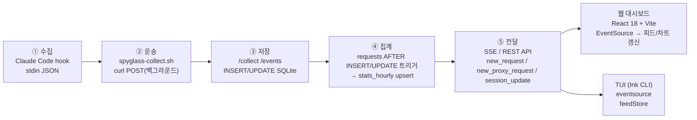
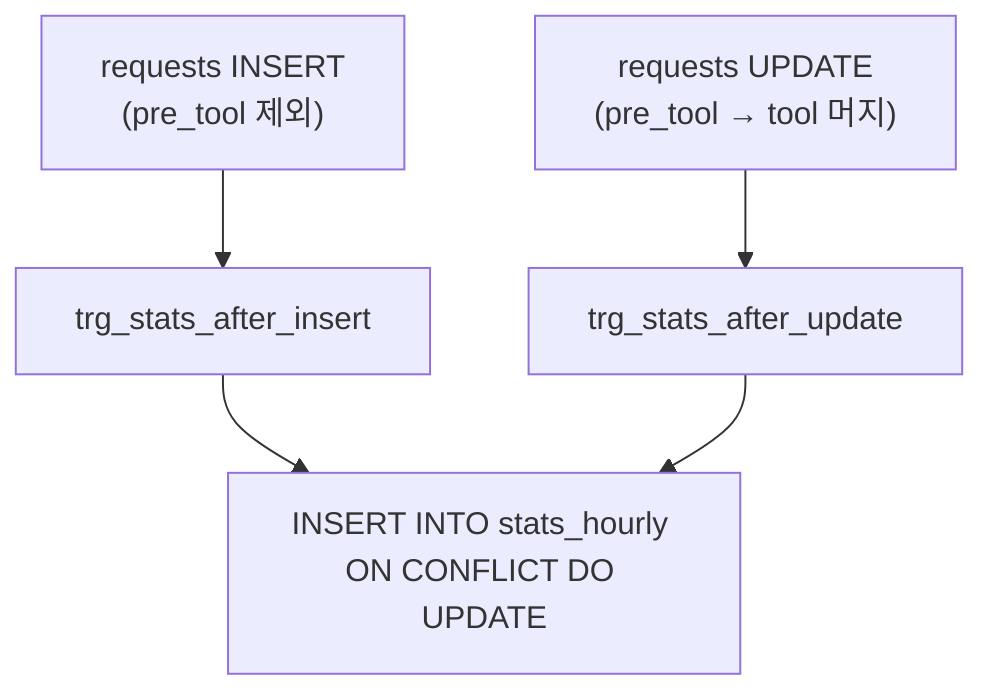
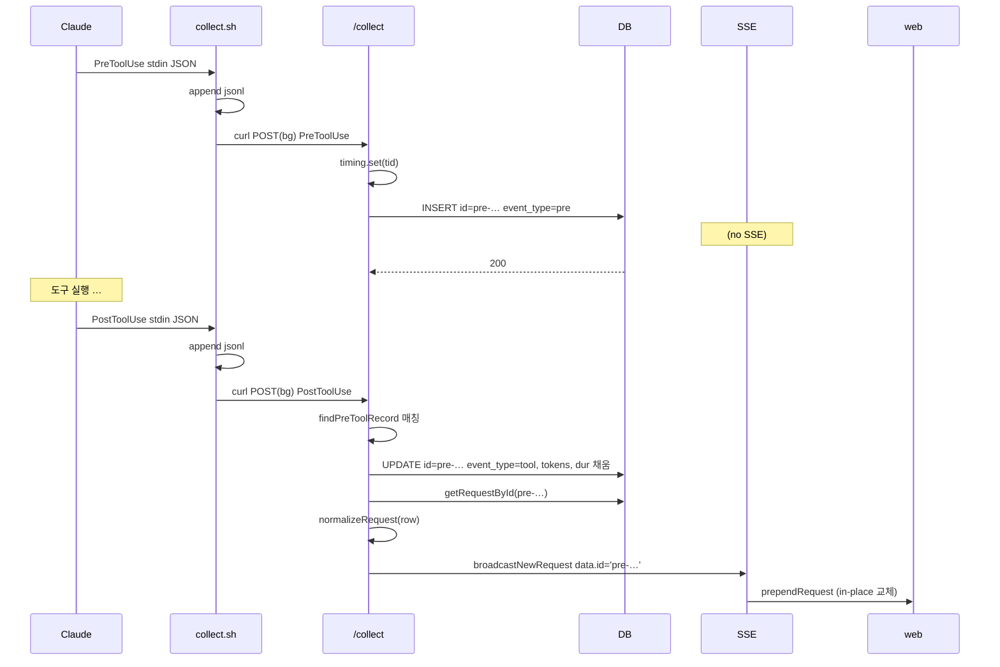
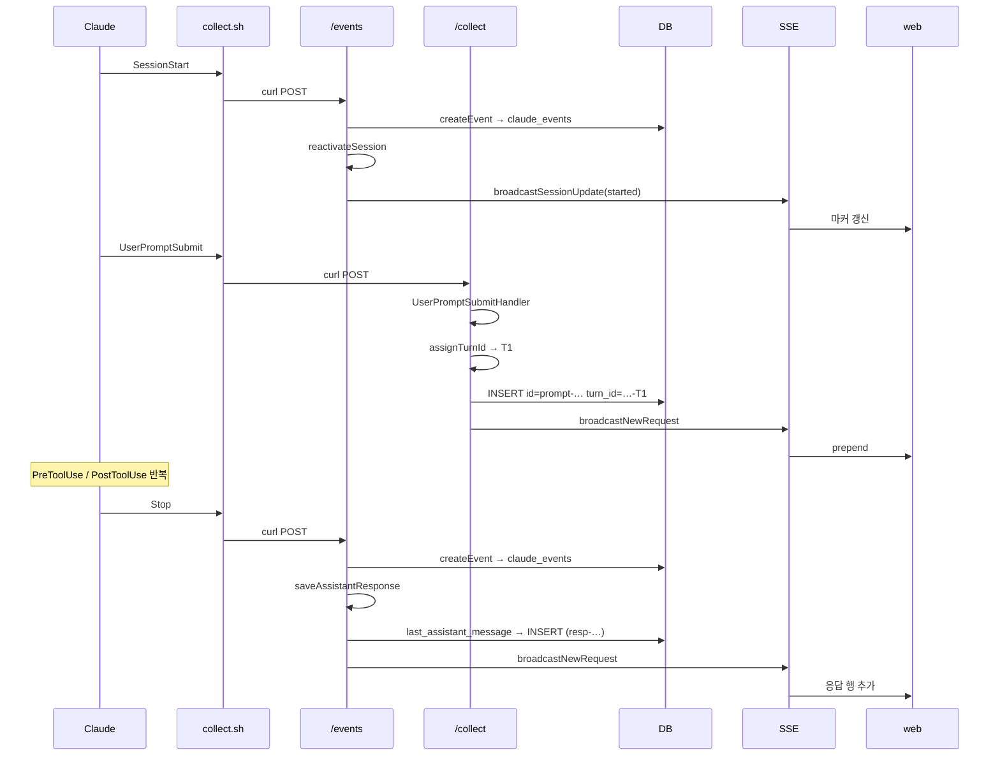

# 데이터 흐름 (Data Flow)

> 문서 범위: Claude Code 훅에서 발생한 1건의 이벤트가 사용자 화면(웹 대시보드/TUI)에 표시되기까지 거치는 모든 단계.
> 참조 코드: `packages/server`, `packages/storage`, `packages/web`, `packages/tui`, `hooks/spyglass-collect.sh`.

---

## 문서 기준

| 항목 | 값 |
|------|-----|
| 시각 | 2026-06-06 16:44:03 KST |
| 커밋 | `4ea9686` |
| 태그 | `v4.4.0` |
| 마이그레이션 | `057-preview-encryption.sql` (`PRAGMA user_version = 57`) |

---

## 1. 개요

데이터 흐름은 다섯 단계 — **수집 → 운송 → 저장 → 집계 → 전달** — 로 압축됩니다.



핵심 원칙:

1. **원장은 stdout/jsonl + raw `payload` 컬럼**. 정제 결과가 잘못돼도 원본은 항상 복원 가능합니다.
2. **SSoT는 `requests`·`proxy_requests`·`stats_hourly` 세 테이블**입니다.
3. **`pre_tool` 이벤트는 SSE에 브로드캐스트하지 않습니다**. PostToolUse가 `pre_tool` 행을 Upsert로 완성한 뒤에야 송출합니다.

---

## 2. 수집 및 운송

### 2.1 Hook 시스템

Claude Code는 등록된 hook을 매 이벤트마다 호출합니다. spyglass가 수집하는 주요 훅:

| hook 이름 | 발생 시점 | 운송 엔드포인트 |
| --------- | -------- | -------------- |
| `UserPromptSubmit` | 사용자가 프롬프트를 별냄 | `/collect` |
| `PreToolUse` | 도구 호출 시작 직전 | `/collect` |
| `PostToolUse` | 도구 호출 종료 직후 | `/collect` |
| `SessionStart` | 세션 시작 | `/events` |
| `Stop` | turn 종료 | `/events` |
| `SessionEnd` | 세션 종료 | `/events` |

### 2.2 `spyglass-collect.sh` 동작

`hooks/spyglass-collect.sh`는 다음 순서로 동작합니다.

1. **TTY가 아닐 때만 동작**(`[[ ! -t 0 ]]`).
2. **원장 우선 기록**: `~/.spyglass/logs/hook-raw.jsonl`에 한 줄 append.
3. **`hook_event_name` 추출**: python3 인라인 스크립트로 파싱.
4. **case 분기 라우팅**:
   - `UserPromptSubmit | PreToolUse | PostToolUse` → `/collect`
   - 빈 문자열(레거시 hook) → `/collect` 폼백
   - 그 외(`SessionStart`, `Stop`, `SessionEnd`, `Notification`, …) → `/events`
5. **비동기 curl POST**: `( ... ) &`로 백그라운드 서브셸을 띄워 즉시 0 반환.

안전 장치:

- 타임아웃 `SPYGLASS_TIMEOUT=1`초.
- HTTP 코드가 200/201/000 외이면 `collect.log`에 에러 기록.
- 원장은 서버 전송 전에 쓰므로 서버가 죽어도 원본 보존.

### 2.3 환경 변수

| 변수 | 기본값 | 역할 |
| --- | --- | --- |
| `SPYGLASS_HOST` | `localhost` | 서버 호스트 |
| `SPYGLASS_PORT` | `9999` | 서버 포트 |
| `SPYGLASS_TIMEOUT` | `1` (초) | curl 타임아웃 |

---

## 3. `/collect` 서버 수집

### 3.1 진입점

`packages/server/src/hook/http-entry.ts`의 `handleHookHttpRequest`가 진입점입니다.

1. `req.json()`으로 raw 파싱.
2. 진단 로그: `console.log("[RECV] PreToolUse session=...")` + `hook-payload.jsonl` 추가.
3. `HookContext` 구성.
4. `dispatchHookEvent(raw, ctx)` 위임.

### 3.2 Strategy 디스패치

`packages/server/src/hook/dispatcher.ts`:

```ts
const HANDLERS: HookEventHandler[] = [
  new PreToolUseHandler(),
  new PostToolUseHandler(),
  new UserPromptSubmitHandler(),
];
const REGISTRY = new Map(HANDLERS.map(h => [h.eventType, h]));
const FALLBACK = new SystemEventHandler();
```

### 3.3 정제(Normalization)

| 핸들러 | 핵심 정제 작업 |
| ------ | -------------- |
| `PreToolUseHandler` | `tool_use_id`별 시작 시각을 `toolTimingMap`에 기록. `extractToolDetail`로 요약 추출. **model은 의도적으로 NULL** — proxy backfill이 채움. `event_type='pre_tool'`, `id=pre-<ts>-<uuid8>`. |
| `PostToolUseHandler` | `duration_ms` 우선순위: raw payload → timing map fallback. transcript 파싱으로 tokens·model 확정. `event_type='tool'`. Agent 종료 시 서브 transcript에서 자식 tool_use 추출. |
| `UserPromptSubmitHandler` | transcript에서 tokens·model 추출. `<command-name>foo</command-name>` 패턴을 `slash_command` 컬럼에 정규화 저장. |

---

## 4. 이벤트 모델

### 4.1 `event_type` 처리 규칙

| `event_type` | 발생 시점 | DB 동작 | SSE 브로드캐스트 |
| ------------ | -------- | ------- | --------------- |
| `pre_tool` | PreToolUse | INSERT (id=`pre-…`) | **안 함** |
| `tool` | PostToolUse | 동일 `tool_use_id`의 pre_tool을 **UPDATE** (Upsert) | **함** — 송출 id는 DB 실제 id(`pre-…`) |
| `assistant_response` | Stop 훅 + transcript backfill | INSERT (id=`resp-…`) | 함 |
| `prompt` | UserPromptSubmit | INSERT + 새 `turn_id` 채번 | 함 |

### 4.2 Upsert 로직 (`saveRequest`)

PostToolUse가 도착하면 `findPreToolRecord`가 같은 `session_id` + `tool_use_id` + `event_type='pre_tool'`인 행을 찾습니다.

- 매칭 성공 시 `mergePostToolIntoPreTool`로 한 번의 UPDATE로 병합.
- `duration_ms / tokens_* / cache_*_tokens / payload / event_type='tool'` — 덮어씀.
- `model` — `COALESCE(?, model)`로 기존 값 보존.
- `api_request_id` — `COALESCE(api_request_id, ?)`로 backfill 충돌 회피.

UPDATE 성공 시 `wasUpsert=true, savedId=<pre-xxx>`를 반환합니다. 호출자는 `savedId ?? payload.id`로 `getRequestById` 재조회 후 정규화·이상치 보강을 거쳐 송출하므로 **SSE의 id가 `fetchRequests`의 id와 완전히 일치**합니다.

### 4.3 조회 필터

```sql
-- 일반 조회
WHERE event_type IS NULL
   OR event_type != 'pre_tool'
   OR tool_name = 'Agent'

-- 통계 조회
WHERE event_type IS NULL OR event_type = 'tool'
```

---

## 5. `/events` 서버 수집 — 세션 라이프사이클

`packages/server/src/events.ts`의 `eventsCollectHandler`가 처리합니다.

1. raw JSON 파싱 → `claude_events` 테이블 INSERT (`createEvent`).
2. 이벤트 타입별 후속 처리:

| event_type | 추가 작업 |
| ---------- | --------- |
| `SessionStart` | `reactivateSession`으로 `ended_at` NULL 클리어. `broadcastSessionUpdate({action:'started'})`. cwd가 있으면 `syncMetaDocsCwd` 실행. |
| `SessionEnd` | `endSession`으로 `ended_at` 채움. `broadcastSessionUpdate({action:'ended'})`. |
| `Stop` | `saveAssistantResponse` — 마지막 응답 본문을 `requests`에 `type='response'`, `event_type='assistant_response'`로 INSERT. `broadcastNewRequest` 송출. |

### 5.1 Stop 처리의 정밀도

`saveAssistantResponse`는 다음 우선순위로 본문을 결정합니다.

| 순위 | 소스 | 동작 |
| ---- | ---- | ---- |
| 1 | Transcript backfill | `extractAssistantTextEntries`로 모든 assistant text를 idempotent INSERT. |
| 2 | `last_assistant_message` | Stop 훅 payload에서 직접. |
| 3 | Proxy 폼백 | 같은 세션의 최근 proxy 응답 본문을 120초 윈도우 내에서 조회. |
| 4 | (skip) | 이미 transcript backfill 행이 있으면 자체 INSERT 생략. |

---

## 6. 집계 단계

`stats_hourly`·`stats_proxy_hourly`는 **트리거 기반 사전 집계** 테이블입니다.



- `trg_stats_after_insert`: INSERT 시점(pre_tool 행 제외)에 발동.
- `trg_stats_after_update`: pre_tool 행이 tool로 전환될 때 실제 토큰 델타를 누적.

24h 차트는 raw `requests` 스캔 대신 사전 집계 테이블을 쿼리하여 응답 시간 ~5ms 수준을 유지합니다.

---

## 7. SSE 브로드캐스트

`packages/server/src/sse.ts`의 외부 노출 함수:

| 함수 | 이벤트 타입 | 페이로드 |
|------|-------------|----------|
| `broadcastNewRequest` | `new_request` | `NormalizedRequest + session_total_tokens + event_phase` |
| `broadcastNewProxyRequest` | `new_proxy_request` | `ProxyBroadcastPayload (source='proxy')` |
| `broadcastSessionUpdate` | `session_update` | `{ session_id, action: 'started'\|'ended'\|'token_update', ... }` |

`event_phase` 규칙:

- `'created'` (default) — 첫 INSERT, 또는 pre_tool→tool 병합 첫 노출.
- `'updated'` — 기존 행이 backfill/UPDATE로 갱신됨 → 클라이언트 in-place 갱신.

연결 관리는 단일 `Set<ReadableStreamDefaultController>`. 8초 간격 `ping` 이벤트로 idle 연결 유지(`idleTimeout: 0`과 함께 작동). 송신 실패한 연결은 자동 정리.

---

## 8. 웹 클라이언트 수신 흐름

브라우저는 EventSource로 SSE 3채널을 구독해 즉시 화면을 갱신하고, 보조 데이터는 디바운스된 REST 호출로 보강합니다.

### 8.1 SSE 연결

`packages/web/src/app/sse.ts`의 `connectSSE`는 3개 채널을 구독합니다.

```ts
connectSSE({
  onNewRequest:        (e) => { /* hook 데이터 */ },
  onNewProxyRequest:   (e) => { /* proxy 데이터 */ },
  onSessionUpdate:     (e) => { /* 활성/비활성 전환 */ },
  onOpen, onError,
});
```

연결 실패 시 5초 후 재연결.

### 8.2 `onNewRequest` 처리

이벤트 1건당 다음이 순서대로 발생합니다.

1. `recordRequest() + drawTimeline()` — 차트 버킷에 누적.
2. 세션 토큰 즉시 반영 — 캐시 객체 갱신 + 부분 DOM 업데이트.
3. 피드 갱신 — 동일 `id` 행이 있으면 **in-place 갱신(위치 보존)**, 없으면 최상단 prepend.
4. 활성 turn 패치 — 선택된 세션이 일치하면 turn 카운터 in-place 패치.
5. `scheduleDashboardRefresh()` — 1초 디바운스로 통계 재요청.

### 8.3 통계 갱신 디바운스

`scheduleDashboardRefresh`는 단순 debounce(`1000ms`) + 최대 대기(`3000ms`)로 활발한 세션에서도 통계가 stall되지 않도록 합니다.

### 8.4 REST 보조 호출

| API | 호출 시점 | 책임 |
| --- | -------- | ---- |
| `GET /api/dashboard` | SSE debounce 후 | 요약 카드, p95, error_rate |
| `GET /api/requests` | 초기 로드, 필터/페이지 변경 | 로그 피드 page 단위 |
| `GET /api/sessions` | 30초 폴링 | 좌측 사이드바 세션 리스트 |
| `GET /api/metrics/*` | dashboard와 함께 | 옵저빌리티 카드 |

---

## 9. TUI 클라이언트 수신 흐름

TUI는 React + Ink로 구현되며 데이터 경로가 두 갈래로 나뉩니다.

### 9.1 실시간 — SSE → `feedStore`

`packages/tui/src/hooks/useSSE.ts`는 Node `eventsource` 패키지로 `/events`에 연결합니다.

- 슬라이딩 윈도우: 10초 버킷 × 180개 = 30분.
- `new_request` 수신 시 `feedStore.push(r)`로 외부 store에 누적.
- `useFeed`는 `useSyncExternalStore`로 feedStore를 구독.

### 9.2 폴링 — Session detail은 REST

`packages/tui/src/hooks/useSessionTurns.ts`는 `/api/sessions/:id/turns`를 10초 폴링으로 호출합니다.

- `useStripStats.ts` — 5초 폴링.
- `useToolsAnalytics.ts` — 5초 폴링.
- `useProxyRequests.ts` — 폴링 + `new_proxy_request` SSE 수신 시 즉시 refetch.

### 9.3 재연결 정책

exponential backoff (`retryDelay *= 2`, max 15초)로 자동 재연결합니다.

---

## 10. 시퀀스 다이어그램

### 10.1 Bash 도구 호출 1회 (PreToolUse → PostToolUse)



### 10.2 SessionStart + UserPromptSubmit + Stop (turn 1건)



---

## 11. 엣지 케이스와 회복 전략

| 시나리오 | 회복 절차 |
|----------|-----------|
| `pre_tool` 누락 | `findPreToolRecord` null → 일반 INSERT 경로로 새 `tool-<ts>` id 생성. |
| 동일 id 재수신 | `requests.id`가 PRIMARY KEY → 두 번째 INSERT는 SQLite 단계에서 실패. `INSERT OR IGNORE`로 silent skip. |
| 서버 장애 | `SPYGLASS_TIMEOUT=1`초. 모든 raw payload는 `hook-raw.jsonl`에 보존 → 서버 복구 후 replay 가능. |
| SSE 연결 끊김 | 웹: 5초 후 자동 재연결. TUI: exponential backoff (1→15초). 재연결 성공 시 즉시 `fetchDashboard + fetchAllSessions`. |
| Compact / Resume | `reactivateSession`이 `ended_at`을 NULL로 클리어. `broadcastSessionUpdate({action: 'started'})`. |
| Transcript 미접근 | `confidence='error'` → `tokens_confidence='error'`, `tokens_source='unavailable'`. `stats_hourly`는 high 행만 별도 컬럼에 누적하므로 KPI에 영향 없음. |
| 활발한 세션 통계 stall | `scheduleDashboardRefresh`에 `REFRESH_MAX_WAIT_MS=3000` 강제 발화로 방지. |

---

> **문서 기준**
> - 시각: 2026-06-06 16:44:03 KST
> - 커밋: `4ea9686`
> - 태그: `v4.4.0`
