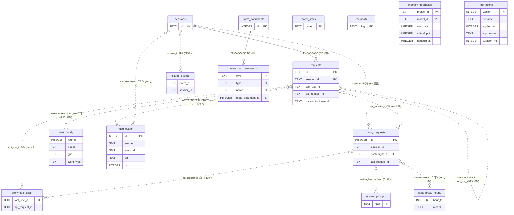

# claude-spyglass 데이터베이스 가이드

claude-spyglass의 영속 저장소(SQLite) 아키텍처, 마이그레이션, 테이블 스키마, 쿼리 패턴, 운영 절차를 모은 통합 가이드입니다.

> **약어 풀이**
> - **SSoT** = Single Source of Truth(단일 진실 원천)
> - **WAL** = Write-Ahead Logging(SQLite의 동시성 모드)
> - **ADR** = Architecture Decision Record(아키텍처 결정 기록)
> - **PRAGMA** = SQLite 전용 설정·메타 조회 명령
> - **dedup** = deduplication(중복 제거)
> - **FK CASCADE** = Foreign Key ON DELETE CASCADE(부모 삭제 시 자식 행도 함께 삭제)

### 이 문서의 범위

- 다룸: 연결 구성, PRAGMA, 마이그레이션 시스템, 테이블 개요, 인덱스 정책, 쿼리 패턴, 보존·유지보수
- 다루지 않음: 테이블별 **전체 컬럼 명세**

### `docs/schema/*.md`와의 관계

- [`docs/schema/`](./schema/) 하위 문서가 **테이블별 컬럼 명세의 1차 소스**입니다.
- 본 문서는 그 위에서 작동하는 **연결·마이그레이션·집계 레이어**를 설명합니다.
- 컬럼 추가 시: schema/*.md 우선 갱신 → 본 문서 § 3.4 마이그레이션 이력에 한 줄.

### 핵심 레퍼런스

- 코드 SSoT: [`packages/storage`](../../packages/storage)
- 스키마 정의: [`packages/storage/src/schema.ts`](../../packages/storage/src/schema.ts)
- 마이그레이션 디렉토리: [`packages/storage/migrations/`](../../packages/storage/migrations)
- 현재 적용 마이그레이션 파일은 `053`까지 존재합니다. 파일명 NNN이 `PRAGMA user_version`과 1:1 매핑됩니다 (`migrator.ts`가 `PRAGMA user_version = N`을 트랜잭션 안에서 갱신). `schema.ts`의 `SCHEMA_VERSION = 23` 상수는 마이그레이션 적용을 제어하지 않는 정적 문서화 값이며 실제 버전과 무관합니다.

### 연관 문서

- [마이그레이션 가이드](./migrations.md) — 마이그레이션 작성 워크플로
- [데이터 흐름](./data-flow.md) — hook/proxy → DB 수집 파이프라인 전체
- [훅 연동](./hooks-integration.md) — Claude Code hook → 수집 스크립트 → 엔드포인트
- [전체 아키텍처](./architecture.md) — 패키지·런타임 구조 (그래프 sync 포함)

---

## 1. 개요

이 절은 엔진·파일·테이블 수 같은 **상수 정보**와 SQLite 선택 이유, 데이터 파이프라인을 한눈에 보여줍니다.

| 항목 | 값 | 비고 |
|------|-----|------|
| DB 파일 경로 | `~/.spyglass/spyglass.db` | `connection.ts`의 `DEFAULT_DB_PATH` |
| 엔진 | SQLite (bun:sqlite) | `Database` 클래스 직접 import |
| Journal 모드 | WAL (Write-Ahead Logging) | `PRAGMA journal_mode = WAL` |
| 파일 권한 | DB 파일 `0600`, 디렉토리 `0700` | `applyFilePermissions()` |
| WAL autocheckpoint | 200 페이지 (~800KB) | `PRAGMA wal_autocheckpoint = 200` |
| 활성 테이블 수 | 15개 — `sessions`, `requests`, `claude_events`, `proxy_requests`, `proxy_tool_uses`, `system_prompts`, `meta_documents`, `meta_doc_resolutions`, `model_limits`, `metadata`, `stats_hourly`, `stats_proxy_hourly`, `anomaly_thresholds`, `kuzu_outbox`, `_migrations` | + 뷰 `correlated_requests`, `v_meta_doc_usage`, `v_flow_active_rows` |

### 왜 SQLite인가

claude-spyglass는 **단일 사용자의 로컬 옵저버빌리티 도구**입니다. 다음 특성 때문에 SQLite가 적합합니다.

- 별도 DB 프로세스가 필요 없는 임베디드 엔진 — 사용자가 spyglass를 켜기만 하면 동작합니다.
- WAL 모드에서 reader 다수 + writer 1개(hook 서버) 패턴이 안전합니다.
- `bun:sqlite`로 zero-dep, 네이티브 바인딩 없이 동작합니다.
- 분석용 페이로드(JSON, zstd BLOB)를 단일 파일로 보관하므로 백업·이동이 `cp` 한 줄로 끝납니다.

### 데이터 흐름

```mermaid
flowchart LR
    hooks["Claude Code hooks"] -->|"/collect: hook/* → processor"| req["requests"]
    hooks -->|"/events: events.ts createEvent"| evt["claude_events"]
    hooks -->|"/collect: ensureSession<br/>/events: reactivateSession / ended_at"| ss2["sessions"]
    hooks -->|"/events: SessionStart → meta-docs synchronizer"| md["meta_documents<br/>meta_doc_resolutions"]
    hooks -->|"/events: Stop 훅 → type='response'"| req
    proxy["HTTP proxy layer"] -->|proxy/handler/persist.ts| praw["proxy_requests<br/>proxy_tool_uses"]
    proxy -->|"body.system → system-hash.ts"| sp["system_prompts<br/>(dedup)"]
    req -.->|AFTER INSERT/UPDATE 트리거| sh["stats_hourly<br/>(사전 집계)"]
    praw -.->|AFTER INSERT 트리거| sph["stats_proxy_hourly<br/>(사전 집계)"]
    req -.->|AFTER INSERT/UPDATE 트리거| ko["kuzu_outbox"]
    ss2 -.->|AFTER INSERT 트리거| ko
    ko -->|storage-graph sync worker<br/>200ms tick · cursor| graph["Ladybug 그래프 DB"]
```

**raw 수집 → 정규화·dedup → 사전 집계 → API 응답**의 4단 파이프라인입니다. `stats_hourly`와 `stats_proxy_hourly`가 대시보드 모든 위젯의 SSoT 집계 테이블입니다. `kuzu_outbox`는 `requests`/`sessions` INSERT·UPDATE를 그래프 DB(Ladybug)로 증분 동기화하는 별도 큐 채널입니다 (§5.13).

---

## 2. 연결과 구성

DB 핸들의 생성·구성·종료 절차를 다룹니다. 한 프로세스에서는 `getDatabase()`가 반환하는 싱글톤 하나만 사용합니다.

### 2.1 `SpyglassDatabase` 클래스

[`packages/storage/src/connection.ts`](../../packages/storage/src/connection.ts)가 모든 DB 핸들을 캡슐화합니다.

```ts
import { getDatabase } from '@spyglass/storage';
const db = getDatabase();        // 싱글톤
const handle = db.instance;       // bun:sqlite Database
```

`ConnectionOptions`: `dbPath` (기본 `~/.spyglass/spyglass.db`), `walMode` (기본 true), `autoInit` (기본 true — 마이그레이션 자동 실행), `debug` (기본 false).

생성자 순서: 부모 디렉토리 생성 → `Database` 열기 → WAL PRAGMA 적용 → 마이그레이션 실행 → 파일 권한 강화 (`chmod 600 / 700`) → `trackedInstances` 등록 (`closeDatabase()`로 일괄 정리).

### 2.2 적용되는 PRAGMA

PRAGMA는 SQLite 전용 설정·메타 조회 명령입니다. 아래 PRAGMA들은 [`schema.ts`의 `WAL_MODE_PRAGMAS`](../../packages/storage/src/schema.ts)에서 한 번에 적용됩니다.

```sql
PRAGMA journal_mode = WAL;              -- writer 1 + reader N
PRAGMA busy_timeout = 5000;             -- 5초 재시도
PRAGMA synchronous = NORMAL;            -- WAL 결합 시 안전 최적값
PRAGMA cache_size = -64000;             -- 64MB 페이지 캐시 (음수 = KB 단위)
PRAGMA foreign_keys = ON;               -- requests → sessions FK 강제 (SQLite 디폴트 OFF)
PRAGMA journal_size_limit = 104857600;  -- WAL 100MB 상한
PRAGMA wal_autocheckpoint = 200;        -- ~800KB마다 자동 checkpoint
```

`wal_autocheckpoint`를 200으로 낮춘 이유: 대형 zstd 페이로드 BLOB이 누적되기 전에 자주 checkpoint하여 STW(stop-the-world) 윈도우를 짧게 유지하기 위함입니다.

### 2.3 종료·체크포인트

`close()`는 멱등이며 **반드시 `PRAGMA wal_checkpoint(TRUNCATE)`를 먼저 수행**합니다. 이는 `-wal`, `-shm` 잔존 파일이 다음번 동일 경로 재오픈 시 `disk I/O error`를 일으키는 문제를 차단하기 위함입니다 (특히 테스트 fixture가 `db.close()` 없이 `unlink`만 하는 패턴에서 발생).

`db.getStatus()` → `{ path, journalMode, walSize, isOpen }`.

---

## 3. 마이그레이션 시스템

`migrations/NNN-*.sql` 파일을 lexicographic 순서로 적용하는 단방향(forward-only) 시스템입니다. 트랜잭션 안에서 DDL과 `PRAGMA user_version` 갱신을 원자적으로 묶어, 중간 실패 시에도 상태가 어긋나지 않도록 설계되어 있습니다.

### 3.1 동작 원리

[`packages/storage/src/migrator.ts`](../../packages/storage/src/migrator.ts)의 `runMigrations(db, debug)`:

1. `PRAGMA user_version` 조회 → `currentVersion`
2. `migrations/` 디렉토리의 `.sql` 파일을 lexicographic 정렬, 파일명 prefix `NNN`을 버전 번호로 사용
3. `version > currentVersion`인 파일만 순차 적용
4. **PRAGMA가 아닌 모든 statement**를 `db.transaction()`으로 감싸 적용 후 `PRAGMA user_version = N` 갱신
5. 파일에 명시된 PRAGMA는 트랜잭션 밖에서 별도 실행
6. `version >= 35` 이고 `_migrations` 테이블이 존재하면 동일 트랜잭션에서 `INSERT OR REPLACE INTO _migrations`로 히스토리 행 기록 (version PK, filename, applied_at, app_version, duration_ms)

**파일명 prefix 파싱 한도** (`parseMigrationVersion`): 숫자 prefix가 3자리를 초과하면 silent overflow를 막기 위해 즉시 throw합니다 (`MIGRATION_VERSION_LIMIT = 999`, ADR-002). 999 도달 시 4자리 padding 확장은 별도 ADR로 결정합니다.

### 3.2 핵심 설계 결정

- **트랜잭션 내부 `user_version` 갱신**: DDL과 버전 갱신을 원자적으로 묶어 비정상 종료 시 버전 불일치 방지
- **`duplicate column name` / `already exists` 자동 스킵**: 비정상 종료 후 재실행 시 이미 적용된 DDL을 무시
- **`BEGIN ... END;` 트리거 보존**: 단순 `split(';')`이 트리거 본문 안 세미콜론까지 자르는 문제를 placeholder 치환으로 회피 (`splitSqlStatements`)
- **빈 DB**: `currentVersion = 0`에서 시작해 `001-init.sql`부터 모두 적용 → `CREATE TABLE IF NOT EXISTS`로 멱등 보장

### 3.3 신규 마이그레이션 추가 절차

1. `migrations/NNN-<설명>.sql` 작성 (NNN = `currentMax + 1`, 3자리 0-padded, `IF NOT EXISTS` 멱등성)
2. `stats_hourly` 등 사전 집계 테이블 변경 시 백필 SQL 포함 또는 `rebuild-stats` 안내
3. 파일 내부에 `BEGIN/COMMIT` 금지 — migrator가 트랜잭션으로 감쌉니다. 트리거는 `BEGIN ... END;` 블록으로 작성 (`splitSqlStatements`가 보존)
4. `bun test packages/storage/src/__tests__/` — 빈 DB와 기존 DB 양쪽 검증
5. 운영 적용 전 hook 서버 중단 (트리거·백필 race 회피)

### 3.4 마이그레이션 이력 요약

마이그레이션 파일은 `001`~`053`까지 존재합니다 (`041`~`046` 번호는 사용되지 않음 — 비연속이지만 migrator는 `version > currentVersion` 파일만 적용하므로 결번은 무해). 다음 4단계로 묶어 정리합니다.

<details>
<summary><b>초기 (v001 ~ v010) — 기본 스키마 + 토큰·이벤트 도입</b></summary>

| 버전 | 핵심 변경 |
|------|-----------|
| 001 | `sessions`, `requests` 테이블 + 기본 인덱스 4개 |
| 002 | `requests.tool_detail` |
| 003 | `requests.turn_id` + 기존 prompt에 turn 번호 backfill |
| 004 | `requests.source` (예: `subagent-transcript`) |
| 005 | `cache_creation_tokens`, `cache_read_tokens` |
| 006 | `claude_events` 테이블 + 인덱스 2개 |
| 007 | `requests.preview` (100자 제한) |
| 008 | `tool_use_id`, `event_type` (`pre_tool`/`tool`) |
| 009 | Skill/Agent `tool_detail` 재계산 (멱등) |
| 010 | preview 2000자로 재추출 |

</details>

<details>
<summary><b>중기 (v011 ~ v020) — 메타데이터·proxy·감사 컬럼</b></summary>

| 버전 | 핵심 변경 |
|------|-----------|
| 011 | `tokens_confidence`, `tokens_source` + `claude_events`에 8개 컬럼 |
| 012 | `idx_requests_timestamp`, `visible_requests` VIEW |
| 013 | `metadata` key-value 테이블 |
| 014 | `proxy_requests` 테이블 신설 |
| 015 | proxy 메트릭 10개 컬럼 + `correlated_requests` VIEW |
| 016 | `requests.type` CHECK에 `response` 추가 (테이블 재생성) |
| 017 | `requests.parent_tool_use_id` + 부분 인덱스 |
| 018 | sentinel 세션 삭제, `visible_requests` 폐기, `correlated_requests` 재정의 |
| 019 | `proxy_requests.session_id/turn_id`, `requests.api_request_id` |
| 020 | 감사용 메타 16개 컬럼 (`client_user_agent`, `permission_mode` 등) |

</details>

<details>
<summary><b>중기-후반 (v021 ~ v035) — 압축·dedup·meta-docs·사전 집계·anomaly</b></summary>

| 버전 | 핵심 변경 |
|------|-----------|
| 021 | zstd 압축 payload BLOB 컬럼 + `system_reminder` |
| 022 | `system_prompts` dedup 테이블 + `proxy_requests.system_hash` |
| 023 | `proxy_tool_uses` 테이블 |
| 024 | `meta_documents`, `meta_doc_resolutions`, `requests.slash_command`, `v_meta_doc_usage` |
| 025 | 집계 최적화용 복합/부분 인덱스 3개 |
| 026 | `model_limits` 테이블 + 시드 데이터 |
| 027 | `stats_hourly` 사전 집계 테이블 |
| 028 | AFTER INSERT/UPDATE 트리거 (pre_tool → tool 머지 보정) |
| 029 | 기존 requests를 stats_hourly로 1회 백필 |
| 030 | `stats_hourly`에 `event_type` 차원 + `tokens_high` 4개 컬럼 (테이블 재생성) |
| 031 | `duration_ms_sum/count` 의미 변경 (NULL 제외 모든 행) |
| 032 | `stats_proxy_hourly` 테이블 + 트리거 + 백필 |
| 033 | `anomaly_thresholds` 테이블 — bloated-sys / agent-spike 임계값(warn_pct, critical_pct) SSoT. 기본 시드: warn=15%, critical=25% |
| 034 | anomaly 검출 보조 인덱스 추가 — `idx_proxy_requests_system_byte_null` (system_byte_size NULL 부분 인덱스), `idx_requests_tool_use_id`, `idx_requests_session_timestamp` (session_id, timestamp DESC) |
| 035 | `_migrations` 메타테이블 신설 — 마이그레이션 적용 히스토리(filename, applied_at, app_version, duration_ms) SSoT. legacy v1~v34 백필 포함 |

</details>

<details open>
<summary><b>최근 (v036 ~ v053) — flow 호출그래프·read 성능·그래프 sync outbox</b></summary>

| 버전 | 핵심 변경 |
|------|-----------|
| 036 | `idx_requests_meta_doc_call` 부분 인덱스 `(tool_name, tool_detail, timestamp)` WHERE `tool_name IN ('Skill','Agent') AND tool_detail IS NOT NULL AND tool_use_id IS NOT NULL` — meta-doc 호출그래프 부모 후보 조회 |
| 037 | slash_command 행에 가상 `tool_use_id = 'slash:' || turn_id` 부여 + 같은 turn root-level 호출을 슬래시 가상 ID에 연결 + `idx_requests_parent_tool_use_id` 부분 인덱스 |
| 038 | 서브에이전트 자식 행 `parent_tool_use_id` 백필 (같은 session/turn 직전 Agent 매칭, 모호 시 NULL 유지) |
| 039 | rolling Skill/Task 부모 재계산 — Skill/Task는 매칭 Agent를, 그 외 도구는 직전 Skill/Task를 부모로 |
| 040 | `v_flow_active_rows` VIEW 신설 — flow 차트 BFS 전용 projection (event_rank tie-break, `tool_use_id IS NOT NULL`) |
| 047 | getTurnsBySession read 가속 복합 인덱스 4개 (`idx_requests_session_type_turn_ts`, `idx_requests_session_turn_active`, `idx_requests_session_turn_ts_active`, `idx_proxy_requests_session_turn_ts`) + `ANALYZE` |
| 048 | `idx_proxy_requests_session_sysbytes` `(session_id, system_byte_size DESC, timestamp DESC)` WHERE `system_byte_size IS NOT NULL` — getSessionSystemContextMeta 가속 |
| 049 | `kuzu_outbox` 테이블 + `idx_kuzu_outbox_id` + `requests`/`sessions` AFTER INSERT 트리거 — 그래프 sync 채널 |
| 050 | historical `sessions`/`requests`를 `kuzu_outbox`로 1회 백필 (`NOT EXISTS` 멱등) + `idx_kuzu_outbox_source_event` |
| 051 | `trg_requests_pre_to_tool_outbox` AFTER UPDATE 트리거 — `event_type` `pre_tool` → `tool` 전환 시 op='update' 발행 |
| 052 | 서브에이전트 자식 `parent_tool_use_id` 자동 백필 (TEMP TABLE 경유) + 복원 행을 `kuzu_outbox` op='update'로 재발행 |
| 053 | `kuzu_outbox` 트리거 3종 하드닝 — `INSERT OR IGNORE` + `WHEN NEW.id IS NOT NULL` 가드로 outbox 쓰기가 메인 write를 롤백하지 못하게 격리 |

</details>

> `038`/`052`는 둘 다 서브에이전트 `parent_tool_use_id` 백필이지만 매칭 휴리스틱과 적용 범위가 다릅니다 (`038`=같은 turn, `052`=같은 session + 그래프 재동기).

---

## 4. 스키마 개요

테이블 간 관계와 분류를 한눈에 보여줍니다. 컬럼 단위 명세는 § 5와 `docs/schema/`를 참조하세요.

### 4.1 ERD



> **관계 표기**: 실선(`||--o{`)은 DB가 강제하는 FOREIGN KEY 제약(`requests → sessions`, `meta_doc_resolutions → meta_documents` 두 개뿐, 둘 다 ON DELETE CASCADE)입니다. 점선(`}o..o{`)은 FK 제약이 없는 논리적 연결 — 단순 컬럼 매칭(`session_id`, `tool_use_id`, `api_request_id`, `system_hash` 등) 또는 트리거 전용 채널(`stats_hourly`, `stats_proxy_hourly`, `kuzu_outbox`)입니다.
>
> 트리거: 특정 테이블에 INSERT/UPDATE/DELETE가 발생할 때 SQLite가 자동으로 실행하는 SQL 핸들러. 본 프로젝트에서는 raw 테이블의 변경을 사전 집계 테이블·그래프 sync 큐에 즉시 반영하는 데 사용합니다.

### 4.2 테이블 분류

- **Raw 수집**: `sessions`, `requests`, `claude_events`, `proxy_requests`, `proxy_tool_uses`
- **카탈로그·정규화**: `system_prompts`, `meta_documents`, `meta_doc_resolutions`, `model_limits`
- **사전 집계**: `stats_hourly`, `stats_proxy_hourly`
- **운영 메타**: `metadata`, `anomaly_thresholds`
- **그래프 sync 큐**: `kuzu_outbox`
- **시스템 메타**: `_migrations`
- **뷰**: `correlated_requests`, `v_meta_doc_usage`, `v_flow_active_rows`

---

## 5. 테이블별 상세

본 절은 **핵심 컬럼·인덱스 요약**입니다. 전체 컬럼 명세는 [`docs/schema/*.md`](./schema/)를 참조하세요. 컬럼 표는 `이름 · 타입 · 제약(NULL/기본값) · 비고` 4열 포맷으로 통일합니다.

### 5.1 `sessions`

세션(= Claude Code 한 번의 실행 단위) 메타.

| 컬럼 | 타입 | 제약·기본값 | 비고 |
|------|------|-------------|------|
| `id` | TEXT | PK | Claude Code 발급 UUID |
| `project_name` | TEXT | NOT NULL | cwd(current working directory) basename |
| `started_at` | INTEGER | NOT NULL | Unix ms |
| `ended_at` | INTEGER | NULL 허용 | NULL = 활성 또는 stale |
| `total_tokens` | INTEGER | DEFAULT 0 | 누적 토큰 |
| `created_at` | INTEGER | DEFAULT (strftime sec) | 레코드 생성 시각 |

**런타임 derive 필드**: `first_prompt_payload`, `last_activity_at`, `live_state ∈ {live, stale, ended}`는 DB 컬럼이 아니라 read 쿼리의 CASE/서브쿼리로 산출됩니다. `live` 판정은 `LIVE_STALE_THRESHOLD_MS = 30 * 60 * 1000` (30분)을 기준으로 합니다 (`packages/storage/src/queries/session/_shared.ts`).

| 인덱스 | 컬럼·조건 | 용도 |
|--------|-----------|------|
| `idx_sessions_started_at` | `started_at DESC` | 최근 세션 목록 |
| `idx_sessions_project` | `project_name` | 프로젝트별 필터 |

상세: [`docs/schema/sessions.md`](./schema/sessions.md)

### 5.2 `requests`

훅 기반 모든 요청(prompt / tool_call / system / response)의 1차 저장소. 핵심 그룹:

- **식별**: `id`, `session_id` (FK CASCADE), `timestamp`, `created_at`
- **분류**: `type` CHECK `('prompt','tool_call','system','response')`, `event_type`(`pre_tool`/`tool`), `tool_name`, `tool_detail`, `turn_id`
- **모델·토큰**: `model`, `tokens_input/output/total`, `cache_creation_tokens`, `cache_read_tokens`
- **신뢰도**: `tokens_confidence` (`high`/`error`), `tokens_source` (`transcript`/`unavailable`)
- **페어링·계층**: `tool_use_id`, `parent_tool_use_id`, `api_request_id`
- **페이로드**: `payload` (BLOB zstd or TEXT JSON), `payload_raw_size`, `payload_algo`
- **감사 메타**: `permission_mode`, `agent_id`, `agent_type`, `tool_interrupted`, `tool_user_modified`
- **기타**: `preview`, `source`, `slash_command`

**`type` 의미** (`schema.ts: RequestType`):
- `prompt` — UserPromptSubmit 훅
- `tool_call` — Pre/PostToolUse 훅 (한 도구 호출당 row 1개. event_type으로 구분)
- `system` — SessionStart, Notification 등
- `response` — Stop 훅의 `last_assistant_message`

**Pre/Post tool 쌍 처리** (CLAUDE.md 규칙):
- `event_type='pre_tool'`: 도구 실행 시작 — DB INSERT, SSE 미브로드캐스트
- `event_type='tool'`: 도구 실행 완료 — 동일 `tool_use_id`의 pre_tool row를 UPDATE (`mergePostToolIntoPreTool`)
- 조회 기본 필터(`ACTIVE_REQUEST_FILTER_SQL`): `event_type IS NULL OR event_type != 'pre_tool' OR tool_name = 'Agent'`
- 통계 필터: `event_type IS NULL OR event_type = 'tool'`

**주요 인덱스** (전체는 [`docs/schema/requests.md`](./schema/requests.md)):

| 인덱스 | 컬럼·조건 | 핵심 쿼리 |
|--------|-----------|-----------|
| `idx_requests_session` | `(session_id, timestamp DESC)` | 세션 타임라인 |
| `idx_requests_type` | `(type, timestamp DESC)` | type별 필터 |
| `idx_requests_timestamp` | `timestamp DESC` | 전역 최근 N건 |
| `idx_requests_session_type_ts_asc` | `(session_id, type, timestamp ASC)` | listVisibleSessions 첫 prompt 시각 |
| `idx_requests_type_event_ts` | `(type, event_type, timestamp DESC)` | 집계 함수 군집 |
| `idx_requests_tool_duration_partial` | `duration_ms ASC` partial | P95 지연 |
| `idx_requests_tool_use_id` | NOT NULL | Pre/Post 매칭 |
| `idx_requests_parent_tool_use_id` | NOT NULL | 서브에이전트 자식 |
| `idx_requests_api_request_id` | NOT NULL | proxy 역참조 |
| `idx_requests_meta_doc` | `(tool_name, tool_detail)` partial | Behavior Definitions 사용량 |
| `idx_requests_slash` | NOT NULL | 슬래시 커맨드 집계 |

### 5.3 `claude_events`

훅에서 들어온 raw 페이로드 보관 — `sessions`/`requests`로 정규화되지 않는 이벤트(SessionStart, Stop, Notification 등)와 분석·디버깅용 전체 페이로드.

주요 컬럼: `id` PK AUTOINCREMENT, `event_id` UNIQUE (idempotency), `event_type`, `session_id`, `timestamp`, `payload` (JSON TEXT), `schema_version`, `transcript_path`, `cwd`, `agent_id`, `agent_type`, 그리고 정규화 컬럼 `permission_mode`, `source`, `end_reason`, `model`, `stop_hook_active`, `task_id`, `task_subject`, `notification_type`.

인덱스: `idx_events_session_time` `(session_id, timestamp)`, `idx_events_type_time` `(event_type, timestamp)`.

상세: [`docs/schema/claude-events.md`](./schema/claude-events.md)

### 5.4 `proxy_requests` + `proxy_tool_uses`

HTTP 프록시 레이어가 캡처한 Anthropic API 호출 메트릭. hook 데이터와 별도로 운용되며 `session_id`/`turn_id` 헤더 직접 매칭 + `proxy_tool_uses`로 tool_use 정확 cross-link.

**`proxy_requests` 컬럼 그룹**:

- 식별·HTTP: `id`, `timestamp`, `method`, `path`, `status_code`, `response_time_ms`
- 모델·토큰: `model`, `tokens_input/output`, `cache_creation_tokens`, `cache_read_tokens`, `tokens_per_second`, `cost_usd`(항상 NULL), `is_stream`, `first_token_ms`
- 요청 본문 메타: `messages_count`, `max_tokens`, `tools_count`, `request_preview`, `tool_names`, `temperature`, `thinking_type`, `system_preview`, `system_reminder`, `metadata_user_id`
- 응답 메타: `stop_reason`, `response_preview`, `error_type`, `error_message`, `api_request_id`
- Cross-link: `session_id`, `turn_id`, `system_hash`, `system_byte_size`
- 클라이언트 감사: `client_user_agent`, `client_app`, `anthropic_beta`, `anthropic_org_id`, `anthropic_request_id`, `client_meta_json`
- 페이로드 압축: `payload` BLOB, `payload_raw_size`, `payload_algo`

**주요 인덱스**: `idx_proxy_requests_timestamp` (DESC), `idx_proxy_requests_model` (NOT NULL), `idx_proxy_requests_session_id` (NOT NULL), `idx_proxy_requests_system_hash`, `idx_proxy_requests_anthropic_req_id` (NOT NULL).

**`proxy_tool_uses`**: `tool_use_id` PK + `api_request_id` (NOT NULL, indexed) + `tool_name`, `block_index`, `created_at`. proxy SSE 응답의 `content_block_start.tool_use`를 PostToolUse 훅과 1:1 매핑. `INSERT OR IGNORE`로 멱등.

proxy commit 트랜잭션 마지막에 `backfillRequestApiRequestIdByToolUse()`가 호출되어, hook PostToolUse와의 race로 발생한 `requests.api_request_id` NULL을 즉시 보정합니다.

상세: [`docs/schema/proxy-requests.md`](./schema/proxy-requests.md)

### 5.5 `system_prompts`

매 LLM 요청에 함께 전송되는 `body.system`을 hash 기반 dedup 저장.

- `hash` PK (SHA-256 hex 64자, content-addressable), `content` (정규화 본문, billing-header `idx[0]` 제외), `byte_size`, `segment_count`, `first_seen_at`, `last_seen_at`, `ref_count`
- UPSERT 정책: 동일 hash 재등장 시 `last_seen_at` 갱신 + `ref_count + 1`, `content`/`first_seen_at` 불변
- 정규화 로직: [`packages/server/src/proxy/system-hash.ts: normalizeSystem()`](../../packages/server/src/proxy/system-hash.ts)
- 인덱스: `idx_system_prompts_last_seen` (DESC), `idx_system_prompts_ref_count` (DESC)

**`system_reminder` ⊥ `system_hash` (ADR-007)**: 전자는 user 메시지 내 `<system-reminder>` 블록, 후자는 `body.system` 본문 참조. 두 채널은 데이터를 공유하지 않으며 절대 섞지 말 것.

상세: [`docs/schema/system-prompts.md`](./schema/system-prompts.md)

### 5.6 `meta_documents` + `meta_doc_resolutions`

Claude Code Behavior Definitions(에이전트·스킬·슬래시 커맨드) 카탈로그.

**`meta_documents`** — multi-source row 모델, `(type, name, source, source_root)` UNIQUE.
- `id` PK AUTOINCREMENT
- `type` CHECK `('agent','skill','command')`, `name`
- `source` CHECK `('built-in','plugin','userSettings','projectSettings','policySettings','bundled','unknown')`
- `source_root` (project=git root realpath, user=~/.claude, built-in/bundled=NULL)
- `file_path`, `description`, `user_invocable`, `frontmatter_json`
- `first_seen_at`, `last_seen_at`, `deleted_at` (soft-delete)

**`meta_doc_resolutions`** — cwd별 우선순위 해소 결과, `(cwd, type, name)` 복합 PK + `meta_document_id` FK (ON DELETE CASCADE).

**우선순위 chain**: `projectSettings` (deepest) → 상위 project → `userSettings` → built-in/bundled/plugin (현재 resolution 대상 외).

**`v_meta_doc_usage` VIEW**: `requests` 테이블을 agent/skill/command 세 축으로 GROUP BY 한 통합 집계. `listMetaDocsWithUsage`가 카탈로그와 LEFT JOIN하여 사용 횟수·토큰·최근 사용 시각을 반환.

상세: [`docs/schema/meta-documents.md`](./schema/meta-documents.md)

### 5.7 `model_limits`

모델별 context window 한도 SSoT. `pattern` TEXT PK (substring match), `max_tokens` INTEGER NOT NULL, `notes` TEXT.

**추론 우선순위** ([`server/src/model-limits.ts: getModelMaxTokens()`](../../packages/server/src/model-limits.ts)):

1. 모델명 `[1m]` suffix → 1,000,000 (즉시 반환)
2. `anthropic-beta` 헤더에 `context-1m-2025-08-07` 포함 → 1,000,000 (즉시 반환)
3. 시드 매칭(최장 우선): 본 테이블 pattern 최장 매칭 → 해당 row의 `max_tokens`, 미매칭 시 시드는 200,000(`DEFAULT_MAX_TOKENS`)으로 폴백
4. 관측치 결합: `getObservedMaxCached(db, model)`이 `proxy_requests`에서 그 모델로 관측된 최대 컨텍스트를 TTL 캐시(`OBSERVED_TTL_MS = 60_000`, exact model 매칭)로 조회 → 최종값 = `Math.max(seed, observed)`

4단계 관측치 결합은 정적 시드가 실제 CLI 한도와 어긋날 때(예: 관측치가 시드를 초과) 동적으로 보정하기 위한 것입니다 — 관측치가 시드를 넘으면 시드가 틀린 것으로 보고 관측치를 한도의 최소 보장값으로 채택합니다.

시드 데이터(GA 1M, Opus/Sonnet/Haiku 4.x 표준 200K, Kimi K2 등)는 `INSERT OR IGNORE`로 멱등 보장. 시드 캐시(`_seedCache`)는 첫 `getModelMaxTokens()` 호출 시 1회 DB SELECT로 로드되는 lazy 캐시이며, 관측치 캐시(`_observedCache`)는 model별 60초 TTL입니다. `invalidateModelLimitsCache()`가 둘 다 비웁니다.

상세: [`docs/schema/model-limits.md`](./schema/model-limits.md)

### 5.8 `metadata`

서버 운영용 key-value (예: `last_cleanup_at`). `CREATE TABLE metadata (key TEXT PRIMARY KEY, value TEXT NOT NULL)`. CRUD: `queries/metadata.ts`의 `getMetadata(key)` / `setMetadata(key, value)`.

### 5.9 `stats_hourly` (사전 집계 SSoT)

**차원**: `(hour_ts, model, type, event_type)` UNIQUE — `hour_ts`는 Unix epoch **seconds** (`(timestamp_ms / 1000 / 3600) * 3600`).

**필터**: `event_type IS NULL OR event_type != 'pre_tool'` — pre_tool은 미완성 레코드라 통계 제외.

**측정 컬럼** (raw 누적):

- `request_count`
- `tokens_input/output/total` (전체)
- `cache_creation_tokens`, `cache_read_tokens`
- `duration_ms_sum`, `duration_ms_count` — NULL 제외 모든 행
- `tokens_input/output/total_high_sum`, `tokens_high_count` — `tokens_confidence='high'` 필터 재현용

**트리거**:

- `trg_stats_after_insert` — `COALESCE(NEW.event_type,'')` 정규화 후 UPSERT
- `trg_stats_after_update` — `OLD.event_type='pre_tool' AND NEW.event_type='tool'` 일 때만 발동 (pre_tool은 INSERT 트리거에서 skip됐으므로 여기서 첫 카운트)

인덱스: `idx_stats_hourly_ts` (DESC), `idx_stats_hourly_model_ts` `(model, hour_ts DESC)`, `idx_stats_hourly_event_type` `(event_type, hour_ts DESC)`.

### 5.10 `stats_proxy_hourly`

proxy_requests 사전 집계 SSoT. 차원 `(hour_ts, model)` UNIQUE.

측정 컬럼:
- 카운터: `request_count`, `error_count` (status >= 400 OR error_type), `stream_count`
- 토큰: `tokens_input/output`, `cache_creation_tokens`, `cache_read_tokens`
- 지연: `response_time_ms_sum/count`, `first_token_ms_sum/count` (NULL 제외 모든 행)
- 비용: `cost_usd_sum` REAL (쿼리 단에서 ROUND)

트리거: `trg_proxy_stats_after_insert` 하나만 (proxy_requests UPDATE 경로 거의 없음 — ADR-002).

### 5.11 `anomaly_thresholds`

bloated-sys / agent-spike anomaly 임계값 SSoT. `(project_id, model_id)` 복합 PK.

- `project_id` TEXT NOT NULL DEFAULT `'*'`, `model_id` TEXT NOT NULL DEFAULT `'*'` — `'*'`는 전역 폴백 와일드카드 (NULL 미사용, ADR-004)
- `warn_pct` INTEGER NOT NULL, `critical_pct` INTEGER NOT NULL — 윈도우 비율 정수 (15 = 15%)
- `notes` TEXT, `updated_at` INTEGER NOT NULL DEFAULT (strftime('%s','now'))

우선순위 조회: (project_id+model_id 동시 일치) → (project_id 일치) → (model_id 일치) → 전역(`'*'/'*'`) 폴백. 기본 시드: `warn_pct=15, critical_pct=25` (ADR-001).

캐시: `server/src/anomaly-thresholds.ts`가 첫 호출 시 1회 로드 → 인메모리 보존. SQL 갱신 후 즉시 반영 시 `invalidateAnomalyThresholdsCache()` 호출.

### 5.12 `_migrations`

마이그레이션 적용 히스토리 시스템 메타 테이블. `version` INTEGER PK.

- `filename` TEXT NOT NULL — 적용된 SQL 파일명
- `applied_at` INTEGER NOT NULL — 적용 시각 (unix epoch seconds)
- `app_version` TEXT — 적용 시점 spyglass 앱 버전 (package.json#version); legacy 백필 시 NULL
- `duration_ms` INTEGER — 적용 소요 시간 (ms); legacy 백필 시 NULL

인덱스: `idx_migrations_applied_at_desc` `(applied_at DESC, version DESC)` — `/api/version`의 `latestMigrationFile` 조회·lag 감지용.

v1~v34 레거시 백필: `filename='(legacy)'`, `applied_at=백필 시각`, `app_version/duration_ms=NULL`. `PRAGMA user_version`과 1:1 대응하는 감사 테이블이며 `migrator.ts`가 각 파일 적용 트랜잭션 안에서 `INSERT OR REPLACE` 실행 (원자성 보장).

### 5.13 `kuzu_outbox` (그래프 sync 큐)

SQLite(SSoT) → Ladybug 그래프 DB projection 의 증분 동기화 채널.

- `id` INTEGER PK AUTOINCREMENT — sync worker cursor 기준 (단조 증가)
- `source` TEXT CHECK `('requests','sessions')`
- `event_id` TEXT NOT NULL — 소스 테이블 PK (`requests.id`·`sessions.id` 모두 TEXT PK이므로 TEXT 저장)
- `op` TEXT CHECK `('insert','update','delete')` — 현재 insert/update 사용
- `ts` INTEGER DEFAULT (epoch ms)

**트리거** (모두 `INSERT OR IGNORE` + `WHEN NEW.id IS NOT NULL` 가드로 outbox 쓰기가 메인 write 를 롤백하지 못하게 격리):

- `trg_requests_to_kuzu_outbox` — `requests` AFTER INSERT → op='insert'
- `trg_sessions_to_kuzu_outbox` — `sessions` AFTER INSERT → op='insert'
- `trg_requests_pre_to_tool_outbox` — `requests` AFTER UPDATE OF `event_type` WHEN `pre_tool→tool` → op='update'

**소비자**: `packages/storage-graph`의 sync worker 가 200ms tick 으로 `id > cursor ORDER BY id LIMIT 500` 폴링 → enrich → Ladybug 에 idempotent MERGE → cursor advance. 인덱스: `idx_kuzu_outbox_id` (cursor 폴링), `idx_kuzu_outbox_source_event` `(source, event_id)` (백필 NOT EXISTS).

**retention**: `deleteOldData()`는 `kuzu_outbox`를 정리하지 않습니다 (그래프 retention 은 storage-graph 의 `deleteOldGraphData()`가 별도 담당).

---

## 6. 인덱스 정책 정리

인덱스 추가 시 따르는 4가지 원칙입니다. 모든 신규 인덱스는 이 기준에 부합해야 합니다.

1. **WHERE prefix 컬럼부터 시작** — 카디널리티가 높은 컬럼을 앞에 둡니다.
2. **정렬 비용 흡수** — `ORDER BY x DESC` 패턴이 반복되면 인덱스 정렬 방향을 일치시켜 sort 비용을 0으로 만듭니다.
3. **Partial index로 크기 최소화** — NULL 비율이 높은 컬럼은 `WHERE col IS NOT NULL` 부분 인덱스로 만듭니다.
4. **`ANALYZE` 필수** — 새 인덱스 추가 후 마이그레이션 끝에 `ANALYZE`를 호출해 옵티마이저 통계를 갱신합니다.

핵심 복합 인덱스:

- `idx_requests_type_event_ts` `(type, event_type, timestamp DESC)` — 집계 군집 필터+정렬 흡수
- `idx_requests_tool_duration_partial` `(duration_ms ASC)` WHERE `type='tool_call' AND event_type='tool' AND duration_ms>0` — P95 계산
- `idx_requests_session_type_ts_asc` `(session_id, type, timestamp ASC)` — listVisibleSessions 첫 prompt 시각

효과: `SCAN requests` → `SEARCH requests USING INDEX`.

---

## 7. 주요 쿼리 패턴

대시보드 위젯이 의존하는 핵심 쿼리들을 모듈 구조 → 공통 필터 → 위젯별 산식 순서로 정리합니다.

### 7.1 디렉토리 구조

| 모듈 | 책임 |
|------|------|
| `request/read.ts` | SELECT 전용 + `ACTIVE_REQUEST_FILTER_SQL` (SSoT) |
| `request/write.ts` | INSERT/UPDATE/DELETE |
| `request/turn.ts` | 턴 그룹핑 및 자식 호출 조회 |
| `request/aggregate-general.ts` | 헤더/요약 카드 통계 (stats_hourly 기반) |
| `request/aggregate-cache.ts` | 캐시 히트율 (stats_hourly 기반) |
| `request/aggregate-strip.ts` | Command Center Strip (P95, error rate) |
| `request/aggregate-{latency,tool,time}.ts` | P95 헬퍼·도구별·시간 버킷 집계 |
| `session/{read,write,aggregate,retention,_shared}.ts` | CRUD + 일일 유지보수 + LIVE 정책 |
| `metrics/{timeseries,activity,usage}.ts` | Burn rate, cache trend, heatmap, 모델 사용량 |
| `stats/build-aggregate.ts` | `stats_hourly` 재집계 SQL SSoT |
| `stats/build-proxy-aggregate.ts` | `stats_proxy_hourly` 재집계 SQL SSoT |
| `event.ts` | claude_events CRUD + 통계 |
| `meta-document.ts` | 카탈로그 upsert + 사용량 조회 |
| `system-prompt.ts` | system_prompts UPSERT (dedup) |
| `proxy.ts` | proxy_requests + proxy_tool_uses CRUD |
| `proxy-stats.ts` | stats_proxy_hourly 조회 |
| `model-limits.ts`, `metadata.ts` | 모델 한도·키밸류 메타 |

### 7.2 활성 요청 필터 (SSoT)

[`request/read.ts`](../../packages/storage/src/queries/request/read.ts) (ADR-003):

```ts
export const ACTIVE_REQUEST_FILTER_SQL =
  "(event_type IS NULL OR event_type != 'pre_tool' OR tool_name = 'Agent')";
```

모든 read 함수에서 이 상수를 import해 동일 정책을 적용합니다. "조회 가시성 정책" 변경 = 이 파일만 수정.

### 7.3 캐시 히트율 (`aggregate-cache.ts`)

```sql
SELECT SUM(tokens_input), SUM(cache_creation_tokens), SUM(cache_read_tokens)
FROM stats_hourly
WHERE type IN ('prompt','tool_call','response') AND hour_ts BETWEEN ? AND ?
```

산식: `hit_rate = cache_read / (tokens_input + cache_read + cache_creation)`. ms → bucket(sec) 변환은 `Math.floor(ts / 1000 / 3600) * 3600`. pre_tool은 `stats_hourly` 트리거가 이미 제외.

### 7.4 헤더/요약 카드 통계 (`aggregate-general.ts`)

`stats_hourly` 기반. `event_type IN ('tool','')` 필터가 완료된 tool_call 행(`event_type='tool'`)과 NULL event_type 행(stats_hourly의 NULL→`''` 정규화 컨벤션으로 `''`로 저장됨)을 집계하고 pre_tool 행은 제외합니다. 토큰 합계는 `tokens_*_high_sum` / `tokens_high_count` 컬럼을 사용해 `tokens_confidence='high'` 행만 집계합니다.

### 7.5 Command Center Strip (`aggregate-strip.ts`)

P95 duration은 **requests 테이블 직접** 조회 (precision 보장 + 부분 인덱스 활용):

```sql
SELECT duration_ms FROM requests
WHERE type='tool_call' AND event_type='tool' AND duration_ms > 0
  AND timestamp BETWEEN ? AND ?
ORDER BY duration_ms ASC
```

→ `idx_requests_tool_duration_partial`이 정렬·필터 모두 흡수. JS의 `computeP95(rows)`가 95% 분위수 계산.

오류율은 동일 기간 `event_type='tool'` 행 중 `tool_detail`에 에러 패턴이 포함된 행 비율입니다. 영어 패턴은 `LOWER(tool_detail) LIKE '%error%'`로 대소문자를 무시하고, 나머지(`[오류]`, `エラー`, `错误`)는 대소문자 구분 `LIKE`로 매칭합니다 (`OR` 결합). `errors / total`을 소수점 4자리로 반올림해 반환.

### 7.6 시계열 버킷 (`metrics/timeseries.ts`)

- **Burn Rate**: `requests` 직접 GROUP BY hour (prompt + tokens_confidence='high') — 정밀도 필요해 stats_hourly 미사용
- **Cache Trend**: `stats_hourly`에서 `type='prompt'` 행을 hour 단위 합산
- **Anomaly 입력**: `requests`에서 raw rows (spike/loop/slow 판정은 서버 라우트에서 알고리즘 적용)

### 7.7 세션 retention (`session/retention.ts`)

`deleteOldData(db, beforeTimestamp)`의 삭제 순서:

1. `requests` — `timestamp < cutoff` 직접 삭제 (FK CASCADE 의존 없이 활성 세션의 과거 요청도 정리)
2. `proxy_requests` — `timestamp < cutoff`
3. `claude_events` — `timestamp < cutoff`
4. `sessions` — `started_at < cutoff` AND 살아있는 자식 없는 세션만 (`id NOT IN (SELECT DISTINCT session_id FROM ...)`)
5. `system_prompts` — `last_seen_at < cutoff` AND 살아있는 proxy_requests가 미참조
6. `stats_hourly` — `hour_ts < cutoffHourTs` DELETE + 경계 hour 버킷은 `rebuildStatsHourly({ sinceTs, truncate: true })`로 재집계 (대량 DELETE로 오염된 사전 집계 보정 — ADR-004)

`stats_hourly`에 AFTER DELETE 트리거를 두지 않은 이유: retention 같은 대량 삭제 시 트리거가 row 단위로 발동하면 비용이 급격히 늘어나기 때문입니다. 대신 retention 직후 영향 받은 버킷만 재집계합니다.

`stats_proxy_hourly`는 retention 직후 `rebuild-stats-proxy --since=<cutoffHourTs>`를 수동으로 실행하는 것을 권장합니다 (현재 자동 보정 없음).

---

## 8. 데이터 보존 정책

raw 수집 테이블은 cutoff 기준으로 정리하고, 카탈로그·dedup 테이블은 참조 무결성을 지키며 보존합니다.

### 8.1 세션 retention

- 기본 보존 기간은 서버 설정으로 관리. `deleteOldData(db, beforeTimestamp)`가 주기적으로 호출됨.
- `metadata` 테이블의 `last_cleanup_at` 키로 마지막 cleanup 시각 추적.
- 활성 세션은 자식 행이 cutoff 이후에 있으면 sessions row 자체는 보존 (과거 requests만 정리).

### 8.2 dedup 카탈로그 보존

- `system_prompts`: `proxy_requests`가 참조하지 않는 row만 cutoff 시 삭제. 정책상 `system_prompts` 행은 절대 임의 삭제하지 않음.
- `meta_documents`: soft-delete (`deleted_at`). 디스크에서 파일이 사라진 정의는 row 유지하되 `deleted_at` 기록. 파일 복원 시 자동으로 활성화됨 (`deleted_at = NULL`).
- `model_limits`: 영구. 신규 모델은 마이그레이션이나 직접 INSERT로 추가.

### 8.3 라이브 세션 판정

[`queries/session/_shared.ts`](../../packages/storage/src/queries/session/_shared.ts):

```ts
export const LIVE_STALE_THRESHOLD_MS = 30 * 60 * 1000; // 30분
```

`live_state` CASE:
- `ended_at IS NOT NULL` → `'ended'`
- `last_activity_at >= now - 30min` → `'live'`
- 그 외 → `'stale'`

---

## 9. 유지보수

운영 중 자주 쓰이는 재집계·VACUUM·무결성 검증 명령을 모았습니다. 사전 집계와 raw 테이블 사이에 드리프트가 의심되면 § 9.3의 drift 쿼리부터 확인하세요.

### 9.1 사전 집계 재구성

```bash
# stats_hourly 전체 재집계 (산식 변경 후, 대량 정정 후)
bun run rebuild-stats

# 특정 시점 이후만 재집계
bun run rebuild-stats --since=1735603200   # unix epoch sec

# proxy 사전 집계 재구성
bun run rebuild-stats-proxy
bun run rebuild-stats-proxy --since=1735603200
```

[`packages/storage/src/scripts/rebuild-stats.ts`](../../packages/storage/src/scripts/rebuild-stats.ts) — `DELETE + INSERT`를 단일 트랜잭션으로 묶어 hook insert와의 race를 차단합니다. 두 번 실행해도 결과 동일.

내부적으로 [`queries/stats/build-aggregate.ts`](../../packages/storage/src/queries/stats/build-aggregate.ts)의 `STATS_HOURLY_AGGREGATE_SELECT`를 사용. 백필 SQL과 트리거가 동일 산식을 공유하도록 SSoT 통합.

### 9.2 VACUUM / 최적화 / 백업

```bash
sqlite3 ~/.spyglass/spyglass.db "PRAGMA wal_checkpoint(TRUNCATE);"   # WAL → main 머지
sqlite3 ~/.spyglass/spyglass.db "VACUUM;"                            # 디스크 공간 회수 (락 발생, 서버 중단 필요)
sqlite3 ~/.spyglass/spyglass.db "ANALYZE;"                           # 옵티마이저 통계 갱신

# 안전한 백업 (SQLite가 직렬화 보장)
sqlite3 ~/.spyglass/spyglass.db ".backup /backup/spyglass-$(date +%Y%m%d).db"
```

WAL 모드에서 단순 `cp`는 위험합니다 — `-wal`/`-shm` 파일을 함께 복사하거나 위처럼 `.backup` API를 사용해야 합니다.

### 9.3 검증·디버깅 쿼리

```sql
PRAGMA user_version;            -- 마이그레이션 버전
PRAGMA integrity_check;         -- DB 무결성
PRAGMA foreign_key_check;       -- FK 위반 row

-- 인덱스 사용 여부
EXPLAIN QUERY PLAN
SELECT * FROM requests WHERE session_id=? AND type='tool_call' ORDER BY timestamp DESC LIMIT 50;

-- stats_hourly ↔ requests 동기화 검증
SELECT
  (SELECT SUM(tokens_total) FROM stats_hourly) -
  (SELECT SUM(tokens_total) FROM requests WHERE event_type IS NULL OR event_type != 'pre_tool') AS drift;
```

drift ≠ 0이면 `rebuild-stats` 실행.

---

## 10. 가격 관리 (`pricing.ts`)

토큰 단가는 DB 컬럼이 아니라 외부 설정 파일과 런타임 캐시로 관리합니다. 비용은 저장하지 않고 위젯에서 계산합니다.

[`packages/storage/src/pricing.ts`](../../packages/storage/src/pricing.ts) — 토큰 단가 정보를 코드 밖으로 분리한 가격 관리자.

- 외부 설정: `~/.spyglass/pricing.json` (없으면 기본값으로 자동 생성)
- 매칭: `model.startsWith(entry.model)` (prefix match)
- 폴백: Sonnet 4 단가
- 캐시: `loadPricing()` 첫 호출 시 `cachedPricing` 1회 로드 (lazy). 이후 호출은 캐시 반환

기본 단가표 (USD per 1M tokens): `claude-opus-4-` (15/75/18.75/1.50), `claude-haiku-4-` (0.80/4/1.00/0.08), `claude-sonnet-4-` (3/15/3.75/0.30). 컬럼 순서: input, output, cache_create, cache_read.

DB의 `proxy_requests.cost_usd`는 신뢰도 문제로 NULL 유지. 비용이 필요한 위젯은 `getPricingForModel(model)` × `tokens` 컬럼으로 런타임 계산합니다.

---

## 11. 외부 API와의 매핑

훅(hook) 이벤트와 프록시 캡처가 어떤 엔드포인트를 거쳐 어느 테이블에 기록되는지 1:1로 보여줍니다.

**hook → DB 흐름**:

| Hook 이벤트 | 엔드포인트 | 저장 위치 |
|-------------|------------|-----------|
| `UserPromptSubmit` | `/collect` | `requests` (`type='prompt'`) |
| `PreToolUse` | `/collect` | `requests` (`type='tool_call'`, `event_type='pre_tool'`) |
| `PostToolUse` | `/collect` | `requests` UPDATE (`event_type='tool'` 머지) |
| `SessionStart` | `/events` | `claude_events` + `sessions` reactivate + meta-docs sync |
| `SessionEnd` | `/events` | `claude_events` + `sessions.ended_at` |
| `Stop` | `/events` | `claude_events` + `requests` (`type='response'` 추가) |
| `Notification`, 와일드카드 | `/events` | `claude_events`만 |

**proxy → DB 흐름** ([`server/src/proxy/handler/persist.ts`](../../packages/server/src/proxy/handler/persist.ts)):

1. 요청 인입: 헤더(`x-claude-code-session-id`, `anthropic-beta`)·body(`messages_count`, `tools_count`, `system`) 파싱
2. body.system 정규화 → `system_prompts` UPSERT → `system_hash` 획득
3. 응답 완료: SSE 파싱으로 `api_request_id`, tool_use 블록, tokens 누적
4. `proxy_requests` INSERT (압축 payload 포함)
5. tool_use 블록 → `proxy_tool_uses` INSERT OR IGNORE
6. `backfillRequestApiRequestIdByToolUse()` — hook race로 NULL인 `requests.api_request_id` 즉시 채움

---

## 12. schema/ 참조

테이블별 전체 컬럼·인덱스·예시 쿼리는 다음 문서에 있습니다.

- [README — 스키마 개요·ERD](./schema/README.md)
- [sessions](./schema/sessions.md) — 세션 메타
- [requests](./schema/requests.md) — 훅 기반 요청/도구 호출 (핵심 테이블)
- [claude-events](./schema/claude-events.md) — raw 훅 페이로드
- [proxy-requests](./schema/proxy-requests.md) — HTTP 프록시 메트릭 + `proxy_tool_uses`
- [system-prompts](./schema/system-prompts.md) — system 본문 dedup
- [meta-documents](./schema/meta-documents.md) — Behavior Definitions 카탈로그 + cwd resolution
- [model-limits](./schema/model-limits.md) — 모델 한도 SSoT

---

## 13. 변경 추적

스키마·집계 변경 시 갱신해야 하는 문서·파일 위치를 한곳에 모아둡니다.

- 신규 마이그레이션 추가 시 본 문서의 § 3.4 표에 한 줄 추가
- 테이블 컬럼 추가/변경 시 해당 `docs/schema/<table>.md` 갱신
- 산식 변경(특히 `stats_hourly` / `stats_proxy_hourly`) 시 `aggregate-*.ts`와 `build-aggregate.ts`, 마이그레이션, 본 문서 § 5.9 / § 5.10 / § 7을 동시 갱신
- 모든 메타 문서 작성은 [`CLAUDE.md`](../../CLAUDE.md)의 doc-spec 스킬 규칙을 따름
