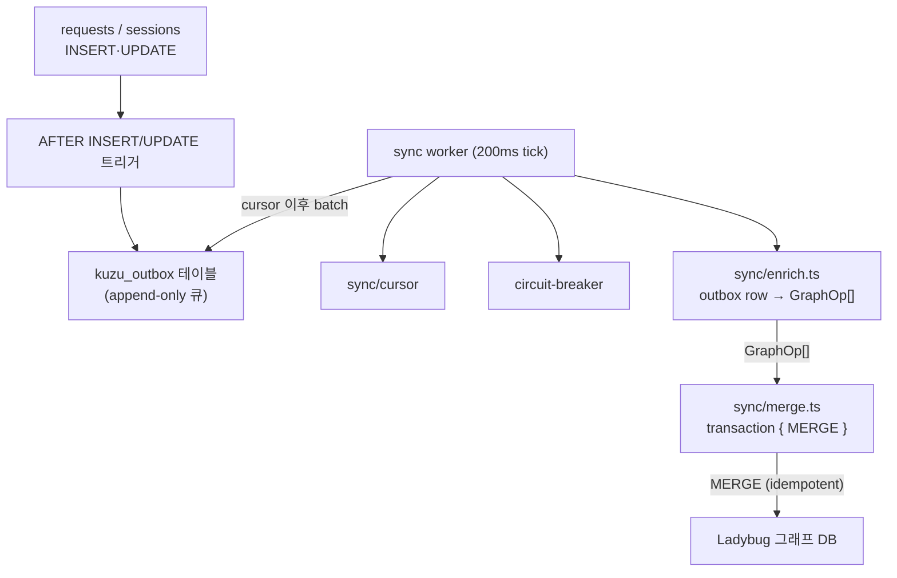
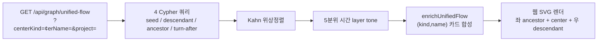

# 그래프(Graph)

> SQLite SSoT → `kuzu_outbox` 큐 → Ladybug 그래프 DB로 incremental sync. 메타 문서 통합 Flow를 read-only로 노출합니다.

---

## 문서 기준

| 항목 | 값 |
|------|-----|
| 시각 | 2026-06-06 16:44:03 KST |
| 커밋 | `4ea9686` |
| 태그 | `v4.4.0` |

---

## 1. 개요

`packages/storage-graph`는 SQLite를 SSoT로 두고 outbox 패턴으로 Ladybug 그래프 투영을 incremental sync합니다. 그래프가 깨지거나 미가용필도 RDB 쓰기 경로는 영향을 받지 않습니다.

- **모드 게이트**: `SPYGLASS_GRAPH_MODE='off'`이면 tick은 즉시 반환하고 outbox만 누적.
- **회로 차단기**: 연속 실패 시 OPEN. RDB·SSE 무영향.
- **retention**: `deleteOldGraphData(cutoff)`가 Event/ToolCall/Turn/Session 노드만 `DETACH DELETE`. MetaDocument/Agent 보존.

---

## 2. 그래프 스키마

`packages/storage-graph/src/schema/ddl.ts`가 정의합니다.

| 노드 | 속성 |
|------|------|
| `Event` | `id`, `timestamp`, `type`, `tool_name`, `tool_detail`, `tokens_total` |
| `ToolCall` | `id`, `tool_use_id`, `tool_name`, `status` |
| `Turn` | `id`, `turn_id`, `timestamp` |
| `Session` | `id`, `project_name`, `started_at`, `ended_at` |
| `MetaDocument` | `id`, `type`, `name`, `source` |
| `Agent` | `id`, `agent_type` |

| 엣지 | 출발 → 도착 |
|------|-------------|
| `HAS_EVENT` | Session → Event |
| `HAS_TOOL` | Turn → ToolCall |
| `NEXT_TURN` | Turn → Turn |
| `CALLS` | Event/ToolCall → MetaDocument |
| `HAS_AGENT` | ToolCall → Agent |
| `PARENT_OF` | ToolCall → ToolCall |

---

## 3. 통합 Flow (`/api/graph/unified-flow`)

메타 문서 호출 관계를 시각화하는 단일 엔드포인트입니다.

- **쿼리**: `getUnifiedFlow`(`packages/storage-graph/src/queries/unified-flow.ts`)가 4개 Cypher(seed + descendant + ancestor + turn-after) + Kahn 위상정렬 + 5분위 시간 layer tone을 산출.
- **보강**: `enrichUnifiedFlow`(`packages/server/src/routes/graph.ts`)가 raw ToolCall을 (kind,name) 카드 단위로 합성 — distinct turn count, MCP 그룹핑, HOT pill, edge strength.
- **렌더**: 웹의 `features/meta-docs/`가 SVG 셸 안에 inject. pan/zoom 치메라 제공.

---

## 4. Graph 라우터

`packages/server/src/routes/graph.ts`가 노출합니다.

| 라우트 | 동작 |
|--------|------|
| `GET /api/graph/status` | 그래프 운영 상태(모드, 회로 상태, cursor, 노드 수) |
| `GET /api/graph/sessions/:id/initial` | 세션 초기 hydrate 서브그래프 |
| `GET /api/graph/turns/:id/neighbors` | BFS depth hop 이웃 노드 |
| `GET /api/graph/turns/:id/path` | 경로 placeholder |
| `GET /api/graph/unified-flow` | 메타 문서 통합 flow |
| `GET /api/graph/dlq` | Dead Letter Queue 목록 |
| `POST /api/graph/dlq/resurrect` | DLQ 행 재처리 |

---

## 5. 확장

새 노드/엣지 종류 추가:
1. `packages/storage-graph/src/schema/ddl.ts`에 정의 추가.
2. `packages/storage-graph/src/sync/enrich.ts`에서 outbox row → GraphOp 매핑 추가.
3. read: `queries/unified-flow.ts` 또는 새 쿼리 함수 작성 후 `routes/graph.ts`에 라우트 추가.

---

> **문서 기준**
> - 시각: 2026-06-06 16:44:03 KST
> - 커밋: `4ea9686`
> - 태그: `v4.4.0`
