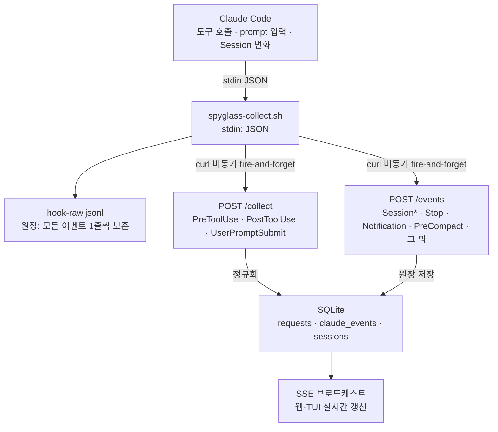
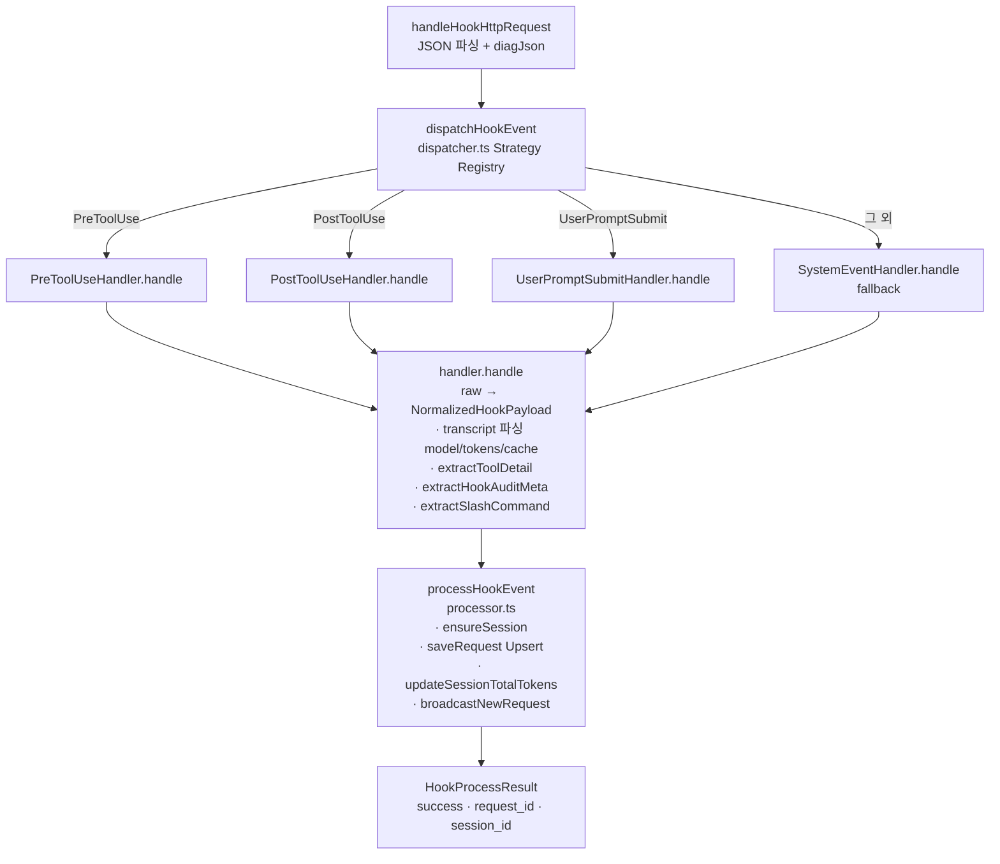
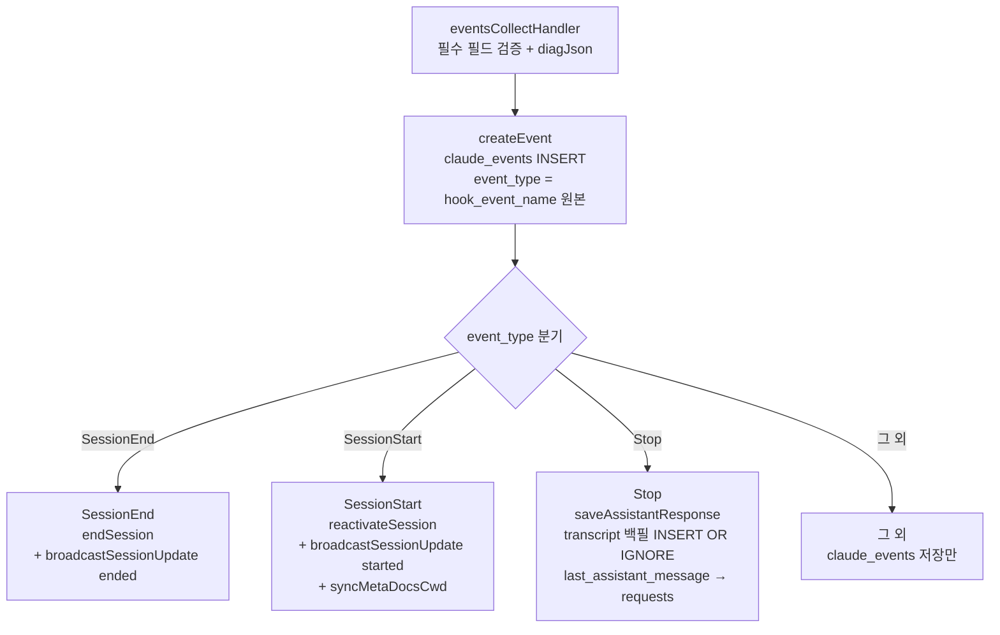
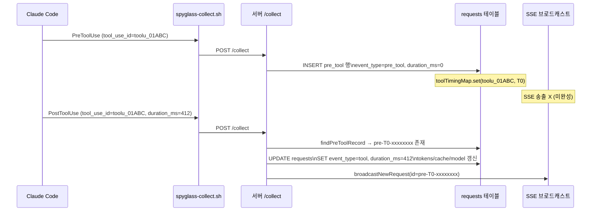
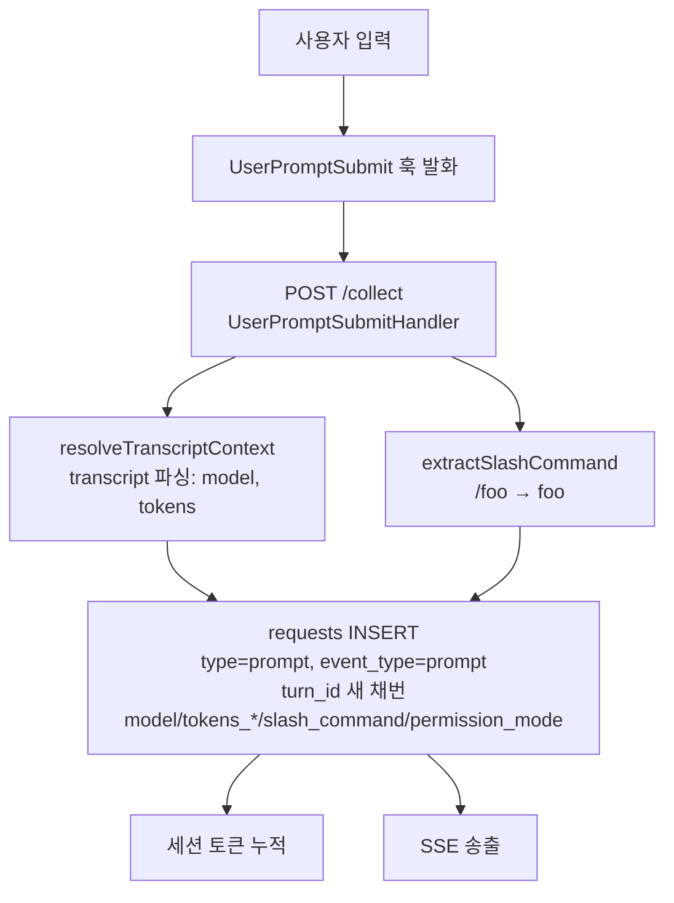

# 훅 통합 가이드

**한눈에 보기**: Claude Code는 도구 호출·프롬프트 입력·세션 변화 같은 이벤트가 발생할 때마다
외부 명령(훅)을 실행할 수 있습니다. claude-spyglass는 단 하나의 bash 스크립트(`spyglass-collect.sh`)를
모든 훅에 연결하여, stdin으로 들어오는 JSON 페이로드를 로컬 서버(`:9999`)로 비동기 POST 합니다.
서버는 페이로드를 정규화하여 SQLite에 저장하고 SSE(Server-Sent Events)로 웹/TUI에 실시간 송출합니다.

이 문서는 훅이 발화되는 시점부터 DB·SSE에 반영되는 시점까지의 데이터 흐름과
등록·확장·진단 방법을 단일 진실 공급원(single source of truth) 수준으로 정리합니다.

> 설치·운영의 큰 그림은 [`install-guide.md`](../install-guide.md)를 참고하세요.
> 본 문서는 **훅 메커니즘 자체**에 집중합니다.

---

## 목차

1. [개요](#1-개요)
2. [지원 훅 이벤트 종류](#2-지원-훅-이벤트-종류)
3. [수집 스크립트 `spyglass-collect.sh`](#3-수집-스크립트-spyglass-collectsh)
4. [서버 측 ingest 처리](#4-서버-측-ingest-처리)
5. [`.claude/settings.json` 등록 방법](#5-claudesettingsjson-등록-방법)
6. [이벤트별 데이터 흐름](#6-이벤트별-데이터-흐름)
7. [새 이벤트 추가하기](#7-새-이벤트-추가하기)
8. [트러블슈팅](#8-트러블슈팅)

---

## 1. 개요

### 1.1 Claude Code 훅이란

Claude Code는 도구 실행, 사용자 프롬프트 입력, 세션 생명주기 등 **명시된 이벤트가 발생할 때** 사용자가 등록한 외부 명령을 실행합니다.
훅에 등록된 명령은 다음 규약으로 동작합니다.

- **stdin**(표준 입력)으로 JSON 페이로드가 들어옵니다.
- 페이로드의 `hook_event_name` 필드로 어떤 이벤트인지 식별합니다.
- 명령은 동기/비동기로 실행되며, exit code 또는 `stdout`으로 Claude Code의 동작을 막거나 결정할 수도 있습니다.
- spyglass는 **수동적 관찰만** 하고 Claude Code의 흐름에 절대 개입하지 않습니다.
- 등록 위치는 글로벌 `~/.claude/settings.json` 또는 프로젝트 `.claude/settings.json`의 `hooks` 키입니다.

### 1.2 spyglass의 활용 방식

spyglass는 **모든 훅을 단 하나의 bash 스크립트**(`hooks/spyglass-collect.sh`)에 연결합니다.
스크립트는 stdin 페이로드를 받아 로컬 spyglass 서버(`http://127.0.0.1:9999`)로 HTTP POST 합니다.
Claude Code 프로세스를 블로킹하지 않도록 백그라운드(`&`)에서 비동기 전송됩니다.



> **약어 안내** — SSE: Server-Sent Events(서버→클라이언트 단방향 실시간 스트림).
> TUI: Text-based User Interface(터미널 UI). CC: Claude Code.

### 1.3 두 종류의 HTTP 엔드포인트

수집 스크립트는 `hook_event_name`을 보고 두 엔드포인트 중 하나로 분기합니다.
서버는 두 엔드포인트의 raw 페이로드를 통일된 방식으로 처리합니다.

| 엔드포인트 | 주 저장 테이블 | 처리하는 `hook_event_name` |
|------------|----------------|------------------------------|
| `POST /collect` | `requests` (+ `sessions`) | `PreToolUse`, `PostToolUse`, `UserPromptSubmit` |
| `POST /events`  | `claude_events` (+ `Stop`은 `requests`로도) | 그 외 전부 (`SessionStart`, `SessionEnd`, `Stop`, `Notification`, `PreCompact`, ...) |

---

## 2. 지원 훅 이벤트 종류

spyglass는 Claude Code가 보내는 모든 훅을 받을 수 있도록 설계되어 있습니다.
이벤트는 두 부류로 나뉩니다 — **정밀하게 정규화하는 이벤트**(전용 핸들러 보유)와
**raw 원장만 보존하는 이벤트**(스키마-라이트 보존).
spyglass가 지원하는 총 이벤트 수는 **27종**입니다(`/collect` 3종 + `/events` 24종).

### 2.1 정규화되는 이벤트 (`/collect` 라우트)

`packages/server/src/hook/dispatcher.ts`의 Strategy Registry에 등록된 핸들러로 처리됩니다.

| `hook_event_name` | 핸들러 클래스 | DB 저장 | `event_type` |
|--------------------|----------------|---------|---------------|
| `PreToolUse` | `PreToolUseHandler` | `requests` INSERT | `pre_tool` |
| `PostToolUse` | `PostToolUseHandler` | `requests` UPSERT (pre→post 머지) | `tool` |
| `UserPromptSubmit` | `UserPromptSubmitHandler` | `requests` INSERT (새 `turn_id` 채번) | `prompt` |

매칭 핸들러가 없으면 fallback인 **`SystemEventHandler`** 가 동작해 `request_type='system'`으로 그대로 보존합니다.
현재는 발화 경로가 없지만 향후 호환성을 위한 안전망입니다.

### 2.2 원장 보존 이벤트 (`/events` 라우트)

`packages/server/src/events.ts`의 `eventsCollectHandler`가 `claude_events` 테이블에 INSERT 합니다.
아래는 실제 운영에서 관측된 이벤트와 `settings.hooks.full.json`이 등록하는 전체 목록입니다.

| 그룹 | `hook_event_name` | 비고 / 부가 동작 |
|------|--------------------|------------------|
| **세션** | `SessionStart` | `sessions.ended_at = NULL`로 reactivate · SSE `session.started` 브로드캐스트 · `cwd` 기준 Behavior Definitions 카탈로그 동기화 |
| **세션** | `SessionEnd` | `sessions.ended_at` 설정 · SSE `session.ended` 브로드캐스트 |
| **세션** | `Stop` | transcript 백필 → `last_assistant_message`를 `requests`에 `type='response'`로 INSERT · SSE 송출 |
| **세션** | `StopFailure` | 원장만 보존 |
| **도구** | `PostToolUseFailure` | 원장만 보존 (도구 실패 감사용) |
| **알림** | `Notification` | `notification_type` / `type` 필드를 그대로 저장 |
| **서브에이전트** | `SubagentStart`, `SubagentStop` | 원장 보존 (자식 도구는 PostToolUse 시점에 transcript에서 별도 추출) |
| **압축** | `PreCompact`, `PostCompact` | 컨텍스트 압축 추적 (메트릭 `activity.ts`가 보유 세션 수 집계) |
| **권한** | `PermissionRequest`, `PermissionDenied` | 권한 모드(`plan` / `acceptEdits` 등) 분석 |
| **플러그인·UX** | `Setup`, `TeammateIdle`, `Elicitation`, `ElicitationResult` | 원장 보존 |
| **태스크** | `TaskCreated`, `TaskCompleted` | Task 메타 보존 (`tool_use_id` / `task_id` / `description` 컬럼 매핑) |
| **시스템 상태** | `ConfigChange`, `WorktreeCreate`, `WorktreeRemove`, `InstructionsLoaded`, `CwdChanged`, `FileChanged` | 작업 환경 변화 |

> 새 이벤트가 등장해도 `/events`는 **`hook_event_name`을 그대로 `event_type`으로 저장**하므로
> 코드 수정 없이도 페이로드가 유실되지 않습니다.

### 2.3 raw 페이로드의 공통 필드

`ClaudeHookPayload` 타입 정의는 `packages/server/src/hook/types.ts`에 있습니다.

```ts
interface ClaudeHookPayload {
  hook_event_name: string;        // UserPromptSubmit | PreToolUse | PostToolUse | ...
  session_id: string;             // Claude Code 세션 UUID
  transcript_path?: string;       // ~/.claude/projects/<encoded>/<session>.jsonl
  cwd?: string;                   // 호출 시점의 작업 디렉토리(working directory)
  tool_name?: string;             // Read / Bash / Edit / Agent / mcp__... 등
  tool_input?: Record<string, unknown>;  // Pre/PostToolUse 한정
  tool_response?: unknown;        // PostToolUse 한정
  tool_use_id?: string;           // toolu_xxx 형식의 Anthropic ID
  duration_ms?: number;           // PostToolUse 한정 (신버전 CC가 직접 측정)
  permission_mode?: string;       // bypassPermissions / plan / acceptEdits / dontAsk / default
  agent_id?: string;              // 서브에이전트 내부 훅이면 채워짐
  agent_type?: string;            // Explore / general-purpose 등
  prompt?: string;                // UserPromptSubmit 한정
}
```

이벤트별 부가 필드:

- **`Stop`** — `last_assistant_message`(마지막 어시스턴트 텍스트)
- **`Notification`** — `notification_type`
- **`TaskCreated` / `TaskCompleted`** — `description`, `subject`, `task_id`

---

## 3. 수집 스크립트 `spyglass-collect.sh`

**요약**: 모든 훅이 호출하는 단일 진입점 스크립트입니다. 6단계로 동작하며 — stdin 검증, 페이로드 캡처,
raw 원장 append, 이벤트 판별, `/collect` 또는 `/events`로 분기 전송, 백그라운드 분리 — 어떤 단계가 실패해도 Claude Code를 막지 않습니다.

전체 경로: `hooks/spyglass-collect.sh` (저장소 기준).
실행 권한이 필요합니다(`chmod +x`). 모든 훅 등록은 이 스크립트 하나를 호출합니다.

### 3.1 동작 단계

1. **stdin 검증** — `[[ ! -t 0 ]]`로 파이프 입력 여부 확인.
   TTY(터미널) 에서 직접 실행되면 즉시 종료.
2. **페이로드 캡처** — `payload=$(cat)`으로 전체 JSON을 메모리에 보관.
3. **원장 기록** — `~/.spyglass/logs/hook-raw.jsonl`에 한 줄로 append (전 이벤트 100% 보존).
4. **이벤트 판별** — `python3` 한 줄로 `hook_event_name` 필드 추출.
   `python3`이 없거나 JSON 파싱이 실패하면 빈 문자열로 폴백.
5. **분기 전송**:
   - `UserPromptSubmit` / `PreToolUse` / `PostToolUse` → `POST /collect`
   - 그 외 모든 이벤트 → `POST /events`
   - `hook_event_name` 추출 실패 → `POST /collect` (레거시 호환)
6. **비동기 fire-and-forget** — `( curl ... ) &` 로 백그라운드 분리.
   서브쉘 PID만 echo 하고 부모 스크립트는 즉시 종료하므로 Claude Code 도구 호출이 차단되지 않습니다.

### 3.2 환경 변수

| 변수 | 기본값 | 의미 |
|------|--------|------|
| `SPYGLASS_HOST` | `localhost` | 서버 호스트명. 다른 머신으로 보내려면 변경 (방화벽·보안 검토 필수) |
| `SPYGLASS_PORT` | `9999` | 서버 포트 |
| `SPYGLASS_TIMEOUT` | `1` | curl `--max-time` 초 단위. 너무 짧으면 OS 부하 시 유실 가능 |
| `HOME` | 시스템 | 로그·DB 경로 결정 (`~/.spyglass/...`) |

서버가 사용하는 변수(`ANTHROPIC_UPSTREAM_URL` 등)는 훅 스크립트와 **무관**합니다.

### 3.3 stdin JSON 형식 예시

5종 이벤트의 stdin 페이로드 예시입니다. 접기 블록을 펼쳐 확인하세요.

<details>
<summary><b>UserPromptSubmit</b> — 사용자 프롬프트 입력</summary>

```json
{
  "hook_event_name": "UserPromptSubmit",
  "session_id": "8f3c1c2d-...-...",
  "transcript_path": "/Users/alice/.claude/projects/-Users-alice-myrepo/8f3c1c2d-...jsonl",
  "cwd": "/Users/alice/myrepo",
  "permission_mode": "acceptEdits",
  "prompt": "<command-name>/commit</command-name>\n변경사항 커밋해줘"
}
```
</details>

<details>
<summary><b>PreToolUse</b> — 도구 실행 직전</summary>

```json
{
  "hook_event_name": "PreToolUse",
  "session_id": "8f3c1c2d-...",
  "transcript_path": "/Users/alice/.claude/projects/.../8f3c1c2d.jsonl",
  "cwd": "/Users/alice/myrepo",
  "tool_name": "Bash",
  "tool_input": { "command": "ls -la", "description": "List files" },
  "tool_use_id": "toolu_01ABCxyz...",
  "permission_mode": "acceptEdits"
}
```
</details>

<details>
<summary><b>PostToolUse</b> — 도구 실행 완료 (PreToolUse와 <code>tool_use_id</code>로 페어링)</summary>

```json
{
  "hook_event_name": "PostToolUse",
  "session_id": "8f3c1c2d-...",
  "transcript_path": "/Users/alice/.claude/projects/.../8f3c1c2d.jsonl",
  "cwd": "/Users/alice/myrepo",
  "tool_name": "Bash",
  "tool_input": { "command": "ls -la" },
  "tool_response": { "stdout": "...", "exit_code": 0, "interrupted": false },
  "tool_use_id": "toolu_01ABCxyz...",
  "duration_ms": 412,
  "permission_mode": "acceptEdits"
}
```
</details>

<details>
<summary><b>SessionStart</b> — 세션 시작 / 재개</summary>

```json
{
  "hook_event_name": "SessionStart",
  "session_id": "8f3c1c2d-...",
  "source": "startup",
  "cwd": "/Users/alice/myrepo",
  "transcript_path": "/Users/alice/.claude/projects/.../8f3c1c2d.jsonl"
}
```
</details>

<details>
<summary><b>Stop</b> — 한 턴(turn)의 어시스턴트 응답 완료</summary>

```json
{
  "hook_event_name": "Stop",
  "session_id": "8f3c1c2d-...",
  "transcript_path": "/Users/alice/.claude/projects/.../8f3c1c2d.jsonl",
  "reason": "end_turn",
  "stop_hook_active": false,
  "last_assistant_message": "변경사항을 커밋했습니다. ..."
}
```
</details>

### 3.4 HTTP 전송 동작

```bash
curl -s -w "\n%{http_code}" \
  -X POST \
  -H "Content-Type: application/json" \
  -d "$json_data" \
  --max-time "$SPYGLASS_TIMEOUT" \
  "$endpoint"
```

- `Content-Type: application/json` 고정.
- `--max-time 1` 기본 — 서버가 죽어 있어도 1초 후 절차 종료.
- 응답 본문 + HTTP 코드를 합쳐 마지막 줄로 코드 추출.

### 3.5 에러 처리

- HTTP 코드가 `200 | 201 | 000`이 아닐 때만 `~/.spyglass/logs/collect.log`에 `[ERROR] ...` 라인을 남깁니다.
  - `000`은 curl이 응답을 받지 못한 경우(서버 다운/타임아웃)로, 운영상 흔하므로 의도적으로 침묵합니다.
- 모든 동작은 백그라운드 `( ... ) &` 안에서 일어나며 부모 프로세스는 항상 정상 종료(`exit 0`)합니다.
  훅 실패가 Claude Code 도구 실행을 막지 않도록 보장하는 장치입니다.
- 로그 디렉토리 생성 실패 시 `set -euo pipefail`에 의해 즉시 종료되며 stdin 페이로드는 유실됩니다.
  이 경우 권한을 점검하세요.

### 3.6 운영 산출 파일

| 파일 | 의미 |
|------|------|
| `~/.spyglass/logs/hook-raw.jsonl` | 모든 훅 호출의 raw 페이로드 (1줄/이벤트, 서버 처리 성공 여부와 무관) |
| `~/.spyglass/logs/collect.log` | 훅 스크립트 동작 로그 (`[INFO]`, `[ERROR]`) |

서버 측 진단 로그(`hook-payload.jsonl`, `model-trace.log` 등)는 **별도**로 `~/.spyglass/diag/` 아래에 저장됩니다.

---

## 4. 서버 측 ingest 처리

**요약**: 서버는 `/collect`(정규화 채널)와 `/events`(raw 보존 채널)를 별도로 처리합니다.
`/collect`는 Strategy Pattern으로 핸들러를 분기하여 `requests` 테이블에 정제된 행을 만들고,
`/events`는 모든 페이로드를 `claude_events` 원장에 그대로 저장합니다.

### 4.1 라우팅

`packages/server/src/runtime/dispatch.ts` 가 최상위 경로별 핸들러를 결정합니다.

```ts
if (path === '/collect') {
  const result = await handleHookHttpRequest(req, db);   // packages/server/src/hook/http-entry.ts
  if (result.status === 200) invalidateDashboardCache();
  return result;
}
if (path === '/events') {
  if (req.method === 'POST') return eventsCollectHandler(req, db.instance);
  return sseRouter(req);                   // GET 은 SSE 스트림
}
```

같은 `/events` 경로가 **POST는 수집, GET은 SSE 구독**으로 양분되는 점을 기억하세요.

**`invalidateDashboardCache()`** (`packages/server/src/routes/dashboard.ts`):
`/api/dashboard` 응답 캐시(TTL 30s)를 무효화하는 함수입니다. 활성 세션 중 훅 이벤트가 폭풍처럼 연속 도착할 때 매번 캐시를 비우면 Bun 이벤트 루프가 포화될 수 있으므로, **5초 debounce** 방식으로 동작합니다 — 첫 호출 시 5초 타이머를 시작하고, 타이머가 살아있는 동안 추가 호출은 흡수합니다. 타이머 만료 시 `_dashboardCache = null`로 초기화됩니다.
호출 지점: `dispatch.ts`(`/collect` 200 응답), `events.ts`(Stop 훅 처리), `proxy/handler/broadcast.ts`(proxy INSERT).
테스트·긴급 상황에서는 debounce를 우회하는 `invalidateDashboardCacheNow()`를 사용합니다.

### 4.2 `/collect` 파이프라인 (정규화 채널)



### 4.3 `/events` 파이프라인 (raw 보존 채널)



### 4.4 저장되는 테이블 요약

`packages/storage/src/schema.ts`, `migrations/006-add-claude-events.sql` 참조.

- **`requests`** — `/collect` 정규화 결과 (UI 메인 피드 소스). 주요 컬럼:
  `id`, `session_id`, `timestamp`, `type` ∈ {`prompt`,`tool_call`,`system`,`response`},
  `tool_name`, `tool_detail`, `turn_id`, `model`, `tokens_*`, `duration_ms`,
  `payload` (raw JSON 보존), `cache_creation_tokens`, `cache_read_tokens`, `preview`,
  `tool_use_id`, `event_type` ∈ {`pre_tool`,`tool`,`prompt`,`assistant_response`,...},
  `tokens_confidence`, `tokens_source`, `parent_tool_use_id`, `api_request_id`,
  `permission_mode`, `agent_id`, `agent_type`, `tool_interrupted`, `tool_user_modified`, `slash_command`.

- **`claude_events`** — `/events` 원장 (PreCompact, Permission*, Worktree*, ... 전체 raw 보존). 주요 컬럼:
  `event_id` (UUID), `event_type` (hook_event_name 원본), `session_id`, `transcript_path`, `cwd`,
  `agent_id`, `agent_type`, `timestamp`, `payload` (raw JSON), `schema_version`,
  `permission_mode`, `source`, `end_reason`, `model`, `stop_hook_active`,
  `task_id`, `task_subject`, `notification_type`.

> **중요**: `requests`의 `event_type='pre_tool'` 행은 미완성 상태(아직 PostToolUse가 도착하지 않음)입니다.
> 모든 조회 쿼리는 다음 필터를 기본으로 사용해야 합니다.
> (`Agent` 도구는 예외 — 자식 추출 시점까지 `pre_tool` 상태가 유지되지만 UI에는 표시되어야 함)
>
> ```sql
> WHERE event_type IS NULL OR event_type != 'pre_tool' OR tool_name = 'Agent'
> ```

---

## 5. `.claude/settings.json` 등록 방법

**요약**: 두 가지 프로파일이 있습니다 — **minimal**(6개 이벤트, 코어 기능 충분) /
**full**(27개 이벤트, 모든 메트릭 활성화). 모든 항목은 동일한 명령(`bash $SPYGLASS_DIR/hooks/spyglass-collect.sh`)을 가리킵니다.

> 훅은 반드시 **글로벌 `~/.claude/settings.json`** 에 등록하세요.
> 프로젝트 단위 설정에 두면 다른 프로젝트의 작업이 누락됩니다.
>
> Claude Code의 `hooks` 키는 **이벤트 이름 수준의 `"*"` 와일드카드를 지원하지 않습니다.**
> 이벤트마다 키를 명시해야 합니다.

### 5.1 키 구조

```jsonc
{
  "env": {
    "SPYGLASS_DIR": "/absolute/path/to/spyglass-src"   // 필수
    // 선택: "SPYGLASS_HOST", "SPYGLASS_PORT", "SPYGLASS_TIMEOUT"
  },
  "hooks": {
    "<hook_event_name>": [
      {
        "matcher": "*",                  // PreToolUse/PostToolUse에서만 의미 — 모든 도구 매칭
        "hooks": [
          {
            "type": "command",           // 필수: 빠지면 Claude Code가 훅을 무시함
            "command": "bash $SPYGLASS_DIR/hooks/spyglass-collect.sh",
            "async": true,               // 권장: Claude Code 메인 흐름과 분리
            "timeout": 1                 // 초 단위
          }
        ]
      }
    ]
  }
}
```

규칙:

- `command` 안의 `$SPYGLASS_DIR`은 Claude Code가 훅 실행 직전에 `env.SPYGLASS_DIR` 값으로 치환합니다.
- `matcher`는 **`PreToolUse` / `PostToolUse` / `PostToolUseFailure` 전용**이며 **도구 이름 매칭**용입니다 (`"*"` = 전체).
- `async: true` + `timeout: 1`을 권장합니다 — 훅 실패가 도구 실행을 막지 않도록 하기 위함입니다.

### 5.2 minimal 프로파일 — 6개 이벤트 (`docs/examples/settings.hooks.minimal.json`)

**대상**: 세션 timeline + 도구 호출 + 프롬프트 + 응답까지 코어 기능만 필요할 때.
세션 메트릭, compact 추적, 권한 모드 분석 등 부가 메트릭은 비활성화됩니다.

```jsonc
{
  "env": { "SPYGLASS_DIR": "/Users/<your-name>/.spyglass-src" },
  "hooks": {
    "UserPromptSubmit": [{ "hooks": [{ "type": "command", "command": "bash $SPYGLASS_DIR/hooks/spyglass-collect.sh", "async": true, "timeout": 1 }] }],
    "PreToolUse":       [{ "matcher": "*", "hooks": [{ "type": "command", "command": "bash $SPYGLASS_DIR/hooks/spyglass-collect.sh", "async": true, "timeout": 1 }] }],
    "PostToolUse":      [{ "matcher": "*", "hooks": [{ "type": "command", "command": "bash $SPYGLASS_DIR/hooks/spyglass-collect.sh", "async": true, "timeout": 1 }] }],
    "SessionStart":     [{ "hooks": [{ "type": "command", "command": "bash $SPYGLASS_DIR/hooks/spyglass-collect.sh", "async": true, "timeout": 1 }] }],
    "SessionEnd":       [{ "hooks": [{ "type": "command", "command": "bash $SPYGLASS_DIR/hooks/spyglass-collect.sh", "async": true, "timeout": 1 }] }],
    "Stop":             [{ "hooks": [{ "type": "command", "command": "bash $SPYGLASS_DIR/hooks/spyglass-collect.sh", "async": true, "timeout": 1 }] }]
  }
}
```

### 5.3 full 프로파일 — 27개 이벤트 (권장, `docs/examples/settings.hooks.full.json`)

**대상**: 모든 메트릭(compact·permission·subagent·worktree 등)을 활용하고 싶을 때.
모든 항목은 동일한 패턴을 따르므로 한 줄로 요약하면 다음과 같습니다.

```jsonc
"<EventName>": [{ "matcher": "*",  // Pre/PostToolUse(Failure)만 해당
                  "hooks": [{ "type": "command",
                              "command": "bash $SPYGLASS_DIR/hooks/spyglass-collect.sh",
                              "timeout": 1, "async": true }] }]
```

등록되는 이벤트 목록:

| 카테고리 | 이벤트 |
|----------|--------|
| 도구 | `PreToolUse`, `PostToolUse`, `PostToolUseFailure` |
| 프롬프트·세션 | `UserPromptSubmit`, `SessionStart`, `SessionEnd`, `Stop`, `StopFailure` |
| 서브에이전트 | `SubagentStart`, `SubagentStop` |
| 알림·UX | `Notification`, `Setup`, `TeammateIdle`, `Elicitation`, `ElicitationResult` |
| 컨텍스트·권한 | `PreCompact`, `PostCompact`, `PermissionRequest`, `PermissionDenied` |
| 태스크 | `TaskCreated`, `TaskCompleted` |
| 시스템 상태 | `ConfigChange`, `WorktreeCreate`, `WorktreeRemove`, `InstructionsLoaded`, `CwdChanged`, `FileChanged` |

전체 파일은 `docs/examples/settings.hooks.full.json`을 참고하세요.
`jq` 자동 병합 절차는 [`install-guide.md` §4.4](../install-guide.md#44-자동-병합-jq-사용--권장)를 사용하세요.

### 5.4 등록 검증

```bash
# 1) 등록된 훅 키 수
jq '.hooks | keys | length' ~/.claude/settings.json
# 27   (또는 6)

# 2) SPYGLASS_DIR 절대경로 확인
jq -r '.env.SPYGLASS_DIR' ~/.claude/settings.json

# 3) 스크립트 실행 권한
ls -l "$(jq -r .env.SPYGLASS_DIR ~/.claude/settings.json)/hooks/spyglass-collect.sh"

# 4) 서버 헬스
curl -sf http://127.0.0.1:9999/health && echo OK
```

설정 변경 후에는 Claude Code를 **완전히 종료**한 뒤 다시 실행해야 새 훅이 로드됩니다.

---

## 6. 이벤트별 데이터 흐름

**요약**: 이 섹션은 주요 이벤트가 실제로 어떻게 `requests` / `claude_events` 테이블에 기록되고 SSE로 송출되는지
시퀀스 다이어그램 수준으로 풀어 설명합니다. Upsert(PreToolUse→PostToolUse), 새 turn 채번(UserPromptSubmit),
transcript 백필(Stop), 서브에이전트 자식 추출의 4가지 핵심 패턴을 다룹니다.

### 6.1 PreToolUse → PostToolUse (Upsert 패턴)

도구 1회 호출은 두 개의 훅을 발생시키며, spyglass는 같은 `tool_use_id`를 가진 두 페이로드를 **한 개의 `requests` 행으로 병합**합니다.



부수 효과 (`PostToolUseHandler.handle` 후반부):

- **어시스턴트 텍스트 백필** — `extractAssistantTextEntries(transcript_path)`로 turn 안의 모든 어시스턴트 텍스트 응답을 `id='resp-msg-<message_id>'`로 `INSERT OR IGNORE`합니다.
  중간 응답이 유실되지 않도록 도입된 변경입니다.
- **서브에이전트 자식 추출** — `tool_name === 'Agent'`일 때 서브 transcript에서 자식 `tool_use`를 모두 추출해 `parent_tool_use_id=<부모 toolu>`로 일괄 INSERT합니다.

### 6.2 UserPromptSubmit



신규 세션의 첫 프롬프트는 transcript에 아직 어시스턴트 라인이 없어 `tokens_*=0`, `model=NULL`로 저장될 수 있습니다.
이 경우 proxy 채널이 동작 중이라면 `proxy/backfill.ts`가 응답 도착 시점에 `model`을 채워줍니다.

### 6.3 SessionStart / SessionEnd / Stop

세 이벤트 모두 `/events` 라우트로 들어가 `claude_events`에 원장 INSERT 된 뒤 이벤트별 추가 동작이 이어집니다.

- **SessionStart** — `reactivateSession(db, session_id)`(`ended_at=NULL`) + SSE `session.started` + `cwd` 기준 Behavior Definitions 카탈로그 동기화 (5초 throttle).
- **SessionEnd** — `endSession(db, session_id, timestamp)`(`ended_at` 설정) + SSE `session.ended`.
- **Stop** — `saveAssistantResponse(db, payload, timestamp)` 4단계 폴백 시퀀스:
  1. **transcript 백필** — `extractAssistantTextEntries(transcript_path)`로 turn 내 모든 어시스턴트 텍스트 항목을 `persistAssistantTextResponses`로 `INSERT OR IGNORE`. 마지막 항목의 `message_id`를 `lastEntryMessageId`로 보관.
  2. **메시지 소스 결정** — Stop 페이로드의 `last_assistant_message`를 1차 소스로 사용. 비어 있으면 `proxy_requests` 120초 윈도우(`getLatestProxyResponseBefore`)로 폴백. 그래도 없으면 no-op 반환.
  3. **중복 INSERT 회피** — `lastEntryMessageId`가 있고 `requests` 테이블에 해당 행(`resp-msg-<message_id>`)이 이미 존재하면 자체 INSERT 생략, `invalidateDashboardCache()` 호출 후 반환 (transcript 백필 행이 SSoT).
  4. **self-INSERT + SSE 송출** — transcript/proxy에서 토큰·모델을 best-effort 추출하고 `getTurnIdAt` → `getLastTurnId` 순으로 `turn_id` 결정 후 `createRequest`(`type='response'`, `event_type='assistant_response'`)로 INSERT. `invalidateDashboardCache()` 호출 후 DB에서 행을 다시 SELECT해 정규화(`normalizeRequest`) + 이상치 부여(`enrichRowWithAnomalies`) → `broadcastNewRequest` 송출.

### 6.4 Compact / Permission / Worktree 등

이 이벤트들은 `claude_events` 원장에만 저장되며 SSE 송출은 하지 않습니다.
메트릭 집계는 별도 쿼리가 담당하며, 예를 들어 `packages/storage/src/queries/metrics/activity.ts`가 PreCompact/PostCompact 보유 세션 수를 집계합니다.

### 6.5 서브에이전트 흐름

`tool_name='Agent'`의 PostToolUse 처리 시 `PostToolUseHandler.maybePersistSubagentChildren`가 동작합니다.

1. `resolveSubagentTranscriptPath(raw.transcript_path, session_id, agentId)`로 서브 transcript 경로 결정.
2. `extractSubagentToolCalls(subPath)`로 N개의 자식 `tool_use` 추출 (각 자식의 model, usage 포함).
3. `persistSubagentChildren(db, children, { parentToolUseId, sessionId, turnId })` 호출:
   - 각 자식을 `requests`에 `source='subagent-transcript'`, `event_type='tool'`,
     `parent_tool_use_id=<부모 Agent toolu>`, `turn_id=<부모 Agent와 동일>`로 INSERT.
   - `tool_use_id` 중복 시 skip — 재실행 안전.

서브에이전트 내부 훅(`agent_id` 필드가 채워진 페이로드)이 별도로 도착할 수도 있습니다.
이 경우 `PreToolUseHandler`가 서브 transcript에서 model을 추출해 채웁니다(`raw.agent_id ? subTranscriptModel : undefined`).

---

## 7. 새 이벤트 추가하기

**요약**: 새 훅 이벤트를 spyglass가 인식하게 만드는 절차는 **처리 깊이**에 따라 4단계로 나뉩니다 —
(1) raw 보존만 / (2) 전용 핸들러 추가 / (3) 도구 detail 확장 / (4) 새 컬럼 추가.
가장 흔한 경우는 (1)이며, `settings.json`에 키 한 줄만 추가하면 끝납니다.

### 7.1 raw 보존만 필요할 때 (가장 흔함)

`.claude/settings.json` 의 `hooks` 키에 새 이벤트 이름을 추가하기만 하면 됩니다.
서버는 `/events` 라우트로 받아 `claude_events.event_type` 에 `hook_event_name` 그대로 저장합니다 — 코드 수정 없음.

추가 필드까지 컬럼으로 뽑고 싶다면:

1. `packages/storage/migrations/NNN-add-...sql` 작성 (`ALTER TABLE claude_events ADD COLUMN ...`).
2. `packages/storage/src/schema.ts` 의 `SCHEMA_VERSION` 증가.
3. `packages/storage/src/queries/event.ts` 의 `ClaudeEvent` 인터페이스와 `createEvent` INSERT에 컬럼 추가.
4. `packages/server/src/events.ts` 의 `eventsCollectHandler`에서 raw `payload[<field>]` → `event` 매핑 추가.

### 7.2 정규화(전용 핸들러)가 필요할 때

`requests` 테이블에 의미 있는 행으로 들어가야 하거나 SSE 송출이 필요한 경우입니다.

1. **핸들러 클래스 작성** — `packages/server/src/hook/handlers/<new-event>.handler.ts`. `HookEventHandler` 인터페이스를 구현하고 `handle(raw, ctx)` 에서 `NormalizedHookPayload` 를 만들어 `processHookEvent(db, payload)` 호출. 기존 `pre-tool-use.handler.ts` 가 가장 작은 레퍼런스.
2. **dispatcher 등록** — `packages/server/src/hook/dispatcher.ts` 의 `HANDLERS` 배열에 인스턴스 한 줄 추가:

   ```ts
   const HANDLERS: HookEventHandler[] = [
     new PreToolUseHandler(),
     new PostToolUseHandler(),
     new UserPromptSubmitHandler(),
     new MyNewEventHandler(),   // ← 추가
   ];
   ```

3. **수집 스크립트 분기** — `hooks/spyglass-collect.sh` 의 `case "$hook_event_name" in` 에 새 이벤트를 `/collect` 경로로 추가 (그대로 두면 `/events` 로 빠짐).
4. (필요 시) **컬럼 추가** — `requests` 에 새 컬럼이 필요하면 storage 마이그레이션 추가.

기존 핸들러는 수정하지 않습니다 — OCP(Open-Closed Principle, 개방-폐쇄 원칙) 준수.

### 7.3 도구별 detail 문자열 확장

새 도구가 등장해 `requests.tool_detail` 에 의미 있는 요약을 넣고 싶다면:

- `packages/server/src/hook/tool-detail.ts` 의 `extractToolDetail` switch 문에 케이스 한 개 추가.
- 추가 필드: `tool_name`, `tool_input`(필수), 선택적으로 `tool_response`(PostToolUse).
- 80자 이내로 잘라 반환 권장(`.slice(0, 80)`).

### 7.4 raw 페이로드의 새 메타 → `requests` 컬럼

예: `permission_mode` 처럼 모든 훅 종류에 걸쳐 같은 raw 필드를 컬럼화하고 싶을 때:

1. storage 마이그레이션으로 `requests.<new_field>` 컬럼 추가.
2. `packages/server/src/hook/audit-meta.ts` 의 `extractHookAuditMeta` 반환 객체에 필드 추가.
3. `NormalizedHookPayload`(types.ts)와 `saveRequest`(persist.ts) INSERT 목록에 컬럼 추가.

핸들러는 `...extractHookAuditMeta(raw)` 로 spread하기 때문에, audit-meta만 수정하면 세 핸들러(`PreToolUse`/`PostToolUse`/`UserPromptSubmit`) 모두 자동 반영됩니다.

---

## 8. 트러블슈팅

**요약**: 아래 인덱스 표에서 증상에 해당하는 항목으로 바로 이동하세요.
대부분의 문제는 (1) 글로벌 settings 미등록, (2) 서버 다운, (3) `tool_use_id` 불일치, (4) 마이그레이션 누락 중 하나입니다.

### 증상 인덱스

| # | 증상 | 가장 흔한 원인 | 섹션 |
|---|------|----------------|------|
| 1 | 훅이 전혀 실행되지 않음 (`hook-raw.jsonl` 비어있음) | settings.json 미등록 / 경로 오류 | [8.1](#81-훅이-전혀-실행되지-않음) |
| 2 | 훅은 실행되는데 DB가 비어있음 | 서버 다운 / 포트 차단 | [8.2](#82-훅은-실행되지만-데이터가-안-들어옴) |
| 3 | `pre_tool` 행이 `tool`로 머지되지 않음 | PreToolUse 훅 미등록 | [8.3](#83-posttooluse가-들어오는데-pre_tool-행이-합쳐지지-않음) |
| 4 | `duration_ms`가 0 | 구버전 CC + PreToolUse 누락 | [8.4](#84-duration_ms-가-0-또는-음수) |
| 5 | SSE에 도구 행이 중복 표시 | 클라이언트 직접 DOM 조작 | [8.5](#85-sse-에-도구-행이-두-번-나타남) |
| 6 | 슬래시 커맨드 통계가 비어 있음 | UserPromptSubmit 훅 미등록 | [8.6](#86-슬래시-커맨드-통계가-비어-있음) |
| 7 | 일부 이벤트가 누락됨 | 해당 키가 `hooks`에 없음 | [8.7](#87-일부-이벤트가-누락됨--수동-시뮬레이션) |
| 8 | `no such column` 오류 | 마이그레이션 누락 | [8.8](#88-마이그레이션이-누락된-컬럼) |

---

### 8.1 훅이 전혀 실행되지 않음

**증상**: `~/.spyglass/logs/hook-raw.jsonl`이 비어 있거나 파일이 생성되지 않음.

체크리스트:

```bash
# 1) settings 위치 — 글로벌이 맞는지
ls -la ~/.claude/settings.json
jq '.hooks | keys | length' ~/.claude/settings.json   # 0이면 hooks 미등록

# 2) 환경 변수가 jsonc 주석으로 깨지지 않았는지
jq -e '.hooks.PreToolUse[0].hooks[0].command' ~/.claude/settings.json
# "bash $SPYGLASS_DIR/hooks/spyglass-collect.sh"

# 3) SPYGLASS_DIR 절대 경로 (~/ 사용 금지)
jq -r '.env.SPYGLASS_DIR' ~/.claude/settings.json

# 4) 스크립트 실행 권한
SP=$(jq -r '.env.SPYGLASS_DIR' ~/.claude/settings.json)
test -x "$SP/hooks/spyglass-collect.sh" || chmod +x "$SP/hooks/spyglass-collect.sh"

# 5) Claude Code 재시작
#    설정 변경 후 새 세션이 아니라, 프로세스를 완전히 종료한 뒤 다시 실행해야 함
```

`hooks` 키 등록 시 가장 흔한 실수는 **`"type": "command"` 필드 누락**입니다.
이 필드가 빠지면 Claude Code가 훅을 무시합니다.

### 8.2 훅은 실행되지만 데이터가 안 들어옴

`~/.spyglass/logs/hook-raw.jsonl`에는 줄이 쌓이는데 DB에 행이 안 들어오는 경우입니다.

```bash
# 1) 서버 실행 여부
curl -sf http://127.0.0.1:9999/health && echo OK
# 응답 없음 → bun run dev 로 서버 기동

# 2) collect.log 에 HTTP 에러가 있는지
tail -n 50 ~/.spyglass/logs/collect.log
# [ERROR] Failed to send data: HTTP 400 (endpoint=...)  →  payload 스키마 오류

# 3) 서버 콘솔에 [RECV] 가 찍히는지 (server.log 또는 stdout)
tail -f $(jq -r '.env.SPYGLASS_DIR' ~/.claude/settings.json)/server.log 2>/dev/null
# [RECV] PreToolUse session=8f3c...  ← 정상 도착

# 4) 서버 진단 로그 (raw 도착 여부)
ls -la ~/.spyglass/diag/
tail -n 5 ~/.spyglass/diag/hook-payload.jsonl 2>/dev/null
```

서버가 살아있는데 `collect.log`에만 ERROR가 쌓이면 페이로드 자체 문제일 수 있으니 `hook-raw.jsonl` 마지막 줄을 `jq .`로 검증하세요.

### 8.3 PostToolUse가 들어오는데 `pre_tool` 행이 합쳐지지 않음

**증상**: `requests`에 `event_type='pre_tool'` 행이 그대로 남아 있고, 별도의 `event_type='tool'` 행이 추가로 생긴다.

가능 원인:

- PreToolUse 훅이 등록되지 않음 → PostToolUse만 발화 → 일반 INSERT로 빠짐.
- `tool_use_id`가 두 페이로드에서 일치하지 않음 (서드파티 클라이언트 등 비표준 발행).
- 서버가 PostToolUse 도착 전에 재시작됨. 단, `toolTimingMap` 메모리 캐시는 비워져도 `findPreToolRecord`는 DB SELECT 기반이라 영향 없음.
- 종합하면 가장 흔한 원인은 **PreToolUse 누락**입니다.

진단:

```sql
-- 세션 안에서 매칭되지 않은 pre_tool 행 찾기
SELECT id, tool_name, tool_use_id, timestamp
FROM requests
WHERE session_id = '<session>'
  AND event_type = 'pre_tool'
ORDER BY timestamp DESC LIMIT 20;
```

### 8.4 `duration_ms`가 0 또는 음수

`PostToolUseHandler`의 duration 결정 로직:

```
duration_ms = raw.duration_ms ?? 0
if (duration_ms === 0 && raw.tool_use_id) {
  startTs = toolTimingMap.get(raw.tool_use_id)
  if (startTs) duration_ms = now - startTs
}
```

따라서 다음 경우 0이 됩니다.

- 구버전 Claude Code (`raw.duration_ms` 미전송) + PreToolUse 훅 미등록.
- 서버가 PreToolUse 도착 후 재시작되어 `toolTimingMap`이 비워짐.

**해결**: PreToolUse 훅을 반드시 함께 등록하고 신버전 Claude Code 사용을 권장합니다.

### 8.5 SSE에 도구 행이 두 번 나타남

`processHookEvent`는 `event_type='pre_tool'`일 때 SSE를 송출하지 않습니다.
두 번 보이는 케이스의 진단 항목:

- 웹 클라이언트가 `prependRequest` 외에 직접 DOM을 수정하고 있는지 확인하세요(CLAUDE.md 함수 캡슐화 원칙 위배).
- 서버 측 `broadcastNewRequest`가 동일 행에 대해 두 번 호출되는 경로를 점검하세요.
  일반적으로 `processHookEvent` 1회 + `events.ts`의 `Stop` 처리의 별도 `response` INSERT 1회 패턴이 정상이며, 이때는 두 행의 `id`가 서로 다릅니다.

### 8.6 슬래시 커맨드 통계가 비어 있음

`requests.slash_command` 컬럼은 `UserPromptSubmit` 훅이 등록되어 있어야 채워집니다.
또한 사용자가 실제로 `/명령어`를 **입력**해야 Claude Code가 `<command-name>/명령어</command-name>`를 prompt 본문에 박아주고,
spyglass의 `extractSlashCommand`가 이를 정규화합니다. 일반 자연어 입력에는 `NULL`이 정상입니다.

### 8.7 일부 이벤트가 누락됨 — 수동 시뮬레이션

`~/.spyglass/logs/hook-raw.jsonl`은 훅 스크립트가 *받기만 하면* 무조건 기록합니다.
이 파일에 줄이 없다면 다음 셋 중 하나입니다 — (1) 해당 이벤트가 `hooks` 키에 미등록, (2) 사용 중인 Claude Code 버전이 해당 훅을 발화하지 않음, (3) `$SPYGLASS_DIR` 경로가 잘못됨.

stdin 시뮬레이션으로 직접 검증:

```bash
echo '{"hook_event_name":"PreToolUse","session_id":"test","tool_name":"Bash","tool_input":{"command":"true"},"tool_use_id":"toolu_test"}' \
  | bash "$(jq -r '.env.SPYGLASS_DIR' ~/.claude/settings.json)/hooks/spyglass-collect.sh"

tail -n 1 ~/.spyglass/logs/hook-raw.jsonl
sqlite3 ~/.spyglass/spyglass.db \
  "SELECT id, event_type, tool_name FROM requests WHERE session_id='test' LIMIT 5;"

# 테스트 후 정리
sqlite3 ~/.spyglass/spyglass.db \
  "DELETE FROM requests WHERE session_id='test'; DELETE FROM sessions WHERE id='test';"
```

### 8.8 마이그레이션이 누락된 컬럼

조회 쿼리가 `no such column: slash_command` 같은 오류로 실패하면 DB가 구버전입니다.

```bash
bun -e 'const {Database}=require("bun:sqlite");
  const db = new Database(`${process.env.HOME}/.spyglass/spyglass.db`);
  console.log(db.query("PRAGMA user_version").get());'
# { user_version: 32 }  ← 최신 마이그레이션 번호와 일치해야 함

# 마이그레이션은 서버 기동 시 자동 적용 — 그래도 안 되면 doctor로 진단
cd "$(jq -r '.env.SPYGLASS_DIR' ~/.claude/settings.json)" && bun run doctor
```

---

## 참고 파일

| 영역 | 경로 |
|------|------|
| 수집 스크립트 | `hooks/spyglass-collect.sh` |
| /collect 진입 | `packages/server/src/hook/http-entry.ts` |
| /events 진입 | `packages/server/src/events.ts` |
| Strategy registry | `packages/server/src/hook/dispatcher.ts` |
| 핸들러 | `packages/server/src/hook/handlers/*.handler.ts` |
| 정제 후 저장 | `packages/server/src/hook/processor.ts`, `persist.ts` |
| 도구 detail | `packages/server/src/hook/tool-detail.ts` |
| audit 메타 | `packages/server/src/hook/audit-meta.ts` |
| 슬래시 커맨드 | `packages/server/src/hook/slash-command.ts` |
| transcript 파싱 | `packages/server/src/hook/transcript.ts`, `transcript-context.ts` |
| storage 스키마 | `packages/storage/src/schema.ts`, `packages/storage/migrations/` |
| 예제 설정 | `docs/examples/settings.hooks.minimal.json`, `docs/examples/settings.hooks.full.json` |
| 설치 가이드 | `docs/install-guide.md` |
