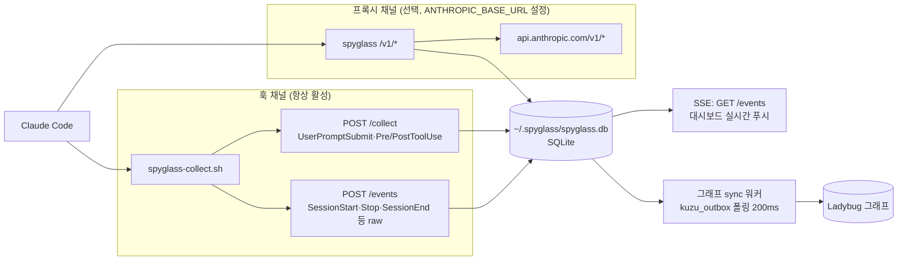

# claude-spyglass 문서

## Claude Code 실행을 들여다보는 로컬 망원경


> **TL;DR** — Claude Code 세션의 토큰·도구 호출·캐시·시스템 프롬프트를 로컬에서 들여다보는 관측 도구입니다. 이 문서는 인덱스 페이지로, [빠른 시작](#빠른-시작)으로 5분 안에 띄워보거나 아래 [문서 네비게이션](#문서-네비게이션)에서 주제별 가이드를 찾아 들어갈 수 있습니다.

---

## 프로젝트 소개

`claude-spyglass`는 Claude Code 세션 내부에서 실제로 무슨 일이 일어나는지 가시화하는 **로컬 모니터링 도구**입니다. 생산성 도구가 아니라 **관측(observability)** 도구로 설계되었습니다.

대부분의 Claude 도구가 "더 빠르게, 더 많이"에 초점을 맞춘다면, spyglass는 다음 질문에 답합니다.

- 이 세션의 시스템 프롬프트가 왜 갑자기 80%를 잡아먹고 있는가
- 어떤 룰·스킬·에이전트가 실제로 주입되었는가
- PreToolUse → PostToolUse 사이에 어떤 도구가 몇 번 호출되었는가
- 실제 API 토큰 비용·캐시 적중률·TTFT(첫 토큰까지 걸린 시간)는 얼마인가
- 토큰 스파이크, 도구 루프, 느린 호출이 언제 발생했는가

### 로컬 우선 원칙

- 호스트 머신에서만 실행 (Bun 프로세스)
- 외부 송신·원격 백엔드·텔레메트리 없음
- 모든 데이터는 `~/.spyglass/` 아래(`spyglass.db` SQLite + `graph/` Ladybug 그래프)에 로컬 저장
- 프록시 경유 시에도 API 키는 그대로 통과시키고 spyglass는 메타만 기록

---

## 핵심 기능

### 실시간 요청 추적

- Claude Code 훅이 발생할 때마다 `hooks/spyglass-collect.sh`가 도구 이벤트(UserPromptSubmit·Pre/PostToolUse)는 `POST /collect`로, 세션 이벤트(SessionStart·Stop·SessionEnd 등)는 `POST /events`로 전달
- 정제된 레코드를 SQLite에 적재하고 SSE(Server-Sent Events, `GET /events`)로 클라이언트에 즉시 푸시
- `pre_tool` → `tool` 상태 전이를 동일 `tool_use_id`로 인플레이스 갱신 (피드 행이 깜빡이지 않음)

### 토큰·캐시 분석

- 프록시 채널 활성화 시 `proxy_requests` 테이블에 입력/출력/캐시 생성/캐시 읽기 토큰 기록
- 모델별 단가(`~/.spyglass/pricing.json`)로 USD 비용 자동 계산
- TPS(초당 토큰), TTFT(첫 토큰까지 걸린 시간), 캐시 적중률 도출

### 세션 통계

- `sessions` 테이블이 프로젝트명, 시작/종료 시각, 누적 토큰을 보관
- 도구 호출 카테고리(Agent / Skill / MCP / Native)별 분포 집계
- 룰·스킬·에이전트 카탈로그 스캔으로 워크스페이스별 유효 메타 문서 노출

### 런타임 이상 탐지

- **spike** — 세션 평균 대비 200% 초과 입력 토큰
- **loop** — 단일 턴 내 동일 도구 3회 이상 연속 호출
- **slow** — 전체 도구 호출 P95 임계 초과 응답 시간

### 두 가지 인터페이스

- **웹 대시보드** — 브라우저에서 `http://127.0.0.1:9999` 접속. 라이브 피드, 차트, 캐시 도넛, 컨텍스트 그래프, 메타 카탈로그를 한 화면에 제공
- **TUI(터미널 UI)** — Ink 기반(`bun run tui`)으로 라이브 피드·통계·도구 분포를 SSH 환경에서도 확인

---

## 빠른 시작

### 1. 저장소 클론과 의존성 설치

```bash
git clone <repository-url> "${HOME}/.spyglass-src"
cd "${HOME}/.spyglass-src"
bun install
```

> **요구 사항** — Bun 1.2.0 이상, 최신 Claude Code, (선택) `jq` 1.6 이상.

### 2. 서버 기동

```bash
bun start
# 또는 개발 중 재시작
bun run dev
```

서버는 `127.0.0.1:9999`에 바인딩되며 PID는 `~/.spyglass/server.pid`에 기록됩니다.

### 3. 헬스체크

```bash
curl -sf http://127.0.0.1:9999/health && echo OK
```

### 4. Claude Code 훅 등록

`~/.claude/settings.json`에 `env.SPYGLASS_DIR`과 훅 프로파일을 병합합니다. 예제 프로파일은 두 가지가 제공됩니다.

- [`examples/settings.hooks.minimal.json`](../examples/settings.hooks.minimal.json) — 6개 훅 (최소 구성)
- [`examples/settings.hooks.full.json`](../examples/settings.hooks.full.json) — 27개 훅 (권장)

전체 `jq` 병합 절차는 [설치 가이드](../install-guide.md#4-claude-code-훅-설정)를 참고하세요. 등록 후에는 Claude Code를 **완전히 종료한 뒤 재시작**해야 훅이 로드됩니다.

### 5. 대시보드 접속

```bash
# macOS
open http://127.0.0.1:9999
# Linux
xdg-open http://127.0.0.1:9999
```

Claude Code 세션을 한 번이라도 실행하면 라이브 피드에 요청이 흐르기 시작합니다.

### 6. (선택) 프록시 채널 활성화

```bash
# spyglass가 실행 중이면 프록시 경유
claude() {
  if curl -sf http://localhost:9999/health > /dev/null 2>&1; then
    ANTHROPIC_BASE_URL=http://localhost:9999 command claude "$@"
  else
    command claude "$@"
  fi
}
```

프록시를 켜면 `proxy_requests` 테이블에 토큰·비용·시스템 프롬프트가 기록되어, 대시보드의 토큰·비용 정확도가 크게 향상됩니다.

### 7. 환경 자동 검증

```bash
bun run doctor
```

Bun 런타임, 서버 포트, `~/.claude/settings.json` 훅 등록, DB 권한·마이그레이션 스키마 버전, turn·proxy 데이터 무결성을 한 번에 점검합니다.

---

## 모노레포 구조

Bun workspaces(`packages/*`) 기반으로 구성됩니다.

```text
claude-spyglass/
├── packages/
│   ├── server/              # HTTP 서버(Bun) — /collect, /events, /api/*, /v1/* 프록시
│   │   ├── src/
│   │   │   ├── index.ts         # 데몬 디스패처 (start/stop/restart/status)
│   │   │   ├── cli.ts, cli/     # doctor 진입점 + cli/checks/
│   │   │   ├── runtime/         # daemon · dispatch · config
│   │   │   ├── routes/, api.ts, sse.ts, events.ts
│   │   │   ├── proxy/, hook/    # /v1/* 프록시 · hook 수집·정제
│   │   │   ├── meta-docs/       # 룰·스킬·에이전트 카탈로그 스캔
│   │   │   └── metrics/, metrics.ts, domain/, settings/
│   │   └── scripts/         # backfill-system-prompts.ts · backfill-subagent-parents.ts
│   ├── storage/             # SQLite 스토리지 — connection · migrator · queries
│   │   ├── migrations/          # 001-init.sql … 053-kuzu-outbox-trigger-hardening.sql
│   │   └── src/
│   │       ├── queries/         # request/ · session/ · metrics/ · stats/ · flow/
│   │       ├── runtime/         # retention · maintenance
│   │       └── scripts/         # rebuild-stats.ts · rebuild-stats-proxy.ts · bench-*.ts
│   ├── storage-graph/       # Ladybug 그래프 — client · queries(unified-flow/retention) · sync
│   ├── tui/                 # Ink 기반 TUI (React) — screens/, components/, stores/
│   ├── web/                 # 정적 웹 대시보드 — index.html + assets/{css,js} + locales/
│   ├── desktop/             # Electron 래퍼 — main/preload
│   └── types/               # 워크스페이스 공유 타입 (request/session/turn)
├── hooks/spyglass-collect.sh  # Claude Code 훅 진입점 (POST /collect, raw → /events)
├── scripts/                 # install.sh, delete-old-data.ts, i18n-extract.ts 등
├── docs/                    # install-guide.md, examples/, architecture/(index.md · schema/ · images/ 포함)
├── docker-compose.yml, Dockerfile
└── package.json             # bun workspaces 루트
```

데이터 저장 위치는 소스 저장소와 **분리**되어 있습니다. 저장소를 옮기거나 재클론해도 수집된 데이터는 그대로 유지됩니다.

| 항목 | 경로 |
|------|------|
| DB | `~/.spyglass/spyglass.db` (+ `-wal`, `-shm`) |
| 그래프 | `~/.spyglass/graph/` (Ladybug) |
| 가격표 | `~/.spyglass/pricing.json` |
| 서버 설정 | `~/.spyglass/server-config.json` |
| 훅 로그 | `~/.spyglass/logs/collect.log` |
| 훅 원본 페이로드 | `~/.spyglass/logs/hook-raw.jsonl` |
| 서버 PID | `~/.spyglass/server.pid` |

---

## 스크립트 레퍼런스

루트 `package.json`에 정의된 모든 스크립트입니다. 명령은 클론한 저장소 디렉토리(`~/.spyglass-src`)에서 실행하세요.

### 서버 라이프사이클

```bash
bun start         # 서버 기동 (이미 떠 있으면 알림)
bun run dev       # restart — 기존 프로세스 종료 후 재기동 (개발 중 권장)
bun run stop      # PID 파일 기준 SIGTERM
bun run status    # PID · 포트 · 헬스 한 줄 요약
```

내부적으로 `bun run packages/server/src/index.ts <command>`를 호출합니다.

### 환경 진단

```bash
bun run doctor    # 자동 점검 — Bun 버전 / settings.json·훅 등록 / DB 권한·스키마 / 서버 포트 / turn·proxy 무결성
```

`bun run packages/server/src/cli.ts doctor`로 연결되며, `--fix` 플래그가 지원되는 항목은 자동 보정합니다.

### TUI

```bash
bun run tui       # Ink 터미널 대시보드 (packages/tui/src/index.tsx)
```

### 품질·테스트

```bash
bun test          # 워크스페이스 전체 bun test
bun run typecheck # tsc --noEmit
```

### 데이터 유지보수

```bash
bun run rebuild-stats              # requests 기반 stats_hourly 재집계
bun run rebuild-stats-proxy        # proxy_requests 기반 stats_proxy_hourly 재집계
bun run backfill:system-prompts    # 과거 proxy_requests에 시스템 프롬프트 해시 백필
bun run backfill:subagent-parents  # 서브에이전트 parent_tool_use_id 백필
```

### Git 훅

```bash
bun run prepare   # git config core.hooksPath .githooks (저장소 자동 실행)
```

### 데스크톱 (Electron)

```bash
bun run desktop:dev        # Electron 개발 모드 (packages/desktop)
bun run desktop:build:mac  # macOS 패키지 빌드
bun run desktop:pack:mac   # macOS 디렉토리 팩(미서명)
```

---

## 동작 채널 요약

spyglass는 두 갈래로 데이터를 수집합니다. 훅 채널은 기본으로 켜져 있고, 프록시 채널은 토큰·비용 정밀도가 필요할 때 선택적으로 활성화합니다. 수집된 데이터는 SQLite에 기록되고, 그래프 동기화 워커가 이를 Ladybug 그래프로 비동기 반영합니다.



훅·프록시 두 채널 모두 동일한 `~/.spyglass/spyglass.db`에 기록되며, 대시보드는 `GET /events` SSE 스트림으로 실시간 갱신됩니다. 컨텍스트 흐름 그래프는 `kuzu_outbox` 테이블을 폴링하는 동기화 워커가 Ladybug 그래프로 반영합니다.

자세한 구성요소·요청 라이프사이클은 [아키텍처 문서](./architecture.md)와 [데이터 흐름](./data-flow.md)을 참고하세요.

---

## 문서 네비게이션

### 시작하기

- [설치 가이드](../install-guide.md) — 클론·기동·훅 등록·프록시 설정의 전체 절차
- [구성(Configuration)](./configuration.md) — `SPYGLASS_*` / `ANTHROPIC_*` 환경변수 레퍼런스
- [아키텍처](./architecture.md) — 서버·스토리지·TUI·웹 구성요소와 의존 관계

### 데이터 레이어

- [데이터 흐름](./data-flow.md) — 훅·프록시 → 정제 → 저장 → SSE → 클라이언트
- [데이터베이스 스키마](./database.md) — `sessions` / `requests` / `claude_events` / `proxy_requests` / `system_prompts`
  - 테이블별 상세는 [`schema/`](./schema/) 하위 문서 참고:
    [requests](./schema/requests.md) ·
    [sessions](./schema/sessions.md) ·
    [claude-events](./schema/claude-events.md) ·
    [proxy-requests](./schema/proxy-requests.md) ·
    [system-prompts](./schema/system-prompts.md) ·
    [meta-documents](./schema/meta-documents.md) ·
    [model-limits](./schema/model-limits.md)
- [마이그레이션](./migrations.md) — `001` … `053` 스키마 마이그레이션 카탈로그와 적용 규칙

### 인터페이스·통합

- [HTTP API](./api-http.md) — `/collect`, `/events`, `/api/*`, `/health`, `/v1/*` (프록시) 레퍼런스
- [Claude Code 훅 통합](./hooks-integration.md) — 훅 프로파일·이벤트 목록·`spyglass-collect.sh` 명세
- [CLI](./cli.md) — `start` / `stop` / `status` / `doctor` 명령 옵션
- [TUI 가이드](./tui.md) — Ink 화면 구성·키바인딩
- [웹 대시보드](./web-dashboard.md) — 라이브 피드·차트·메타 카탈로그·필터·검색

### 운영

- [배포(Deployment)](./deployment.md) — Bun 데몬 운영, Docker 이미지(`Dockerfile`, `docker-compose.yml`)
- [지표·분석(Metrics & Analytics)](./metrics-analytics.md) — TPS·TTFT·캐시 적중·이상 탐지 정의
- [문제 해결](./troubleshooting.md) — 헬스체크 실패, 훅 미수집, 프록시 오류, 마이그레이션 점검
- [기여 가이드](./contributing.md) — 개발 환경, 커밋 규약, 테스트 정책

---

## 관련 자료

### 외부 링크

- [Anthropic Claude API 문서](https://docs.anthropic.com/) — 모델, 토큰, 메시지 스펙
- [Claude Code Hooks 레퍼런스](https://docs.anthropic.com/en/docs/claude-code/hooks) — `UserPromptSubmit`, `PreToolUse`, `PostToolUse` 등 이벤트 명세
- [Bun 문서](https://bun.sh/docs) — 런타임·테스트 러너·workspaces
- [SQLite 문서](https://www.sqlite.org/docs.html) — DB 백엔드
- [Ink](https://github.com/vadimdemedes/ink) — TUI 렌더링 (React for CLI)

### 예제·샘플

- [최소 훅 프로파일](../examples/settings.hooks.minimal.json) — 6개 훅 (UserPromptSubmit, PreToolUse, PostToolUse, SessionStart, SessionEnd, Stop)
- [권장 훅 프로파일](../examples/settings.hooks.full.json) — 27개 훅 (전체 HOOK_EVENTS)

---

<div align="center">
  <sub>로컬에서만 동작하는 Claude Code 관측 도구</sub><br/>
  <sub>
    <a href="#빠른-시작">시작하기</a> ·
    <a href="./architecture.md">아키텍처</a> ·
    <a href="./troubleshooting.md">문제 해결</a> ·
    <a href="./contributing.md">기여</a>
  </sub>
</div>
