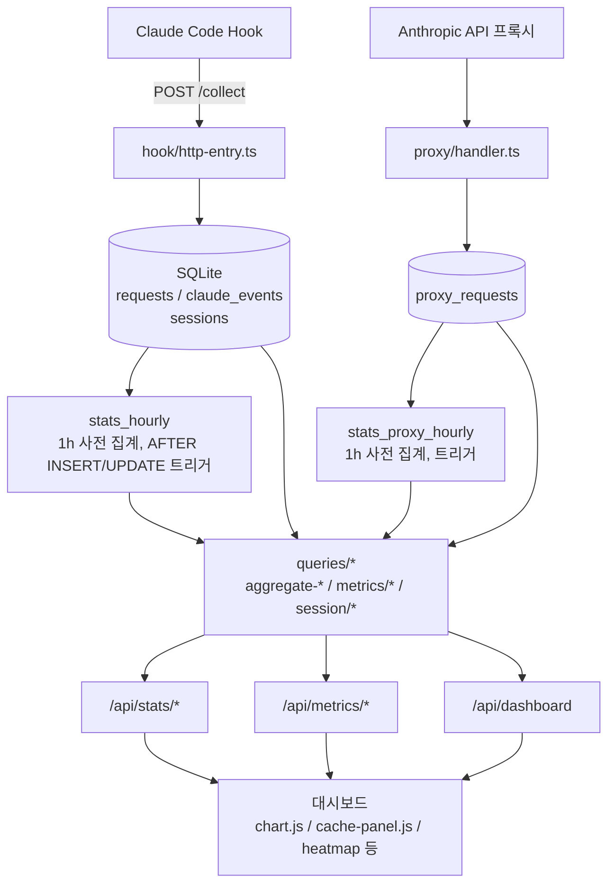
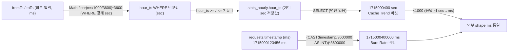

# 메트릭/분석 가이드 (Metrics & Analytics)

claude-spyglass가 어떤 지표를 어떤 산식으로 집계하고, 어느 계층에서 노출하는지 정리한 문서입니다.
정의 모호성으로 인한 회귀를 막기 위해 **모든 산식의 SSoT(단일 출처)** 와 **파일 경로**를 함께 기록합니다.

> 관련 문서: [데이터 흐름](./data-flow.md) · [데이터베이스 스키마](./database.md) · [HTTP API](./api-http.md) · [마이그레이션](./migrations.md) · [웹 대시보드](./web-dashboard.md)

## 목차

1. **개요** — 데이터 흐름, 계층 책임, 추적 도메인
2. **메트릭 카탈로그** — 토큰 / 캐시(5종) / 도구 / 세션 / 모델 / 비용
3. **집계 계층** — 6개 aggregate 분해 (`aggregate-cache/general/strip/...`)
4. **시계열 데이터** — 버킷팅, anomaly, burn rate
5. **도구 카테고리** — 4-카테고리 매핑 (`tool-category.ts`)
6. **모델 한도** — context window 추론 (`model-limits.ts`)
7. **사전 집계** — `stats_hourly` SSoT SQL
8. **재계산 스크립트** — `rebuild-stats`
9. **라우트 표면** — `/api/stats/*`, `/api/metrics/*`
10. **클라이언트 시각화** — `chart.js`, `cache-panel.js`
11. **정의 충돌 체크리스트** — 회귀 방지 핵심
12. **부록: 핵심 파일 인덱스**

---

## 1. 개요

### 1.1 데이터 흐름



### 1.2 계층별 책임

| 계층 | 책임 | 대표 파일 |
|------|------|----------|
| 원본 수집 | hook이 PreToolUse/PostToolUse/Stop 등을 `POST /collect` | `packages/server/src/hook/http-entry.ts` |
| API 프록시 수집 | Anthropic API 레이어 메트릭 (`proxy_requests`) | `packages/server/src/proxy/handler.ts` |
| 정규화 저장 | `requests` / `claude_events` / `proxy_requests` / `sessions` | `packages/storage/src/schema*.ts` |
| 사전 집계 | `stats_hourly`, `stats_proxy_hourly` (1시간 버킷) | `packages/storage/src/queries/stats/build-aggregate.ts` |
| 도메인 쿼리 | `aggregate-*`, `metrics/*`, `session/*` | `packages/storage/src/queries/` |
| HTTP 라우트 | `/api/stats/*`, `/api/dashboard` | `packages/server/src/routes/{stats,dashboard}.ts` |
| 메트릭 라우트 | `/api/metrics/*` | `@spyglass/metrics/src/router.ts` |
| 시각화 | Canvas 차트, 캐시 패널, 도넛, 히트맵 | `packages/web/src/features/dashboard/` |

### 1.3 추적 도메인 4종

| 도메인 | 주요 지표 | 대표 노출 위치 |
|--------|----------|---------------|
| **토큰** | input / output / cache_read / cache_creation / total | 헤더 카드, 시계열 |
| **캐시** | hit rate, creation/read 비율, 시간대별 trend | 좌측 Cache Panel, 도넛, Cache Trend |
| **도구** | 호출 수, 실패율, 카테고리 분포, P95 지연 | Tool Performance, 카테고리 도넛 |
| **세션** | 활성/누적 수, turn 분포, compaction, agent 깊이, 컨텍스트 사용률 | 세션 카드, 분포 차트 |

### 1.4 비용(USD) 노출 정책

USD 비용은 **노출하지 않습니다.** 사용자별 실제 가격 플랜을 알 수 없는 추정치라 옵저빌리티 신뢰도가 떨어집니다 (`aggregate-cache.ts`, `aggregate-strip.ts` 주석). 단가는 `pricing.ts`에 정의되지만 외부 도구가 절감액을 추정할 때만 사용합니다.

---

## 2. 메트릭 카탈로그

### 2.1 토큰

| 컬럼 | 의미 | 출처 |
|------|------|------|
| `tokens_input` | LLM이 청구한 입력 토큰 (캐시 미포함) | `usage.input_tokens` |
| `tokens_output` | 출력 토큰 | `usage.output_tokens` |
| `cache_read_tokens` | 캐시 히트로 read한 토큰 | `usage.cache_read_input_tokens` |
| `cache_creation_tokens` | 새 캐시 등록 시 write한 토큰 | `usage.cache_creation_input_tokens` |
| `tokens_total` | input + output | hook 측 계산 |
| `tokens_confidence` | `high` / `low` / `error` 측정 신뢰도 | hook 측 분류 |

**합산 정책:** 모든 통계 쿼리는 `tokens_confidence='high'` 행만 토큰 합산에 포함하여, PreToolUse 등 토큰=0 미완성 레코드를 배제합니다. `stats_hourly`는 이 필터를 사후 재현하기 위해 `tokens_*_high_sum` / `tokens_high_count` 컬럼을 별도로 보관합니다(§7).

### 2.2 캐시 비율 — 5가지 산식 한눈에

같은 "캐시 비율"이라도 위치별로 분자/분모가 다릅니다. 분모에 `cache_creation`을 포함하는 그룹(A)과 제외하는 그룹(B)으로 나뉩니다.

| # | 위치 | 분자 | 분모 | 의미 | SSoT |
|---|------|------|------|------|------|
| 1 | 좌측 Cache Panel **Hit Rate** | `cache_read` | `input + read + creation` | 캐시 적중률 (효율성) | `aggregate-cache.ts#getCacheStats` |
| 2 | 도넛 가운데 % (cache 모드) | `cache_creation` | `input + read + creation` | 신규 캐시 적용 비율 | `chart.js#drawDonut` |
| 3 | 좌측 패널 보조 바 (Create vs Read) | `cache_creation` | `read + creation` | 캐시 내부 신·구 비중 | `cache-panel.js#renderCachePanel` |
| 4 | Cache Trend 시계열 hit_rate | `cache_read` | `input + read` | 단기 효율 (진동 축소) | `stats_hourly` |
| 5 | 모델별 Cache Matrix hit_rate | `cache_read` | `input + read` | 모델 간 비교 | `requests` (high) |

- **그룹 A** (#1, #2, #3 변형, 세션 단위): 분모에 `creation` 포함 — 전체 토큰 비용 대비 캐시 비율 의미
- **그룹 B** (#4, #5): 분모에서 `creation` 제외 — 단기 효율을 부드럽게 보기 위함

#### 분모에 `cache_creation`을 포함하는 이유 (그룹 A)

`cache_creation`은 **첫 write 비용이 발생하는 토큰**입니다. 분모에 포함해야 "전체 토큰 비용 중 캐시 처리 비율"의 의미가 정확합니다. 분모에서 빼면 새 세션 초반 hit rate가 인위적으로 부풀어 보이는 회귀가 생깁니다 (`aggregate-cache.ts` 주석).

```ts
// aggregate-cache.ts#getCacheStats
const totalBillableInput = totalTokensInput + totalCacheRead + totalCacheCreation;
const hitRate = totalBillableInput > 0 ? totalCacheRead / totalBillableInput : 0;
```

#### 좌측 Hit Rate vs 도넛 가운데 % — 중복 아님

두 값은 **같은 분모를 보는 서로 다른 각도**입니다.

| 지표 | 묻는 질문 |
|------|----------|
| 좌측 Hit Rate (#1) | 들어온 토큰 중 캐시에서 **끌어다 쓴** 비율 — 효율성 |
| 도넛 가운데 % (#2) | 들어온 토큰 중 새로 캐시에 **올린** 비율 — 신규 컨텍스트 유입 |

#### 캐시 도넛 시각 정책

- **슬라이스**: 2-slice (`cache` = creation, `others` = read + input) — 시각 비율과 라벨 의미 일치
- **가운데 산식**: `cache_creation / (read + creation + input)` — 신규 캐시 등록 비율
- **범례 %**: 슬라이스와 동일한 보색 관계(합 = 100%)로 통일

### 2.3 도구 호출

`getToolStats` (`aggregate-tool.ts`)가 `requests`에서 직접 집계합니다 (사전 집계 X — confidence 카운트가 필요해 raw 스캔 필수).

| 컬럼 | 의미 |
|------|------|
| `call_count` | 도구 호출 수 (`event_type='tool'`만, pre_tool 제외) |
| `total_tokens` | high confidence 토큰 합 |
| `avg_duration_ms` / `max_duration_ms` | 실행 시간 평균/최대 |
| `error_count` | `tool_detail LIKE '%Error%' OR LIKE '%error%' OR tokens_confidence='error'` (합산) |
| `confidence_low_count` / `confidence_error_count` | `tokens_confidence='low'` / `='error'` 행 수 (UI 워터마크용) |

**WHERE 필터:** `type='tool_call' AND tool_name IS NOT NULL AND (event_type IS NULL OR event_type='tool')` — PostToolUse 완료 도구 호출만 집계 (pre_tool 제외).

`/api/stats/tools`는 `confidence_low_count + confidence_error_count > 0`을 `has_low_confidence` boolean으로 파생 노출하여 UI 워터마크 트리거로 사용합니다.

### 2.4 세션

`/api/stats/sessions` 응답:

| 키 | 의미 |
|------|------|
| `total_sessions` | 활동 기록이 있는 visible 세션 수 |
| `total_tokens` | 세션 토큰 합 |
| `avg_tokens_per_session` | 세션당 평균 토큰 |
| `active_sessions` | LIVE 세션 — stale·빈 세션 제외 |

세션 구조 분석 (`/api/metrics/turn-distribution`, `/api/metrics/agent-depth`):

- **Turn 분포 버킷:** `1-3 / 4-10 / 11-25 / 26-50 / 51+`
- **Compaction Rate:** `compacted_sessions / total_sessions` (같은 윈도우 내 prompt 활동 세션만 분모)
- **Agent Depth:** `no_agent` (0회) / `single_agent` (1회) / `multi_agent` (2회+)

### 2.5 모델별 사용량 / 컨텍스트 사용률

**모델별 사용량** — `getModelUsageStats` (`metrics/usage.ts`)가 `type='prompt'`를 모델별로 GROUP BY. `request_count`는 호출 수, `total_tokens`는 high confidence 합. `model NOT LIKE '<%>'` 필터로 플레이스홀더 제외.

**컨텍스트 사용률** (`/api/metrics/context-usage`) — 세션 마지막 prompt의 `final_tokens / model_max_tokens`를 4개 버킷에 분배합니다.

| 버킷 | 범위 |
|------|------|
| `<50%`   | `[0, 0.5)` |
| `50-80%` | `[0.5, 0.8)` |
| `80-95%` | `[0.8, 0.95)` |
| `>95%`   | `[0.95, ∞)` |

`final_tokens = 세션 마지막 prompt의 (tokens_input + cache_read + cache_creation)` — 그 시점에 모델이 받은 입력 컨텍스트 크기 (`metrics/usage.ts#getSessionContextUsage`).

### 2.6 비용 (Cost) — 내부 추정 전용

`pricing.ts`의 단가표 (USD per 1M tokens):

| 모델 prefix | input | output | cacheCreate | cacheRead |
|------------|-------|--------|-------------|-----------|
| `claude-opus-4-`   | 15.00 | 75.00 | 18.75 | 1.50 |
| `claude-sonnet-4-` |  3.00 | 15.00 |  3.75 | 0.30 |
| `claude-haiku-4-`  |  0.80 |  4.00 |  1.00 | 0.08 |
| fallback           |  3.00 | 15.00 |  3.75 | 0.30 |

가격은 외부 파일로 오버라이드 가능합니다. 첫 실행 시 `~/.spyglass/pricing.json`에 기본값을 기록하고, 이후 그 파일이 SSoT입니다.

```ts
// pricing.ts#loadPricing — 우선순위
// 1. cachedPricing (인메모리) → 2. ~/.spyglass/pricing.json → 3. DEFAULT_PRICING (+ 자동 생성)
```

이 단가는 UI에 노출하지 않습니다 — 실제 플랜·할인을 알 수 없는 추정치라 잘못된 신뢰를 줄 위험이 더 큽니다.

---

## 3. 집계 계층: aggregate-cache / aggregate-general / aggregate-strip

`packages/storage/src/queries/request/`는 UI 도메인별로 분해된 집계 함수입니다. 같은 `requests` 테이블을 SUM/COUNT 하지만 **각각의 "변경 이유"가 달라** SRP로 분리되어 있습니다.

### 3.0 6개 aggregate 비교

| 파일 | UI 도메인 | 핵심 함수 | 데이터 소스 | 변경 트리거 |
|------|-----------|----------|------------|------------|
| `aggregate-cache.ts` | 좌측 Cache Panel | `getCacheStats` | `stats_hourly` | 히트율/절감 지표 변경 |
| `aggregate-general.ts` | 헤더/요약 카드 | `getRequestStats` / `getRequestStatsByType` | `stats_hourly` | 요약 카드 지표 변경 |
| `aggregate-strip.ts` | Command Center Strip | `getStripStats` | `stats_hourly` | Strip 노출 지표 변경 |
| `aggregate-latency.ts` | 응답시간 카드 | `getAvgPromptDurationMs` / `getP95DurationMs` | `requests` | percentile 정의 변경 |
| `aggregate-tool.ts` | Tool Performance | `getToolStats` / `getSessionToolStats` | `requests` | 도구 지표 변경 |
| `aggregate-time.ts` | 시간대별 분포 | `getHourlyRequestStats` | `requests` | 시간 단위 변경 |

### 3.1 `aggregate-cache.ts` — Hit Rate / 절감 토큰

- 데이터 소스: **`stats_hourly` 사전 집계** (인덱스 조회)
- 분모: `tokens_input + cache_read_tokens + cache_creation_tokens`
- `tokens_confidence` 필터 없음 — stats_hourly 트리거가 pre_tool을 이미 제외해 high/low 구분 의미가 미세
- 반환: `{ hitRate, cacheReadTokens, cacheCreationTokens, savingsTokens (= cacheRead alias), savingsRate }` — 모두 4자리 반올림

### 3.2 `aggregate-general.ts` — 헤더 요약

- 데이터 소스: **`stats_hourly` 사전 집계** + `event_type IN ('tool','')` 필터
- `event_type=''`는 trigger가 NULL을 정규화한 결과 (`stats-event-type-dim` ADR-004)
- `avg_tokens_per_request = tokens_total_high_sum / tokens_high_count` (high 필터 재현)
- `avg_duration_ms = duration_ms_sum / duration_ms_count` (duration은 high 필터를 적용하지 않음)

`getRequestStatsByType`은 type별 GROUP BY로 prompt / tool_call / response 분포를 뽑습니다. pre_tool은 stats_hourly 트리거가 이미 배제하므로 tool_call count에 포함되지 않습니다.

### 3.3 `aggregate-strip.ts` — Command Center Strip

- 노출 지표 2종: `p95_duration_ms`, `error_rate`
- P95는 `aggregate-latency.ts#computeP95` 헬퍼 재사용 (중복 제거)
- `buildRangeClause` 헬퍼로 같은 timestamp 범위를 두 서브쿼리(p95, error rate)에 일관 적용

---

## 4. 시계열 데이터 — `timeseries.ts`

`packages/storage/src/queries/metrics/timeseries.ts`는 **1시간 버킷** 시계열의 SSoT입니다.

### 4.1 버킷 산식 — ms vs sec



- **Burn Rate** (`requests` 직접): SQL `(CAST(timestamp / 3600000 AS INTEGER) * 3600000)` 로 ms 단위 버킷 키 생성.
- **Cache Trend** (`stats_hourly` 사전 집계): `hour_ts`는 이미 sec 단위로 저장돼 있어 변환 없이 `GROUP BY hour_ts` 로 그대로 사용. 별도의 `Math.floor(fromTs / 1000 / 3600) * 3600` / `Math.floor(toTs / 1000 / 3600) * 3600` 은 hour_ts를 변환하는 식이 아니라, **ms 단위 외부 입력 파라미터(`fromTs`/`toTs`)를 sec 경계값으로 환산해 `WHERE hour_ts >= ? / <= ?` 비교에 쓰는 식**입니다 (`timeseries.ts` lines 71, 75).

응답 단계에서 Cache Trend의 sec hour_ts를 ×1000하여 외부 shape는 ms로 통일합니다.

### 4.2 빈 버킷 처리 — `fillHourSlots`

raw SQL은 데이터가 있는 시간대만 반환합니다. 응답 단계에서 `fillHourSlots`(`metrics/_shared.ts`)가 시작/끝 슬롯을 `Math.floor(ms / HOUR) * HOUR`로 정렬한 뒤 1h씩 증가시키며 raw Map에서 lookup해 빈 슬롯을 0/null로 채웁니다. Generic builder라 호출 측에서 cast가 불필요합니다.

### 4.3 Burn Rate vs Cache Trend

| 함수 | 데이터 소스 | hit_rate 분모 | 빈 버킷 |
|------|------------|--------------|---------|
| `getBurnRateBuckets` | `requests` (`tokens_confidence='high'`) | — | tokens=0, requests=0 |
| `getCacheTrendBuckets` | `stats_hourly` (인덱스) | `tokens_input + cache_read` | `hit_rate=null` (UI에서 점 미표시) |

> 주의: 시계열 hit_rate **분모는 `input + read`** 로, **§2.2 Cache Panel(`input + read + creation`)** 과 다릅니다. 시계열은 단기 효율 표시 용도라 creation을 제외해 진동을 줄였습니다.

### 4.4 어제 동시각 비교 / Anomaly

**Burn Rate 비교** (`metrics/calculators/burn-rate.ts`): 24h 윈도우와 정확히 24h 이전 동기간을 비교해 `delta_pct = ((current - yesterday) / yesterday) * 100` 산출. 어제 0이면 `null`(UI "—").

**Anomaly** (`metrics/calculators/anomaly.ts`, 임계 `anomaly-thresholds.ts`) — 6종 검출:

| 종류 | 판정 기준 | 데이터 소스 | 검출 함수 |
|------|----------|------------|----------|
| **spike** | 세션별 prompt `tokens_input` 평균(샘플 ≥ 2)의 200% 초과 (`avg * 2`) | `requests` | `computeAnomalyTimeSeries` / `computeRowAnomalies` |
| **loop**  | `turn_id` 내 동일 `tool_name` 연속 3회 이상 | `requests` | `computeAnomalyTimeSeries` / `computeRowAnomalies` |
| **slow**  | 전체 `tool_call duration_ms`의 P95 초과 (`idx = ceil(N * 0.95) - 1`) | `requests` | `computeAnomalyTimeSeries` / `computeRowAnomalies` |
| **bloated-sys** | `system_byte_size / 4 / model_max_tokens ≥ warn_pct/100`; warn ≥ 15%, critical ≥ 25% (`anomaly_thresholds` 시드) | `proxy_requests` | `detectBloatedSys` |
| **agent-spike** | Agent/Skill/Task 부모의 자식합(WITH RECURSIVE 깊이 3): `pct_of_window ≥ warn_pct/100` AND `child_sum / parent ≥ 10×` (`AGENT_SPIKE_MULTIPLIER_THRESHOLD` 고정 상수) | `requests` | `detectAgentSpike` / `detectAgentSpikeBatch` |
| **context-saturation** | 세션 최대 prompt context(`tokens_input + cache_read + cache_creation`) / 동적 `model_max_tokens` ≥ 0.85 → critical, ≥ 0.70 → warn (`CTX_SAT_WARN_PCT=70` / `CTX_SAT_CRITICAL_PCT=85` 코드 상수) | `proxy_requests` | `detectContextSaturation` |

`bloated-sys` / `agent-spike` 임계는 `anomaly_thresholds` 테이블(Migration 033)에서 `(project_id, model_id)` 우선순위로 조회하며, 시드 누락 시 코드 폴백 warnPct=15 / criticalPct=25를 사용합니다. `context-saturation`의 임계는 현재 코드 상수만 사용합니다. `spike` / `loop` / `slow` 3종은 시계열 버킷 카운트(`computeAnomalyTimeSeries`, `/api/metrics/anomalies-timeseries`)와 행 단위 stage 부여(`computeRowAnomalies`) 두 경로를 모두 지원합니다. `bloated-sys` / `context-saturation`는 `domain/anomaly-enricher.ts#summarizeSessionAnomalies`가 합성해 `GET /api/sessions/:id` 응답에 실립니다.

---

## 5. 도구 카테고리 — `tool-category.ts`

`tool_name`을 4개 카테고리(`Agent` / `Skill` / `MCP` / `Native`)로 매핑합니다.

**판정 우선순위** (높음 → 낮음):

| 순위 | 조건 | 카테고리 |
|------|------|----------|
| 1 | `mcp__` prefix | `MCP` |
| 2 | `AGENT_TOOLS` set 포함 (`Agent`, `Task`, `TaskCreate`/`Update`/`List`/`Get`/`Output`/`Stop`) | `Agent` |
| 3 | `toolName === 'Skill'` | `Skill` |
| 4 | 그 외 (Read, Write, Edit, Bash, Grep, Glob, WebSearch, WebFetch 등) | `Native` |

```ts
// packages/server/src/tool-category.ts
export function categorizeToolName(toolName: string | null | undefined): ToolCategory {
  if (!toolName) return 'Native';
  if (toolName.startsWith('mcp__')) return 'MCP';
  if (AGENT_TOOLS.has(toolName)) return 'Agent';
  if (toolName === 'Skill') return 'Skill';
  return 'Native';
}
```

`/api/metrics/tool-categories`는 raw counts(`getToolCategoryRawCounts`)를 받아 라우트에서 합산하며, `ALL_TOOL_CATEGORIES`를 미리 0으로 초기화해 **0건 카테고리도 응답에 포함**합니다 (UI 일관성).

---

## 6. 모델 한도 — `model-limits.ts`

컨텍스트 사용률 계산에 쓰이는 모델별 max_tokens. **DB 시드 + 요청 페이로드 관측치 결합을 SSoT로 사용**합니다 (시드 정의는 Migration 026). 시드는 폴백/하한선이며, `proxy_requests`에 관측된 그 모델의 최대 컨텍스트가 시드보다 크면 관측치를 채택합니다 — `한도 = max(시드, 관측치)`.

**추론 우선순위** (`getModelMaxTokens`, 높음 → 낮음):

| 순위 | 조건 | max_tokens |
|------|------|-----------|
| 1 | 모델명에 `[1m]` suffix (`/\[1m\]/i`) | `EXTENDED` (1_000_000) — 즉시 단락 |
| 2 | `anthropic-beta` 헤더에 `context-1m-2025-08-07` 포함 | `EXTENDED` (1_000_000) — 즉시 단락 |
| 3 | `model_limits` 시드 substring 매칭 (`model.includes(row.pattern)`, 첫 매칭 채택) | 행의 `max_tokens` → `seed` (미매칭 시 `seed = DEFAULT` 200_000) |
| 4 | `proxy_requests` 관측 최대 컨텍스트 (`getObservedMaxCached`, exact model, TTL 60s) | 최종 반환 = `Math.max(seed, observed)` |

순위 1·2는 즉시 EXTENDED로 반환합니다. 순위 3에서 시드를 산출(미매칭 시 DEFAULT 폴백)한 뒤, 순위 4에서 관측치를 조회해 `Math.max(seed, observed)`로 결합한 값을 최종 반환합니다.

```ts
// model-limits.ts#getModelMaxTokens (핵심)
if (/\[1m\]/i.test(model)) return EXTENDED_MAX_TOKENS;                       // 1
if (anthropicBeta && anthropicBeta.includes(CONTEXT_1M_BETA)) return EXTENDED_MAX_TOKENS; // 2
let seed = DEFAULT_MAX_TOKENS;                                              // 3
for (const row of rows) {
  if (model.includes(row.pattern)) { seed = row.max_tokens; break; }        // substring 매칭
}
const observed = getObservedMaxCached(db, model);                          // 4 (TTL 60s)
return Math.max(seed, observed);
```

```ts
export const DEFAULT_MAX_TOKENS  = 200_000;
export const EXTENDED_MAX_TOKENS = 1_000_000;
const CONTEXT_1M_BETA = 'context-1m-2025-08-07';
const OBSERVED_TTL_MS = 60_000;
```

관측치는 `getObservedMaxContextForModel` (`packages/storage/src/queries/model-limits.ts`)를 model별 TTL 60초 캐시로 감싸 조회합니다 (0건 모델은 0 반환). 신규 모델은 시드 행 추가(`UPDATE/INSERT model_limits ...`)로 하한선을 보정하며, 관측치가 시드를 초과하면 자동으로 관측치가 채택됩니다. 시드는 첫 호출 시 1회 로드 후 인메모리에 보존됩니다. SQL 직접 갱신 후 즉시 반영하려면 `invalidateModelLimitsCache()`를 호출해 시드·관측 캐시를 모두 비우세요.

`getAllModelLimits()`는 시드 + 상수 전체를 클라이언트 UI 보조 표시용으로 노출하여, 클라이언트 mirror(`context-window.js`)와 정합성을 확인할 수 있게 합니다.

---

## 7. 사전 집계 — `stats_hourly`

`stats_hourly`는 1시간 × `(model, type, event_type)` 4튜플 차원의 사전 집계 테이블입니다 (ADR-001/004).

### 7.1 집계 SQL (`build-aggregate.ts`)

`stats_hourly` 자동 집계는 두 경로로 채워집니다.

- **트리거** (`requests` AFTER INSERT/UPDATE): `trg_stats_after_insert` / `trg_stats_after_update`. 트리거 본문은 마이그레이션 SQL로 정의되며 현재 정의는 Migration 031(`031-stats-duration-avg-fix.sql`)에 있습니다.
- **백필/재집계** (`rebuildStatsHourly`): `STATS_HOURLY_AGGREGATE_SELECT` 상수를 그대로 사용 (TS SSoT).

아래 SQL은 `rebuildStatsHourly`가 사용하는 `STATS_HOURLY_AGGREGATE_SELECT` 상수의 핵심 발췌입니다. 트리거는 동일한 집계 산식을 raw SQL로 복제합니다(트리거는 SQL 파일이라 TS 상수를 import할 수 없음 — 산식 변경 시 양쪽을 함께 수정).

```sql
SELECT
  (timestamp / 1000 / 3600) * 3600        AS hour_ts,    -- unix epoch sec
  COALESCE(model, '')                     AS model,
  type, COALESCE(event_type, '')          AS event_type,
  COUNT(*)                                AS request_count,
  SUM(...tokens_input/output/total/cache_*) AS ...,
  -- + duration_ms_sum/count, tokens_*_high_sum, tokens_high_count
FROM requests
WHERE (event_type IS NULL OR event_type != 'pre_tool')
GROUP BY hour_ts, model, type, event_type
```

**핵심 정책:**

| 항목 | 정책 |
|------|------|
| 버킷 산식 | `(timestamp / 1000 / 3600) * 3600` (sec 단위) |
| WHERE 필터 | `event_type != 'pre_tool'` — PreToolUse 미완성 레코드 제외 |
| high confidence 재현 | `tokens_*_high_sum` / `tokens_high_count` 컬럼 별도 보관 |
| 산식 일치 | `rebuildStatsHourly`는 `STATS_HOURLY_AGGREGATE_SELECT` 상수 사용; 트리거(SQL)는 동일 산식을 raw SQL로 복제 (ADR-005) |
| 멱등성 | `ON CONFLICT(hour_ts, model, type, event_type) DO NOTHING` |

---

## 8. 재계산 스크립트

언제 필요한가:

1. **산식 변경** — `STATS_HOURLY_AGGREGATE_SELECT`가 바뀌면 과거 버킷도 새 산식으로 재계산
2. **외부 데이터 정정** — `requests` / `proxy_requests`를 SQL로 손댄 직후
3. **retention 외 대량 DELETE 후 보정** — retention은 자동 보정이 있지만 그 외 DELETE는 수동

### 8.1 사용법

```bash
# stats_hourly 재집계
bun run rebuild-stats               # 전체 truncate + 재집계
bun run rebuild-stats --since=<sec> # hour_ts >= sec 범위만

# stats_proxy_hourly 재집계 (proxy_requests 사전 집계)
bun run rebuild-stats-proxy
bun run rebuild-stats-proxy --since=<sec>
```

### 8.2 멱등성 보장

DELETE + INSERT를 단일 트랜잭션(`db.instance.transaction(() => { ... })()`)으로 묶어 동시 hook insert와의 race를 차단합니다. 같은 명령을 두 번 실행해도 결과 동일.

### 8.3 retention과의 협력

`deleteOldData` (`session/retention.ts`)는 6단계(requests → proxy_requests → claude_events → sessions → system_prompts → stats_hourly) 자식 → 부모 순으로 삭제한 뒤, 경계 hour 버킷을 자동 재집계합니다.

```ts
// retention.ts
const cutoffHourTs = Math.floor(beforeTimestamp / 1000 / 3600) * 3600;
run('DELETE FROM stats_hourly WHERE hour_ts < ?', cutoffHourTs);
// 경계 버킷(일부 삭제·일부 잔존)은 잔여 행을 다시 집계해 정확도 회복
rebuildStatsHourly(db, { sinceTs: cutoffHourTs, truncate: true });
```

stats_hourly에 AFTER DELETE 트리거를 두지 않는 대신, retention 직후 영향 받은 hour 버킷 범위만 재집계하는 전략입니다 (ADR-004).

---

## 9. 라우트 표면

### 9.1 `/api/stats/*` (`routes/stats.ts`)

| 경로 | 함수 | 비고 |
|------|------|------|
| `/api/stats/sessions` | `getSessionStats` | visible / LIVE 분리 |
| `/api/stats/requests` | `getRequestStats` | stats_hourly 기반 |
| `/api/stats/projects?limit=N` | `getProjectStats` | top-N 프로젝트 |
| `/api/stats/tools?limit=N` | `getToolStats` | + `has_low_confidence` 파생 |
| `/api/stats/by-type` | `getRequestStatsByType` | prompt/tool_call/response |
| `/api/stats/strip` | `getStripStats` | 오늘(자정~) P95 + error_rate |
| `/api/stats/cache?from=&to=` | `getCacheStats` | hitRate, savings |
| `/api/stats/proxy?from=&to=` | `getProxyHourlyStats` | latency/TTFT |
| `/api/stats/proxy/by-model` | `getProxyHourlyStatsByModel` | 모델별 비교 |

### 9.2 `/api/metrics/*` (`metrics/router.ts`)

11개 시각화 전용 엔드포인트. 공통 쿼리: `?range=24h|7d|30d|all` 또는 `?from=<ms>&to=<ms>`.

| 경로 | 데이터 | 용도 |
|------|--------|------|
| `model-usage` | 모델별 request_count + percentage | Donut |
| `cache-matrix` | 모델별 hit_rate | 매트릭스 |
| `context-usage` | 4-bucket 분포 + model_limits | 히스토그램 |
| `activity-heatmap` | 7×24 격자 (요일×시간) | Heatmap |
| `turn-distribution` | 5-bucket + compaction_rate | 히스토그램 |
| `agent-depth` | depth 분포 + 0/1/multi 요약 | 분포 |
| `tool-categories` | 4-카테고리 분포 | 도넛/바 |
| `anomalies-timeseries` | spike/loop/slow 시계열 | 시계열 |
| `burn-rate` | 24h × 1h 토큰 + 어제비교 | 시계열 |
| `cache-trend` | 24h × 1h hit_rate | 시계열 |
| `proxy-trend` | 24h × 1h 응답시간/에러율/비용 | 시계열 |

### 9.3 응답 contract

모든 `/api/metrics/*`는 `{ success, data, meta: { range, from?, to?, generated_at } }` 형태로 응답합니다 (`metrics/_shared.ts#MetricsResponse`). `range`는 `'24h' | '7d' | '30d' | 'custom' | 'all'` 중 하나.

#### `proxy-trend` 응답 shape (`ProxyTrendPayload`, `metrics/calculators/proxy-trend.ts`)

| 필드 | 타입 | 설명 |
|------|------|------|
| `buckets` | `ProxyTrendBucket[]` | 24개 1h 버킷 (빈 버킷은 0/null) |
| `avg_response_time_ms_now` | `number \| null` | 최신 valid 버킷의 평균 응답시간 (ms) |
| `error_rate_now` | `number \| null` | 최신 valid 버킷의 에러율 (0~1) |
| `total_cost_usd` | `number` | 24h 전체 버킷 `cost_usd` 합산 (소수 6자리 반올림); `stats_proxy_hourly.cost_usd_sum` 기반 |
| `total_requests` | `number` | 24h 전체 버킷 요청 수 합산 |

버킷 단위 `cost_usd`는 `cost_usd_sum / 1` (1버킷이 이미 집계값)을 소수 6자리로 반올림한 값이며, `total_cost_usd`는 이 버킷 값들의 합을 다시 소수 6자리로 반올림합니다 (`Math.round(sum * 1_000_000) / 1_000_000`).

---

## 10. 클라이언트 시각화

### 10.1 `chart.js` — 타임라인 + 도넛

Canvas 기반, 외부 라이브러리 의존 없음.

**타임라인 (Sparkline)** — 30분 버킷 슬라이딩 윈도우(`TIMELINE_BUCKETS = 30`). SSE로 record 수신 시 `recordRequest()`가 현재 버킷 카운트를 증가시키고, 매 분 `advanceBuckets()`가 슬롯을 이동합니다. Gradient stroke: brand orange(#FF7A45) → amber(#FFD43B).

**도넛 — 3가지 모드** (`donutMode`):

- **`model`** (기본): 모델별 요청 수. `modelClassOf(model)`(render/model.js)로 분류 → `--model-{haiku|sonnet|opus|external|synthetic|unknown}-color` 디자인 토큰 사용. 모델 뱃지와 도넛 슬라이스가 동일 분류·동일 색 토큰을 공유해 색이 어긋나지 않음.
- **`cache`**: §2.2 참조. 슬라이스 합 = 분모, 가운데 % = creation/분모
- **`type`**: prompt/tool_call/system. CSS 변수 `--type-{type}-color` 동기화

도넛 가운데 텍스트는 모드별로 다릅니다. `cache` 모드는 hit-rate-precision 라벨링(99 < x < 100 → `>99%`, 0 < x < 1 → `<1%`, else `${round}%`)을 적용해 99.5%가 100%로 잘못 표시되는 인지 부담을 회피합니다.

### 10.2 `cache-panel.js` — 좌측 캐시 패널

3개 시각 요소:

1. **Hit Rate bar** — 너비 = `Math.round(hitRate * 100)`. Tone 자동 (`is-high` ≥70%, `is-mid` ≥30%, `is-low`)
2. **Creation vs Read ratio bar** — `cacheRatioCreate` / `cacheRatioRead` 너비 보색
3. **상태 라벨** — `readPct >= 70 ? 'stable' : 'building'`

라벨링은 도넛과 동일한 `>99%` / `<1%` boundary 정책을 사용하고, 정밀 값은 tooltip(`.toFixed(2)`)에 노출합니다.

#### 세션 단위 캐시 통계 (`computeSessionCacheStats`)

서버 `aggregate-cache.ts#getCacheStats`의 클라이언트 거울 — 세션 디테일 패널에서 사용 (**동일 SSoT**).

**합산 규칙:**

- `event_type === 'pre_tool'` 레코드 제외 (미완성)
- `type ∈ {prompt, tool_call, response}` — 모든 LLM API 호출 합산
- `hitRate = cache_read / (input + cache_read + cache_creation)`

```ts
// cache-panel.js (핵심)
const denom   = input + cacheRead + cacheCreate;
const hitRate = denom > 0 ? cacheRead / denom : 0;
```

도구 사이클의 모든 LLM API 호출(prompt + tool_call + response)을 합산하므로 도구 호출마다 보고되는 `cache_read`가 분모/분자에 빠짐없이 반영됩니다.

---

## 11. 정의 충돌 체크리스트 (회귀 방지)

캐시 비율 정의를 변경하기 전에 다음 표를 한 줄씩 검토하세요. 분모에 `creation`을 포함하는지로 두 그룹이 나뉩니다.

### 그룹 A — 분모에 `creation` 포함 (전체 비용 기준)

| 위치 | 분자 | 분모 | 데이터 소스 |
|------|------|------|------------|
| 좌측 Cache Panel Hit Rate | `cache_read` | `input + cache_read + cache_creation` | `getCacheStats` |
| 도넛 가운데 % (cache 모드) | `cache_creation` | `input + cache_read + cache_creation` | `chart.js#drawDonut` |
| 세션 단위 (`computeSessionCacheStats`) | `cache_read` | `input + cache_read + cache_creation` | 클라이언트 in-memory |

### 그룹 B — 분모에서 `creation` 제외 (시계열 진동 완화)

| 위치 | 분자 | 분모 | 데이터 소스 |
|------|------|------|------------|
| Cache Trend hit_rate | `cache_read` | `input + cache_read` | `stats_hourly` |
| 모델별 cache-matrix hit_rate | `cache_read` | `input + cache_read` | `requests` (high) |

### 새 위치에 캐시 비율을 추가할 때

1. 그룹 A인지 B인지 명시적으로 선택
2. 주석에 SSoT 링크 (`aggregate-cache.ts#getCacheStats` 또는 `stats_hourly`) 표기
3. UI 라벨에 분모 구성(`+creation` 여부) 힌트 노출 검토

---

## 12. 부록: 핵심 파일 인덱스

**서버 (`packages/server/src/`)**

- `metrics.ts` — 호환 shim (re-export)
- `metrics/router.ts` — `/api/metrics/*` 11개 라우트
- `metrics/_shared.ts` — `parseTimeWindow` / `fillHourSlots`
- `metrics/calculators/{burn-rate,cache-trend,proxy-trend,anomaly}.ts` — 시계열 계산기
- `routes/stats.ts` — `/api/stats/*` 9개 라우트
- `routes/dashboard.ts` — `/api/dashboard` (캐시 정책)
- `model-limits.ts` — context window 추론 (DB 시드)
- `tool-category.ts` — 4-카테고리 매핑

**스토리지 (`packages/storage/src/`)**

- `pricing.ts` — `~/.spyglass/pricing.json` 단가
- `queries/request/aggregate-{cache,general,strip,latency,tool,time}.ts` — UI 도메인별 분해
- `queries/metrics/{usage,activity,timeseries}.ts` — 사용량 / 활동 / 시계열
- `queries/session/{aggregate,retention}.ts` — 세션 통계 / 보관
- `queries/stats/{build-aggregate,build-proxy-aggregate}.ts` — `stats_hourly` / `stats_proxy_hourly` SSoT SQL
- `scripts/rebuild-stats{,-proxy}.ts` — 수동 재집계

**대시보드 (`packages/web/assets/js/`)**

- `chart.js` — Canvas 타임라인 + 도넛
- `cache-panel.js` — 좌측 캐시 패널
