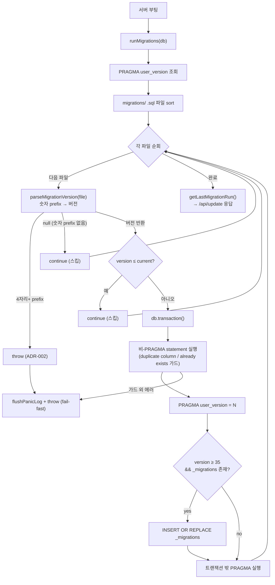

# Database Migrations — SSoT Guide

> claude-spyglass SQLite 스키마 마이그레이션 작성·운영 가이드.
> 본 문서는 마이그레이션 시스템의 **단일 진실 소스(SSoT)** 이며, 신규 마이그레이션
> 파일을 추가할 때 반드시 본 문서의 규칙을 따라야 한다.
>
> 관련 문서: [database.md](database.md) · [api-http.md](api-http.md) · [data-flow.md](data-flow.md)
>
> 코드·테스트 주석에 등장하는 ADR 라벨 (설계 결정 앵커):
> - ADR-001: `_migrations` 메타테이블 (히스토리·감사 SSoT)
> - ADR-002: 마이그레이션 번호 999 한도 (`MIGRATION_VERSION_LIMIT`)
> - ADR-003: 회귀 테스트 시나리오 1/2/3 (`migrator.test.ts`)
> - ADR-004: `/api/update` 응답 `migrationsApplied`
> - ADR-005: `/api/version` `dbUserVersion` + `latestMigrationFile`
> - ADR-006: 부팅 panic 로그 fsync + lag 감지
> - ADR-007: shallow clone 부팅 감지 (`isShallowRepository`)

---

## 1. 마이그레이션 시스템 개요

### 파일 위치

```
packages/storage/migrations/NNN-description.sql
```

- `NNN`: 3자리 zero-padded 버전 번호 (`001`, `002`, …, `053`, `055`, `056`, ...)
- `description`: kebab-case 짧은 설명 (`add-tool-detail`, `add-claude-events`)
- 파일명에서 앞 3자리가 `PRAGMA user_version` 값에 1:1 매핑된다.
- 디렉토리 번호에 gap이 있어도 (예: 040 다음 047) 동작에 영향 없음 — migrator는 정렬된
  파일을 순차 적용하며 `version <= currentVersion`만 스킵한다.

### 적용 흐름 (`packages/storage/src/migrator.ts`)

1. 서버 부팅 시 `runMigrations(db)` 호출
2. 현재 `PRAGMA user_version` 조회
3. `migrations/` 디렉토리 `.sql` 파일을 파일명 기준 sort
4. 각 파일에 대해:
   - `parseMigrationVersion(file)`로 앞 숫자 prefix 파싱 — **4자리 이상이면 즉시 throw (ADR-002)**, 숫자 prefix 없으면 null 반환 후 스킵
   - 현재 버전 이하면 스킵
   - **하나의 트랜잭션 안에서** 비-PRAGMA DDL/DML 실행 → `PRAGMA user_version = N` → (메타테이블 존재 시) `_migrations` INSERT OR REPLACE
   - 파일에 명시된 `PRAGMA` statement는 트랜잭션 **밖**에서 별도 실행
5. 모든 파일 처리 완료 후 `getLastMigrationRun()`이 `/api/update` 응답으로 회수됨



### 적용 판단 — 듀얼 SSoT

| 정보 | 위치 | 용도 |
|------|------|------|
| **현재 버전 빠른 조회** | `PRAGMA user_version` | 부팅 시 점프 적용 판단, 0.1ms 미만 |
| **히스토리 / 감사 / 진단** | `_migrations` 테이블 | `/api/update`·`/api/version` 응답, 적용 시각·소요·앱 버전 |

두 SSoT는 동일 트랜잭션 안에서 갱신되어 비정상 종료 시에도 자동 정합한다.

---

## 2. 절대 규칙

### 2.1 멱등성 (Idempotency)

**모든 statement는 멱등해야 한다.** 동일 마이그레이션이 두 번 실행되어도 안전하게 통과해야 한다.

#### DDL 멱등 패턴

```sql
-- ✅ 권장
CREATE TABLE IF NOT EXISTS foo (...);
CREATE INDEX IF NOT EXISTS idx_foo_bar ON foo(bar);
DROP TABLE IF EXISTS legacy_foo;

-- ❌ 금지 — 재실행 시 "table already exists" 에러
CREATE TABLE foo (...);
```

`ALTER TABLE ADD COLUMN`은 SQLite가 `IF NOT EXISTS`를 지원하지 않으므로, migrator가
`duplicate column name` 에러를 자동 가드한다. 다음 패턴을 그대로 사용하면 된다:

```sql
-- ✅ 권장 — migrator가 duplicate column 가드로 안전 통과
ALTER TABLE requests ADD COLUMN new_col TEXT;
```

#### DML 멱등 패턴

```sql
-- ✅ 권장
INSERT OR IGNORE INTO foo (id, name) VALUES (1, 'bar');
INSERT INTO foo (...) VALUES (...) ON CONFLICT(id) DO NOTHING;
INSERT INTO foo (...) VALUES (...) ON CONFLICT(id) DO UPDATE SET ...;

-- ❌ 금지 — 재실행 시 행 중복 또는 PK 충돌
INSERT INTO foo VALUES (1, 'bar');
```

#### `ON CONFLICT` 컬럼은 활성 제약과 일치해야 한다

`INSERT ... ON CONFLICT(...) DO ...` 패턴은 멱등해 보여도, ON CONFLICT 절에 나열한 컬럼
조합이 대상 테이블의 **활성 PRIMARY KEY 또는 UNIQUE 제약과 정확히 일치하지 않으면** SQLite가
충돌 대상을 찾지 못해 멱등성이 깨진다. 특히 backfill 마이그레이션에서 흔한 함정이다.

신규 backfill 작성 시:

1. 대상 테이블의 현재 PK/UNIQUE 제약을 `schema.ts` 또는 최신 정의 마이그레이션에서 먼저 확인
2. ON CONFLICT 절에 그 PK/UNIQUE 컬럼 조합을 정확히 적기 (예: `stats_hourly`는
   `UNIQUE(hour_ts, model, type, event_type)`)
3. 가능하면 `INSERT OR IGNORE` 단순 형태 선호

### 2.2 트랜잭션 경계

**파일 내부에서 BEGIN/COMMIT/SAVEPOINT 명령을 사용하지 마라.**

migrator는 각 파일을 다음 형태로 감싼다:

```typescript
db.transaction(() => {
  // 파일 내 비-PRAGMA statement 실행 (duplicate column / already exists 는 가드로 통과)
  for (const stmt of nonPragmaStmts) db.prepare(stmt).run();
  db.prepare(`PRAGMA user_version = ${version}`).run();
  // version >= 35 && _migrations 존재 시 INSERT OR REPLACE
})();
// PRAGMA statement 는 트랜잭션 밖에서 별도 실행
```

파일 내부에서 BEGIN을 호출하면 nested transaction이 되어 SQLite가 에러를 던지거나
의도와 다르게 자동 commit/rollback 된다.

```sql
-- ❌ 금지
BEGIN;
CREATE TABLE foo (...);
COMMIT;

-- ✅ 권장 — migrator가 트랜잭션을 감쌈
CREATE TABLE foo (...);
```

### 2.3 fail-fast 정책

마이그레이션 1개라도 실패하면 **즉시 throw**하고 후속 파일은 적용하지 않는다.

```typescript
// migrator.ts — try/catch가 에러를 외부로 전파
try {
  db.prepare(stmt).run();
} catch (e) {
  // duplicate column / already exists 외에는 throw
  throw e;
}
```

부팅 시 마이그레이션이 실패하면 `~/.spyglass/logs/server.log`에 panic 로그가
**fsync 강제**로 기록된 후 프로세스가 종료된다 (ADR-006). 후속 부팅에서
`PRAGMA user_version < 디렉토리 최신 버전`이 감지되면 `/api/version` 응답의
`migrationLag` 필드로 클라이언트에 노출된다.

### 2.4 999 한도 (ADR-002)

`packages/storage/src/migrator.ts`의 `parseMigrationVersion()` — 파일명 앞 숫자 prefix를
`/^(\d+)/`로 떼낸 뒤 3자리로 자른다. `MIGRATION_VERSION_LIMIT = 999` — **001~999만 허용**.

- `999-final.sql`까지 정상 동작
- 앞 숫자 prefix가 4자리 이상(`1000-xxx.sql` 등)이면 `parseMigrationVersion()`이 명확한 에러로 throw
- 999 도달 시점에 4자리 padding 확장을 별도 ADR로 결정 (yagni — 현재 056번)

```typescript
// ❌ 금지 — silent overflow 차단됨
// "1000-foo.sql" → parseMigrationVersion()이 throw

// ✅ 권장 — 999 도달 직전에 별도 ADR로 4자리 확장 결정
```

---

## 3. 신규 마이그레이션 추가 절차

### 3.1 파일 작성

```bash
# 1. 현재 최신 버전 확인
ls packages/storage/migrations/ | tail -3
# → 053-kuzu-outbox-trigger-hardening.sql
# → 055-kuzu-outbox-dlq.sql
# → 056-payload-encryption.sql
# (디렉토리에 gap 존재: 041~046·054 결번 — 동작 무관, 다음 번호는 항상 max+1)

# 2. 새 파일 생성 — 다음 번호 사용 (현재 max 056 → 057)
touch packages/storage/migrations/057-your-feature.sql
```

### 3.2 SQL 작성 템플릿

```sql
-- =============================================================================
-- 057 — <기능명> (관련 feature/ADR 참조)
-- =============================================================================
-- 배경:
--   <왜 이 마이그레이션이 필요한가>
--
-- 멱등성:
--   <어떻게 멱등성을 보장하는가 — IF NOT EXISTS / INSERT OR IGNORE / ON CONFLICT>
--
-- 트랜잭션:
--   본 파일은 migrator.transaction() 안에서 실행됨 — 파일 내부 BEGIN/COMMIT 금지.
--
-- @see <관련 코드 파일 — 예: packages/storage/src/queries/...ts>
-- =============================================================================

-- 멱등 DDL 예시
CREATE TABLE IF NOT EXISTS foo (
  id INTEGER PRIMARY KEY,
  ...
);

CREATE INDEX IF NOT EXISTS idx_foo_bar ON foo(bar);

-- 멱등 DML 예시 (필요한 경우)
INSERT OR IGNORE INTO foo (id, name) VALUES (1, 'default');
```

### 3.3 코드 반영

새 컬럼/테이블 추가 시:

1. **마이그레이션 파일** — 위 템플릿대로 작성
2. **쿼리 함수** — `packages/storage/src/queries/*.ts`에 CRUD 추가
3. **`index.ts` re-export** — `packages/storage/src/index.ts`에 신규 export 추가
4. **타입 정의** — `CollectPayload` 인터페이스, `createRequest()` 시그니처 등
5. **훅 스크립트** — 신규 필드 수집 로직 추가 (`hooks/spyglass-collect.sh`)
6. **`/collect` 엔드포인트** — 필드 전달 로직 추가
7. **API 라우터** — 노출 필요 시 `packages/server/src/routes/*.ts` 추가

### 3.4 회귀 테스트 의무

마이그레이션을 추가했다면 다음을 확인:

- [ ] `bun test packages/storage/src/__tests__/migrator.test.ts` 통과
- [ ] 시나리오 1 (빈 DB → max 일괄 점프): 새 파일도 자동 적용, `_migrations` 행 수 = legacy + 적용된 v35+ 파일 수
- [ ] 시나리오 2 (매 버전 N-1 → N 단일 점프): 적용 파일 순서가 디렉토리 sort와 일치, 재호출 시 no-op 멱등
- [ ] 시나리오 3 (비정상 종료 시뮬레이션): PRAGMA 강제 후퇴 후 재실행 시 duplicate column/already exists 가드로 안전 복구

도메인 별 추가 회귀가 필요한 경우 별도 `*.test.ts`를 작성한다 (예: `rebuild-stats.test.ts`).

---

## 4. 메타테이블 `_migrations` 활용 (ADR-001)

### 스키마

```sql
CREATE TABLE _migrations (
  version     INTEGER PRIMARY KEY,
  filename    TEXT NOT NULL,
  applied_at  INTEGER NOT NULL,  -- unix epoch seconds
  app_version TEXT,              -- 적용 시점 spyglass 앱 버전
  duration_ms INTEGER            -- 적용 소요 시간 (ms)
);
```

### 진단 쿼리 예시

```sql
-- 최근 5개 적용 마이그레이션
SELECT version, filename, datetime(applied_at, 'unixepoch') AS applied, duration_ms
FROM _migrations
ORDER BY version DESC LIMIT 5;

-- 가장 느렸던 마이그레이션 (성능 회귀 추적)
SELECT version, filename, duration_ms
FROM _migrations
WHERE duration_ms IS NOT NULL
ORDER BY duration_ms DESC LIMIT 10;

-- 특정 앱 버전에서 적용된 마이그레이션
SELECT version, filename FROM _migrations WHERE app_version = '1.0.3';
```

### API 노출

| 엔드포인트 | 필드 | 회수 정보 |
|------------|------|-----------|
| `GET /api/version` | `dbUserVersion`, `latestMigrationFile`, `migrationLag` | 현재 적용 상태 + lag 감지 |
| `POST /api/update` | `migrationsApplied: { from, to, files, durationMs }` | 본 부팅에서 적용된 마이그레이션 요약 |

---

## 5. 운영 시나리오

### 5.1 자동 업데이트 후 검증

```bash
# 업데이트 호출
curl -X POST http://localhost:8765/api/update

# 재기동 대기 (1.5s) 후 검증
sleep 2 && curl http://localhost:8765/api/version
# → dbUserVersion: 56, latestMigrationFile: "056-payload-encryption.sql"
```

### 5.2 마이그레이션 lag 감지

부팅 마이그레이션이 panic으로 종료된 경우, 후속 부팅에서 `/api/version`이
다음을 반환한다:

`migrationLag`는 `dbUserVersion`이 디렉토리 최신 파일 번호보다 작을 때만 포함되며,
`current`(현재 적용 버전)와 `latestFile`(디렉토리 최신 파일명) 두 필드를 갖는다.

```json
{
  "data": {
    "dbUserVersion": 53,
    "latestMigrationFile": "053-kuzu-outbox-trigger-hardening.sql",
    "migrationLag": {
      "current": 53,
      "latestFile": "056-payload-encryption.sql"
    }
  }
}
```

조치:
1. `~/.spyglass/logs/server.log`에서 panic 원인 확인
2. 문제 마이그레이션 수정
3. 서버 재시작 — migrator가 자동으로 lag 따라잡기

### 5.3 shallow clone 경고

`git clone --depth 1`로 설치된 환경은 `git pull --ff-only`가 실패할 수 있다.
부팅 시 `/api/version` 응답에 `isShallowRepository: true`가 포함되며 dashboard에
경고가 노출된다.

조치:
```bash
git fetch --unshallow
```

---

## 6. 자주 묻는 질문

### Q. 컬럼 추가 시 DEFAULT 값을 꼭 지정해야 하나요?

**예.** 기존 데이터를 보호하기 위해 모든 신규 컬럼에 `DEFAULT` 값을 지정한다.

```sql
ALTER TABLE requests ADD COLUMN new_flag INTEGER DEFAULT 0;
ALTER TABLE requests ADD COLUMN new_text TEXT DEFAULT NULL;
```

### Q. 마이그레이션 롤백은 어떻게 하나요?

**롤백은 지원하지 않는다.** 순방향 전용 마이그레이션 정책 — `PRAGMA user_version` 후행
감소는 데이터 일관성을 깰 수 있어 미지원. 문제 발생 시:

1. 새 마이그레이션을 추가해 상태를 복구 (forward fix)
2. 또는 DB 백업에서 복원 후 재배포

### Q. 인덱스는 어떻게 추가하나요?

```sql
-- ✅ 단순 인덱스
CREATE INDEX IF NOT EXISTS idx_requests_session ON requests(session_id);

-- ✅ 복합 인덱스 + 정렬 방향
CREATE INDEX IF NOT EXISTS idx_requests_session_ts
  ON requests(session_id, timestamp DESC);

-- ✅ partial index (특정 조건의 행만 인덱싱)
CREATE INDEX IF NOT EXISTS idx_proxy_null_size
  ON proxy_requests(timestamp DESC)
  WHERE system_byte_size IS NULL;
```

### Q. 트리거는 어떻게 작성하나요?

`BEGIN ... END;` 블록 — migrator의 `splitSqlStatements()`가 `BEGIN…END` 블록을
placeholder로 치환해 트리거 내부 세미콜론을 보존한 뒤 split하고 복원한다.

실제 사용 예 — `031-stats-duration-avg-fix.sql`의 `trg_stats_after_insert` (requests INSERT 시
`stats_hourly` 버킷 UPSERT). `WHEN` 절로 `pre_tool` 행을 제외하고,
`ON CONFLICT(hour_ts, model, type, event_type)` DO UPDATE로 누적한다:

```sql
CREATE TRIGGER IF NOT EXISTS trg_stats_after_insert
AFTER INSERT ON requests
WHEN NEW.type IS NOT NULL
  AND (NEW.event_type IS NULL OR NEW.event_type != 'pre_tool')
BEGIN
  INSERT INTO stats_hourly (
    hour_ts, model, type, event_type, request_count,
    duration_ms_sum, duration_ms_count, ...
  ) VALUES (
    (NEW.timestamp / 1000 / 3600) * 3600, COALESCE(NEW.model, ''), NEW.type,
    COALESCE(NEW.event_type, ''), 1,
    CASE WHEN NEW.duration_ms IS NOT NULL THEN NEW.duration_ms ELSE 0 END,
    CASE WHEN NEW.duration_ms IS NOT NULL THEN 1 ELSE 0 END, ...
  )
  ON CONFLICT(hour_ts, model, type, event_type) DO UPDATE SET
    request_count = request_count + 1,
    ...;
END;
```

현재 활성 트리거 (각 트리거의 최종 정의 파일):

| 트리거 | 정의 파일 | 대상 |
|--------|-----------|------|
| `trg_stats_after_insert` / `trg_stats_after_update` | `031-stats-duration-avg-fix.sql` | `requests` → `stats_hourly` 집계 |
| `trg_proxy_stats_after_insert` | `032-add-stats-proxy-hourly.sql` | `proxy_requests` → `stats_proxy_hourly` 집계 |
| `trg_requests_to_kuzu_outbox` / `trg_sessions_to_kuzu_outbox` / `trg_requests_pre_to_tool_outbox` | `053-kuzu-outbox-trigger-hardening.sql` | `requests`·`sessions` → `kuzu_outbox` (INSERT OR IGNORE + `NEW.id IS NOT NULL` 가드) |

### 055/056 운영 참고

- **055 (`kuzu_outbox-dlq`)**: 기존 outbox 행은 `attempts=0`, `dead=0`, `last_error=NULL`로 초기화되어 종전과 동일하게 처리됩니다. `idx_kuzu_outbox_live` 부분 인덱스는 `dead=0` 행만 스캔 대상으로 하여 DLQ 격리분이 폴링에 영향을 주지 않습니다.
- **056 (`payload-encryption`)**: `ALTER TABLE ADD COLUMN`만 수행하므로 기존 데이터 무손실. `requests.payload_algo`의 죽은 DEFAULT `'zstd'`를 `NULL`로 정리하는 `UPDATE`가 포함되나, 이는 평문 마커를 올바르게 맞추는 메타데이터 수정이며 `payload` 본문은 불변. 암호화는 `SPYGLASS_ENCRYPTION` 옵트인 시에만 활성화되므로 OFF 상태면 동작 변화 없음.

### Q. WAL 모드 PRAGMA를 파일에 넣어도 되나요?

**예 — 트랜잭션 밖에서 실행된다.** migrator는 `PRAGMA`로 시작하는 statement를
트랜잭션 밖에서 별도 실행한다. 다만 일반적으로 WAL 설정은 `connection.ts`의
`enableWalMode()`에서 처리하므로 마이그레이션 파일에는 데이터 정합 관련 PRAGMA만
포함하는 것이 일반적이다 (`PRAGMA wal_checkpoint(TRUNCATE)` 등).

---

## 7. 관련 문서

- 스키마 전체 구조: `packages/storage/src/schema.ts`
- 마이그레이션 실행 로직: `packages/storage/src/migrator.ts`
- 회귀 테스트: `packages/storage/src/__tests__/migrator.test.ts`
- API 응답 스펙: [api-http.md](api-http.md)
- DB 일반: [database.md](database.md)
- 데이터 흐름: [data-flow.md](data-flow.md)
