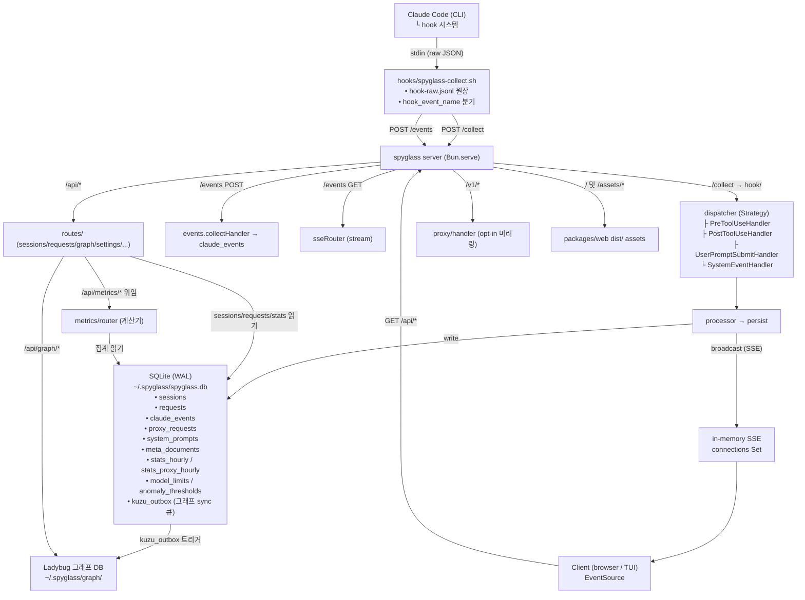
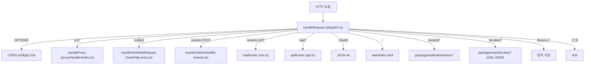
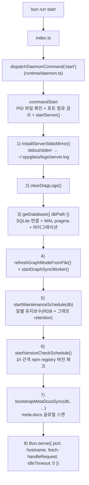
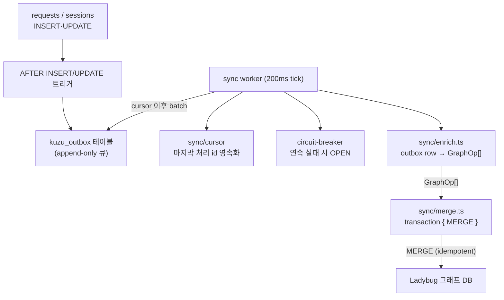

# 개요 및 시스템 다이어그램

> **TL;DR** — `Claude Code hook → spyglass-collect.sh → POST /collect → SQLite → SSE → web/TUI`

---

## 문서 기준

| 항목 | 값 |
|------|-----|
| 시각 | 2026-06-06 16:44:03 KST |
| 커밋 | `4ea9686` |
| 태그 | `v4.4.0` |
| 마이그레이션 | `057-preview-encryption.sql` (`PRAGMA user_version = 57`) |

---

## 1. 목적

claude-spyglass(이하 **spyglass**)는 Claude Code의 **로컬 실행 컨텍스트**를 실시간으로 관찰하는 관측(observability) 도구입니다.

수집의 시작점은 **Claude Code Hook 시스템**(`UserPromptSubmit`, `PreToolUse`, `PostToolUse`, `SessionStart`, `Stop`, `SessionEnd` 등)입니다. spyglass는 이를 **로컬 HTTP 서버**(`packages/server`)가 받아 **SQLite**(`packages/storage`)에 영속화하고, **SSE**를 통해 실시간으로 **웹 대시보드**(`packages/web`)와 **터미널 UI**(`packages/tui`)에 푸시합니다.

### 핵심 가치

| 가치 | 구현 |
|------|------|
| **로컬 우선** | `~/.spyglass/spyglass.db`, 로그, PID 파일 모두 로컬. 외부 네트워크 의존 0 |
| **실시간 시각화** | SSE(`/events`) — 새 요청 도착 시 즉시 푸시 |
| **무손실 수집** | 훅 raw 페이로드는 `~/.spyglass/logs/hook-raw.jsonl`에 원장 기록 후 서버 전달 |
| **카탈로그형 분석** | Behavior Definitions(SKILL.md / agents.md / CLAUDE.md / commands) 메타 문서 카탈로그를 별도 테이블로 정규화 |
| **그래프 시각화** | SQLite SSoT → `kuzu_outbox` 큐 → Ladybug 그래프 DB로 incremental sync. 메타 문서 통합 Flow(`/api/graph/unified-flow`)를 별도 read-optimized 투영으로 제공 |
| **사후 감사** | 마이그레이션 누적으로 모든 분석 컬럼이 영속화 |

---

## 2. 시스템 아키텍처

### 2.1 데이터 흐름 — 큰 그림



### 2.2 HTTP 디스패처 진입점

`packages/server/src/runtime/dispatch.ts`의 `handleRequest`가 단일 진입점이며, 경로 prefix별로 도메인 핸들러에 위임합니다.



### 2.3 서버 라이프사이클



### 2.4 그래프 sync 채널

`packages/storage-graph`는 SQLite를 SSoT로 두고 outbox 패턴으로 Ladybug에 incremental sync합니다.



- 모드 게이트: `SPYGLASS_GRAPH_MODE='off'`이면 tick은 즉시 반환하고 outbox만 누적됩니다.
- 회로 차단기: 연속 실패 시 OPEN되어 그래프 호출을 잠시 멈춥니다. RDB·SSE는 무영향입니다.
- retention: `deleteOldGraphData(cutoff)`가 Event/ToolCall/Turn/Session 노드만 `DETACH DELETE`(MetaDocument/Agent 보존). 그래프 폴더 자체를 삭제하는 경로는 없습니다.

---

## 3. 설계 원칙

### 단일 책임(SRP)

변경 이유별로 파일이 분리됩니다.

| 변경 이유 | 파일 |
|-----------|------|
| 부팅 절차 | `runtime/lifecycle.ts` |
| 데몬 명령 | `runtime/daemon.ts` |
| 경로 prefix | `runtime/dispatch.ts` |
| API 라우팅 | `api.ts` (fan-out 디스패처만) |
| 도메인별 라우터 | `routes/*.ts` |

### Strategy 패턴 — Hook handler 확장

`packages/server/src/hook/dispatcher.ts`:

```ts
const HANDLERS: HookEventHandler[] = [
  new PreToolUseHandler(),
  new PostToolUseHandler(),
  new UserPromptSubmitHandler(),
];
```

새 hook event 추가는 `handlers/<new-event>.handler.ts` 작성 후 `HANDLERS` 배열에 1줄 추가로 끝납니다.

### Single Source of Truth (SSoT)

| 데이터 | SSoT 위치 |
|--------|-----------|
| Request 타입 contract | `packages/types/src/request.ts` |
| 활성 요청 필터 SQL | `packages/storage/src/queries/request/read.ts` |
| `live_state` 산출 식 | `packages/storage/src/queries/session/_shared.ts` |
| Retention cutoff | `packages/storage/src/runtime/retention.ts` |
| 통합 flow 쿼리 | `packages/storage-graph/src/queries/unified-flow.ts` |
| SSE payload 빌더 | `packages/server/src/sse.ts:buildNewRequestEvent` |

### 캡슐화

- **동일 판단 로직은 한 곳에만** — 호출 측에서 `boolean`으로 재계산하지 말고, raw data를 함수에 전달하고 판단은 함수 내부에서 처리합니다.
- **기존 렌더링 함수를 반드시 재사용** — 아이콘·배지·행(row) 등 UI 요소는 기존 함수를 거치지 않고 직접 HTML/JSX 작성을 금지합니다.

---

## 4. 기능 분포

| 기능 | 위치 |
|------|------|
| 수집 | `hooks/spyglass-collect.sh` + `packages/server/src/hook/` |
| 영속화 | `packages/storage/` (SQLite + WAL) |
| HTTP API | `packages/server/src/api.ts` + `routes/*` |
| 실시간 | `packages/server/src/sse.ts` |
| 프록시(선택) | `packages/server/src/proxy/` — Anthropic API HTTP 레벨 미러링 |
| 메타 문서 | `packages/server/src/meta-docs/` |
| 그래프 | `packages/storage-graph/` + `packages/server/src/routes/graph.ts` |
| 설정 | `packages/server/src/routes/settings.ts` |
| 웹 대시보드 | `packages/web/` (React 18 + Vite) |
| 터미널 UI | `packages/tui/` (Ink + React) |
| 데스크톱 | `packages/desktop/` (Electron 래퍼) |

---

> **문서 기준**
> - 시각: 2026-06-06 16:44:03 KST
> - 커밋: `4ea9686`
> - 태그: `v4.4.0`
