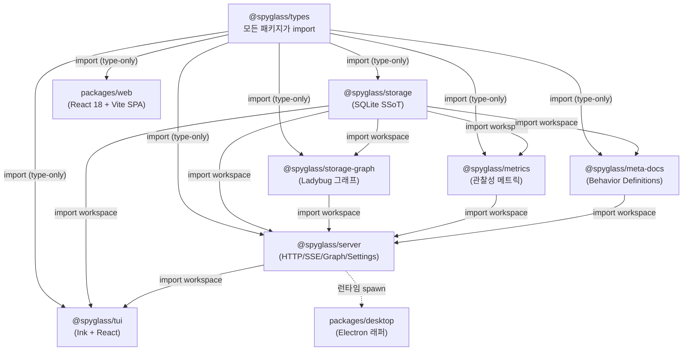

# 패키지 구조

> Bun workspaces(`packages/*`) 기반 모노레포. 의존은 단방향으로만 흐릅니다.

---

## 문서 기준

| 항목 | 값 |
|------|-----|
| 시각 | 2026-06-06 16:44:03 KST |
| 커밋 | `4ea9686` |
| 태그 | `v4.4.0` |

---

## 1. 디렉토리 구조

```
claude-spyglass/
├── package.json                       — 워크스페이스 루트, npm scripts, dependencies
├── bun.lock                            — 워크스페이스 잠금 파일
├── tsconfig.json                       — 루트 TS 설정 (path 별칭 없음)
├── settings.json                       — Claude Code hook 등록
├── docker-compose.yml / Dockerfile     — (선택) 컨테이너 실행
├── hooks/
│   └── spyglass-collect.sh             — Claude Code 훅 수집 스크립트
├── scripts/                            — 빌드/배포 보조 스크립트
├── packages/
│   ├── types/                          — 공통 타입 정의 (런타임 0줄)
│   ├── storage/                        — SQLite 스키마 + 쿼리 + 마이그레이션
│   ├── storage-graph/                  — Ladybug 그래프 DB + outbox sync
│   ├── metrics/                        — 관찰성 메트릭 라우터 + 계산기
│   ├── meta-docs/                      — Behavior Definitions 스캐너 + 동기화
│   ├── server/                         — Bun HTTP 서버 (API + SSE + Hook + Proxy)
│   ├── tui/                            — Ink 기반 터미널 UI
│   ├── web/                            — React 18 + Vite 웹 대시보드
│   └── desktop/                        — Electron 데스크톱 래퍼
└── docs/                               — 운영/스키마/아키텍처 문서
```

---

## 2. 패키지 의존 그래프



핵심 관찰: **상위(`types`)는 누구에게도 의존하지 않고**, 의존은 항상 한 방향(`types → storage → storage-graph → server → tui`)으로만 흐릅니다. 양 방향 의존성은 금지됩니다.

---

## 3. 패키지별 책임

| 패키지 | 책임 | 런타임 | 주요 디렉토리 |
|--------|------|--------|---------------|
| `@spyglass/types` | 서버/TUI/웹이 공유하는 TS 타입 contract. **런타임 0줄.** | TS 선언만 | `src/{request,session,turn,i18n}.ts` |
| `@spyglass/storage` | SQLite 연결, 스키마, 마이그레이션, 모든 SQL 쿼리, retention SSoT. | Bun/Node | `src/{connection,schema,migrator,queries/*,runtime/retention}` |
| `@spyglass/storage-graph` | Ladybug 그래프 client, outbox sync worker, unified-flow 쿼리, 회로 차단기, 그래프 retention. | Bun + Ladybug | `src/{client,queries/*,sync/*,runtime/*,schema/*}` |
| `@spyglass/metrics` | 관찰성 메트릭 라우터 + 계산기. 11개 `/api/metrics/*` 엔드포인트. | Bun | `src/{router.ts,calculators/*,tool-category.ts}` |
| `@spyglass/meta-docs` | Behavior Definitions 스캐너, 리졸버, 동기화. | Bun/Node | `src/{scanner.ts,resolver.ts,synchronizer.ts,known-cwds.ts}` |
| `@spyglass/server` | HTTP 서버 + SSE + Hook 수집 + Proxy + Graph + Settings. | Bun | `src/{api,sse,hook,proxy,routes,runtime,settings}` |
| `@spyglass/tui` | Ink 기반 터미널 UI. SSE 클라이언트, KPI strip, 사이드바, screens. | React 18 + Ink 5 | `src/{app.tsx,components,screens,hooks,stores}` |
| `packages/web` | React 18 + Vite 웹 대시보드. Zustand 상태관리, React Router v6, react-i18next. | 브라우저 | `src/{main.tsx,app/,features/,components/}` |
| `packages/desktop` | 서버를 띄우고 대시보드를 감싸는 Electron 래퍼. | Electron | `main/`, `preload/` |

---

## 4. 주요 함수 진입점

| 영역 | 진입 파일 |
|------|-----------|
| 전체 서버 부팅 | `packages/server/src/index.ts`, `runtime/lifecycle.ts` |
| HTTP 라우팅 | `packages/server/src/runtime/dispatch.ts` |
| API fan-out | `packages/server/src/api.ts` |
| Hook 수집 | `packages/server/src/hook/dispatcher.ts` |
| Proxy | `packages/server/src/proxy/handler/index.ts` |
| SSE | `packages/server/src/sse.ts` |
| 메트릭 | `packages/metrics/src/router.ts` |
| Meta-docs | `packages/meta-docs/src/synchronizer.ts` |
| Graph 라우터 | `packages/server/src/routes/graph.ts` |
| 통합 flow 쿼리 | `packages/storage-graph/src/queries/unified-flow.ts` |
| 그래프 sync worker | `packages/storage-graph/src/sync/worker.ts` |
| DB 연결 | `packages/storage/src/connection.ts` |
| 마이그레이션 | `packages/storage/src/migrator.ts` |
| Retention SSoT | `packages/storage/src/runtime/retention.ts` |
| 공통 타입 | `packages/types/src/request.ts` |
| TUI 루트 | `packages/tui/src/app.tsx` |
| 웹 진입점 | `packages/web/src/main.tsx` |
| Hook 수집 스크립트 | `hooks/spyglass-collect.sh` |

---

> **문서 기준**
> - 시각: 2026-06-06 16:44:03 KST
> - 커밋: `4ea9686`
> - 태그: `v4.4.0`
