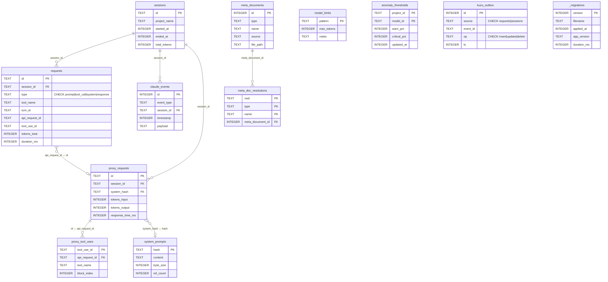

# 데이터베이스 스키마 문서

Claude Spyglass SQLite 데이터베이스 스키마 설명서입니다.

> 연관 문서: [데이터베이스 가이드](../database.md) · [마이그레이션 가이드](../migrations.md) · [데이터 흐름](../data-flow.md)

## 개요

| 항목 | 내용 |
|------|------|
| DB 파일 | `~/.spyglass/spyglass.db` (`SPGLASS_DB_PATH` 로 재정의 가능 — `Y` 가 빠진 표기가 실제 키) |
| 엔진 | SQLite (WAL 모드, Bun `bun:sqlite`) |
| 스키마 출처 | `packages/storage/migrations/NNN-*.sql` (마이그레이터가 파일명 순으로 적용) |
| 테이블 수 | 15개 |
| 뷰 수 | 3개 |

> DDL 의 단일 출처는 `packages/storage/migrations/` 디렉토리다. `migrator.ts` 가 `.sql` 파일을 파일명 순으로 스캔·적용하고 `_migrations` 메타테이블에 기록한다. `packages/storage/src/schema.ts` 는 런타임 타입(`Session`, `Request`)과 `WAL_MODE_PRAGMAS` 만 제공한다.

## 테이블 목록

| 테이블명 | 설명 | 문서 |
|----------|------|------|
| `sessions` | 세션 단위 정보 | [sessions.md](sessions.md) |
| `requests` | 훅 기반 요청/도구 호출 (PreToolUse, PostToolUse, UserPromptSubmit, Stop) | [requests.md](requests.md) |
| `claude_events` | 원시 훅 이벤트 (SessionStart/Stop/SessionEnd 등) | [claude-events.md](claude-events.md) |
| `proxy_requests` | API 프록시 캡처 (`/v1/*` 인터셉트) | [proxy-requests.md](proxy-requests.md) |
| `proxy_tool_uses` | proxy SSE에서 추출한 tool_use_id ↔ api_request_id 매핑 | [proxy-requests.md](proxy-requests.md) |
| `system_prompts` | 시스템 프롬프트 정규화 dedup | [system-prompts.md](system-prompts.md) |
| `meta_documents` | agent/skill/command 카탈로그 | [meta-documents.md](meta-documents.md) |
| `meta_doc_resolutions` | (cwd, type, name) → meta_document_id 매핑 | [meta-documents.md](meta-documents.md) |
| `model_limits` | 모델 패턴별 max_tokens limit | [model-limits.md](model-limits.md) |
| `metadata` | 서버 운영용 key-value 저장소 | — |
| `stats_hourly` | hook 요청 사전 집계 (시간 + event_type 차원) | — |
| `stats_proxy_hourly` | proxy 요청 사전 집계 (시간 단위) | — |
| `anomaly_thresholds` | bloated-sys / agent-spike 임계값 SSoT — (project_id, model_id) 기준 warn_pct / critical_pct | — |
| `kuzu_outbox` | 그래프(Ladybug) sync 대기열 — requests/sessions 변경을 트리거로 적재 | — |
| `_migrations` | 마이그레이션 적용 히스토리 (version, filename, applied_at, app_version, duration_ms) | — |

## 뷰 목록

| 뷰명 | 정의 마이그레이션 | 설명 |
|------|------------------|------|
| `correlated_requests` | `018-cleanup-and-correlation.sql` | requests 의 prompt ↔ tool_call 상관 매칭 뷰 |
| `v_meta_doc_usage` | `024-meta-documents.sql` | meta_documents 사용량 집계 뷰 |
| `v_flow_active_rows` | `040-flow-active-rows-view.sql` | flow 차트용 활성 행 뷰 |

## ERD

> ERD 는 핵심 컬럼과 관계만 표현한 단순화 다이어그램이다. 전체 컬럼은 각 테이블 문서 및 마이그레이션 SQL 을 참조한다.



## 설정 (PRAGMA)

→ SSoT 는 `packages/storage/src/schema.ts: WAL_MODE_PRAGMAS` (`connection.ts` 에서 연결 시 적용)

```sql
PRAGMA journal_mode = WAL;
PRAGMA busy_timeout = 5000;
PRAGMA synchronous = NORMAL;
PRAGMA cache_size = -64000;             -- 64MB
PRAGMA foreign_keys = ON;
PRAGMA journal_size_limit = 104857600;  -- 100MB WAL size limit
PRAGMA wal_autocheckpoint = 200;        -- 약 800KB마다 checkpoint
```

## 주요 쿼리 패턴

### 활성 세션 조회
```sql
SELECT * FROM sessions WHERE ended_at IS NULL;
```

### 세션별 요청 통계
```sql
SELECT
  s.id,
  s.project_name,
  COUNT(r.id) AS request_count,
  SUM(r.tokens_total) AS total_tokens
FROM sessions s
LEFT JOIN requests r ON s.id = r.session_id
GROUP BY s.id;
```

### 도구별 사용 통계
```sql
SELECT
  tool_name,
  COUNT(*) AS count,
  SUM(tokens_total) AS total_tokens,
  AVG(duration_ms) AS avg_duration
FROM requests
WHERE tool_name IS NOT NULL
GROUP BY tool_name
ORDER BY count DESC;
```

### 턴별 토큰 사용량
```sql
SELECT
  turn_id,
  COUNT(*) AS requests,
  SUM(tokens_total) AS tokens,
  GROUP_CONCAT(DISTINCT tool_name) AS tools
FROM requests
WHERE session_id = ?
GROUP BY turn_id
ORDER BY turn_id;
```

### 시스템 프롬프트별 API 요청 수
```sql
SELECT
  sp.hash,
  sp.byte_size,
  sp.ref_count,
  COUNT(pr.id) AS request_count
FROM system_prompts sp
LEFT JOIN proxy_requests pr ON sp.hash = pr.system_hash
GROUP BY sp.hash
ORDER BY request_count DESC;
```

### hook ↔ proxy 교차 연결 (api_request_id 기준)
```sql
SELECT
  r.id       AS hook_request_id,
  r.tool_use_id,
  pr.id      AS proxy_request_id,
  pr.tokens_input,
  pr.tokens_output,
  pr.response_time_ms
FROM requests r
JOIN proxy_requests pr ON r.api_request_id = pr.id
WHERE r.session_id = ?;
```

## 파일 위치

- 스키마 DDL (SSoT): `packages/storage/migrations/NNN-*.sql`
- 마이그레이터: `packages/storage/src/migrator.ts`
- 런타임 타입 + PRAGMA: `packages/storage/src/schema.ts`
- 연결 관리: `packages/storage/src/connection.ts`
- 쿼리 함수: `packages/storage/src/queries/*.ts`
