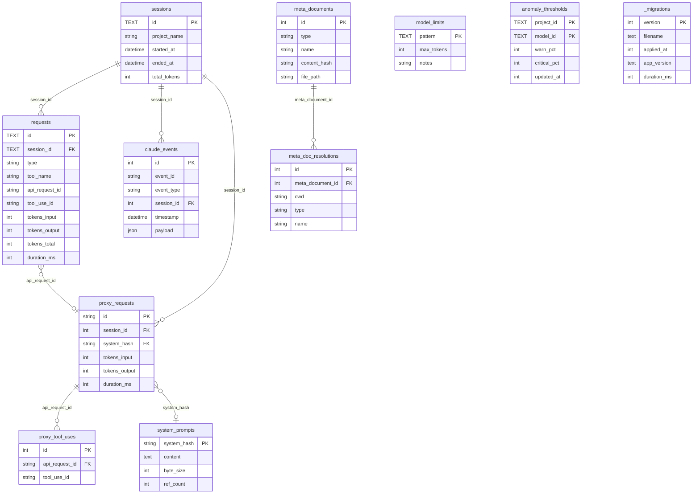

# 데이터베이스 스키마 문서

Claude Spyglass SQLite 데이터베이스 스키마 설명서입니다.

## 개요

| 항목 | 내용 |
|------|------|
| DB 파일 | `~/.spyglass/spyglass.db` |
| 엔진 | SQLite (WAL 모드) |
| 테이블 수 | 14개 |

## 테이블 목록

| 테이블명 | 설명 | 문서 |
|----------|------|------|
| `sessions` | 세션 단위 정보 | [sessions.md](sessions.md) |
| `requests` | 훅 기반 요청/도구 호출 (PreToolUse, PostToolUse, UserPromptSubmit, Stop) | [requests.md](requests.md) |
| `claude_events` | 원시 훅 이벤트 (SessionStart/Stop/SessionEnd 등) | [claude-events.md](claude-events.md) |
| `proxy_requests` | API 프록시 캡처 (/v1/* 인터셉트) | [proxy-requests.md](proxy-requests.md) |
| `proxy_tool_uses` | proxy SSE에서 추출한 tool_use_id ↔ api_request_id 매핑 | [proxy-requests.md](proxy-requests.md) |
| `system_prompts` | 시스템 프롬프트 정규화 dedup | [system-prompts.md](system-prompts.md) |
| `meta_documents` | agents/skills/commands/CLAUDE.md 카탈로그 | [meta-documents.md](meta-documents.md) |
| `meta_doc_resolutions` | cwd별 (type, name) → meta_document_id 매핑 | [meta-documents.md](meta-documents.md) |
| `model_limits` | Claude 모델별 context/output limit | [model-limits.md](model-limits.md) |
| `metadata` | 서버 운영용 key-value 저장소 | — |
| `stats_hourly` | hook 요청 사전 집계 (시간 단위) | — |
| `stats_proxy_hourly` | proxy 요청 사전 집계 (시간 단위) | — |
| `anomaly_thresholds` | bloated-sys / agent-spike 임계값 SSoT (project_id, model_id) 기준 warn_pct / critical_pct | — |
| `_migrations` | 마이그레이션 적용 히스토리 시스템 메타 (filename, applied_at, app_version, duration_ms) | — |

## ERD



## 설정 (PRAGMA)

→ 실제 값은 `packages/storage/src/schema.ts: WAL_MODE_PRAGMAS` 참조

```sql
PRAGMA journal_mode = WAL;
PRAGMA busy_timeout = 5000;
PRAGMA synchronous = NORMAL;
PRAGMA cache_size = -64000;       -- 64MB
PRAGMA foreign_keys = ON;
PRAGMA journal_size_limit = 104857600;  -- 100MB WAL size limit
PRAGMA wal_autocheckpoint = 200;  -- 약 800KB마다 checkpoint
```

## 주요 쿼리 패턴

### 활성 세션 조회
```sql
SELECT * FROM sessions WHERE ended_at IS NULL;
```

### 세션별 요청 통계
```sql
SELECT
  s.id,
  s.project_name,
  COUNT(r.id) AS request_count,
  SUM(r.tokens_total) AS total_tokens
FROM sessions s
LEFT JOIN requests r ON s.id = r.session_id
GROUP BY s.id;
```

### 도구별 사용 통계
```sql
SELECT
  tool_name,
  COUNT(*) AS count,
  SUM(tokens_total) AS total_tokens,
  AVG(duration_ms) AS avg_duration
FROM requests
WHERE tool_name IS NOT NULL
GROUP BY tool_name
ORDER BY count DESC;
```

### 턴별 토큰 사용량
```sql
SELECT
  turn_id,
  COUNT(*) AS requests,
  SUM(tokens_total) AS tokens,
  GROUP_CONCAT(DISTINCT tool_name) AS tools
FROM requests
WHERE session_id = ?
GROUP BY turn_id
ORDER BY turn_id;
```

### 시스템 프롬프트별 API 요청 수
```sql
SELECT
  sp.system_hash,
  sp.byte_size,
  sp.ref_count,
  COUNT(pr.id) AS request_count
FROM system_prompts sp
LEFT JOIN proxy_requests pr ON sp.system_hash = pr.system_hash
GROUP BY sp.system_hash
ORDER BY request_count DESC;
```

### hook ↔ proxy 교차 연결 (api_request_id 기준)
```sql
SELECT
  r.id       AS hook_request_id,
  r.tool_use_id,
  pr.id      AS proxy_request_id,
  pr.tokens_input,
  pr.tokens_output,
  pr.duration_ms
FROM requests r
JOIN proxy_requests pr ON r.api_request_id = pr.id
WHERE r.session_id = ?;
```

## 파일 위치

- 스키마 정의: `packages/storage/src/schema.ts`
- 연결 관리: `packages/storage/src/connection.ts`
- 쿼리 함수: `packages/storage/src/queries/*.ts`
