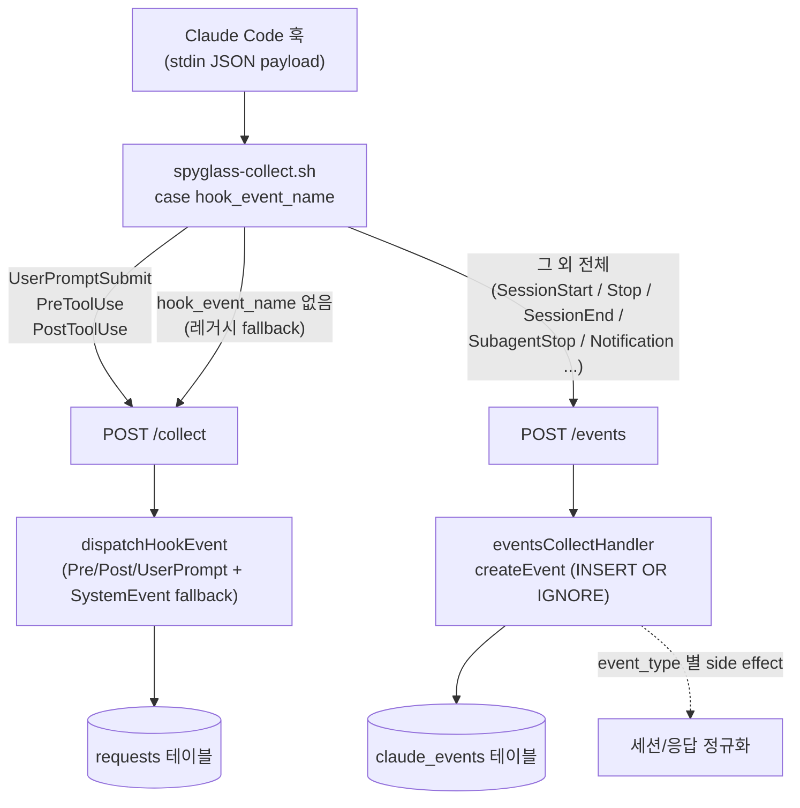

# claude_events 테이블

Raw 훅 이벤트 페이로드를 그대로 저장하는 append-only 테이블입니다.

## 개요

| 항목 | 내용 |
|------|------|
| 목적 | Claude Code 훅의 원본 페이로드 보관 + 세션 라이프사이클 이벤트 정규화 |
| 쓰기 경로 | `POST /events` 엔드포인트 (`packages/server/src/events.ts`) |
| 쓰기 패턴 | `INSERT OR IGNORE` (`event_id` UNIQUE 충돌 시 무시 → 사실상 append-only) |
| 생성 마이그레이션 | `006-add-claude-events.sql` |
| 컬럼 확장 마이그레이션 | `011-token-confidence-and-event-columns.sql` |

## 컬럼 정의

| 컬럼명 | 타입 | 제약조건 | 설명 |
|--------|------|----------|------|
| `id` | INTEGER | PRIMARY KEY, AUTOINCREMENT | 내부 ID |
| `event_id` | TEXT | NOT NULL, UNIQUE | 이벤트 고유 ID (`crypto.randomUUID()`) |
| `event_type` | TEXT | NOT NULL | 훅 이벤트명 (`hook_event_name`) |
| `session_id` | TEXT | NOT NULL | 세션 ID |
| `transcript_path` | TEXT | NULL | 트랜스크립트 파일 경로 |
| `cwd` | TEXT | NULL | 작업 디렉토리 |
| `agent_id` | TEXT | NULL | 에이전트 ID |
| `agent_type` | TEXT | NULL | 에이전트 타입 |
| `timestamp` | INTEGER | NOT NULL | 이벤트 저장 시간 (`Date.now()`, Unix ms) |
| `payload` | TEXT | NOT NULL, DEFAULT '{}' | 전체 훅 페이로드 (`JSON.stringify`) |
| `schema_version` | INTEGER | DEFAULT 1 | 페이로드 스키마 버전 (현재 항상 1) |
| `permission_mode` | TEXT | NULL | Claude 권한 모드 (`permission_mode` 매핑) |
| `source` | TEXT | NULL | 이벤트 발생 출처 (`source` 매핑) |
| `end_reason` | TEXT | NULL | 종료 원인 (페이로드 `reason` 필드 매핑; SQL 예약어 회피) |
| `model` | TEXT | NULL | 사용 모델명 (`model` 매핑) |
| `stop_hook_active` | INTEGER | NULL | stop_hook 활성 여부 (`stop_hook_active` boolean → 0/1) |
| `task_id` | TEXT | NULL | `tool_use_id` 우선, 없으면 `task_id` 매핑 |
| `task_subject` | TEXT | NULL | `description` 우선, 없으면 `subject` 매핑 |
| `notification_type` | TEXT | NULL | `notification_type` 우선, 없으면 `type` 매핑 |

> 컬럼 매핑 SSoT: `eventsCollectHandler` 의 `event: ClaudeEvent` 구성부 (`packages/server/src/events.ts`).
> INSERT 정의: `createEvent` (`packages/storage/src/queries/event.ts`).

## 인덱스

| 인덱스명 | 컬럼 | 용도 |
|----------|------|------|
| `idx_events_session_time` | `session_id, timestamp` | 세션별 시간순 조회 |
| `idx_events_type_time` | `event_type, timestamp` | 타입별 시간순 조회 |

## 이벤트 라우팅

훅 스크립트(`hooks/spyglass-collect.sh`)가 `hook_event_name` 으로 전송 대상을 분기한다.
`claude_events` 에 저장되는 이벤트는 **`/events` 로 라우팅된 이벤트뿐**이다.



`/collect` 경로(`dispatchHookEvent`)는 `claude_events` 에 쓰지 않는다. 따라서
`UserPromptSubmit` / `PreToolUse` / `PostToolUse` 는 `requests` 테이블에만 기록된다.

## 수집되는 이벤트와 side effect

`createEvent` 로 모든 이벤트가 저장된 뒤, `event_type` 에 따라 추가 처리가 일어난다
(`eventsCollectHandler`).

| 이벤트 타입 | claude_events 저장 | 추가 side effect |
|------------|:---:|------|
| `SessionStart` | O | `reactivateSession` (ended_at 클리어) → `broadcastSessionUpdate(action='started')` → `cwd` 있으면 `syncCwd` (meta-docs 카탈로그 동기화, try/catch 격리) |
| `SessionEnd` | O | `endSession` (ended_at 갱신) → `broadcastSessionUpdate(action='ended')` |
| `Stop` | O | `saveAssistantResponse` — transcript 백필 + `last_assistant_message`(없으면 proxy 응답 fallback)를 `requests` 에 `type='response'` 행으로 INSERT 후 SSE 브로드캐스트 |
| `SubagentStop` | O | 없음 (저장만) |
| `Notification` | O | 없음 (저장만, 세부 타입은 `notification_type` 컬럼) |
| 기타 wildcard 이벤트 | O | 없음 (저장만) |

> `SubagentStop` / `Notification` 등은 `eventsCollectHandler` 의 `if/else` 분기에
> 해당 케이스가 없어 `createEvent` 저장만 수행한다.

## Retention

`claude_events` 는 `timestamp` 기준으로 정리된다 (`sessions` FK 없음).

- `DELETE FROM claude_events WHERE timestamp < ?` — cutoff 이전 행 삭제
  (`packages/storage/src/queries/session/retention.ts`).
- 세션 삭제는 `requests` / `claude_events` / `proxy_requests` 모두에서 해당
  `session_id` 가 사라진 세션에 한해 수행된다.
- cutoff SSoT: `getRetentionCutoffTs()` (기본 30일, `SPYGLASS_RETENTION_DAYS`).

## 읽기 API

| 함수 (`queries/event.ts`) | 엔드포인트 | 정렬 |
|---|---|---|
| `getEventsBySession(db, sessionId, limit)` | `GET /api/sessions/:id/events` | `timestamp DESC` |
| `getEventsByType(db, eventType, limit)` | `GET /api/events/by-type/:type` | `timestamp DESC` |
| `getRecentEvents(db, limit)` | `GET /api/events` | `timestamp DESC` |
| `getEventStats(db)` | `GET /api/events/stats` | `count DESC` |

## 데이터 샘플 쿼리

```sql
-- 특정 세션의 모든 이벤트 조회
SELECT * FROM claude_events
WHERE session_id = ?
ORDER BY timestamp;

-- 이벤트 타입별 통계
SELECT event_type, COUNT(*) AS count
FROM claude_events
GROUP BY event_type
ORDER BY count DESC;

-- 최근 raw 이벤트 조회
SELECT event_type, timestamp, json_extract(payload, '$.hook_event_name') AS hook
FROM claude_events
ORDER BY timestamp DESC
LIMIT 10;
```

## 참고사항

- `payload` 컬럼에 전체 훅 페이로드가 JSON 문자열로 저장된다.
- 정규화된 컬럼(`permission_mode`, `end_reason`, `task_id` 등)은 `payload` 에서
  추출한 자주 쓰는 필드의 사본이며, 원본은 항상 `payload` 에 보존된다.
- `requests` 테이블로 정제되지 않는 세션 라이프사이클·알림 이벤트의 보관소다.

## 연관 문서

- [requests 테이블](requests.md) — `/collect` 경로 도구 호출·응답의 SoT
- [sessions 테이블](sessions.md) — SessionStart/SessionEnd 가 갱신하는 세션 메타
- [스키마 인덱스](README.md)
- [훅 연동](../hooks-integration.md)
- [데이터 흐름](../data-flow.md)
- [마이그레이션](../migrations.md)
