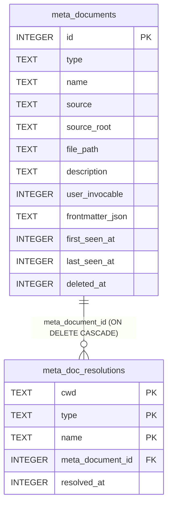

# meta_documents / meta_doc_resolutions 테이블

Claude Code Behavior Definitions(에이전트·스킬·슬래시 커맨드) 카탈로그와 cwd별 호출 매핑을 저장하는 두 테이블입니다.

---

## meta_documents 테이블

### 개요

| 항목 | 내용 |
|------|------|
| 목적 | `.claude/{agents,skills,commands}` 에서 발견된 Behavior Definitions 카탈로그 보존 |
| 관련 스키마 | `${CLAUDE_PROJECT_DIR}/packages/storage/migrations/024-meta-documents.sql` |
| 관련 쿼리 | `${CLAUDE_PROJECT_DIR}/packages/storage/src/queries/meta-document.ts` |

동일 이름의 정의가 userSettings·projectSettings·built-in 등 여러 source에 존재할 수 있으므로 **multi-source row 모델**을 사용합니다. `(type, name, source, source_root)` 조합이 UNIQUE 키이며, cwd별 우선순위 해소 결과는 `meta_doc_resolutions` 테이블이 별도로 관리합니다.

### 컬럼 정의

| 컬럼명 | 타입 | 제약조건 | 설명 |
|--------|------|----------|------|
| `id` | INTEGER | PRIMARY KEY AUTOINCREMENT | 행 식별자 |
| `type` | TEXT | NOT NULL, CHECK | 정의 종류. `agent` \| `skill` \| `command` |
| `name` | TEXT | NOT NULL | 정의 이름. frontmatter의 `name` 필드 또는 파일명(확장자 제외) |
| `source` | TEXT | NOT NULL, CHECK | 발견 출처. 아래 source 값 목록 참조 |
| `source_root` | TEXT | NULL 허용 | project면 git root realpath, user면 `~/.claude` 절대경로, built-in·bundled면 NULL |
| `file_path` | TEXT | NULL 허용 | `.md` 파일 절대경로. built-in·bundled는 파일이 없으므로 NULL |
| `description` | TEXT | NULL 허용 | frontmatter `description` 필드 또는 본문 첫 줄·첫 헤딩(최대 200자) |
| `user_invocable` | INTEGER | NOT NULL, DEFAULT 0 | 사용자가 직접 호출 가능한 정의 여부. `1` = true. command는 항상 1, skill은 frontmatter `user-invocable` 값 |
| `frontmatter_json` | TEXT | NULL 허용 | 파일 frontmatter 원본을 JSON 직렬화한 값. frontmatter가 없으면 NULL |
| `first_seen_at` | INTEGER | NOT NULL | 최초 발견 시각 (Unix timestamp, milliseconds) |
| `last_seen_at` | INTEGER | NOT NULL | 가장 최근 동기화에서 발견된 시각 (Unix timestamp, milliseconds) |
| `deleted_at` | INTEGER | NULL 허용 | soft-delete 시각. NULL = 활성 상태. 아래 soft-delete 설명 참조 |

#### source 값 목록

| 값 | 의미 |
|----|------|
| `projectSettings` | 프로젝트 `.claude/` 에서 발견 |
| `userSettings` | 글로벌 `~/.claude/` 에서 발견 |
| `built-in` | Claude Code 내장 정의 |
| `bundled` | Claude Code 번들 포함 정의 |
| `plugin` | 플러그인 제공 정의 |
| `policySettings` | 관리형(managed) 정책 정의 |
| `unknown` | 출처 불명 |

### soft-delete 동작

`SessionStart` 동기화 완료 후, 이번 스캔에서 등장하지 않은 기존 행에 `deleted_at`을 기록합니다. 파일이 삭제되거나 디렉토리가 이동된 경우 해당 행이 soft-delete됩니다.

- `deleted_at IS NULL` = 현재 활성 정의
- `deleted_at IS NOT NULL` = 더 이상 디스크에 없는 정의 (이력 보존 목적으로 행은 유지)
- upsert 시 `deleted_at`은 NULL로 초기화됩니다 — 파일이 복원되면 자동으로 활성 상태로 돌아옵니다
- soft-delete는 **같은 (source, source_root) 범위 안에서만** 수행됩니다. 다른 source의 row에는 영향을 주지 않습니다

### 인덱스

| 인덱스명 | 컬럼 | 조건 | 용도 |
|----------|------|------|------|
| `idx_meta_docs_type_name` | `(type, name)` | `deleted_at IS NULL` | 활성 정의 이름 검색 |
| `idx_meta_docs_source_root` | `source_root` | `source_root IS NOT NULL` | project 단위 필터링 |

### 집계 뷰 (v_meta_doc_usage)

`requests` 테이블을 `tool_name IN ('Agent', 'Skill')` 및 `slash_command` 컬럼으로 집계한 뷰입니다. `listMetaDocsWithUsage` 쿼리에서 이 뷰를 `meta_documents`와 LEFT JOIN하여 호출 횟수·토큰·최근 사용 시각을 한 번에 반환합니다.

→ 상세 집계 로직은 `${CLAUDE_PROJECT_DIR}/packages/storage/migrations/024-meta-documents.sql` 참조

---

## meta_doc_resolutions 테이블

### 개요

| 항목 | 내용 |
|------|------|
| 목적 | cwd별로 `(type, name)` → `meta_document_id` 우선순위 해소 결과 보존 |
| 관련 스키마 | `${CLAUDE_PROJECT_DIR}/packages/storage/migrations/024-meta-documents.sql` |
| 관련 쿼리 | `${CLAUDE_PROJECT_DIR}/packages/storage/src/queries/meta-document.ts` |

`SessionStart` 동기화가 끝날 때마다 해당 cwd의 매핑 전체를 원자적으로 교체합니다. 매 호출마다 source chain을 다시 계산하는 대신, 미리 계산된 결과를 조회하여 성능을 확보합니다.

### 컬럼 정의

| 컬럼명 | 타입 | 제약조건 | 설명 |
|--------|------|----------|------|
| `cwd` | TEXT | PK (복합) | 작업 디렉토리 realpath 절대경로 |
| `type` | TEXT | PK (복합) | 정의 종류. `agent` \| `skill` \| `command` |
| `name` | TEXT | PK (복합) | 정의 이름 |
| `meta_document_id` | INTEGER | NOT NULL, FK | 우선순위 chain 적용 후 선택된 `meta_documents.id` |
| `resolved_at` | INTEGER | NOT NULL | 해소 계산 시각 (Unix timestamp, milliseconds) |

`(cwd, type, name)` 이 복합 PRIMARY KEY입니다. 하나의 cwd에서 동일 (type, name)은 단 하나의 `meta_document_id`로 해소됩니다.

### 우선순위 chain

동일 (type, name)이 여러 source에 존재할 때 아래 순서로 우선순위를 적용합니다.

1. `projectSettings` — cwd에 가장 가까운 깊이의 project root (deepest first)
2. `projectSettings` — 상위 project root들 (git root 방향)
3. `userSettings` — 글로벌 `~/.claude/`

built-in·bundled·plugin은 현재 MVP에서 resolution 대상에 포함하지 않습니다.

→ chain 계산 로직은 `${CLAUDE_PROJECT_DIR}/packages/server/src/meta-docs/resolver.ts` 참조

### 인덱스

| 인덱스명 | 컬럼 | 용도 |
|----------|------|------|
| `idx_meta_doc_res_doc` | `meta_document_id` | 카탈로그 행 삭제 시 cascade 탐색 |

### 외래키

| 컬럼 | 참조 | 동작 |
|------|------|------|
| `meta_document_id` | `meta_documents(id)` | ON DELETE CASCADE |

---

## 관계

- **meta_documents 1 : meta_doc_resolutions N** — 하나의 카탈로그 행이 여러 cwd에서 winning row로 선택될 수 있습니다.
- `meta_documents` 행이 삭제되면 해당 `meta_document_id`를 참조하는 `meta_doc_resolutions` 행도 CASCADE 삭제됩니다.
- 동기화 흐름: `scanner.ts`가 디스크 스캔 → `synchronizer.ts`가 `meta_documents` upsert + soft-delete → `resolver.ts` chain 계산 → `meta_doc_resolutions` 교체.

→ 동기화 진입점 및 throttle 설정은 `${CLAUDE_PROJECT_DIR}/packages/server/src/meta-docs/synchronizer.ts` 참조

---

## 참고사항

- 스캔 대상 디렉토리 규약(agents·skills·commands 서브디렉토리 구조)은 `${CLAUDE_PROJECT_DIR}/packages/server/src/meta-docs/scanner.ts` 참조
- `SessionStart` 이후 5초 이내 동일 cwd 재동기화는 throttle로 skip됩니다. 강제 재동기화는 수동 refresh API를 통해 가능합니다
- `requests.slash_command` 컬럼은 이 마이그레이션에서 함께 추가되며, `<command-name>` 태그에서 추출한 슬래시 커맨드 이름을 보관합니다. `meta_documents.name`(command 타입)과 직접 매칭됩니다
