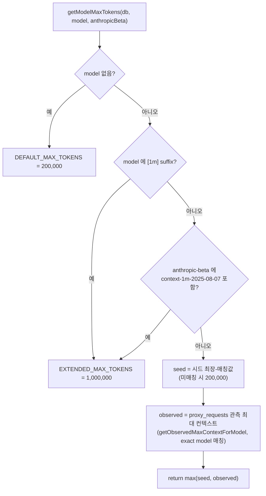
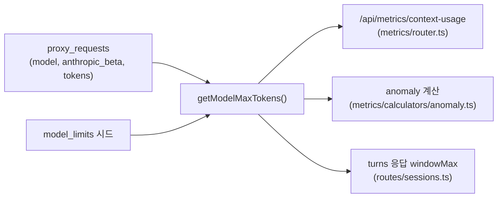

# model_limits 테이블

Claude 및 비-Anthropic 모델별 context window 한도(max_tokens)의 **시드(폴백) 값**을 저장하는 테이블입니다. 실제 추론 한도는 이 시드와 `proxy_requests` 관측치를 `max()`로 결합해 산출합니다.

> 연관 문서: [스키마 개요](README.md) · [proxy_requests](proxy-requests.md) · [메트릭·분석](../metrics-analytics.md) · [마이그레이션 가이드](../migrations.md)

## 개요

| 항목 | 내용 |
|------|------|
| 목적 | 모델별 context window 한도의 시드/하한선 SSoT — 코드 하드코딩 대신 DB 데이터로 관리 |
| DDL | `packages/storage/migrations/026-model-limits-table.sql` |
| 쿼리 | `packages/storage/src/queries/model-limits.ts` |
| 추론 | `packages/server/src/model-limits.ts` |

## 컬럼 정의

| 컬럼명 | 타입 | 제약조건 | 설명 |
|--------|------|----------|------|
| `pattern` | TEXT | PRIMARY KEY | 모델명에 포함되면 매칭되는 패턴 (substring match) |
| `max_tokens` | INTEGER | NOT NULL | 토큰 단위 context window 시드 한도 |
| `notes` | TEXT | NULL | 출처·근거 메모 (GA 발표값, 메이커 발표값 등) |

## 추론 로직

추론은 `getModelMaxTokens(db, model, anthropicBeta?)`(`packages/server/src/model-limits.ts`)가 담당합니다. 시드 테이블만으로 결정하지 않고, **요청 페이로드 기반 동적 보정**을 적용합니다. spyglass는 proxy 입장이라 CLI가 실제로 운영하는 한도를 미리 알 수 없으므로, 시드는 하한선으로만 쓰고 그 모델로 실제 흘러간 요청의 최대 컨텍스트를 관측해 `max(seed, observedMax)`로 묶습니다.

| 순위 | 조건 | 결과 |
|------|------|------|
| 0 | `model` 이 falsy | `DEFAULT_MAX_TOKENS` (200,000) |
| 1 | 모델명에 `[1m]` suffix 포함 (정규식 `/\[1m\]/i`) | `EXTENDED_MAX_TOKENS` (1,000,000) |
| 2 | `anthropicBeta` 에 `context-1m-2025-08-07` 토큰 포함 | `EXTENDED_MAX_TOKENS` (1,000,000) |
| 3 | 위 미해당 | `max(seed, observed)` — 아래 참조 |

- **seed**: 시드 테이블에서 `model.includes(pattern)`이 처음 참이 되는 행의 `max_tokens`. 시드는 `length(pattern) DESC`로 정렬되어 로드되므로 **더 긴(구체적인) 패턴이 먼저 매칭**됩니다. 어떤 패턴에도 안 걸리면 `DEFAULT_MAX_TOKENS`(200,000).
- **observed**: `getObservedMaxContextForModel(db, model)`이 `proxy_requests`에서 `model = ?` (exact match)인 행의 `MAX(tokens_input + cache_creation_tokens + cache_read_tokens)`를 산출. 해당 모델 요청이 0건이거나 `proxy_requests` 테이블 자체가 없으면 0을 반환하여 자연스럽게 `max(seed, 0) = seed`로 폴백.

관측치가 시드를 초과한다는 것은 시드가 실제 운영 한도보다 작게 잡혀 있다는 증거이며, 관측치가 곧 그 환경 CLI 한도의 최소 보장값입니다. 별도 코드 변경 없이 모델 한도가 자동 보정됩니다.

## 상수

| 상수 | 값 | 정의 위치 |
|------|------|----------|
| `DEFAULT_MAX_TOKENS` | 200,000 | `packages/server/src/model-limits.ts` |
| `EXTENDED_MAX_TOKENS` | 1,000,000 | `packages/server/src/model-limits.ts` |
| `CONTEXT_1M_BETA` | `context-1m-2025-08-07` | `packages/server/src/model-limits.ts` |

## 시드 데이터

| pattern | max_tokens | notes |
|---------|------------|-------|
| `claude-opus-4-7` | 1,000,000 | Anthropic Opus 4.7 — GA 1M context |
| `claude-opus-4-6` | 1,000,000 | Anthropic Opus 4.6 — GA 1M context |
| `claude-sonnet-4-6` | 1,000,000 | Anthropic Sonnet 4.6 — GA 1M context |
| `claude-opus-4` | 200,000 | Anthropic Opus 4.x 표준 200K (GA 1M 미포함 베이스) |
| `claude-sonnet-4` | 200,000 | Anthropic Sonnet 4.x 표준 200K (GA 1M 미포함 베이스) |
| `claude-haiku-4` | 200,000 | Anthropic Haiku 4.x 표준 200K |
| `claude-3-5-sonnet` | 200,000 | Anthropic Sonnet 3.5 — 표준 200K |
| `claude-3-5-haiku` | 200,000 | Anthropic Haiku 3.5 — 표준 200K |
| `claude-3-opus` | 200,000 | Anthropic Opus 3 — 표준 200K |
| `kimi-k2` | 128,000 | Moonshot Kimi K2 series — 기본 128K (운영자가 UPDATE로 보정 가능) |

조회 쿼리 `getAllModelLimits(db)`는 `SELECT pattern, max_tokens, notes FROM model_limits ORDER BY length(pattern) DESC, pattern ASC`로 정렬하여 최장 패턴 우선 매칭을 보장합니다.

## 캐시

`packages/server/src/model-limits.ts`는 두 종류의 인메모리 캐시를 둡니다.

| 캐시 | 대상 | 수명 |
|------|------|------|
| `_seedCache` | 시드 테이블 전체 (`getAllModelLimitsFromDb` 1회 로드) | 무기한 (첫 호출 시 채움) |
| `_observedCache` | model별 관측 최대 컨텍스트 | TTL 60초 (`OBSERVED_TTL_MS`) |

`invalidateModelLimitsCache()`를 호출하면 두 캐시를 모두 비워 다음 추론에서 fresh 값으로 채웁니다. 운영자가 SQL로 시드를 수정했거나 관측치 즉시 반영이 필요할 때 사용합니다.

> 참고: `packages/storage/src/queries/model-limits.ts`의 `getAllModelLimits`는 `@spyglass/storage`에서 `getAllModelLimitsFromDb`로 re-export 되며, server의 `getAllModelLimits`(시드 + 상수를 함께 반환하는 UI 보조 함수)와 이름이 다릅니다.

## 갱신 방법

- **신규 모델 추가**: 새 migration SQL 파일에 `INSERT OR IGNORE` 추가, 또는 운영자가 직접 `INSERT`/`UPDATE`.
- **즉시 반영**: 시드 수정 후 `invalidateModelLimitsCache()` 호출, 또는 프로세스 재시작.
- **멱등 보장**: 시드 INSERT는 `INSERT OR IGNORE` 정책이라 마이그레이터 재실행에 안전.
- **동적 보정**: 시드를 수정하지 않아도, 그 모델로 들어온 요청이 시드를 초과하면 `proxy_requests` 관측치가 60초 TTL 내에 한도에 반영됩니다.

## 호출 지점

- `packages/server/src/metrics/router.ts` — `/api/metrics/context-usage` 사용률 분포 계산 및 `/api/metrics/...` 응답의 `model_limits` 노출(`getAllModelLimits(db)`).
- `packages/server/src/metrics/calculators/anomaly.ts` — context-window 기반 이상 탐지 분모(`windowMax`).
- `packages/server/src/routes/sessions.ts` — turns 응답의 prompt별 `windowMax`.

## 관계

- 이 테이블은 다른 테이블을 참조하거나 참조받지 않습니다 (FK 없음).
- 추론 시 `proxy_requests`의 `model`, `anthropic_beta`, 토큰 컬럼(`tokens_input` / `cache_creation_tokens` / `cache_read_tokens`)을 입력으로 사용합니다.

## 참고사항

- `pattern`은 exact match가 아닌 **substring match**입니다 (`model.includes(pattern)`).
- Anthropic 외 모델(Kimi 등)도 이 테이블로 관리하여 코드 변경 없이 신규 모델을 지원합니다.
- "컨텍스트 크기"의 정의는 `tokens_input + cache_creation_tokens + cache_read_tokens`로, 클라이언트 차트의 `context_tokens` 정의와 동일합니다.
