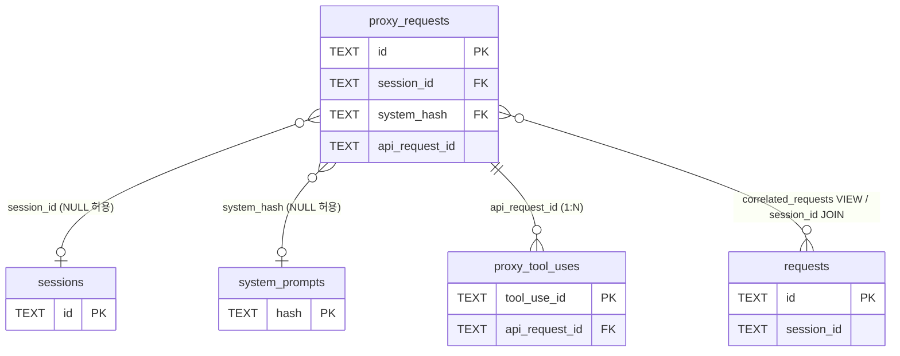
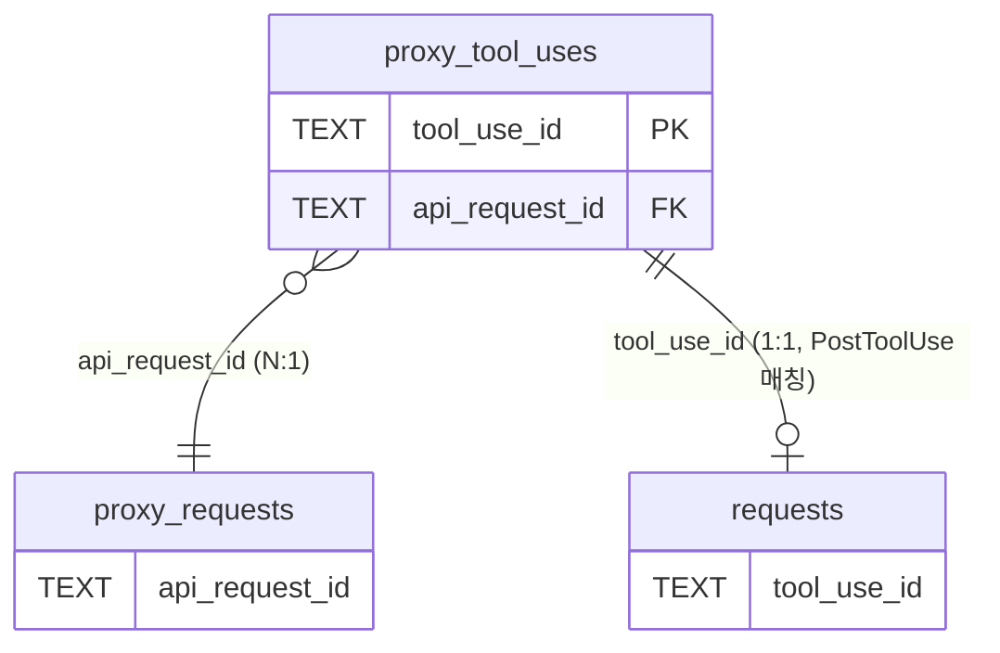

# proxy_requests / proxy_tool_uses 테이블

HTTP 프록시 레이어에서 수집한 Anthropic API 호출 메트릭과 도구 호출 매핑을 저장하는 테이블 쌍입니다.

---

## proxy_requests 테이블

### 개요

| 항목 | 내용 |
|------|------|
| 목적 | HTTP 프록시에서 수집한 LLM API 요청/응답 메트릭 저장 |
| 주요 쿼리 파일 | `packages/storage/src/queries/proxy.ts` |
| 주요 퍼시스트 파일 | `packages/server/src/proxy/handler/persist.ts` |

### 컬럼 정의

#### 식별·HTTP 기본

| 컬럼명 | 타입 | 제약조건 | 설명 |
|--------|------|----------|------|
| `id` | TEXT | PRIMARY KEY | 요청 고유 ID (proxy 레이어 UUID) |
| `timestamp` | INTEGER | NOT NULL | 요청 시작 시간 (Unix timestamp, milliseconds) |
| `method` | TEXT | NOT NULL | HTTP 메서드 (예: `POST`) |
| `path` | TEXT | NOT NULL | 요청 경로 (예: `/v1/messages`) |
| `status_code` | INTEGER | NULL | HTTP 응답 상태 코드 |
| `response_time_ms` | INTEGER | NULL | 요청 → 응답 완료까지 전체 소요 시간 (ms) |
| `created_at` | INTEGER | DEFAULT (strftime('%s','now')) | 레코드 생성 시각 (Unix timestamp, seconds) |

#### 모델·토큰·성능

| 컬럼명 | 타입 | 기본값 | 설명 |
|--------|------|--------|------|
| `model` | TEXT | NULL | 사용된 Anthropic 모델명 (예: `claude-opus-4-5`) |
| `tokens_input` | INTEGER | 0 | 입력 토큰 수 |
| `tokens_output` | INTEGER | 0 | 출력 토큰 수 |
| `cache_creation_tokens` | INTEGER | 0 | 캐시 생성 토큰 수 |
| `cache_read_tokens` | INTEGER | 0 | 캐시 히트 읽기 토큰 수 |
| `tokens_per_second` | REAL | NULL | 출력 토큰 생성 속도 (TPS, 스트림 전용) |
| `cost_usd` | REAL | NULL | 비용 (현재 미사용, 항상 NULL — 가격 플랜 미확정) |
| `is_stream` | INTEGER | 0 | SSE 스트리밍 여부 (1=stream, 0=non-stream) |
| `first_token_ms` | INTEGER | NULL | Time-To-First-Token (TTFT, ms, 스트림 전용) |

#### 요청 본문 메타

| 컬럼명 | 타입 | 기본값 | 설명 |
|--------|------|--------|------|
| `messages_count` | INTEGER | 0 | 요청 body의 messages 배열 길이 (대화 히스토리 깊이) |
| `max_tokens` | INTEGER | NULL | 요청 시 지정한 max_tokens |
| `tools_count` | INTEGER | 0 | 요청에 포함된 tool 정의 수 |
| `request_preview` | TEXT | NULL | 마지막 user 메시지 앞 200자 (hook preview와 correlation 키) |
| `tool_names` | TEXT | NULL | 요청에 포함된 도구 이름 목록 (JSON 배열 또는 콤마 구분) |
| `temperature` | REAL | NULL | 요청 body의 temperature 값 |
| `thinking_type` | TEXT | NULL | extended thinking 활성화 타입 (예: `enabled`) |
| `system_preview` | TEXT | NULL | body.system 앞 200자 요약 (빠른 미리보기용) |
| `system_reminder` | TEXT | NULL | user 메시지 내 system-reminder 원문 (`system_preview`와 직교 — ADR-007) |
| `metadata_user_id` | TEXT | NULL | body.metadata.user_id |

#### 응답 메타

| 컬럼명 | 타입 | 기본값 | 설명 |
|--------|------|--------|------|
| `stop_reason` | TEXT | NULL | 응답 종료 사유 (`end_turn`, `max_tokens`, `tool_use`, `stop_sequence`) |
| `response_preview` | TEXT | NULL | 어시스턴트 응답 앞 200자 |
| `error_type` | TEXT | NULL | Anthropic 에러 타입 (예: `authentication_error`, `invalid_request_error`) |
| `error_message` | TEXT | NULL | 에러 상세 메시지 |
| `api_request_id` | TEXT | NULL | Anthropic 서버 발행 메시지 ID (`msg_xxx`) |

#### Cross-link·세션 연결

| 컬럼명 | 타입 | 기본값 | 설명 |
|--------|------|--------|------|
| `session_id` | TEXT | NULL | `x-claude-code-session-id` 헤더 직접 저장 → `sessions.id` 참조 |
| `turn_id` | TEXT | NULL | 동일 턴의 N개 API 호출 그룹화 키 |

#### 클라이언트·감사 메타

| 컬럼명 | 타입 | 기본값 | 설명 |
|--------|------|--------|------|
| `client_user_agent` | TEXT | NULL | 요청 `User-Agent` 헤더 (CLI 버전 추적) |
| `client_app` | TEXT | NULL | `x-app` 헤더 (예: `claude-code`) |
| `anthropic_beta` | TEXT | NULL | `anthropic-beta` 헤더 값 (활성화된 베타 기능) |
| `anthropic_org_id` | TEXT | NULL | 응답 헤더 `anthropic-organization-id` |
| `anthropic_request_id` | TEXT | NULL | 응답 헤더의 `request-id` (`req_xxx` — `api_request_id`와 별개) |
| `client_meta_json` | TEXT | NULL | Stainless SDK 메타 등 기타 클라이언트 메타 (JSON) |

#### 페이로드 압축

| 컬럼명 | 타입 | 기본값 | 설명 |
|--------|------|--------|------|
| `payload` | BLOB | NULL | zstd 압축된 원본 요청/응답 페이로드 |
| `payload_raw_size` | INTEGER | NULL | 압축 전 원본 크기 (bytes) |
| `payload_algo` | TEXT | `'zstd'` | 압축 알고리즘 식별자 |

#### System Prompt 정규화 참조

| 컬럼명 | 타입 | 기본값 | 설명 |
|--------|------|--------|------|
| `system_hash` | TEXT | NULL | `system_prompts.hash` 참조 (SHA-256 hex, NULL 허용 — body.system 미존재 또는 backfill 미수행) |
| `system_byte_size` | INTEGER | NULL | system 본문 크기 캐시 (UI `X KB` 라벨용 hot data) |

### 인덱스

| 인덱스명 | 컬럼 | 조건 | 용도 |
|----------|------|------|------|
| `idx_proxy_requests_timestamp` | `timestamp DESC` | — | 최근 요청 조회 |
| `idx_proxy_requests_model` | `model, timestamp DESC` | `model IS NOT NULL` | 모델별 요청 필터링 |
| `idx_proxy_requests_session_id` | `session_id, timestamp DESC` | `session_id IS NOT NULL` | 세션별 proxy 요청 조회 |
| `idx_proxy_requests_turn_id` | `turn_id` | `turn_id IS NOT NULL` | 턴 단위 그룹핑 |
| `idx_proxy_requests_client_app` | `client_app` | `client_app IS NOT NULL` | 클라이언트 앱별 분석 |
| `idx_proxy_requests_anthropic_org` | `anthropic_org_id` | `anthropic_org_id IS NOT NULL` | 조직 단위 사용량 분석 |
| `idx_proxy_requests_anthropic_req_id` | `anthropic_request_id` | `anthropic_request_id IS NOT NULL` | 운영 req_xxx 역참조 |
| `idx_proxy_requests_system_hash` | `system_hash` | — | system prompt 재사용 드릴다운 |

### 외래키

공식 FOREIGN KEY 제약은 없음. `session_id → sessions.id`, `system_hash → system_prompts.hash`는 인덱스만으로 관리.

- `session_id`: NULL 허용 행(구 데이터, 헤더 미수신) 보존을 위해 강제 FK 미적용
- `system_hash`: backfill 옵션 운용 및 `system_prompts` 테이블이 삭제되지 않는 정책 하에 CASCADE 불필요

### 관계

---

## proxy_tool_uses 테이블

### 개요

| 항목 | 내용 |
|------|------|
| 목적 | proxy SSE에서 추출한 tool_use 블록의 `tool_use_id ↔ api_request_id` 매핑 보존 |
| 등장 배경 | hook PostToolUse가 `tool_use_id`로 정확한 `api_request_id`를 역조회하도록 — timestamp 윈도우 휴리스틱 제거 |

### 컬럼 정의

| 컬럼명 | 타입 | 제약조건 | 설명 |
|--------|------|----------|------|
| `tool_use_id` | TEXT | PRIMARY KEY | Anthropic 발급 도구 호출 ID (`toolu_xxx`, 전역 유니크 가정) |
| `api_request_id` | TEXT | NOT NULL | 해당 tool_use를 포함한 응답의 Anthropic 메시지 ID (`msg_xxx`) |
| `tool_name` | TEXT | NULL | 도구 이름 (예: `Bash`, `Read`) |
| `block_index` | INTEGER | NULL | 응답 content 배열 내 tool_use 블록 위치 인덱스 |
| `created_at` | INTEGER | DEFAULT (strftime('%s','now')) | 레코드 생성 시각 (Unix timestamp, seconds) |

### 인덱스

| 인덱스명 | 컬럼 | 용도 |
|----------|------|------|
| `idx_proxy_tool_uses_api_request_id` | `api_request_id` | 역방향 조회 — "이 응답이 발행한 도구 호출들" |

### 관계

---

## correlated_requests VIEW

`proxy_requests`와 `requests`(hook 데이터)를 타임스탬프 근사값으로 연결하는 뷰입니다.

| 항목 | 내용 |
|------|------|
| 목적 | proxy ↔ hook 매칭 (session_id 직접 연결 불가한 구 데이터 대상) |
| 매칭 조건 | proxy timestamp ±5초 이내의 `type='prompt'` hook 이벤트 LEFT JOIN |
| 정렬 | `proxy_requests.timestamp DESC` |

주요 노출 컬럼: proxy 측 전체 메트릭(`proxy_id`, `proxy_ts`, `model`, 토큰, 성능 지표) + hook 측 (`hook_id`, `session_id`, `turn_id`, `hook_prompt_preview`, `correlation_diff_ms`).

---

## 참고사항

- `cost_usd` 컬럼은 schema 호환을 위해 유지되지만 현재 항상 NULL — 가격 플랜을 알 수 없어 신뢰도가 낮은 추정치를 저장하지 않음
- `system_reminder`(v21)와 `system_hash`(v22)는 직교 책임: 전자는 user 메시지 내 reminder 원문, 후자는 `body.system` 본문 참조
- `payload` BLOB은 `/api/proxy-requests/:id/messages` 단건 조회(`getProxyRequestById`)에서만 디코드, 목록 조회에서는 명시 컬럼만 SELECT하여 MB 단위 직렬화 비용 차단
- v19 이후(헤더 직접 저장) 데이터는 `session_id`가 NULL이 아니므로 `correlated_requests` VIEW 휴리스틱 불필요
- `proxy_tool_uses` INSERT는 `INSERT OR IGNORE` — 같은 응답이 중복 처리되어도 멱등 보장
- proxy commit 트랜잭션 마지막에 `backfillRequestApiRequestIdByToolUse`를 호출하여, hook PostToolUse와의 race condition으로 발생한 `api_request_id` NULL 행을 즉시 보정
