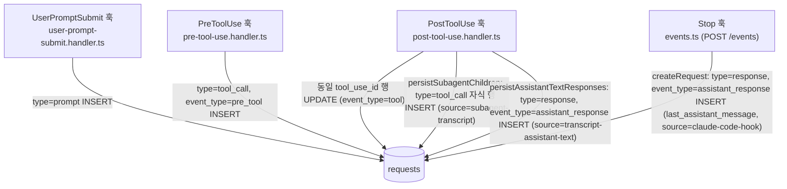

# requests 테이블

훅 기반 요청 및 도구 호출 정보를 저장하는 메인 SoT 테이블입니다.
PreToolUse / PostToolUse / UserPromptSubmit / Stop 훅 이벤트가 이 테이블로 정제 저장됩니다.

> 연관 문서: [스키마 인덱스](README.md) · [sessions](sessions.md) · [proxy-requests](proxy-requests.md) · [claude-events](claude-events.md) · [마이그레이션](../migrations.md) · [데이터 흐름](../data-flow.md)

## 개요

| 항목 | 내용 |
|------|------|
| 목적 | 개별 요청/도구 호출 상세 기록 (메인 SoT) |
| 정의 위치 | `packages/storage/migrations/001-init.sql` (기본 테이블) + 마이그레이션 002~047 (컬럼·인덱스 누적) |
| 쓰기 패턴 | INSERT + UPDATE (pre_tool → tool 머지) |
| 부모 테이블 | `sessions` (`session_id` FK, ON DELETE CASCADE) |

## 쓰기 흐름

`requests` 행은 훅 이벤트별로 INSERT 되고, PreToolUse → PostToolUse 는 동일 `tool_use_id` 로 UPDATE 머지됩니다.



처리 코드:
- 훅 도구·프롬프트 경로 — `packages/server/src/hook/handlers/*.handler.ts` → `packages/server/src/hook/persist.ts` (`saveRequest` / 머지 UPDATE).
- PostToolUse 중간 응답 — `post-tool-use.handler.ts` 가 transcript 추출 후 `persist.ts` 의 `persistAssistantTextResponses` 호출 → `type='response'` INSERT.
- Stop 응답 — `packages/server/src/events.ts` (POST /events 엔드포인트) 가 `createRequest` 직접 호출 → `type='response'` INSERT. handlers/ 를 경유하지 않는다.

## id 채번 규칙

훅 핸들러 경로의 `id` 는 `makeRequestId(prefix, now)` 가 생성하며 형식은 `{prefix}-{timestampMs}-{random8}` 입니다 (`packages/server/src/hook/handlers/_shared.ts`). 응답(`type='response'`) 행은 별도 채번 규칙을 사용합니다 — 아래 표 참조.

| prefix | 발행 위치 | 의미 |
|--------|-----------|------|
| `prompt` | user-prompt-submit.handler.ts | UserPromptSubmit |
| `sys` | system-event.handler.ts | 시스템 이벤트 |
| `pre` | pre-tool-use.handler.ts | PreToolUse (pre_tool) |
| `tool` | post-tool-use.handler.ts | PostToolUse |
| `sub` | persist.ts (서브에이전트 자식) | transcript 파싱 자식 도구 행 |
| `resp-msg` | persist.ts `persistAssistantTextResponses` (`resp-msg-{messageId}`) | transcript 중간 어시스턴트 텍스트 응답 |
| `resp` | events.ts Stop 경로 (`resp-{timestampMs}-{random8}`) | Stop 훅 last_assistant_message 응답 |

## 컬럼 정의

| 컬럼명 | 타입 | 제약조건 | 도입 | 설명 |
|--------|------|----------|------|------|
| `id` | TEXT | PRIMARY KEY | v1 | 요청 고유 ID (`{prefix}-{timestampMs}-{random8}`) |
| `session_id` | TEXT | NOT NULL, FK | v1 | 세션 참조 (sessions.id) |
| `timestamp` | INTEGER | NOT NULL | v1 | 요청 발생 시간 (Unix timestamp, milliseconds) |
| `type` | TEXT | NOT NULL, CHECK | v1 | 요청 타입 (`prompt`, `tool_call`, `system`, `response`) |
| `tool_name` | TEXT | NULL | v1 | 도구명 (tool_call인 경우) |
| `model` | TEXT | NULL | v1 | 사용된 AI 모델명 |
| `tokens_input` | INTEGER | DEFAULT 0 | v1 | 입력 토큰 수 |
| `tokens_output` | INTEGER | DEFAULT 0 | v1 | 출력 토큰 수 |
| `tokens_total` | INTEGER | DEFAULT 0 | v1 | 총 토큰 수 (input + output) |
| `duration_ms` | INTEGER | DEFAULT 0 | v1 | 실행 시간 (밀리초) |
| `payload` | TEXT/BLOB | NULL | v1 | 원본 훅 페이로드 (JSON TEXT 또는 zstd 압축 BLOB) |
| `created_at` | INTEGER | DEFAULT `strftime('%s','now')` | v1 | 레코드 생성 시간 (Unix timestamp, seconds) |
| `tool_detail` | TEXT | NULL | v2 | 도구 상세 요약 1줄 (80자 이내) |
| `turn_id` | TEXT | NULL | v3 | 턴 그룹핑 ID (`{session_id}-T{N}`) |
| `source` | TEXT | NULL | v4 | 데이터 출처 (예: `subagent-transcript`) |
| `cache_creation_tokens` | INTEGER | DEFAULT 0 | v5 | 캐시 생성 토큰 수 |
| `cache_read_tokens` | INTEGER | DEFAULT 0 | v5 | 캐시 읽기 토큰 수 |
| `preview` | TEXT | NULL | v7 | 프롬프트 내용 미리보기 |
| `tool_use_id` | TEXT | NULL | v8 | Pre/Post 툴 페어링 키 |
| `event_type` | TEXT | NULL | v8 | 이벤트 서브타입 (`pre_tool`, `tool`, `assistant_response`) |
| `tokens_confidence` | TEXT | DEFAULT 'high' | v11 | 토큰 신뢰도 (`high`, `error`) |
| `tokens_source` | TEXT | DEFAULT 'transcript' | v11 | 토큰 출처 (`transcript`, `unavailable`) |
| `parent_tool_use_id` | TEXT | NULL | v17 | 부모 Agent의 `tool_use_id` (서브에이전트 자식 행 연결용) |
| `api_request_id` | TEXT | NULL | v19 | Anthropic API 응답 ID — proxy_requests 역참조 키 |
| `permission_mode` | TEXT | NULL | v20 | Claude Code 권한 모드 (예: `bypassPermissions`, `plan`) |
| `agent_id` | TEXT | NULL | v20 | 서브에이전트 ID |
| `agent_type` | TEXT | NULL | v20 | 서브에이전트 타입 |
| `tool_interrupted` | INTEGER | NULL | v20 | 도구 실행 중 인터럽트 발생 여부 (0/1) |
| `tool_user_modified` | INTEGER | NULL | v20 | 사용자 수정 여부 (0/1) |
| `payload_raw_size` | INTEGER | NULL | v21 | 압축 전 페이로드 원본 크기 (bytes) |
| `payload_algo` | TEXT | DEFAULT 'zstd' | v21 | 페이로드 압축 알고리즘 |
| `slash_command` | TEXT | NULL | v24 | UserPromptSubmit에서 추출한 슬래시 커맨드 이름 (선행 `/` 제거) |

## type CHECK 제약

```sql
CHECK (type IN ('prompt', 'tool_call', 'system', 'response'))
```

- `prompt` : 사용자 입력 (UserPromptSubmit 훅)
- `tool_call` : 도구 호출 (PreToolUse / PostToolUse 훅)
- `system` : 시스템 이벤트 (SessionStart, Notification 등)
- `response` : Claude 응답 (`event_type='assistant_response'`). Stop 훅의 last_assistant_message(events.ts) + PostToolUse transcript 중간 텍스트(persistAssistantTextResponses) 두 경로로 INSERT

## 인덱스

| 인덱스명 | 컬럼 | 부분 조건 (WHERE) | 용도 |
|----------|------|------|------|
| `idx_requests_session` | `session_id, timestamp DESC` | — | 세션별 요청 조회 |
| `idx_requests_type` | `type, timestamp DESC` | — | 타입별 요청 조회 |
| `idx_requests_tokens` | `tokens_total DESC` | — | 토큰 사용량 상위 조회 |
| `idx_requests_session_type` | `session_id, type` | — | 세션+타입 복합 조회 (turn 채번 COUNT) |
| `idx_requests_turn` | `turn_id` | — | 턴 기반 그룹핑 |
| `idx_requests_tool_use_id` | `tool_use_id` | `tool_use_id IS NOT NULL` | Pre/Post 툴 매칭 |
| `idx_requests_timestamp` | `timestamp DESC` | — | 시간 범위 조회 |
| `idx_requests_parent_tool_use_id` | `parent_tool_use_id` | `parent_tool_use_id IS NOT NULL` | 서브에이전트 자식 조회 |
| `idx_requests_api_request_id` | `api_request_id` | `api_request_id IS NOT NULL` | proxy_requests 역참조 |
| `idx_requests_agent_id` | `agent_id` | `agent_id IS NOT NULL` | 에이전트 ID 조회 |
| `idx_requests_permission_mode` | `permission_mode` | `permission_mode IS NOT NULL` | 권한 모드 분석 |
| `idx_requests_slash` | `slash_command` | `slash_command IS NOT NULL` | 슬래시 커맨드 집계 |
| `idx_requests_meta_doc` | `tool_name, tool_detail` | `tool_name IN ('Agent','Skill')` | Behavior Definitions 매칭 |
| `idx_requests_type_event_ts` | `type, event_type, timestamp DESC` | — | 집계·통계 쿼리 최적화 |
| `idx_requests_tool_duration_partial` | `duration_ms ASC` | `type='tool_call' AND event_type='tool' AND duration_ms>0` | P95 지연 계산 |
| `idx_requests_session_type_ts_asc` | `session_id, type, timestamp ASC` | — | 세션 첫 prompt 시각 조회 |
| `idx_requests_session_timestamp` | `session_id, timestamp DESC` | — | anomaly 검출 세션 단위 범위 스캔 |
| `idx_requests_meta_doc_call` | `tool_name, tool_detail, timestamp` | `tool_name IN ('Skill','Agent') AND tool_detail IS NOT NULL AND tool_use_id IS NOT NULL` | 메타 문서 call-graph 산출 |
| `idx_requests_session_type_turn_ts` | `session_id, type, turn_id, timestamp` | — | turn 렌더링 read 가속 |
| `idx_requests_session_turn_active` | `session_id, turn_id` | `turn_id IS NOT NULL` | turn 활성 행 조회 |
| `idx_requests_session_turn_ts_active` | `session_id, turn_id, timestamp` | `turn_id IS NOT NULL` | turn 시간 정렬 조회 |

## 외래키

```sql
FOREIGN KEY (session_id) REFERENCES sessions(id) ON DELETE CASCADE
```

## tool_detail 포맷

도구별 요약은 `extractToolDetail(toolName, toolInput, toolResponse?)` (`packages/server/src/hook/tool-detail.ts`) 가 생성하며 모두 80자 이내로 truncate 됩니다.

| 도구 | tool_detail 값 |
|------|----------------|
| `Read` / `Edit` / `MultiEdit` / `Write` | `file_path` |
| `Bash` | `command` (80자 truncate) |
| `Glob` / `Grep` | `pattern` 또는 `pattern in {path}` |
| `Skill` | `skill` 이름, 없으면 `args` |
| `Agent` | `subagent_type` → `description` → `prompt` 순으로 첫 존재 값 |
| `WebFetch` | `url` |
| `WebSearch` / `ToolSearch` | `query` |
| `SendMessage` | `→{to}: {summary}` |
| `AskUserQuestion` | 첫 질문(`Q×N` 접두 가능), PostToolUse 시 `질문 → 답` |
| `TaskCreate` | `subject` 또는 `description` |
| `TaskUpdate` | `#{taskId} {from}→{to}` (PostToolUse), 또는 변경 필드 요약 |
| `TaskGet` | `#{taskId}` |
| `TaskList` | `(list)` |
| `mcp__*` | 첫 번째 의미 있는 문자열 필드 |
| 기타 | `null` |

## 데이터 샘플 쿼리

```sql
-- 특정 세션의 모든 요청 조회
SELECT * FROM requests
WHERE session_id = ?
ORDER BY timestamp DESC;

-- 토큰 사용량 상위 요청
SELECT tool_name, tokens_total, tool_detail
FROM requests
ORDER BY tokens_total DESC
LIMIT 10;

-- 도구별 사용 통계
SELECT tool_name, COUNT(*) as count, SUM(tokens_total) as total_tokens
FROM requests
WHERE tool_name IS NOT NULL
GROUP BY tool_name
ORDER BY count DESC;

-- 턴별 요청 그룹핑
SELECT turn_id, COUNT(*) as request_count, SUM(tokens_total) as tokens
FROM requests
WHERE session_id = ?
GROUP BY turn_id
ORDER BY turn_id;

-- 서브에이전트 자식 호출 조회
SELECT * FROM requests
WHERE parent_tool_use_id = ?
ORDER BY timestamp ASC;

-- 슬래시 커맨드 집계
SELECT slash_command, COUNT(*) as count
FROM requests
WHERE slash_command IS NOT NULL
GROUP BY slash_command
ORDER BY count DESC;
```

## 참고사항

- `duration_ms`는 `PreToolUse`와 `PostToolUse` 사이의 경과 시간.
- `tool_use_id`로 Pre/Post 쌍을 매칭 — PostToolUse 는 동일 `tool_use_id` 의 pre_tool 행을 UPDATE 머지한다.
- `event_type='pre_tool'` 행은 read API 에서 기본 제외되며, `tool_name='Agent'` 만 예외 허용 — `ACTIVE_REQUEST_FILTER_SQL` (`packages/storage/src/queries/request/read.ts`) 이 정책 SSoT.
- `parent_tool_use_id`는 서브에이전트(Task) 내부 도구 호출을 부모 Agent 행과 연결하는 외래키 역할.
- `api_request_id`는 Anthropic API 응답의 외부 ID — `proxy_requests` 테이블과 cross-link 키.
- `payload`는 zstd 압축 BLOB 또는 원문 JSON TEXT — `payload_algo` 컬럼으로 구분.
- `slash_command`는 prompt 페이로드의 `<command-name>` 태그에서 추출하며, 선행 `/`는 제거하여 저장한다 (`extractSlashCommand`, `packages/server/src/hook/slash-command.ts`).
