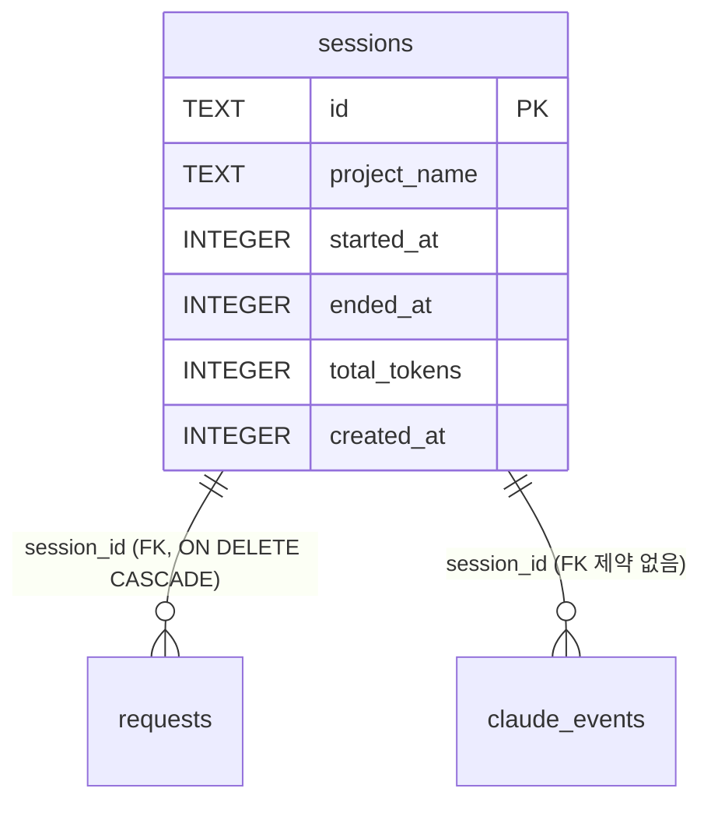
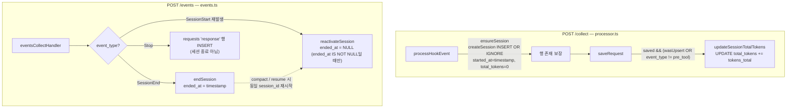

# sessions 테이블

Claude Code 세션 단위 정보를 저장하는 테이블입니다.

> 관련 문서: [스키마 개요](./README.md) · [requests](./requests.md) · [claude_events](./claude-events.md) · [데이터베이스 구조](../database.md) · [마이그레이션](../migrations.md)

## 개요

| 항목 | 내용 |
|------|------|
| 목적 | Claude Code 세션 단위 추적 |
| 정의 위치 | `${CLAUDE_PROJECT_DIR}/packages/storage/src/schema.ts` (`CREATE_SESSION_TABLE`) |

## 컬럼 정의

| 컬럼명 | 타입 | 제약조건 | 설명 |
|--------|------|----------|------|
| `id` | TEXT | PRIMARY KEY | 세션 고유 ID (Claude Code에서 생성) |
| `project_name` | TEXT | NOT NULL | 프로젝트명 (cwd의 basename) |
| `started_at` | INTEGER | NOT NULL | 세션 시작 시간 (Unix timestamp, milliseconds) |
| `ended_at` | INTEGER | NULL | 세션 종료 시간 (NULL = 활성 세션) |
| `total_tokens` | INTEGER | DEFAULT 0 | 세션 누적 토큰 수 |
| `created_at` | INTEGER | DEFAULT (strftime('%s', 'now')) | 레코드 생성 시간 (Unix timestamp, seconds) |

### 런타임 derive 컬럼 (DB 컬럼 아님)

조회 함수가 SELECT 시점에 산출하는 가상 컬럼이다. `domain/session-status.ts`의
`listVisibleSessions` / `listLiveSessions`가 `sessions.*`에 아래 컬럼을 덧붙여 반환한다.

| 컬럼명 | 타입 | 산출 방식 |
|--------|------|------|
| `first_prompt_payload` | TEXT \| null | 세션 첫 번째 prompt request의 payload — `(SELECT r.payload FROM requests r WHERE r.session_id = s.id AND r.type = 'prompt' ORDER BY r.timestamp ASC LIMIT 1)` 상관 서브쿼리 (`listVisibleSessions`에서만) |
| `last_activity_at` | INTEGER \| null | 마지막 visible request의 timestamp — `MAX(r.timestamp)` LEFT JOIN |
| `live_state` | 'live' \| 'stale' \| 'ended' | 세션 라이브 상태 — `buildLiveStateColumn`의 CASE식 |

산출 빌더 정의 → `${CLAUDE_PROJECT_DIR}/packages/storage/src/queries/session/_shared.ts`

## 인덱스

| 인덱스명 | 컬럼 | 용도 |
|----------|------|------|
| `idx_sessions_started_at` | `started_at DESC` | 최근 세션 조회 |
| `idx_sessions_project` | `project_name` | 프로젝트별 세션 필터링 |

## 외래키 / 관계

sessions 테이블 자체에는 외래키 제약이 없다. 하위 테이블이 이 테이블을 참조한다.

- **1:N** → [`requests`](./requests.md) — `session_id` REFERENCES sessions(id) ON DELETE CASCADE
- **1:N** → [`claude_events`](./claude-events.md) — `session_id` 컬럼 참조 (DB FK 제약은 없음, 인덱스 `idx_events_session_time`로만 연결)

## 라이프사이클

세션 행은 **두 개의 분리된 hook 수집 엔드포인트**가 갱신한다.

- `POST /collect` (`packages/server/src/hook/processor.ts`, `processHookEvent`) — PreToolUse/PostToolUse 요청. 세션 생성·토큰 누적.
- `POST /events` (`packages/server/src/events.ts`, `eventsCollectHandler`) — SessionStart/SessionEnd/Stop 등 wildcard hook 이벤트. 세션 종료·재활성.

두 경로는 서로 다른 함수를 호출하며, 한쪽이 다른 쪽 동작을 파생시키지 않는다.

- **생성** (`/collect`): `ensureSession`(`packages/server/src/hook/session.ts`)이 매 요청마다 `createSession`을 `INSERT OR IGNORE`로 호출 — 동시 요청·서버 재시작에도 idempotent. 인메모리 `activeSessions` Set으로 중복 SELECT 비용 절감.
- **토큰 누적** (`/collect`): `saveRequest` 성공 후 Upsert(pre→post 머지)이거나 `event_type != 'pre_tool'`인 경우 `updateSessionTotalTokens`가 `total_tokens = total_tokens + ?`로 증분 갱신한다. pre_tool 자체 INSERT는 토큰=0이라 누적에서 스킵되고, PostToolUse 머지 시점에 반영된다. 별도 재집계 동기화 단계는 없다.
- **종료** (`/events`): `SessionEnd` 이벤트만 `endSession`(`ended_at = timestamp`)을 호출한다. `Stop` 이벤트는 마지막 assistant 메시지를 `requests`에 'response' 타입으로 저장할 뿐 세션을 종료하지 않는다.
- **재활성화** (`/events`): compact/resume로 동일 `session_id`의 `SessionStart`가 재발생하면 `reactivateSession`이 `ended_at IS NOT NULL`인 행에 한해 `ended_at`을 NULL로 되돌린다.

## live_state 판정

`ended_at`만으로는 SessionEnd 누락 세션을 영원히 LIVE로 오인하므로, `last_activity_at` 기반 stale 보정을 함께 사용한다.

| 상태 | 조건 |
|------|------|
| `ended` | `ended_at IS NOT NULL` |
| `live` | `ended_at IS NULL` AND 마지막 visible 활동이 `now - LIVE_STALE_THRESHOLD_MS` 이상 |
| `stale` | `ended_at IS NULL` AND 마지막 visible 활동이 cutoff 미만 (또는 활동 없음) |

- LIVE stale 임계값: `LIVE_STALE_THRESHOLD_MS = 30 * 60 * 1000` (30분) — `_shared.ts` 단일 상수.
- "visible request" 정의: pre_tool 이벤트 제외, 단 `tool_name = 'Agent'`는 예외로 포함 — `buildVisibleSessionPredicate` / `ACTIVE_SESSION_REQUEST_JOIN_SQL`이 SSoT.
- 빈 세션(visible request 0개)은 사이드바·카운트에서 제외된다.

## 참고사항

- 세션 라이프사이클 쿼리(`createSession` / `endSession` / `reactivateSession` / `updateSession`)는 `packages/storage/src/queries/session/write.ts`에 있다.
- visible/LIVE 정의의 결과 함수 SSoT는 `packages/storage/src/domain/session-status.ts`다. `_shared.ts`의 저수준 빌더를 `routes/*`에서 직접 import하지 않는다.
- Retention: `started_at` 기준 cutoff 이전 세션이 RDB 정리 대상에 포함된다 → [데이터베이스 구조](../database.md) 참조.
