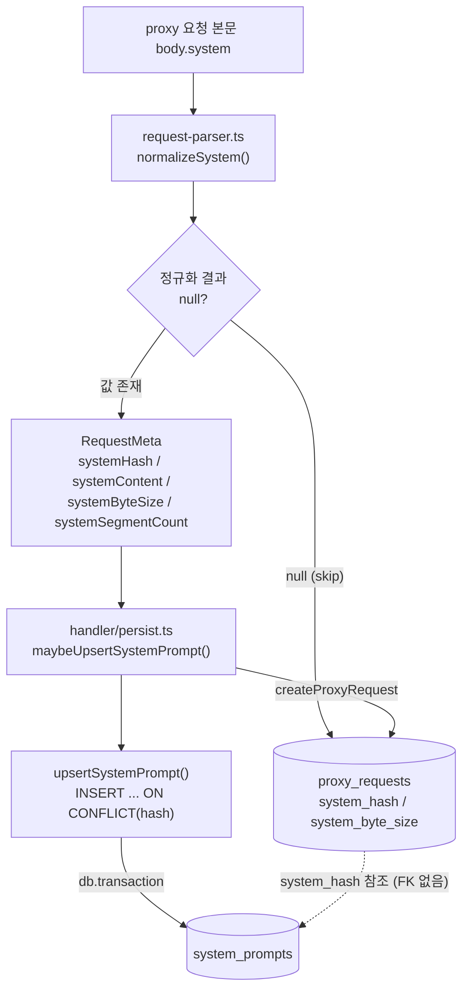
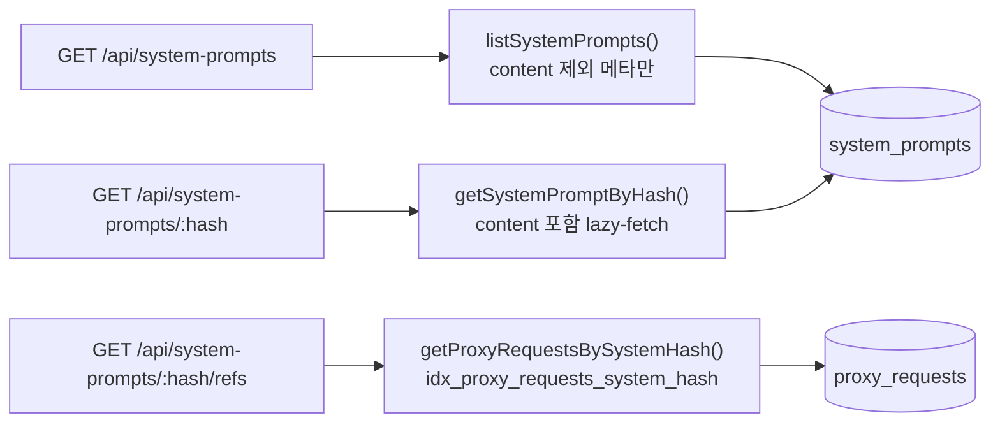

# system_prompts 테이블

LLM 요청에 함께 전송되는 `body.system` 본문을 hash 기반으로 content-addressable dedup 저장하는 카탈로그 테이블입니다.

> 관련 문서: [proxy_requests](./proxy-requests.md) · [스키마 인덱스](./README.md)

## 개요

| 항목 | 내용 |
|------|------|
| 목적 | `body.system` 본문 content-addressable dedup 저장 |
| 정규화 방식 | billing-header(prefix 매칭) 제거 → `\n\n` 결합 → BOM 제거 + CRLF→LF |
| 해시 알고리즘 | SHA-256(UTF-8 정규화 본문), hex 64자 |
| 정의 마이그레이션 | `packages/storage/migrations/022-system-prompts.sql` |
| 정규화 SoT | `packages/server/src/proxy/system-hash.ts: normalizeSystem()` |
| CRUD SoT | `packages/storage/src/queries/system-prompt.ts` |

## 컬럼 정의

| 컬럼명 | 타입 | 제약조건 | 설명 |
|--------|------|----------|------|
| `hash` | TEXT | PRIMARY KEY NOT NULL | SHA-256(정규화 본문) hex 64자, content-addressable PK |
| `content` | TEXT | NOT NULL | 정규화된 system 본문 (billing-header 제외 후 `\n\n` 결합) |
| `byte_size` | INTEGER | NOT NULL | 정규화 본문의 UTF-8 byte 길이 (`Buffer.byteLength`) — UI 'X KB' 라벨 캐시 |
| `segment_count` | INTEGER | NOT NULL DEFAULT 1 | 정규화에 사용된 text 항목 수 (string 입력이면 1, 배열이면 billing-header 제외 후 개수) |
| `first_seen_at` | INTEGER | NOT NULL | 최초 INSERT 시각 (Unix timestamp, milliseconds) |
| `last_seen_at` | INTEGER | NOT NULL | 마지막 사용 시각 (Unix timestamp, milliseconds) — UPSERT마다 갱신 |
| `ref_count` | INTEGER | NOT NULL DEFAULT 1 | 참조된 proxy_requests 수 — UPSERT마다 +1 |
| `created_at` | INTEGER | NOT NULL DEFAULT (strftime('%s','now') * 1000) | 레코드 생성 시각 (Unix timestamp, milliseconds) |

## 인덱스

| 인덱스명 | 컬럼 | 용도 |
|----------|------|------|
| `idx_system_prompts_last_seen` | `system_prompts(last_seen_at DESC)` | 라이브러리 패널 최근 사용 순 정렬 |
| `idx_system_prompts_ref_count` | `system_prompts(ref_count DESC)` | 빈도 높은 페르소나 순 정렬 |
| `idx_proxy_requests_system_hash` | `proxy_requests(system_hash)` | system_hash 역참조 (`:hash/refs`) 조회 |

## 정규화 규칙 (normalizeSystem)

`normalizeSystem(system: unknown)` 가 hash 입력 안정성을 보장한다. 같은 system 페르소나는 항상 동일 hash를 반환한다.

1. `system` 이 `null`/`undefined` → `null` 반환
2. `typeof system === 'string'` → `texts = [system]`
3. `Array.isArray(system)` → 각 항목에 대해 다음을 모두 통과한 `text`만 수집
   - `item.type === 'text'` (cache_control 등 메타 객체는 skip)
   - `typeof item.text === 'string'`
   - `text.startsWith('x-anthropic-billing-header:') === false` (prefix 매칭으로 billing-header 제거 — idx/길이 단독 판별 아님)
4. `texts.length === 0` → `null` 반환
5. `normalized = texts.join('\n\n')` (블록 순서 유지)
6. BOM 제거 + `\r\n` → `\n` 치환 (HTTP 전송 환경 차이 흡수)
7. `hash = SHA-256(utf8(normalized)).hex`, `byteSize = Buffer.byteLength(normalized, 'utf8')`

반환값 `NormalizedSystem`: `{ hash, normalized, segmentCount, byteSize }`.

## 데이터 흐름



읽기 경로 (`routes/system-prompts.ts`):



## UPSERT 전략

```sql
INSERT INTO system_prompts (hash, content, byte_size, segment_count, first_seen_at, last_seen_at, ref_count)
VALUES (?, ?, ?, ?, ?, ?, 1)
ON CONFLICT(hash) DO UPDATE SET
  last_seen_at = excluded.last_seen_at,
  ref_count    = ref_count + 1;
```

- 동일 hash 재등장 시 `last_seen_at`(=요청 nowMs) 갱신 + `ref_count + 1`. `content`·`first_seen_at`·`segment_count`·`byte_size`는 변경하지 않는다.
- 단일 statement이므로 bun:sqlite에서 atomic. `proxy/handler/persist.ts` 가 `createProxyRequest` 와 같은 `db.transaction` 안에서 호출해 두 INSERT가 원자적으로 commit된다.
- `last_seen_at`은 `excluded.last_seen_at`(요청 nowMs)으로 무조건 덮어쓴다. 시간 역행을 방지하려면 호출자가 정상적인 요청 타임스탬프를 보장해야 한다.

## API 라우트

| 메서드 | 경로 | 백엔드 함수 | 응답 |
|--------|------|-------------|------|
| GET | `/api/system-prompts` | `listSystemPrompts` | content 제외 메타 목록. `orderBy ∈ {last_seen_at, ref_count, byte_size, first_seen_at}` (기본 last_seen_at DESC), `limit` 기본 100 / 상한 500 |
| GET | `/api/system-prompts/:hash` | `getSystemPromptByHash` | content 포함 단건 lazy-fetch. hash 미존재 시 404 |
| GET | `/api/system-prompts/:hash/refs` | `getProxyRequestsBySystemHash` | 이 hash를 참조한 proxy_requests 슬림 목록 (payload BLOB 제외, 최신순). `limit` 기본 100 / 상한 500 |

`:hash` 경로는 `^[0-9a-f]{64}$` 정규식으로 검증하며, 형식 불일치 시 400을 반환한다.

## 데이터 샘플

```sql
-- 가장 자주 사용된 system prompt 조회
SELECT hash, byte_size, segment_count, ref_count, last_seen_at
FROM system_prompts
ORDER BY ref_count DESC
LIMIT 10;

-- 특정 hash의 본문 lazy-fetch
SELECT content FROM system_prompts WHERE hash = ?;

-- 최근 등장한 신규 system prompt
SELECT hash, byte_size, first_seen_at
FROM system_prompts
ORDER BY first_seen_at DESC
LIMIT 20;
```

## 관계

- **N:1** ← `proxy_requests.system_hash` (FK 제약 없음, NULL 허용 — backfill을 옵션으로 두므로 일부 행이 NULL/미존재 가능).
- `proxy_requests` 에는 `system_hash`(참조 키)와 `system_byte_size`(UI 라벨 캐시) 컬럼이 함께 존재한다.
- `system_prompts` 행은 삭제하지 않는 정책이므로 참조 무결성 위반 가능성이 없어 FK·CASCADE가 불필요하다.

## 참고사항

- `body.system` 본문 dedup(`system_prompts`)과 user 메시지 안의 `<system-reminder>` 블록 추출(`extractSystemReminders`)은 직교 채널이다. 두 채널은 데이터를 공유하지 않는다.
- byte_size는 정규화 본문의 UTF-8 byte 길이(`Buffer.byteLength`)다. `length(content)`(SQLite 문자 수)와 다를 수 있다.
