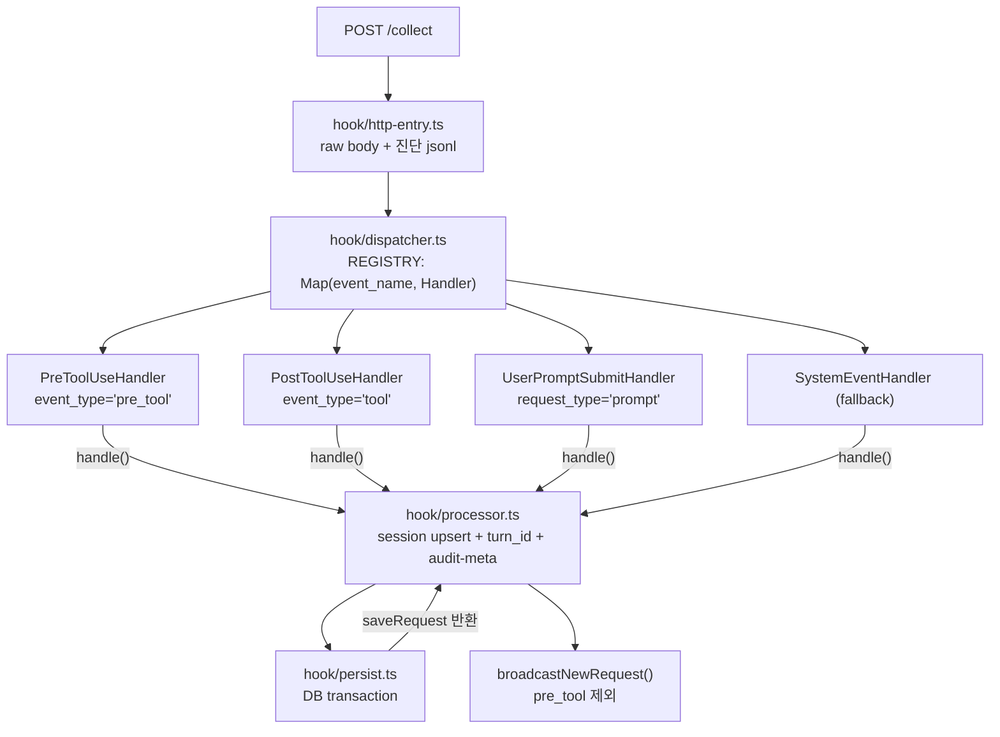
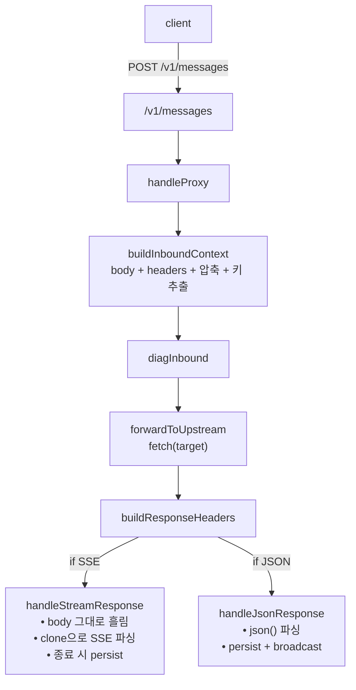

# 서버(Server)

> Bun.serve 단일 진입점. 경로 prefix로 라우터를 fan-out. Hook 수집은 Strategy, Proxy는 8개 모듈로 분핵.

---

## 문서 기준

| 항목 | 값 |
|------|-----|
| 시각 | 2026-06-06 16:44:03 KST |
| 커밋 | `4ea9686` |
| 태그 | `v4.4.0` |

---

## 1. 디렉토리 구조

```
packages/server/src/
├── index.ts                       — 진입점. dispatchDaemonCommand 위임.
├── api.ts                         — routes/* fan-out 디스패처.
├── sse.ts                         — SSE 연결 관리 + broadcast.
├── events.ts                      — POST /events 핸들러.
├── model-limits.ts                — model_limits 캐시.
├── anomaly-thresholds.ts          — anomaly_thresholds 캐시.
├── tool-category.ts               — Tool 이름 → category.
├── mcp-tool-name.ts               — MCP 도구 이름 파싱.
├── version-checker.ts             — npm registry 1h 평런.
├── diag-log.ts                    — 진단 jsonl 기록기.
├── i18n.ts                        — 서버측 i18n 로더.
│
├── runtime/                       — 라이프사이클·디스패치·환경
│   ├── config.ts                  — PORT/HOST/DB_PATH 등 env
│   ├── daemon.ts                  — start/stop/restart/status PID
│   ├── lifecycle.ts               — startServer / stopServer
│   ├── dispatch.ts                — handleRequest (경로 prefix 디스패처)
│   ├── port.ts                    — 포트 점유 검사
│   ├── stdio-mirror.ts            — stdout/stderr → server.log
│   ├── maintenance.ts             — 일별 유지보수
│   └── in-flight.ts               — 처리 중 요청 추적
│
├── routes/                        — REST API (도메인별)
│   ├── _shared.ts                 — jsonResponse, buildMeta 등
│   ├── sessions.ts
│   ├── requests.ts
│   ├── conversations.ts           — 날짜 범위 대화(프롬프트·응답) 조회
│   ├── stats.ts
│   ├── dashboard.ts               — 응답 캐시
│   ├── events.ts
│   ├── proxy.ts
│   ├── system-prompts.ts
│   ├── meta-docs.ts
│   ├── graph.ts
│   ├── settings.ts
│   └── version.ts
│
├── settings/                      — 설정 패널 실행 모듈
│   ├── claude-hooks.ts            — settings.json hook 병합
│   ├── hook-detect.ts             — hook 등록 상태
│   ├── proxy-installer.ts         — 프록시 스니펫 설치
│   ├── graph-db-installer.ts      — Ladybug 감지 + 설치
│   ├── version-probe.ts           — 바이너리 버전 진단
│   └── file-edit-toolkit.ts       — 백업 + diff + atomic write
│
├── hook/                          — /collect 수집 (Strategy)
│   ├── index.ts                   — barrel
│   ├── http-entry.ts              — POST /collect HTTP 진입
│   ├── dispatcher.ts              — Strategy Registry
│   ├── event-handler.ts           — interface + HookContext
│   ├── handlers/
│   │   ├── pre-tool-use.handler.ts
│   │   ├── post-tool-use.handler.ts
│   │   ├── user-prompt-submit.handler.ts
│   │   ├── system-event.handler.ts
│   │   └── _shared.ts
│   ├── processor.ts               — 정제된 payload 처리
│   ├── persist.ts                 — saveRequest + persistSubagentChildren
│   ├── session.ts                 — 세션 upsert
│   ├── turn.ts                    — turn_id 할당
│   ├── transcript.ts              — transcript_path 파싱
│   ├── preview.ts                 — UI preview 추출
│   ├── tool-detail.ts             — tool_input 정제
│   └── types.ts                   — payload 타입
│
├── proxy/                         — /v1/* 미러링 (opt-in)
│   ├── handler/
│   │   ├── index.ts               — 오케스트레이션
│   │   ├── inbound.ts             — context + upstream forward
│   │   ├── stream.ts              — SSE 스트리밍
│   │   ├── non-stream.ts          — JSON 응답
│   │   ├── persist.ts             — proxy_requests INSERT
│   │   ├── broadcast.ts           — SSE broadcast
│   │   └── diag.ts                — 진단 jsonl
│   ├── upstream.ts                — URL 라우팅
│   ├── request-parser.ts          — RequestMeta
│   ├── sse-state.ts               — SSE 누적 파서
│   ├── system-hash.ts             — system 본문 SHA256
│   └── backfill.ts                — hook 측 model NULL 채움
│
└── domain/
    └── request-normalizer.ts      — raw → NormalizedRequest
```

---

## 2. 라우터 fan-out (`api.ts`)

`api.ts`는 **fan-out 우선순위 디스패처**입니다.

```ts
const SYNC_ROUTERS = [
  sessionsRouter, requestsRouter, conversationsRouter,
  statsRouter, dashboardRouter, eventsRouter,
  proxyRouter, systemPromptsRouter, versionRouter,
];

export async function apiRouter(req, db) {
  const metricsResponse = await metricsRouter(req, db);
  if (metricsResponse) return metricsResponse;
  const metaDocsResponse = await metaDocsRouter(req, db);
  if (metaDocsResponse) return metaDocsResponse;
  const graphResponse = await graphRouter(req, db);
  if (graphResponse) return graphResponse;
  const settingsResponse = await settingsRouter(req, db);
  if (settingsResponse) return settingsResponse;

  for (const handler of SYNC_ROUTERS) {
    const res = handler(req, db, url, path, method);
    if (res) return res;
  }
  return jsonResponse({ success: false, error: 'API endpoint not found' }, 404);
}
```

`metaDocs`·`graph`·`settings`는 async(본문 파싱·IO)라 먼저 `await`하고, 나머지는 동기 `SYNC_ROUTERS`로 처리합니다.

---

## 3. Hook 수집 파이프라인



핵심 규칙:

| 상황 | DB 동작 | SSE 동작 |
|------|---------|----------|
| `event_type='pre_tool'` | INSERT (tokens=0, duration_ms=null) | 브로드캐스트 안 함 |
| `event_type='tool'` | 같은 `tool_use_id`의 pre 행 UPDATE | DB 실제 id(`pre-xxx`)로 송출 |

---

## 4. Proxy 핸들러 (`/v1/*`)

ANTHROPIC_BASE_URL을 spyglass로 설정하면 모든 Anthropic API 호출이 서버를 거칩니다.



저장은 `proxy_requests` 테이블. hook과는 **`api_request_id`로 cross-link**됩니다.

---

## 5. SSE 채널

| 함수 | 이벤트 타입 | 페이로드 |
|------|-------------|----------|
| `broadcastNewRequest` | `new_request` | `NormalizedRequest + session_total_tokens + event_phase` |
| `broadcastNewProxyRequest` | `new_proxy_request` | `ProxyBroadcastPayload` |
| `broadcastSessionUpdate` | `session_update` | `{ session_id, action: 'started'\|'ended'\|'token_update' }` |

연결 관리는 단일 `Set<ReadableStreamDefaultController>`. 8초 간격 `ping`으로 idle 연결 유지. 송신 실패한 연결은 자동 정리.

---

## 6. Settings 라우터

| 라우트 | 동작 |
|--------|------|
| `GET /api/settings/diag` | 통합 진단 (캐시) |
| `GET /api/settings/hooks/preview` | hook 병합 미리보기 |
| `POST /api/settings/hooks/apply` / `restore` | 백업 + 병합 / 복원 |
| `POST /api/settings/graph/mode` | 그래프 런타임 모드 |
| `GET /api/settings/graph-db/status` · `POST /install` | Ladybug 감지 / 설치 |
| `GET /api/settings/sqlite/info` | SQLite 정보 |
| `GET /api/settings/proxy/snippet` · `proxy/status` · `POST proxy/install` · `proxy/restore` | 프록시 스니펫·설치·복원 |
| `GET /api/settings/logs` | 로그 디렉토리 스캔 |

---

## 7. 확장 포인트

### 새 hook event 추가
1. `hook/handlers/<event>.handler.ts` 작성 (`HookEventHandler` 구현).
2. `hook/dispatcher.ts`의 `HANDLERS` 배열에 1줄 추가.

### 새 API 라우트 추가
1. 기존 도메인이면 `routes/<domain>.ts`에 추가.
2. 새 도메인이면 `routes/<new-domain>.ts` 작성 후 `api.ts`의 `SYNC_ROUTERS` 또는 async 체인에 1줄 추가.

### 새 SSE 이벤트 타입 추가
1. `sse.ts:SSEEventType`에 union 추가.
2. `broadcast<EventName>` 함수 작성.
3. 웹/TUI 클라이언트 listener 추가.

---

> **문서 기준**
> - 시각: 2026-06-06 16:44:03 KST
> - 커밋: `4ea9686`
> - 태그: `v4.4.0`
