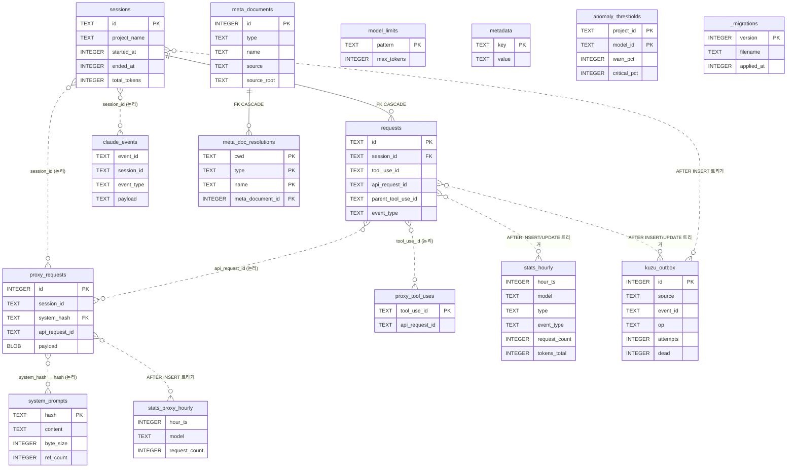

# 스토리지(Storage)

> SQLite(WAL) 기반 영속 계층. `migrations/` 파일 번호 기반 `PRAGMA user_version` 관리. 사전 집계(`stats_hourly`)로 차트 응답을 ~5ms 수준으로 유지.

---

## 문서 기준

| 항목 | 값 |
|------|-----|
| 시각 | 2026-06-06 16:44:03 KST |
| 커밋 | `4ea9686` |
| 태그 | `v4.4.0` |
| 마이그레이션 | `057-preview-encryption.sql` (`PRAGMA user_version = 57`) |

---

## 1. 개요

| 항목 | 값 | 비고 |
|------|-----|------|
| DB 파일 | `~/.spyglass/spyglass.db` | `connection.ts`의 `DEFAULT_DB_PATH` |
| 엔진 | SQLite (`bun:sqlite`) | `Database` 클래스 직접 import |
| Journal 모드 | WAL | `PRAGMA journal_mode = WAL` |
| 파일 권한 | DB `0600`, 디렉토리 `0700` | `applyFilePermissions()` |
| WAL autocheckpoint | 200 페이지 (~800KB) | STF 윈도우 단축 |
| 활성 테이블 수 | 15개 + 뷰 3개 | 아래 §3 참조 |

### 왜 SQLite인가

- 별도 DB 프로세스 불필요 — 사용자가 spyglass를 켜기만 하면 동작.
- WAL 모드에서 reader 다수 + writer 1개 패턴이 안전.
- `bun:sqlite`로 zero-dep, 네이티브 바인딩 없이 동작.
- 분석용 페이로드(JSON, zstd BLOB)를 단일 파일로 보관 — 백업·이동이 `cp` 한 줄.

---

## 2. 연결 관리

### `SpyglassDatabase` 클래스

`packages/storage/src/connection.ts`가 모든 DB 핸들을 캡슐화합니다.

```ts
import { getDatabase } from '@spyglass/storage';
const db = getDatabase();        // 싱글톤
const handle = db.instance;       // bun:sqlite Database
```

`ConnectionOptions`: `dbPath`, `walMode`(기본 true), `autoInit`(기본 true), `debug`(기본 false).

생성자 순서: 부모 디렉토리 생성 → `Database` 열기 → WAL PRAGMA 적용 → 마이그레이션 실행 → 파일 권한 강화 → `trackedInstances` 등록.

### 적용되는 PRAGMA

```sql
PRAGMA journal_mode = WAL;              -- writer 1 + reader N
PRAGMA busy_timeout = 5000;             -- 5초 재시도
PRAGMA synchronous = NORMAL;            -- WAL 결합 시 안전 최적값
PRAGMA cache_size = -64000;             -- 64MB 페이지 캐시
PRAGMA foreign_keys = ON;               -- FK 강제 (SQLite 기본 OFF)
PRAGMA journal_size_limit = 104857600;  -- WAL 100MB 상한
PRAGMA wal_autocheckpoint = 200;        -- ~800KB마다 자동 checkpoint
```

### 종료

`close()`는 멱등이며 **반드시 `PRAGMA wal_checkpoint(TRUNCATE)`를 먼저 수행**합니다. `-wal`, `-shm` 잔존 파일이 다음번 재오픈 시 `disk I/O error`를 일으키는 문제를 차단합니다.

---

## 3. 마이그레이션 시스템

`migrations/NNN-*.sql` 파일을 lexicographic 순서로 적용하는 단방향 시스템입니다.

### 동작 원리

`packages/storage/src/migrator.ts`의 `runMigrations(db, debug)`:

1. `PRAGMA user_version` 조회 → `currentVersion`
2. `migrations/` 디렉토리의 `.sql` 파일을 lexicographic 정렬, 파일명 prefix `NNN`을 버전 번호로 사용
3. `version > currentVersion`인 파일만 순차 적용
4. **PRAGMA가 아닌 모든 statement**를 `db.transaction()`으로 감싸 적용 후 `PRAGMA user_version = N` 갱신
5. 파일에 명시된 PRAGMA는 트랜잭션 밖에서 별도 실행
6. `version >= 35` 이고 `_migrations` 테이블이 존재하면 동일 트랜잭션에서 `INSERT OR REPLACE INTO _migrations`로 히스토리 기록

### 신규 마이그레이션 추가 절차

1. `migrations/NNN-<설명>.sql` 작성 (NNN = `currentMax + 1`, 3자리 0-padded, `IF NOT EXISTS` 멱등성)
2. 파일 내부에 `BEGIN/COMMIT` 금지 — migrator가 트랜잭션으로 감쌉니다. 트리거는 `BEGIN ... END;` 블록으로 작성 (`splitSqlStatements`가 보존)
3. `bun test packages/storage/src/__tests__/` — 빈 DB와 기존 DB 양쪽 검증

### 마이그레이션 이력 요약

파일은 `001`~`057`까지 존재합니다 (`041`~`046`·`054`는 결번 — migrator는 무해).

| 단계 | 버전 | 핵심 변경 |
|------|------|-----------|
| 초기 | 001~010 | `sessions`, `requests`, `tool_detail`, `turn_id`, `source`, `cache_tokens`, `claude_events`, `preview`, `tool_use_id`, `event_type` |
| 중기 | 011~020 | `tokens_confidence`, `proxy_requests`, `parent_tool_use_id`, `api_request_id`, 감사 메타 16개 |
| 중기-후반 | 021~035 | zstd 압축, `system_prompts`, `proxy_tool_uses`, `meta_documents`, `stats_hourly`, `_migrations` |
| 최근 | 036~040 | flow 호출그래프 인덱스, 서브에이전트 부모, rolling Skill/Task 부모, `v_flow_active_rows` |
| read-성능 | 047~048 | `getTurnsBySession` 복합 인덱스 4개, `getSessionSystemContextMeta` 가속 |
| 그래프-sync | 049~053 | `kuzu_outbox` 큐, 트리거 3종, DLQ, 하드닝 |
| at-rest | 055~057 | payload 암호화 algo 마커, preview 미러 컬럼 4종 편입 |

> `041`~`046`·`054`는 결번(미사용)입니다.

---

## 4. 스키마 개요

### 4.1 ERD



> 실선(`||--o{`)은 DB가 강제하는 FOREIGN KEY(`requests → sessions`, `meta_doc_resolutions → meta_documents`). 점선(`}o..o{`)은 논리적 연결 또는 트리거 전용 채널입니다.

### 4.2 테이블 분류

- **Raw 수집**: `sessions`, `requests`, `claude_events`, `proxy_requests`, `proxy_tool_uses`
- **카탈로그·정규화**: `system_prompts`, `meta_documents`, `meta_doc_resolutions`, `model_limits`
- **사전 집계**: `stats_hourly`, `stats_proxy_hourly`
- **운영 메타**: `metadata`, `anomaly_thresholds`
- **그래프 sync 큐**: `kuzu_outbox`
- **시스템 메타**: `_migrations`
- **뷰**: `correlated_requests`, `v_meta_doc_usage`, `v_flow_active_rows`

---

## 5. 핵심 테이블

### 5.1 `requests`

훅 기반 모든 요청(prompt / tool_call / system / response)의 1차 저장소.

- **식별**: `id`, `session_id` (FK CASCADE), `timestamp`
- **분류**: `type` CHECK `('prompt','tool_call','system','response')`, `event_type`, `tool_name`, `tool_detail`, `turn_id`
- **모델·토큰**: `model`, `tokens_input/output/total`, `cache_creation_tokens`, `cache_read_tokens`
- **신뢰도**: `tokens_confidence` (`high`/`error`), `tokens_source` (`transcript`/`proxy`/`unavailable`)
- **페어링·계층**: `tool_use_id`, `parent_tool_use_id`, `api_request_id`
- **페이로드**: `payload` (BLOB zstd or TEXT JSON), `payload_raw_size`, `payload_algo`
- **감사 메타**: `permission_mode`, `agent_id`, `agent_type`, `tool_interrupted`, `tool_user_modified`
- **기타**: `preview`, `source`, `slash_command`

**Pre/Post tool 쌍 처리**:
- `event_type='pre_tool'`: INSERT, SSE 미브로드캐스트
- `event_type='tool'`: 동일 `tool_use_id`의 pre_tool row를 UPDATE
- 조회 기본 필터: `event_type IS NULL OR event_type != 'pre_tool' OR tool_name = 'Agent'`
- 통계 필터: `event_type IS NULL OR event_type = 'tool'`

### 5.2 `proxy_requests` + `proxy_tool_uses`

HTTP 프록시 레이어가 캡처한 Anthropic API 호출 메트릭.

- `proxy_requests`는 `session_id`/`turn_id` 헤더 직접 매칭 + `system_hash` 참조.
- `proxy_tool_uses`는 proxy SSE 응답의 `content_block_start.tool_use`를 PostToolUse와 1:1 매핑.
- commit 트랜잭션 마지막에 `backfillRequestApiRequestIdByToolUse()`가 hook race로 NULL인 `requests.api_request_id`를 즉시 보정.

### 5.3 `system_prompts`

`body.system`을 hash 기반 dedup 저장.

- `hash` PK (SHA-256 hex 64자, content-addressable)
- `content` (정규화 본문, billing-header `idx[0]` 제외), `byte_size`, `ref_count`
- UPSERT: 동일 hash 재등장 시 `ref_count + 1`, `content`/`hash` 불변
- R3 at-rest: `content_algo` — `NULL`=평문, `'aes256gcm'`=암호문. `hash`는 평문 기준 SHA-256 유지

### 5.4 `stats_hourly` (사전 집계 SSoT)

차원: `(hour_ts, model, type, event_type)` UNIQUE. `hour_ts`는 Unix epoch **seconds**.

측정 컬럼:
- `request_count`
- `tokens_input/output/total` (전체)
- `cache_creation_tokens`, `cache_read_tokens`
- `duration_ms_sum`, `duration_ms_count`
- `tokens_input/output/total_high_sum`, `tokens_high_count` — `tokens_confidence='high'` 필터 재현용

트리거:
- `trg_stats_after_insert` — `COALESCE(NEW.event_type,'')` 정규화 후 UPSERT
- `trg_stats_after_update` — `OLD.event_type='pre_tool' AND NEW.event_type='tool'` 일 때만 발동

### 5.5 `kuzu_outbox` (그래프 sync 큐)

SQLite → Ladybug 증분 동기화 채널.

- `id` INTEGER PK AUTOINCREMENT — sync worker cursor 기준
- `source` CHECK `('requests','sessions')`, `event_id` TEXT, `op` CHECK `('insert','update','delete')`
- `attempts`, `last_error`, `dead` (0=정상, 1=DLQ 격리)

트리거 3종 (모두 `INSERT OR IGNORE` + `WHEN NEW.id IS NOT NULL` 가드):
- `trg_requests_to_kuzu_outbox` — AFTER INSERT → op='insert'
- `trg_sessions_to_kuzu_outbox` — AFTER INSERT → op='insert'
- `trg_requests_pre_to_tool_outbox` — AFTER UPDATE OF `event_type` WHEN `pre_tool→tool` → op='update'

소비자: `storage-graph` sync worker가 200ms tick으로 `id > cursor AND dead = 0` 폴링 → enrich → Ladybug MERGE → cursor advance.

---

## 6. At-Rest 암호화 (R3)

민감 본문 컬럼의 디스크 저장 직전 인증 암호화 — **옵트인**(`SPYGLASS_ENCRYPTION` env).

- **알고리즘**: AES-256-GCM. 프레이밍: `[version(1) | nonce(12) | tag(16) | ciphertext]`.
- **키 관리**: env `SPYGLASS_ENCRYPTION_KEY`(base64 32B) > 키파일 `~/.spyglass/encryption.key`(0600) > 최초 자동 생성.
- **옵트인**: `SPYGLASS_ENCRYPTION ∈ {1,true,yes,on}` 시 쓰기 암호화 활성. OFF면 평문(algo NULL).
- **읽기 호환**: 키 자료가 있으면 옵트인 플래그와 무관하게 복호 시도.

### 적용 대상

| 테이블·컬럼 | algo 컬럼 | 평문 마커 | 암호문 마커 |
|-----------|-----------|-----------|------------|
| `requests.payload` | `payload_algo` | `NULL` | `'aes256gcm'` |
| `claude_events.payload` | `payload_algo` | `NULL` | `'aes256gcm'` |
| `system_prompts.content` | `content_algo` | `NULL` | `'aes256gcm'` |
| `proxy_requests.payload` | `payload_algo` | `'zstd'` | `'zstd+aes256gcm'` |
| `requests.preview` | `preview_algo` | `NULL` | `'aes256gcm'` |
| `proxy_requests.request_preview` | `preview_algo` | `NULL` | `'aes256gcm'` |
| `proxy_requests.response_preview` | `preview_algo` | `NULL` | `'aes256gcm'` |
| `proxy_requests.system_preview` | `preview_algo` | `NULL` | `'aes256gcm'` |

> v4.2.9(Migration 057): preview 미러 컬럼 4종이 편입되었습니다. proxy 3컬럼은 원자 동시 기록이라 `preview_algo` 단일 공유, `requests.preview`는 payload와 독립 인코딩이라 별도 컬럼입니다.

코드 SSoT:
- `packages/storage/src/crypto.ts` — `encryptBytes`/`decryptBytes`
- `packages/storage/src/payload-codec.ts` — `encodeText`/`decodeText`, `encodeBlob`/`decodeBlob`
- `packages/storage/src/runtime/encryption.ts` — `getActiveKey()`, `shouldEncrypt()`

---

## 7. 데이터 보존(Retention)

`packages/server/src/runtime/maintenance.ts`가 일별 1회 cutoff 이전 데이터를 정리합니다.

cutoff SSoT: `packages/storage/src/runtime/retention.ts`의 `getRetentionCutoffTs()`(`SPYGLASS_RETENTION_DAYS`, 기본 30일).

- **RDB**: `deleteOldData(db, cutoff)` — requests / proxy_requests / claude_events / sessions / system_prompts / stats_hourly 정리 + `PRAGMA VACUUM`.
- **그래프**: `deleteOldGraphData(cutoff)` — Event/ToolCall/Turn/Session 노드만 `DETACH DELETE` → `CHECKPOINT`. MetaDocument/Agent 보존.

`stats_hourly`는 retention 직후 영향 받은 버킷만 `rebuildStatsHourly`로 재집계합니다(AFTER DELETE 트리거는 대량 삭제 시 비용 급증을 피하기 위해 두지 않음).

---

## 8. 외부 API와의 매핑

| Hook 이벤트 | 엔드포인트 | 저장 위치 |
|-------------|------------|-----------|
| `UserPromptSubmit` | `/collect` | `requests` (`type='prompt'`) |
| `PreToolUse` | `/collect` | `requests` (`type='tool_call'`, `event_type='pre_tool'`) |
| `PostToolUse` | `/collect` | `requests` UPDATE (`event_type='tool'`) |
| `SessionStart` | `/events` | `claude_events` + `sessions` reactivate |
| `SessionEnd` | `/events` | `claude_events` + `sessions.ended_at` |
| `Stop` | `/events` | `claude_events` + `requests` (`type='response'`) |
| `Notification` 등 | `/events` | `claude_events` |

**proxy → DB**:
1. 요청 인입: 헤더·body 파싱
2. `body.system` 정규화 → `system_prompts` UPSERT → `system_hash`
3. 응답 완료: SSE 파싱으로 `api_request_id`, tool_use 블록, tokens 누적
4. `proxy_requests` INSERT
5. `proxy_tool_uses` INSERT OR IGNORE
6. `backfillRequestApiRequestIdByToolUse()` — `requests.api_request_id` 즉시 채움

---

> **문서 기준**
> - 시각: 2026-06-06 16:44:03 KST
> - 커밋: `4ea9686`
> - 태그: `v4.4.0`
