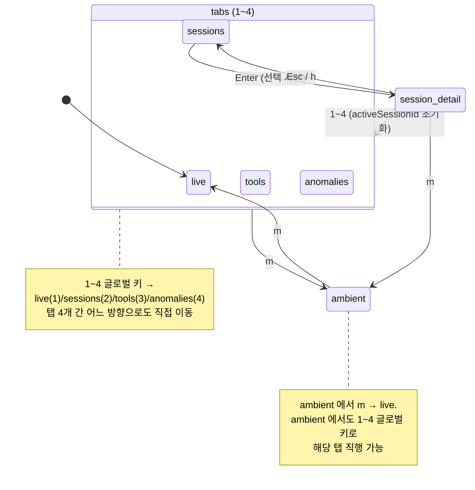
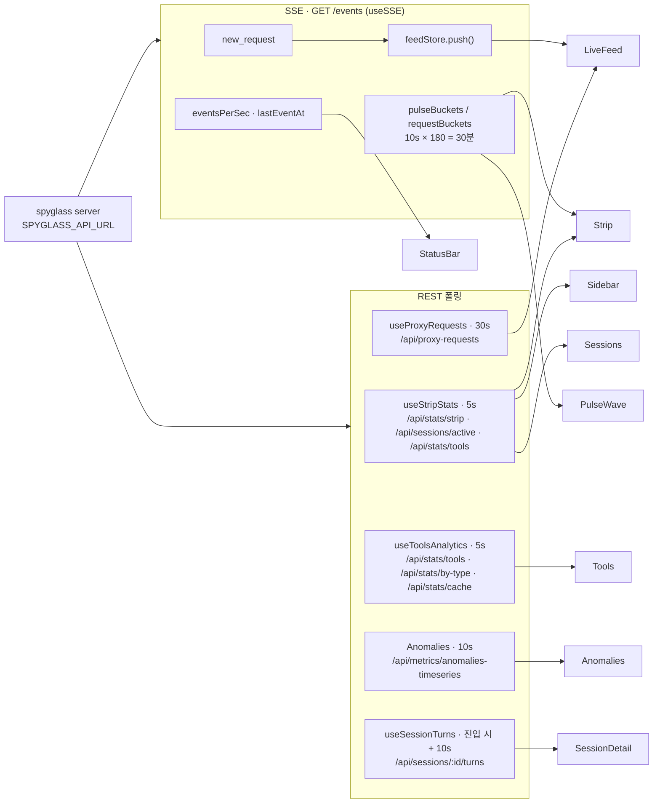

# TUI (Terminal UI)

> React Ink 5 기반 터미널 대시보드. 브라우저 없이 키보드만으로 실시간 요청 피드, 세션, 툴 통계, 이상 이벤트를 확인합니다.

---

## 문서 기준

| 항목 | 값 |
|------|-----|
| 시각 | 2026-06-06 16:44:03 KST |
| 커밋 | `4ea9686` |
| 태그 | `v4.4.0` |

---

> 연관 문서: [개요](./overview.md) · [웹 대시보드](./web.md) · [API & SSE](./api.md) · [데이터 흐름](./data-flow.md) · [운영](./operations.md)


claude-spyglass는 Claude Code 실행 활동을 실시간으로 들여다보는 모니터링 도구입니다.
TUI(Terminal UI, 터미널 사용자 인터페이스)는 같은 데이터를 브라우저 없이 키보드만으로
살펴볼 수 있게 해주는 두 번째 프런트엔드입니다. React Ink 기반으로 구현되어 있으며,
**6개 화면**(LiveFeed / Sessions / SessionDetail / Tools / Anomalies / Ambient)을 통해
라이브 요청 피드, 활성 세션, 툴 통계, 이상 이벤트, 회의실용 풀스크린 모드까지
다룹니다.

본 문서는 `packages/tui` 패키지의 실제 구성, 화면 구조, 키바인딩, 데이터 흐름을
한 곳에 정리한 운영·개발 참고서입니다.

> 연관 문서: [전체 아키텍처](./architecture.md) · [웹 대시보드](./web-dashboard.md)(자매 프런트엔드) ·
> [HTTP API](./api-http.md)(TUI가 폴링하는 REST/SSE 엔드포인트) · [데이터 흐름](./data-flow.md)(수집 → SSE) ·
> [설정](./configuration.md)(환경변수).


## 1. 개요

- **목적**: 웹 대시보드와 동일한 spyglass 서버에 SSE/REST로 연결해, 터미널 안에서 실시간
  요청 흐름·세션·툴 통계·이상 이벤트를 시각화.
  - SSE = Server-Sent Events, REST = HTTP REST API.
- **언제 쓰나**: SSH·tmux 등 GUI 없는 환경, 빠르게 "지금 뭐가 돌고 있나" 확인, 회의실 모니터.
- **스택**: React Ink 5 + React 18 / `asciichart` / `eventsource` (Bun에 표준 EventSource
  부재) / `i18next` (ko/en/ja/zh) / 런타임 Bun 1.2+.

### 시작 방법

```bash
bun start    # 서버 기동 (별도 터미널)
bun tui      # 루트 package.json 스크립트 → packages/tui/src/index.tsx 실행
```

| 환경변수 | 기본값 | 설명 |
| --- | --- | --- |
| `SPYGLASS_API_URL` | `http://127.0.0.1:9999` | TUI가 접속할 서버 (SSE / REST 모두) |
| `SPYGLASS_PROJECT` | (없음) | 표시할 프로젝트명. 미설정 시 `basename(cwd)` |
| `SPYGLASS_ALL_PROJECTS` | (없음) | `1`이면 프로젝트 필터 해제 |
| `SPYGLASS_LANG` | (없음) | `ko` / `en` / `ja` / `zh`. 미설정 시 시스템 로케일 → `ko`. CLI `--lang=en` / `--lang en`이 우선 |
| `SPYGLASS_NO_MOTION` | (없음) | `1`이면 스피너·플래시 끔 |
| `NO_COLOR` | (없음) | 표준. 비어 있지 않으면 16색 강제 |
| `COLORTERM` / `TERM` / `LANG` | — | truecolor / 유니코드 / 256색 자동 감지 |

언어 우선순위: CLI > `SPYGLASS_LANG` > 시스템 `LC_ALL`/`LANG` > 기본 `ko`.
종료는 `q` / `Q` / `Ctrl+C` 입니다. `useKeyboard`가 `onQuit`을 호출하면 `app.tsx`가
`process.exit(0)`을 실행합니다. 엔트리(`index.tsx`)는 Ink `render`의 `waitUntilExit()`을
대기하다 정상 종료 시 `exit(0)`, 에러 시 `exit(1)`로 빠져나갑니다.


## 2. 전체 레이아웃

TUI는 단일 페이지가 "여러 영역(panel)의 수직 스택"으로 구성됩니다.
`App` (`packages/tui/src/app.tsx`)이 다음 구조를 그립니다.

```
┌─────────────────────────────────────────────────────────────────────────────┐
│ [1] Live ◀   [2] Sessions   [3] Tools   [4] Anomalies          ← TabBar     │
├─────────────────────────────────────────────────────────────────────────────┤
│ ● PULSE · active                                  max 12k · last 30m        │
│    12k │             ▁▂▃▄▅▆▇█▇▆▅▄▃▂▁                                        │
│     6k │          ▁▂▃                ▃▂▁                                    │
│     0k │___▁▁▂______________________________________________▁▂______        │
│       -30m            -20m            -10m                          now     │
├─────────────────────────────────────────────────────────────────────────────┤
│ ▔▔▔▔▔   ▔▔▔▔▔   ▔▔▔▔▔   ┌─ Sessions ───────────────────  21 req ─┐          │
│  REQ/MIN P95 ms  ERR %  │ ▸ S-abc123  4m  ████░  12 req           │  ← Strip│
│   12     420ms   0.0%   │   S-def456  9m  ██░░░   3 req           │         │
│  ▲ +8%   ·       ·      └────────────────────────────────────────┘          │
│ ▁▁▁▁▁   ▁▁▁▁▁   ▁▁▁▁▁                                                       │
├──────────────┬──────────────────────────────────────────────────────────────┤
│ Sidebar      │   Main Panel (현재 view에 해당하는 Screen)                   │
│ ┌ name ───┐  │   ┌ Live Feed · 312 req · follow ● ─────────────────────┐    │
│ │ ▶ ● S-… │  │   │ ◆ [end_turn] sonnet-4-7   사용자 메시지 처리 완료…  │    │
│ │   ● S-… │  │   │ 14:02:31 R Read         src/app.tsx          +1.2k 80ms  │
│ │   ● S-… │  │   │ 14:02:32 $ Bash         bun test               +320  …   │
│ └─────────┘  │   └──────────────────────────────────────────────────────┘   │
│ Tools today  │                                                              │
│ ▮▮▮ Read     │                                                              │
│ ▮▮  Bash     │                                                              │
├──────────────┴──────────────────────────────────────────────────────────────┤
│ [1] live  [2] sessions  [3] tools  [4] anomalies          ▮ 7 ev/s          │
│                                              ↑ StatusBar (hints + telemetry)│
└─────────────────────────────────────────────────────────────────────────────┘
```

영역별 역할:

| 영역 | 파일 | 책임 |
| --- | --- | --- |
| TabBar | `components/nav/TabBar.tsx` | 4개 메인 탭, 활성 탭에 ` ◀` |
| PulseWave | `components/signature/PulseWave.tsx` | 30분 토큰 처리량 라인 차트(6행) |
| Strip | `components/layout/Strip.tsx` | BigKpi 3개(REQ/MIN, P95, ERR%) + Sessions 사이드 박스 |
| Sidebar | `components/layout/Sidebar.tsx` | 세션 목록 + "Tools · today" 미니 BarChart. `breakpoint.md`(100) 미만 시 자동 숨김 |
| Main | `screens/*` | 현재 `view` 화면을 `PanelBoundary` 안에서 렌더 |
| StatusBar | `components/nav/StatusBar.tsx` | 좌: 키 힌트, 우: freeze·Staleness·Ticker·ev/s |
| HelpOverlay | `components/overlays/HelpOverlay.tsx` | `?` 모달 (2단 키맵) |
| Ambient | `screens/Ambient.tsx` | 풀스크린 PulseWave 단독 |

`ResponsiveShell`이 `useStdout()`으로 터미널 컬럼을 구독해 100칸 미만이면 사이드바를
숨깁니다. 크기 토큰은 `design-tokens.ts`의 `tokens.layout`에서 가져옵니다
(`breakpoint`, `sidebarWidth.default=28`, `stripHeight=6`, `statusBarHeight=1`).


## 3. 스크린 목록

`types.ts`의 `ScreenId`가 SSoT(Single Source of Truth, 단일 진실 공급원)입니다.

```ts
export type ScreenId =
  | 'live'           // LiveFeed
  | 'sessions'       // Sessions
  | 'session-detail' // SessionDetail (sessions 에서 Enter 시 진입)
  | 'tools'          // Tools
  | 'anomalies'      // Anomalies
  | 'ambient';       // Ambient (풀스크린 모드)
```

| ScreenId | 진입 키 | 컴포넌트 | 한 줄 요약 |
| --- | --- | --- | --- |
| `live` | `1` | `LiveFeed` | SSE로 들어오는 요청을 1행씩 흘리는 기본 화면 |
| `sessions` | `2` | `Sessions` | 활성 세션 목록을 풀스크린으로 |
| `session-detail` | `sessions` 에서 `Enter` | `SessionDetail` | 선택 세션의 Turn 목록 + 토큰 트리 |
| `tools` | `3` | `Tools` | 툴 호출 통계 5탭(overview/tokens/cache/types/perf) |
| `anomalies` | `4` | `Anomalies` | 최근 이상 이벤트(P0/P1/P2) 12개 |
| `ambient` | `m` | `Ambient` | 회의실 빔프로젝터용 풀스크린 PulseWave |

`m` 키는 `ambient` ↔ `live` 간을 토글합니다 — 현재 화면이 `ambient`이면 `live`로, 아니면 `ambient`로 전환합니다(이전 화면 정보를 보관하지 않음). 출처: `app.tsx`의 `onAmbient` (`setView((v) => (v === 'ambient' ? 'live' : 'ambient'))`).

화면 전이(`app.tsx`의 `view` state 머신).
`1`~`4`와 `m`은 `useKeyboard`의 글로벌 키이므로 **어느 화면에서나** 해당 탭/Ambient로 직접 이동합니다.
아래 다이어그램은 1~4 탭 간 상호 전이가 전 화면에서 가능함을 압축 표기하고, 화면 고유 전이(`Enter` 진입, `Esc`/`h` 복귀, `m` Ambient 토글)를 함께 보여줍니다.




## 4. 각 스크린별 상세

### 4.1 LiveFeed (`1`) — `screens/LiveFeed.tsx`

**목적**: SSE `new_request`를 받는 즉시 위쪽에 prepend(앞쪽 삽입)합니다.
`pre_tool` → `tool` 라이프사이클은 같은 행에서 in-place 업데이트되며, `feedStore`가
`tool_use_id` 인덱스를 유지합니다.

**표시 데이터**:
- 최상단 1행 `LatestResponseBar`: 최근 `end_turn` 어시스턴트 응답 프리뷰 (`useProxyRequests`, 30s 폴링).
- 검색바(`/` 입력 시): tool / target / session ID 8자 부분 일치 필터.
- 행(`ToolRow`) 컬럼 폭(모두 ASCII 1자 기준):
  ```
  prefix(4) clock(8) icon(1) tool(14) target(dyn) tokens(8) [*] dur(7) session(8)
  ```
  자식 도구는 prefix `+-  `, root는 공백 4칸. `tokens_confidence !== 'high'`이면 dim + ` *`
  표지(data-honesty-ui).
- 펼친 행(`DetailBox`, `Enter`): `TokenTree`, 세션 ID, 모델명, 소요시간 + 액션 힌트.

**키바인딩**:

| 키 | 동작 |
| --- | --- |
| `↑↓` / `j` / `k` | 행 선택 (선택 시 자동으로 paused 상태로 전환) |
| `g` / `G` | 맨 위 / 맨 아래로 이동 |
| `f` | follow 모드 토글 |
| `Enter` | 행 확장(DetailBox 열기) |
| `/` | 검색 모드 진입 |
| `Esc` | 검색 클리어 또는 펼친 행 닫기 |

> `Space`(freeze 토글)는 LiveFeed 전용이 아니라 글로벌 키입니다(§5.1). LiveFeed의 자체 `useInput`은 위 키만 처리하고, freeze 는 `useKeyboard` 라우터에서 `feedStore.setFreeze`로 직접 처리됩니다.

**인터랙션**:
- `useFollowMode`가 `following` / `paused` FSM(Finite State Machine, 유한 상태 기계)을
  관리합니다. paused 상태에서 새 행이 prepend되면 `selectedIdx += 1` 보정이 일어나
  보고 있던 행이 시야 밖으로 밀려나지 않습니다.
- Freeze 중에는 새 SSE 이벤트가 폐기되고 우하단 `[FROZEN]` 배지가 표시됩니다.
- feedStore 용량은 `tokens.buffer.feedMax = 500` 행이며, 초과 시 꼬리부터 drop됩니다.

### 4.2 Sessions (`2`) — `screens/Sessions.tsx`

**목적**: 활성 세션의 풀스크린 목록을 보여줍니다.

**표시 데이터**: `/api/sessions/active`를 폴링하며 프로젝트 필터를 적용합니다.
각 행은 `▶` 선택 마커 · ● 색점 · `S-{8자}` · (showAll 시) 프로젝트명 · `tok ...` ·
`Gauge(0/200_000)` · `Turn N` 으로 구성됩니다.

**키바인딩**:

| 키 | 동작 |
| --- | --- |
| `↑↓` / `j` / `k` | 세션 선택 이동 |
| `Enter` | 선택 세션의 디테일(SessionDetail)로 진입 |

### 4.3 SessionDetail — `screens/SessionDetail.tsx`

**목적**: Sessions 화면에서 `Enter`로 진입하는 세션별 상세 뷰입니다.

**표시 데이터**: `useSessionTurns(apiUrl, sessionId)`로 HTTP fetch합니다.
`TurnCard` 한 개는 헤더(`Turn N · 시각 · duration · 툴개수 · +tokens · endReason`),
프롬프트 1줄, `ToolRow` 목록, `TokenTree` 푸터로 구성됩니다.
**`endReason`은 DB `stop_reason` 원본을 그대로 노출**합니다(가짜 `end_turn` 합성 금지,
data-honesty-ui).

**키바인딩**:

| 키 | 동작 |
| --- | --- |
| `Esc` / `h` | 뒤로 (Sessions로 복귀) |
| `1` ~ `4` | 다른 메인 탭으로 이동(디테일 닫힘) |

### 4.4 Tools (`3`) — `screens/Tools.tsx`

**목적**: 툴 호출 통계를 5개 서브탭으로 분석합니다.

**표시 데이터**: `useToolsAnalytics`가 `/api/stats/tools`, `/api/stats/by-type`,
`/api/stats/cache`를 5초 주기로 폴링합니다.

| 서브탭 | 표시 |
| --- | --- |
| `overview` | 상위 10개 툴 호출수 `BarChart` (아이콘 prefix) |
| `tokens` | 툴별 avg 토큰 막대. low-confidence 행은 dim + ` *` |
| `cache` | Hit Rate `Gauge` + cache_read/creation `TokenTree` + savings rate |
| `types` | `tool_call` / `prompt` / `system` 별 호출수+토큰 |
| `perf` | p95 duration, error rate, calls. 임계값별 색상 |

**키바인딩**:

| 키 | 동작 |
| --- | --- |
| `Tab` / `Shift+Tab` | 서브탭 순환 |
| `t` | 시간 범위 순환 (`1h → 6h → 24h → 7d`, `lib/time-range.ts`) |

### 4.5 Anomalies (`4`) — `screens/Anomalies.tsx`

**목적**: 최근 이상 이벤트(P0/P1/P2)를 12건까지 노출합니다.

**표시 데이터**: `/api/metrics/anomalies-timeseries?range=`를 10초 주기로 폴링합니다.
한 행 포맷: `[P0|P1|P2] HH:MM:SS kind S-{6자} tool_name detail`.
색상은 P0=danger / P1=warning / P2=muted.

**키바인딩**:

| 키 | 동작 |
| --- | --- |
| `t` | 시간 범위 순환 (`1h → 6h → 24h → 7d`) |

> Anomalies 화면에는 서브탭이 없으므로 Tab / Shift+Tab 키를 사용하지 않습니다.

### 4.6 Ambient (`m`) — `screens/Ambient.tsx`

**목적**: "회의실 모니터" 풀스크린 모드입니다. 빔프로젝터·대형 디스플레이용.

**표시 데이터**: TabBar / Strip / Sidebar 없이 큰 타이틀(`claude · spyglass`) +
메타라인(시각 · sessions · tok) + PulseWave(너비 `max(20, min(width − 4, 80))`)만
노출합니다. 본문 색은 600초마다 primary → info → accent로 순환합니다.

**키바인딩**:

| 키 | 동작 |
| --- | --- |
| `m` | Ambient 종료(직전 화면 복귀) |
| `q` | 프로그램 종료 |
| `?` | Help 모달 열기 |


## 5. 공통 키바인딩

`useKeyboard` (`hooks/useKeyboard.ts`)가 최상위 키 라우터이고, `HelpOverlay`(`?`)가
화면 안에서 보는 cheatsheet입니다.

### 5.1 글로벌 (모든 화면에서 유효)

| 키 | 동작 |
| --- | --- |
| `1` ~ `4` | 메인 탭 이동(live / sessions / tools / anomalies) |
| `m` | Ambient 토글 |
| `z` | 사이드바 숨김 토글 |
| `Space` | feedStore freeze 토글 |
| `?` | Help 모달 열기 |
| `q` / `Q` / `Ctrl+C` | 프로그램 종료 |

예약(HelpOverlay cheatsheet 에는 노출되나 App 레벨에서 동작 안 함): `r` SSE 재연결,
`Ctrl+L` 강제 리드로우, `:` 명령 팔레트. `r`/`o` 콜백은 `useKeyboard`에 정의돼 있지만
`app.tsx`가 `onReconnect`/`onSession`을 전달하지 않고, `Ctrl+L`/`:`는 라우터에 핸들러 자체가
없습니다.

### 5.2 스크린별

| 분류 | 키 | 동작 |
| --- | --- | --- |
| 리스트 네비 | `↑↓` / `j` / `k` | 이동 |
| 리스트 네비 | `Enter` | 확장 / 진입 |
| 리스트 네비 | `Esc` / `h` | 뒤로 |
| LiveFeed 전용 | `f` | follow 토글 |
| LiveFeed 전용 | `g` / `G` | top / bot |
| LiveFeed 전용 | `/` | 검색 진입 |
| Tools 전용 | `Tab` / `Shift+Tab` | 서브탭 순환 |
| Tools / Anomalies | `t` | 시간 범위 순환 |
| 모달(HelpOverlay) | `?` / `Esc` / `q` | 닫기 |


## 6. 컴포넌트 카탈로그

`components/` 하위는 카테고리별로 정리돼 있습니다. 아래 표는 카테고리 → 컴포넌트 →
책임 순으로 그룹화되어 있습니다.

### 6.1 layout — 화면 골격

| 컴포넌트 | 책임 |
| --- | --- |
| `ResponsiveShell` | `useTermCols` / `useTermRows`로 컬럼 추적, breakpoint 미만이면 sidebar 숨김 |
| `MainPanel` | 활성 화면의 포커스 영역 래퍼. `Card`를 `flexGrow=1`로 감싸 남은 공간을 채움 |
| `Sidebar` | 세션 목록 8개 + "Tools · today" BarChart |
| `Strip` | BigKpi 3개(REQ/MIN, P95, ERR%) + SessionsSidebar 박스 |

### 6.2 nav — 탐색·상태

| 컴포넌트 | 책임 |
| --- | --- |
| `TabBar` | 4개 메인 탭. 활성 탭은 primary 색 + ` ◀` |
| `StatusBar` | 좌측 hint 배열, 우측 `[FROZEN]` · StalenessIndicator · Ticker · ev/s |

### 6.3 display — 데이터 표시

| 컴포넌트 | 책임 |
| --- | --- |
| `Card` | 경계선 박스 + 옵션 타이틀 + tone(default / danger / warning / success) |
| `BigKpi` | round 보더 박스 안 5줄: 상단 바(`▔`) / 라벨 / 값(+단위) / 델타(▲▼·)+Sparkline / 하단 바(`▁`) |
| `ToolRow` | LiveFeed의 단일 행. 컬럼 폭 고정, ASCII 1자 글리프 정렬 보장 |
| `TurnCard` | SessionDetail의 Turn 1개. 헤더 + 프롬프트 + 툴 + TokenTree 푸터 |
| `TokenTree` | input / output / cache_read / cache_creation / total 트리 |
| `Badge` / `Ticker` | tone 색 라벨 / 이벤트 도착 시 400ms ▮ ↔ ▯ 플래시 |
| `Divider` | `── LABEL ────` 형식의 섹션 구분선 |
| `Icon` | 툴 아이콘 단일 해석 지점. `lib/tool-icon.ts`의 `toolIconForRecord(record)` 위임 → `tokens.icon.*` ASCII 글리프 + 색. `event_type='pre_tool'`(spinning)이면 `Spinner variant="tool"` 렌더. `StateIcon`은 ok/err/warn/info/running/idle 상태 글리프 별도 제공 |
| `KeyValue` | 정렬된 LABEL · VALUE 행 쌍 |
| `Timestamp` | 자체 틱(self-tick)하는 dim 색상 시각 표시 |

### 6.3-b primitives — 저수준 레이아웃 프리미티브

`components/primitives/index.tsx`가 제공하는 토큰 기반 기초 컴포넌트입니다. 신규 코드는
이 파일을 통해 `Box` / `Text` / 공용 프리미티브를 가져와야 합니다.

| 컴포넌트 | 책임 |
| --- | --- |
| `Box` | `ink`의 `Box` 재-export (import 경로 통일) |
| `Text` | `ink`의 `Text` 재-export (import 경로 통일) |
| `Spacer` | 토큰 단위 빈 공간 (`cols` / `rows` 옵션). 매직 넘버 사용 금지 |
| `Label` | ALL CAPS 소문자 라벨 (`tokens.color.muted.fg`, 문자열 자동 대문자 변환) |
| `Metric` | L1 히어로 숫자 — bold 값 + dim 단위 조합 |
| `Code` | `ink` `Text` props를 그대로 전달하는 인라인 코드 래퍼 |

### 6.4 charts — 차트

| 컴포넌트 | 책임 |
| --- | --- |
| `BarChart` | 가로 막대 차트. label / value / (prefix / color) 시리즈 |
| `Gauge` | 0..1 비율 게이지. thresholds로 warn / danger 색상 분기 |
| `Sparkline` | 8칸 미니 라인 (BigKpi 내부에서 사용) |

### 6.5 signature — 시그니처 비주얼

| 컴포넌트 | 책임 |
| --- | --- |
| `PulseWave` | asciichart 기반 30분 토큰 라인. idle / active / spike 색상 |

### 6.6 feedback — 상태 피드백

| 컴포넌트 | 책임 |
| --- | --- |
| `Spinner` | tool / net / bg / agent variant. 100~250ms ASCII 4프레임 |
| `RowAccent` | 새 행 좌측 ASCII `\|`(`tokens.icon.stripe`) 스트라이프. enter(0–80ms) primary → hold(80–500ms) info → decay(500–1200ms) muted → baseline(>1200ms) 공백으로 1.2s 페이드. 선택 행은 항상 primary 솔리드 `\|` |
| `PanelBoundary` | 패널 단위 ErrorBoundary. 실패 시 `.spyglass-errors.log` 기록 |
| `StalenessIndicator` | SSE 2s 무응답 시 `⚠ reconnecting`, 회복 시 `✓ live` |

### 6.7 overlays — 모달

| 컴포넌트 | 책임 |
| --- | --- |
| `HelpOverlay` | `?` 모달. 6 카테고리 2단 그리드. `?` / `Esc` / `q`로 닫기 |

`derivePulseState(buckets, lastEventAt)`가 idle / active / spike 상태를 판정합니다
(`idle` = 30초 무이벤트, `spike` = 최근 평균 대비 2.4배 + 1000 토큰 초과).


## 7. 상태 관리

**로컬 React state + 1개 외부 스토어** 패턴을 씁니다. Redux / Zustand는 사용하지 않습니다.

**`stores/feed-store.ts` (FeedStore)** — 단일 인스턴스를 `useSyncExternalStore`로 구독합니다.

- `rows: Request[]` — 최신순 링버퍼 (cap `tokens.buffer.feedMax = 500`).
- `byKey: Map<string,number>` — `tool_use_id || id` 인덱싱으로 O(1) in-place 업데이트.
- `pending` + `queueMicrotask(flush)` — 같은 틱의 다수 SSE를 1회 렌더로 코얼리스(병합).
- `push()`는 freeze 중이면 drop 카운트만 +1 하고, 아니면 pending 큐에 적재합니다.
- `flush()`는 동일 key를 머지하고, 새 key는 `unshift`로 앞쪽에 삽입하며, 초과분은 꼬리부터 drop합니다.
- 핵심 의도: `pre_tool` → `tool` 라이프사이클에서 행을 **같은 위치**에서 업데이트해
  로그가 튀지 않게 하는 것.

**App.tsx state**: `view`, `zoom`, `selectedIndex`, `activeSessionId`, `timeRange`,
`helpOpen`. `safeSelected`가 sessions 길이 변화 시 인덱스를 clamp(범위 제한)합니다.

**`useFollowMode`** (LiveFeed 전용): `following` / `paused` FSM(Finite State Machine).
paused 상태에서 새 행이 prepend되면 `selectedIdx += 1` 보정이 일어납니다.


## 8. 데이터 소스

TUI는 `SPYGLASS_API_URL` 한 곳에서 SSE / REST 두 채널을 병행해서 사용합니다.



**SSE — `GET /events`** (`hooks/useSSE.ts`, `eventsource` npm 패키지 사용 — Bun에는 표준
EventSource가 없기 때문):

- `new_request` → `feedStore.push()`.
- `session_update` / `ping` / `message` → 연결이 살아 있음을 알리는 신호.
- `error` → 1s → 15s 지수 백오프 재연결.
- 상태값: `connecting | open | reconnecting | closed`, `eventsPerSec`(1s 카운터),
  `lastEventAt`(Staleness 표시용), `pulseBuckets`(10초 × 180 = 30분 토큰 합계),
  `requestBuckets`(같은 차원의 요청수, REQ/MIN 산출용).

**REST 폴링**:

| 훅 | 엔드포인트 | 주기 | 화면 |
| --- | --- | --- | --- |
| `useStripStats` | `/api/stats/strip`, `/api/sessions/active`, `/api/stats/tools` | 5s | Strip, Sidebar, Sessions |
| `useToolsAnalytics` | `/api/stats/tools`, `/api/stats/by-type`, `/api/stats/cache` | 5s | Tools |
| Anomalies 내부 | `/api/metrics/anomalies-timeseries?range=` | 10s | Anomalies |
| `useSessionTurns` | `/api/sessions/:id/turns` | 진입 시 + 10s | SessionDetail |
| `useProxyRequests` | `/api/proxy-requests?limit=20` | 30s + `new_proxy_request` SSE 트리거 시 | LiveFeed LatestResponseBar |

서버 응답이 `call_count` / `error_count` vs TUI `ToolStat`의 `calls` / `error_rate`처럼
필드명이 달라, `useToolsAnalytics`는 `mapToolRow(raw → ToolStat)`로, `useStripStats`는
인라인 `call_count ?? calls` 폴백으로 정규화합니다. TUI 전용 타입은 `src/types.ts`에
있고, 공유 `Session` 타입은 `@spyglass/types`에서 가져옵니다. 언어 코드(`Lang`) 해석
유틸 `resolveLang`/`isLang`/`DEFAULT_LANG`도 `@spyglass/types`에서 가져옵니다.


## 9. 디자인 토큰

`src/design-tokens.ts`가 **TUI 색·간격·아이콘의 SSoT(Single Source of Truth,
단일 진실 공급원)** 입니다. 컴포넌트는 반드시 `tokens.color.*` 같은 시맨틱 토큰을
통해서만 색을 사용해야 하며, hex 리터럴 직접 사용은 금지입니다.

### 색상 팔레트 (Tokyo Night 9)

| 토큰 | hex | 16색 폴백 | 용도 |
| --- | --- | --- | --- |
| `primary` | `#7aa2f7` | cyan | 활성 탭, 강조 |
| `success` | `#9ece6a` | green | 토큰 증가, OK |
| `warning` | `#e0af68` | yellow | freeze, 검색바, 임계값 |
| `danger`  | `#f7768e` | red | 에러, P0 |
| `info`    | `#7dcfff` | cyan | pre_tool 스피너, 보조 정보 |
| `accent`  | `#bb9af7` | magenta | agent/mcp, 프롬프트 마커 |
| `muted` / `fg` / `bgElev` | `#565f89` / `#c0caf5` / `#1a1b26` | gray / white / black | dim 라벨 / 본문 / 배경 |

그라데이션: `tokenUsageLut`(컨텍스트 사용률 7-stop), `heatmapLut`(히트맵 5단계),
`color.scale.percentile`(p0/p50/p95).

### 모션·아이콘

- `motion.spinner` — tool / net / bg / agent 4종 ASCII 회전자. 모두 1자 폭으로 통일
  (`tui-glyph-ascii ADR-001`).
- `icon.file.{read,edit,write,delete}` = `R / E / W / X`
- `icon.search.{grep,glob,web}` = `? / ? / @`
- `icon.bash.{exec,kill}` = `$ / K`, `icon.mcp.default` = `M`, `icon.agent.d0` = `A`

이 모든 글리프는 어떤 터미널·로케일에서도 visual width = 1이 보장돼 컬럼 정렬이
안전합니다.

### 레이아웃·버퍼 토큰

```ts
tokens.layout = { breakpoint, sidebarWidth, stripHeight, statusBarHeight }
tokens.buffer = { feedMax: 500, sessionLru: 50, anomalyMax: 100, chartBuckets: 180 }
tokens.border = { none, subtle: 'round', default: 'single', focused: 'bold', modal: 'double' }
```

`lib/capabilities.ts`가 `COLORTERM`, `TERM`, `LANG` 환경변수를 보고 truecolor / 유니코드 /
braille 등의 가용성을 감지합니다. `NO_COLOR`가 설정되면 16색 모드로 강제 다운그레이드되고,
`SPYGLASS_NO_MOTION=1`이면 `motion=false`로 동작합니다.


## 10. 트러블슈팅

| 증상 | 점검 | 해결 |
| --- | --- | --- |
| `Waiting for Claude activity…`만 나옴 | 서버 기동 여부 (`bun status` / `curl :9999/health`), `SPYGLASS_API_URL` 값, 우하단 StalenessIndicator 상태 | 서버가 죽었으면 재기동. 다른 프로젝트의 활동을 보려면 `SPYGLASS_ALL_PROJECTS=1` 설정 |
| 행이 깨지거나 컬럼이 어긋남 | TUI는 모든 글리프가 ASCII 1자 폭 전제(`tui-glyph-ascii ADR-001`). `tool_detail` / `payload`가 멀티라인인지 확인 | `lib/format.ts`의 `sanitizeOneLine`이 정규화하므로, 새 경로가 이 함수를 우회하지 않는지 검토 |
| 색이 흑백처럼 보임 | `echo $NO_COLOR`, `echo $COLORTERM` 으로 환경변수 확인 | truecolor 터미널이면 `export COLORTERM=truecolor` 설정 |
| 키 입력 무반응 | TTY 여부 확인. non-TTY 환경(CI 로그 캡처 등)에서는 `useInput`이 동작하지 않음. 모달이 열려 있는지도 확인 | 실제 PTY에서 실행. 모달이 떠 있다면 `Esc`로 닫고 재시도 |
| PulseWave가 footer와 겹침 | `dataWidth = max(8, width − 8 − 2)` 계산이 호출 측 컨테이너 width와 일치하는지 확인 | 컨테이너 width와 PulseWave width를 동일하게 전달 (Ambient 구현 참고) |
| 한 패널만 빨간 박스 | `PanelBoundary`가 잡은 에러. 스택은 `.spyglass-errors.log`에 append됨 | SSE 페이로드 스키마 변경이 원인인 경우가 많음. 로그 확인 후 매핑 함수 수정 |
| Tools 화면 `No tool calls yet` | 현재 시간 범위가 너무 짧을 가능성 | `t` 키로 `7d`까지 범위를 늘려보고, 그래도 비면 `bun rebuild-stats` 실행 |

> TUI 안에서는 `console.log` 사용을 금지합니다(화면이 깨짐). 디버그는 파일 append
> 패턴을 쓰세요 (`PanelBoundary` 구현 참고).


## 부록. 자주 참조하는 파일

```
packages/tui/src/
├── index.tsx                # entry: i18n init → render(<App />)
├── app.tsx                  # root: view state, 키 라우팅, 레이아웃 조립
├── design-tokens.ts         # 색·간격·아이콘 SSoT
├── i18n.ts / types.ts       # i18n 부트, 공유 타입
├── screens/                 # LiveFeed/Sessions/SessionDetail/Tools/Anomalies/Ambient
├── components/
│   ├── layout/    ResponsiveShell, Sidebar, Strip
│   ├── nav/       TabBar, StatusBar
│   ├── display/   Card, BigKpi, ToolRow, TurnCard, TokenTree, Ticker
│   ├── charts/    BarChart, Gauge, Sparkline
│   ├── signature/ PulseWave
│   ├── feedback/  Spinner, RowAccent, PanelBoundary, StalenessIndicator
│   └── overlays/  HelpOverlay
├── hooks/
│   ├── useSSE.ts            # /events 구독 + 30분 버킷 집계
│   ├── useStripStats.ts     # Strip/Sidebar 폴링 (5s)
│   ├── useToolsAnalytics.ts # Tools 폴링 (5s)
│   ├── useSessionTurns.ts   # SessionDetail fetch
│   ├── useProxyRequests.ts  # LatestResponseBar (30s)
│   ├── useFeed.ts           # feedStore 구독
│   ├── useFollowMode.ts     # following/paused FSM
│   ├── useKeyboard.ts       # 글로벌 키 라우터
│   └── useCapabilities.tsx  # 터미널 능력 context
├── stores/feed-store.ts     # tool_use_id 키 ring buffer (cap 500)
└── lib/                     # capabilities, current-project, detect-lang, format,
                             # time-range, tool-icon, gradient

packages/tui/locales/        # src 형제 디렉토리 (src 내부 아님)
                             # ko/en/ja/zh × 5 namespace(common/request/badges/session/ui) = 20 JSON
                             # i18n.ts가 정적 import로 번들에 포함
```
