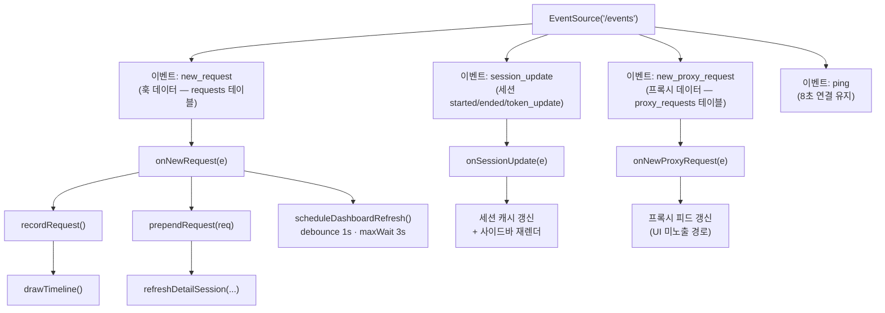

# Web Dashboard 사용자 가이드

## 한눈에 보기

`claude-spyglass`의 웹 대시보드는 **로컬 SQLite에 적재된 Claude Code 세션을 실시간으로 시각화**하는 SPA입니다. 프로젝트·세션 탐색, 요청 추이, 캐시 적중률, 도구 호출 통계, Behavior Definitions 카탈로그를 한 화면에서 제공합니다. 외부 전송 없이 모든 데이터는 로컬에만 존재합니다.

| 항목 | 값 |
|------|----|
| URL | `http://localhost:9999/` |
| 기본 포트 | `9999` (환경변수 `SPGLASS_PORT`로 변경) |
| 데이터 소스 | `~/.spyglass/spyglass.db` (SQLite) |
| 실시간 갱신 | SSE `/events` (`new_request`, `new_proxy_request`, `session_update`) |
| 헬스 체크 | `/health` |
| 빌드 | 없음 — Vanilla JS(ESM) + Vanilla CSS |

본 문서는 **사용자 가이드**입니다. 내부 구현(JS 모듈, 핵심 함수)은 5~6장에 코드 경로와 함께 정리되어 있습니다.

---

## 1. 개요

웹 대시보드는 `~/.spyglass/spyglass.db`에 적재된 데이터를 로컬 브라우저에서 시각화합니다. 새 요청은 SSE로 즉시 push되고, 기존 패널은 폴링 없이 in-place 갱신됩니다.

### 서버 구성

| 항목 | 경로 |
|------|------|
| HTML 진입점 | `packages/web/index.html` (Bun이 `Bun.file()`로 서빙) |
| 정적 분기 | `packages/server/src/runtime/dispatch.ts` |
| REST 진입점 | `packages/server/src/api.ts` |
| 라우트 | `packages/server/src/routes/*` |
| 정적 자산 | `/assets/*`, `/locales/{ko,en,ja,zh}/*.json` |
| 기본 포트 정의 | `packages/server/src/runtime/config.ts` — `DEFAULT_PORT` |

`index.html`은 `<script type="module" src="/assets/js/main.js">` 한 줄로 진입점을 로드합니다.

---

## 2. 화면 레이아웃

대시보드는 **3-컬럼 + 헤더/푸터** 구조입니다. 좌측 56px 폭의 **앱 모드 rail**, 그 옆 **좌측 패널**(프로젝트/세션/옵저빌리티), 가운데~우측 **메인 영역**으로 구성됩니다. `<body data-app-mode>` 속성으로 두 가지 모드(browse / metadocs)가 전환됩니다.

### 2.1 browse 모드 (기본, rail 🚥)

```
+----+-----------------+------------------------------------------------+
| #errorBanner (SSE 끊김 시에만 표시)                                    |
+----+-----------------+------------------------------------------------+
|    | left-panel      | right-panel (main)                             |
|    | +-------------+ | +--- chartSection (#chartSection) -----------+ |
|    | | projects    | | | [요청 추이 (실시간)] [언어][전체|오늘|주]  | |
| r  | | (#browser   | | +--- charts-inner ---------------------------+ |
| a  | |  ProjectsB.)| | |  timeline-meta (품질 / 누적)               | |
| i  | +-- handle ---+ | |  +-- timelineChart canvas ---------------+ | |
| l  | | sessions    | | |  +---------------------------------------+ | |
|    | | (#browser   | | |  donut(typeChart) + cache-panel(Hit/Ratio) | |
| 🚥 | |  SessionsB.)| | +--------------------------------------------+ |
|    | +-- handle ---+ | +--- content-switcher -----------------------+ |
| 📚 | | obs panel   | | |  #defaultView: 최근 요청 피드 (#feedBody)  | |
|    | | 4 cards     | | |    +- 검색 / 필터 -----------------------+ | |
|    | | (#obsPanel) | | |    +- <table> Time Action Target Model -+ | |
|    | +-------------+ | |  #detailView : 세션 상세                   | |
|    | [Update Badge]  | |                (turn/flat/llm/syslib 탭)   | |
|    |                 | +--------------------------------------------+ |
+----+-----------------+------------------------------------------------+
| footer · Claude Spyglass — real-time Claude Code monitor       [?]   |
+----------------------------------------------------------------------+
```

### 2.2 metadocs 모드 (rail 📚)

```
+----+-----------------+------------------------------------------------+
|    | left-panel      | right-panel (main)                             |
|    | +-------------+ | +--- #metaDocsRoot (메인 영역 전체) ---------+ |
|    | | projects    | | | [Behavior Definitions] [도구 통계]         | |
| r  | | thead 변경: | | +--------------------------------------------+ |
| a  | | [프로젝트|항목| | |  #metaDocsBody      (Behavior Definitions) | |
| i  | |  동기화]    | | |                                             | |
| l  | | + __global__| | |  #metaToolStatsBody (도구 통계)             | |
|    | |   가상 행   | | |                                             | |
| 🚥 | +-- handle ---+ | | (좌측 세션 패널은 동일 — 클릭 시 browse 복귀)| |
|    | | sessions    | | |                                             | |
| 📚 | | (그대로)    | | | Esc = 진입 직전 browse 상태로 복귀         | |
|    | +-------------+ | +--------------------------------------------+ |
+----+-----------------+------------------------------------------------+
```

### 2.3 모드 전환 규칙

| 항목 | 값 |
|------|----|
| 전환 방법 | 좌측 rail 버튼 클릭, 또는 `Esc`(metadocs → browse) |
| 마커 | `<body data-app-mode="browse \| metadocs">` |
| 영속화 | `sessionStorage('spyglass.appMode')` |
| Esc 복귀 대상 | 진입 직전 view/탭/sessionId 그대로 복원 |

---

## 3. 패널·뷰 카탈로그

| # | 뷰 | DOM 앵커 | 한 줄 요약 |
|---|------|----------|-----------|
| 3.1 | 헤더 컨트롤 | `#chartSection .view-section-header` | 언어/날짜/차트 토글 |
| 3.2 | 좌측 패널 | `.left-panel` | 프로젝트·세션·옵저빌리티 |
| 3.3 | 메인 차트 | `#chartSection` | timeline·donut·cache-panel |
| 3.4 | 로그 피드 | `#defaultView #feedBody` | 실시간 요청 표 |
| 3.5 | 세션 상세 | `#detailView` | turn/flat/llm/syslib 탭 |
| 3.6 | Behavior Definitions | `#metaDocsRoot` | metadocs 모드 카탈로그 |
| 3.7 | 오버레이 | 단축키·업데이트·툴팁 | 보조 UI |

### 3.1 헤더 영역 (차트 섹션 헤더로 통합)

기존 브랜드 strip은 제거되고(`brand-strip-cleanup` ADR-001) 컨트롤은 `#chartSection`의 `.view-section-header`로 이전됐습니다. SSE 끊김 등 에러는 상단 부유 `#errorBanner`로 표시됩니다.

| 컨트롤 | ID | 동작 |
|--------|----|------|
| 언어 스위처 | `#lang-switcher` | `ko / en / ja / zh` native name 표시 |
| 날짜 필터 | `#dateFilter` | `전체 / 오늘 / 이번주`. `main.js`의 `initDateFilter()`가 동적 생성. 클릭 시 `setActiveRange()` → `fetchDashboard/Requests/CacheStats/AllSessions` |
| 차트 접기 토글 | `#btnToggleChart` | chevron 회전. collapse 상태 localStorage 영속화 |

### 3.2 좌측 패널 (`.left-panel`)

위에서 아래로 3개 섹션과 2개 수직 핸들로 구성됩니다.

```
.left-panel
├── 프로젝트 (#browserProjectsSection)
│     thead-browse   : [프로젝트 | 세션 | 토큰]
│     thead-metadocs : [프로젝트 | 항목 | 동기화]   (metadocs 모드)
├── <handle> #panelVerticalHandle
├── 세션 (#browserSessionsSection)
│     라이브 상태 ● live / ◐ stale / ○ ended
│     행 = 세션 ID(앞 8자) · 토큰 · 발화 preview
├── <handle> #panelVerticalHandleBottom
└── Observability (#obsPanel)  — 4 카드
      #cardBurnRate        Burn Rate (24h 누적 토큰)
      #cardCacheHealth     Cache Health
      #cardLivePulse       활성 세션 수 + 마지막 활동 시각
      #cardToolCategories  도구 카테고리 (또는 Behavior Definitions Top 5)
```

| 항목 | 동작 |
|------|------|
| 패널 토글 | `Cmd/Ctrl + B` 또는 `#btnPanelCollapse`. 핸들 더블클릭 = 콘텐츠 폭 자동 |
| Anomaly | 발생 시 좌상단에 floating `#anomalyBadge` 노출 |
| 세션 데이터 SSoT | `getAllSessions()`. SSE `session_update`로 status를 in-place 갱신 |

### 3.3 메인 차트 영역 (`#chartSection`)

`.charts-inner`는 세 시각화를 가로로 정렬합니다: **timelineChart / typeChart(도넛) / cache-panel**.

#### timelineChart (`<canvas id="timelineChart">`)

30분 sliding window를 30개 분 bucket 막대로 표시합니다. SSE `new_request` 도착 시 `recordRequest()`로 현재 분 카운트가 +1 되고, 매 60초 `advanceBuckets()`가 윈도우를 한 칸 밀며 `drawTimeline()`을 재렌더합니다.

헤더 `timeline-meta`는 두 그룹입니다: **품질**(평균/P95/오류율), **누적**(세션/요청/토큰). dateFilter 변경 시 `applyRangeLabels(range)`가 라벨을 동기화하고, detail 진입 시 같은 canvas 자리가 `contextGrowthChart`로 교체됩니다(`chart-mode=detail`).

#### typeChart (도넛)

3 모드 `type | model | cache`를 `getDonutMode()`로 선택합니다. 기본은 `model`(`/api/metrics/model-usage`)이며, detail 진입 시 자동으로 `cache`로 전환되어 캐시/그 외 2-슬라이스를 표시합니다. 색상은 디자인 토큰을 사용하고, 슬라이스에는 안정 id(`cache`, `others`, …)가 부여되어 locale 전환과 무관하게 매칭됩니다.

#### cache-panel (`#cachePanel`)

두 개의 바로 캐시 상태를 표시합니다. 호버 시 정밀 수치는 `cache-panel-tooltip.js`가 노출합니다.

| 바 | 산식 | 색상 규칙 |
|----|------|-----------|
| Hit Rate | `cache_read / (input + cache_read + cache_creation)` | 70% 이상 green / 30~70% warn / 30% 미만 error / 99~100%는 `>99%` 표기 |
| Creation/Read 비율 | Creation:Read | Creation=info, Read=success, 라벨 `stable` 또는 `building` |

### 3.4 로그 피드 (default view, `#feedBody`)

`최근 요청` 패널은 SSE로 실시간 prepend됩니다. 상단 컨트롤은 검색 박스 `#feedSearchContainer` + 타입 필터 `#typeFilterBtns`입니다.

**컬럼 구성**: Time / Action(type 배지) / Target(도구 아이콘 + 이름, 또는 user/system 배지) / Model / Message(preview, 클릭 펼침) / in / out / Cache(`cache_read_tokens`) / Duration(`slow` 미니 배지) / Session(앞 12자).

**갱신 정책**: SSE 도착 시 `prependRequest(r)`가 최상단에 prepend하거나, 동일 `id` 행이 있으면 셀 단위 in-place 갱신을 수행하여 스크롤 위치를 보존합니다. 최대 200행(`FEED_ROW_CAP`)이며 초과분은 자동 제거됩니다.

### 3.5 세션 상세 (`#detailView`)

세션 행을 클릭하면 우측이 detail 모드로 전환됩니다. 차트 헤더는 `chart-detail-meta`(세션 ID · 프로젝트 · 토큰 · 종료 시각)로 교체됩니다(`chart-mode=detail`).

| 탭 | DOM | 설명 |
|----|-----|------|
| 턴 (turn) | `#turnUnifiedBody` | 사용자 발화 단위 카드. 카드 펼침 + 내부 도구 호출 펼침 2단. `[data-payload-ts]` 액션은 해당 턴의 API 페이로드 뷰로 점프 |
| 평면 (flat) | `#detailRequestsBody` | 평면 표. 컬럼은 피드와 동일하되 Session 컬럼 제외 |
| API 페이로드 (llm) | `llm-input-view.js` | system blocks + user messages 합본 렌더링 |
| System 라이브러리 (syslib) | `system-prompt-library.js` | distinct `system_hash` 카탈로그 카드 |

### 3.6 Behavior Definitions 카탈로그 (`#metaDocsRoot`)

좌측 rail에서 📚 클릭 시 메인 영역 전체가 교체됩니다. 서브 탭은 `[Behavior Definitions]`(`#metaDocsBody`)과 `[도구 통계]`(`#metaToolStatsBody`) 두 가지이며, `sessionStorage('spyglass.metaSubTab')`에 영속화됩니다.

좌측 프로젝트 thead가 `[프로젝트 | 항목 | 동기화]`로 바뀌고, `data-project="__global__"` 가상 행이 "전체 범위" 토글로 동작합니다. `Esc`를 누르면 진입 직전 browse 상태(view/탭/sessionId)로 복귀합니다.

### 3.7 오버레이 / 모달

| 항목 | 트리거 | 비고 |
|------|--------|------|
| 키보드 단축키 도움말 | 푸터 `[?]` 또는 `?` 키 | `renderKbdHelpModal()`이 i18n 로딩 후 inject. 언어 전환 시 `I18n.onChange`로 재렌더 |
| 업데이트 모달 `#updateModal` | `version-check.js` 신버전 감지 | — |
| 툴팁 | hover | `cache-tooltip` / `stat-tooltip` / `cache-panel-tooltip` / `obs-tooltip` |

---

## 4. 컴포넌트 카탈로그

`packages/web/assets/js/components/`에 위치한 재사용 컴포넌트입니다.

### 4.1 filter-bar (`components/filter-bar.js`)

```js
import { createFilterBar } from './components/filter-bar.js';
const bar = createFilterBar('typeFilterBtns', {
  dataAttr: 'filter',   // 결과 버튼에 data-filter="..." 부여
  onChange(filter) { /* 'all'|'prompt'|'system'|'tool_call'|'agent'|'skill'|'mcp' */ },
});
bar.setActive('tool_call');
```

3 그룹으로 구성됩니다: `all` / `request(prompt, system)` / `tool(tool_call, agent, skill, mcp)`. 디자인 시스템 `renderFilterBtn` 출력을 두 클래스(`ds-filter-btn` + `type-filter-btn`)로 확장합니다.

### 4.2 search-box (`components/search-box.js`)

```js
import { createSearchBox } from './components/search-box.js';
createSearchBox('feedSearchContainer', {
  placeholder: I18n.t('ui.search-box.placeholder'),
  onSearch(q) { /* lower-cased trimmed */ },
});
```

검색 아이콘 + 입력창 + clear 버튼으로 구성됩니다. 입력 시마다 콜백이 호출되며, debounce는 호출 측 책임입니다.

### 4.3 design-system 프리미티브

| 항목 | 위치 |
|------|------|
| 프리미티브 (`filter-button.js`, `close-button.js` 등) | `assets/js/design-system/primitives/` |
| CSS 토큰 / 통합 | `assets/css/design-system/_index.css`, `design-tokens.css` |

---

## 5. JS 모듈 구조

진입점은 `index.html`의 `<script type="module" src="/assets/js/main.js">` 한 줄입니다.

### 5.1 의존 그래프 (주요 모듈)

```mermaid
graph TD
  main["main.js"]

  subgraph 렌더링
    chart["chart.js / context-chart.js\ncanvas(timeline/도넛/컨텍스트)"]
    renderers["renderers.js (re-export)"]
    render["render/{badges,model,cells,\nextract,expand,rows,skeleton}.js"]
    renderers --> render
  end

  subgraph 데이터_통신
    api["api.js\nfetchDashboard / fetchRequests / ..."]
    formatters["formatters.js"]
    cache_obs["cache-panel.js / obs-panel.js"]
    anomaly["anomaly.js / left-panel.js / events.js"]
    sse["sse.js\n/events(new_request/proxy/session_update)"]
    api --> formatters
    api --> cache_obs
    api --> anomaly
  end

  subgraph 뷰
    default_view["views/default-view.js"]
    default_sub["default/{bootstrap,chart-policy,\nfeed-live,feed-interactions,...}.js"]
    detail_view["views/detail-view.js\nloadSession / abortCurrentSession"]
    misc_view["session-detail.js / meta-docs-view.js\ntool-stats.js / system-prompt-library.js"]
    default_view --> default_sub
  end

  subgraph 상태_컴포넌트
    state["state.js\nappMode/metaSubTab/rightView/selected* SSoT"]
    components["components/{filter-bar,search-box}.js"]
    i18n["i18n.js + i18n-dom.js\n전역 window.I18n"]
  end

  subgraph 인터랙션
    resize["panel-resize.js / left-panel-vertical-resize.js / col-resize.js"]
    tooltip["stat-tooltip.js / cache-tooltip.js\ncache-panel-tooltip.js / obs-tooltip.js"]
  end

  subgraph 부가
    misc["version-check.js / sparkline.js\ndom-preserve.js / infra.js"]
  end

  main --> chart
  main --> renderers
  main --> api
  main --> sse
  main --> default_view
  main --> detail_view
  main --> misc_view
  main --> state
  main --> components
  main --> i18n
  main --> resize
  main --> tooltip
  main --> misc
```



### 5.2 `api.js` — 서버 통신

엔드포인트 호출과 응답 분배가 모두 이 파일을 통해 일어납니다. 응답은 모두 `{ success, data }` 형태이며 8초 `AbortSignal.timeout`이 걸립니다. 실패 시 `showError(I18n.t(...))`가 상단 배너를 띄웁니다.

| 함수 | 호출 엔드포인트 | 역할 |
|------|-----------------|------|
| `fetchDashboard()` | `/api/dashboard` | 헤더 stat · 도넛 · 프로젝트 목록 |
| `fetchRequests(append?)` | `/api/requests`, `/api/requests/by-type/:t` | 피드 행 |
| `fetchAllSessions()` | `/api/sessions` | 좌측 세션 목록 |
| `fetchCacheStats()` | `/api/stats/cache` | cache-panel |
| `fetchSessionsByProject(p)` | `/api/projects/:p/sessions` | 프로젝트 선택 |
| `fetchObservability()` | `/api/metrics/{burn-rate,cache-trend,tool-categories}` + `/api/sessions/active` | obs-panel 4 카드 |
| `fetchProxyRequests/Stats` | `/api/proxy-requests*` | 프록시 (UI 미노출) |
| `buildQuery(base, extra)` | — | `from/to` 자동 합성 |
| `setActiveRange(r)` | — | `'all' / 'today' / 'week'` 상태 SSoT |

### 5.3 `main.js` — 메인 루프

`init()` 부트스트랩 순서:

1. `window.I18n.init()` 대기
2. `applyAppMode(getAppMode())` — sessionStorage에서 모드 복원
3. `initTypeColors()` / `initBuckets()` / `drawTimeline()` / `setChartMode('default')`
4. 초기 데이터 — `fetchRequests`, `fetchCacheStats`, `Promise.all([fetchDashboard, fetchAllSessions])`
5. `startSSE()` — `/events` 구독
6. 패널 resize / 툴팁 / 탭 / 단축키 초기화
7. `setInterval(advanceBuckets, 60_000)` + `setInterval(fetchAllSessions, 30_000)`

SSE 채널 및 클라이언트 구독 흐름:



> `sse.js`는 `onNewProxyRequest`·`onSessionUpdate`가 콜백으로 전달된 경우에만 해당 채널을 등록합니다(후방 호환).
> 서버(`packages/server/src/sse.ts`)는 연결 직후 `ping`을 1회 전송하고 이후 8초 간격으로 반복합니다.

### 5.4 `renderers.js` — DOM 렌더

`renderers.js`는 한 줄 re-export 진입점이며, 실 구현은 `render/` 디렉터리에 분리되어 있습니다.

| 모듈 | 책임 |
|------|------|
| `render/badges.js` | `typeBadge`, `toolIconHtml`, `toolStatusBadge`, `toolResponseHint` |
| `render/icons.js` | 디자인 시스템 아이콘 호환 shim. `design-system/icons/*` 개별 SVG를 하나의 import 경로로 re-export |
| `render/model.js` | 모델 라벨 / 짧은 이름 / 컬러 매핑 |
| `render/cells.js` | `makeActionCell`, `makeTargetCell`, `makeModelCell`, `makeCacheCell` |
| `render/extract.js` | payload에서 preview / role / tool_response 추출 |
| `render/expand.js` | `togglePromptExpand`, `resolveExpandTarget` |
| `render/rows.js` | `makeRequestRow`, `makeSessionRow`, `makeTurnRow` |
| `render/skeleton.js` | skeleton row 정책 |

### 5.4-b `views/default/` — DefaultView 서브모듈

`views/default-view.js`가 조립하는 내부 모듈로, 각 파일의 변경 이유(축)가 분리되어 있습니다.

| 모듈 | 담당 축 | 책임 |
|------|---------|------|
| `bootstrap.js` | G축 — 조립 | `initDefaultView` 컴포지션 루트. 모듈 부팅 순서와 클로저(검색 박스) 보관 |
| `chart-policy.js` | A축 — 차트 정책 | 타임라인·도넛 모드 전환 정책, `timeline-meta` 라벨 갱신, `ResizeObserver` 정책 |
| `constants.js` | 공용 상수 | `localStorage` 키 (`spyglass:lastProject` 등) 등 여러 모듈이 공유하는 상수 |
| `feed-interactions.js` | C축 — 인터랙션 | 검색 박스·클릭 위임·필터 바 — 사용자 입력 → 피드 표시 상태 매핑 |
| `feed-live.js` | B축 — 라이브 | SSE `new_request`를 피드 테이블에 prepend / in-place 갱신. `prependRequest` SSoT |
| `keyboard.js` | D축 — 키보드 | `Esc` 우선순위 정책, `/`·`?`·`1~7` 등 단축키 정의 및 KBD 도움말 모달 |
| `layout-persist.js` | E축 — 레이아웃 영속 | 차트 섹션·좌측 패널 접힘 상태 `localStorage` 저장·복원. 키 네임스페이스 마이그레이션 |

### 5.4-c `session-detail/` — 세션 상세 서브모듈

`session-detail.js`(루트)는 facade로, 실 구현은 아래 4개 파일로 분리되어 있습니다.

| 모듈 | 책임 |
|------|------|
| `session-detail/index.js` | facade — 데이터 로드(`loadSessionDetail`, `refreshDetailSession`), 검색 박스 초기화(`initDetailSearch`), 외부 호출자 인터페이스 re-export |
| `session-detail/state.js` | 모듈 수준 상태 단일 캡슐화 (필터 / 요청·턴 목록 / 검색어 / 펼침 ID / 필터 결과) |
| `session-detail/flat-view.js` | 평면 요청 표 렌더(`renderDetailRequests`) + 필터·검색 처리(`applyDetailFilter`). `DETAIL_FILTER_CHANGED` 이벤트로 차트·뷰 디커플링 |
| `session-detail/turn-views.js` | 턴 카드 뷰(`renderTurnCards`) / 레거시 테이블 뷰(`renderTurnView`) + 탭 전환·카드 펼침 |
| `session-detail/turn-rows.js` | 단일 turn 내부 행 빌더 — prompt / tool_call / response 인터리빙 HTML 조립 |
| `session-detail/system-reminder.js` | `<system-reminder>` 블록 추출 + dedup / diff SSoT |
| `session-detail/system-reminder-popover.js` | system-reminder 칩 ↔ 팝오버 인터랙션 (토글·위치·포커스 복귀) |

### 5.4-d 루트 레벨 주요 JS 모듈 (`packages/web/assets/js/`)

| 모듈 | 책임 |
|------|------|
| `main.js` | 부트스트랩 진입점. i18n → 모드 복원 → 데이터 초기 로드 → SSE 구독 → 인터랙션 초기화 |
| `sse.js` | `connectSSE()` — `EventSource('/events')` 연결 관리 및 3채널 구독 (`new_request` / `new_proxy_request` / `session_update`) |
| `api.js` | 서버 REST 통신 전담. 응답 `{ success, data }` 래핑, 8초 `AbortSignal.timeout`, 에러 배너 |
| `state.js` | `appMode` / `metaSubTab` / `rightView` / `selected*` 등 전역 UI 상태 SSoT |
| `chart.js` | timeline 막대 차트 + donut 도넛 차트 canvas 렌더 |
| `context-chart.js` | 세션 상세 진입 시 컨텍스트 성장 차트로 교체되는 canvas 렌더 |
| `formatters.js` | 순수 포맷 함수 (`fmt`, `fmtToken`, `formatDuration`, `fmtRelative`, `escHtml`, ...) |
| `renderers.js` | `render/*` re-export 진입점 |
| `events.js` | 훅 이벤트 관련 처리 |
| `anomaly.js` | 이상 이벤트 표시 매핑 헬퍼 (`getAnomalyFlagsForRow` 등) |
| `left-panel.js` | 좌측 패널 프로젝트·세션 섹션 렌더 |
| `infra.js` | 스크롤 잠금 배너 등 범용 인프라 헬퍼 |
| `dom-preserve.js` | 인터랙션 상태(스크롤 위치·펼침) 캡처/복원 유틸 |
| `i18n.js` + `i18n-dom.js` | `window.I18n` 전역 — 언어 로딩·전환·DOM 자동 적용 |
| `sparkline.js` | 미니 스파크라인 캔버스 헬퍼 |
| `version-check.js` | 서버 버전 폴링 → 신버전 감지 시 `#updateModal` 노출 |

### 5.5 `formatters.js`

순수 함수 모음입니다.

| 함수 | 예시 출력 |
|------|-----------|
| `fmt(n)` | `12,345` |
| `fmtToken(n)` | `12.3K` |
| `formatDuration(ms)` | `1.2s` |
| `fmtRelative(ts)` | `3분 전` |
| `fmtTime / fmtTimestamp / fmtDate` | 시각 포맷 |
| `escHtml` | HTML 이스케이프 |
| `shortModelName` | 모델 짧은 이름 |

---

## 6. 핵심 함수 안내 (CLAUDE.md SSoT)

다음 4개 함수는 **렌더링 SSoT**입니다. 직접 HTML 문자열을 짜지 말고 반드시 호출해야 합니다(CLAUDE.md "함수/컴포넌트 캡슐화 원칙" 참조).

### 요약 표

| 함수 | 위치 | 시그니처 | 주요 사용처 |
|------|------|----------|-------------|
| `toolIconHtml` | `packages/web/assets/js/render/badges.js:23` | `(toolName, eventType) → string` | `makeTargetCell`, 턴 뷰, 도구 통계 카드 |
| `makeTargetCell` | `packages/web/assets/js/render/cells.js:54` | `(r) → <td>` | `makeRequestRow`, `makeTurnRow` |
| `makeRequestRow` | `packages/web/assets/js/render/rows.js:50` | `(r, opts) → <tr>` | 피드(`default-view`), 평면 표(`detail-view`) |
| `prependRequest` | `packages/web/assets/js/views/default/feed-live.js:30` | `(r) → void` | SSE `onNewRequest` 콜백 (`main.js`) |

### 6.1 `toolIconHtml(toolName, eventType)`

도구 아이콘 SVG를 반환합니다. `eventType === 'pre_tool'`이면 pulse 애니메이션 클래스 `tool-icon-running`이 자동 부착됩니다.

호출 시 **반드시 `r.event_type`을 두 번째 인자로 전달**해야 합니다. 누락하면 실행 중 상태가 표시되지 않습니다. `Agent` / `Skill` / `Task` 계열 이름은 `tool-icon-agent`로, 그 외는 `tool-icon-tool`로 자동 분기됩니다.

```js
import { toolIconHtml } from './render/badges.js';
const icon = toolIconHtml(r.tool_name, r.event_type);
//  → <span class="tool-icon tool-icon-tool tool-icon-running ds-icon">...</span>
```

### 6.2 `makeTargetCell(r)`

`Target` 컬럼 전체(`<td class="cell-target">`)를 반환합니다. 도구 아이콘 + 이름(+ `Skill(detail)` sub-name) + 오류 상태 배지가 한 번에 합성됩니다.

### 6.3 `makeRequestRow(r, opts)`

피드/평면 표의 한 `<tr>`을 만드는 SSoT 진입점입니다. 모든 `<td>`에 `data-cell` 속성이 부여되어 in-place 셀 교체가 가능합니다.

| 옵션 | 설명 |
|------|------|
| `opts.showSession` | Session 컬럼 포함 여부 |
| `opts.anomalyFlags` | `Set<'spike' / 'loop' / 'slow'>` — 슬로우/스파이크/루프 배지 합성 |

### 6.4 `prependRequest(r)`

SSE `new_request` 도착 시 피드 최상단에 새 행을 추가합니다. 동일 `r.id` 행이 있으면 outerHTML을 새로 만들지 않고 셀(`data-cell="time|action|target|..."`) 단위로 교체하여 expand row 형제를 보존합니다.

새 행이 200개를 초과하면 가장 오래된 행을 자동 제거합니다. `r.event_phase === 'updated'`인 경우 `row-flash-update` 클래스를 600ms 동안 부여하여 시각적 hint를 줍니다.

---

## 7. 인터랙션

### 7.1 클릭 / 호버

| 대상 | 동작 |
|------|------|
| 프로젝트 행 | `selectProject(name)` (detail 열려 있으면 닫고 default 복귀) |
| 세션 행 | `loadSession(id)` → detail 전환 |
| 요청 행 더블클릭 | LLM Input 탭으로 점프 |
| 턴 카드 | 펼침. `[data-payload-ts]` 액션은 API 페이로드 뷰로 점프 |
| Agent / Skill 칩 | `data-meta-doc-type` 딥링크 (browse → metadocs 자동 진입, `Esc`로 복귀) |
| stat / cache / obs 카드 hover | `*-tooltip.js`가 정밀 수치 노출 |

### 7.2 검색 / 필터

- `/` — 검색 포커스, `Esc` — 닫기. 매칭은 `data-search-haystack`(lower-case 직렬화) 기반.
- 필터링은 CSS `display:none`이라 DOM이 보존됩니다.
- 숫자 `1~7` — All / prompt / system / tool_call / Agent / Skill / MCP

### 7.3 행 확장

- Message preview 클릭 → 확장 row 펼침(`togglePromptExpand`).
- 턴 카드는 카드 자체 펼침 + 내부 그룹(`[data-toggle-group]`) 2단 구조입니다.
- `Enter` / `Space` 키보드 활성화 가능.

### 7.4 패널 / 차트 토글

| 단축키 / 컨트롤 | 동작 |
|-----------------|------|
| `Cmd/Ctrl + B` | 좌측 패널 토글 |
| `#btnToggleChart` | 차트 섹션 collapse (localStorage 보존) |
| 핸들 더블클릭 | 콘텐츠 폭 자동 |

### 7.5 스크롤 잠금

피드 위쪽이 아닐 때 새 행이 들어와도 보던 행이 밀리지 않도록 `prependRequest`가 `scrollTop`을 보정합니다. `#scrollLockBanner`가 누적 행 수를 표시하고, 배너 클릭은 `jumpToLatest()`로 동작합니다.

---

## 8. 다국어 (i18n)

### 8.1 구조

```
packages/web/locales/
  {ko,en,ja,zh}/{common,request,badges,session,ui}.json
```

지원 언어 `ko / en / ja / zh`, namespace 5종. 서버는 `/locales/{lang}/{ns}.json`을
`Cache-Control: public, max-age=300`으로 서빙합니다.

### 8.2 언어 결정 우선순위 (`i18n.js`)

1. URL `?lang=` → 2. `localStorage('spyglass:lang')` → 3. `navigator.language` primary
subtag → 4. 기본값 `ko`.

### 8.3 사용

```js
// JS — t() 키 첫 segment가 namespace
window.I18n.t('badges.renderers.tool-hint.lines', { n: 42 });
window.I18n.t('ui.html.error-banner.msg');

// HTML — 정적 data-i18n / data-i18n-attr-*
<span data-i18n="ui.html.error-banner.msg">서버에 연결할 수 없습니다.</span>
<button data-i18n-attr-title="ui.html.error-banner.retry">…</button>
```

`window.I18n.onChange(cb)`로 언어 전환 시 재렌더 콜백 등록. 캐시는 lang+ns 단위.

### 8.4 새 언어 추가

1. `packages/web/locales/<lang>/` 5 JSON을 동일 키로 작성
2. `i18n.js`의 `SUPPORTED_LANGS` 배열 + `index.html` `<select id="lang-switcher">`에 추가
3. 새로고침 후 스위처에서 선택 가능

---

## 9. 테마 (디자인 토큰)

테마는 CSS 변수 단일 SSoT입니다. 위치: `packages/web/assets/css/design-tokens.css`.

### 9.1 Layer 5단계 (배경/표면)

| 토큰 | 값 | 용도 |
|------|----|----|
| `--bg` | `#0a0a0b` | 최하단 배경 |
| `--surface` | `#111113` | 기본 표면 |
| `--surface-alt` | `#17171a` | 보조 표면 |
| `--raised` | `#1e1e22` | 카드 |
| `--floating` | `#26262b` | 떠 있는 요소 (툴팁 등) |
| `--border` | `#26262b` | 일반 경계 |
| `--border-strong` | `#3a3a40` | 강조 경계 |

### 9.2 Text 4-Level (모두 AA 4.5:1 이상)

| 토큰 | 값 | 용도 |
|------|----|----|
| `--text-1` | `#F0F6FC` | 헤더 / 강조 |
| `--text-2` | `#C9D1D9` | 본문 |
| `--text-3` | `#8B949E` | 보조 텍스트 |
| `--text-4` | `#6E7681` | 비활성 |

호환 alias: `--text` / `--text-muted` / `--text-dim`.

### 9.3 Semantic 6-color

| 토큰 | 값 | 의미 |
|------|----|----|
| `--error` | `#F47174` | 오류 |
| `--warn` | `#F0B72F` | 경고 |
| `--success` | `#3FB950` | 성공 |
| `--info` | `#58A6FF` | 정보 |
| `--neutral` | `#8B949E` | 중립 |
| `--accent` | `#FF7A45` | 강조 |

### 9.4 Typography

| 토큰 | 값 | 용도 |
|------|----|----|
| `--font-ui` | `'Inter Variable', 'Inter', system-ui, ...` | UI 텍스트 |
| `--font-data` | `'SF Mono', 'SFMono-Regular', ui-monospace, ...` | 데이터 셀 |
| `--text-hero` | `26px` | Hero 수치 |
| `--text-h1` | `20px` | H1 |
| `--text-h2` | `16px` | H2 |
| `--text-h3` | `15px` | H3 |
| `--text-body` | `12px` | 본문 |
| `--text-data` | `12px` | 데이터 |
| `--text-meta` | `11px` | 메타 정보 |

본문/데이터는 12px이 가독성 하한입니다. Hero 수치는 26px UI 폰트, 데이터 셀은 12px 모노 폰트를 사용합니다.

### 9.5 테마 교체

현재는 **다크 단일 테마**입니다. 토큰을 바꾸려면 `:root` 블록 값만 교체하면 됩니다. 모든 카드/배지/표 CSS가 토큰을 참조하므로 전 페이지가 동시에 갱신됩니다.

### 9.6 CSS 로드 순서 (`index.html`)

토큰 → 공용 → 레이아웃 → 페이지별 → 디자인 시스템 통합 순서입니다.

```
design-tokens.css
  → card → state → keyboard-help
  → layout → header → left-panel
  → default-view → detail-view → table → badges → skeleton
  → cache-panel → turn-view → llm-input → syslib → meta-docs
  → context-chart → tool-stats → obs-panel → app-rail
  → design-system/_index.css
```

---

## 10. 트러블슈팅

| # | 증상 | 점검 | 해결 |
|---|------|------|------|
| 1 | 데이터가 안 들어온다 / 화면이 비어 있다 | `http://localhost:9999/health`가 `200 OK`인가? `SPGLASS_PORT`로 포트가 바뀌었나? `~/.spyglass/spyglass.db`가 비어 있나? | 정확한 포트로 접속. DB가 비었으면 Claude Code 세션 1회 실행. `/api/dashboard`는 5초 debounce + 30초 TTL 캐시(`routes/dashboard.ts`)로 최대 5초까지 지연될 수 있음 |
| 2 | `#errorBanner`("서버에 연결할 수 없습니다.")가 떠 있다 | SSE가 끊긴 상태 | `sse.js`가 5초 간격으로 자동 재시도. 배너의 `다시 시도` 버튼도 사용 가능 |
| 3 | 새 요청이 피드에 안 보인다 | DevTools → Network → `EventStream`에 `/events` 연결이 있는가? 필터(All 외)나 검색 박스 query가 남아 있는가? | `/` 또는 `Esc`로 필터·검색 클리어. `pre_tool` 레코드는 SSE 브로드캐스트되지 않으며, `post_tool`(`event_type='tool'`)에서 같은 `tool_use_id` 행이 update될 때만 prepend/in-place 갱신됨(CLAUDE.md) |
| 4 | 스타일이 깨져 보인다 | DevTools Network에서 CSS 404 여부 확인 | `Cmd+Shift+R` 강제 새로고침 |
| 5 | 도넛이 갱신되지 않는다 | 현재 모드 확인 — detail 진입 시 자동 `cache`, close 시 `model` | `model` 모드는 `fetchModelUsage()` 응답에 의존하므로 데이터가 없으면 정상 동작 |
| 6 | timeline 막대가 0에서 멈춤 | 탭이 백그라운드 상태인가? | `setInterval(advanceBuckets, 60_000)`이 throttle됨. 탭으로 돌아오면 따라잡음 |
| 7 | 좌측 패널을 너무 좁혀서 못 편다 | 현재 폭이 `localStorage('spyglass:panelWidth')`에 저장됨 | `Cmd/Ctrl + B`로 접었다 펴기 또는 핸들 더블클릭(콘텐츠 폭 자동). 완전 초기화는 `localStorage.removeItem('spyglass:panelWidth')` 후 새로고침 (다른 키도 `spyglass:` / `spyglass.` prefix) |
| 8 | 언어 전환이 반영되지 않는다 / `Esc`로 metadocs에서 못 빠져나옴 | 동적 모달은 `I18n.onChange` 등록 필요. 브라우저 자동 번역이 켜져 있는가? 입력창에 포커스가 있는가? | 동적 모달은 `window.I18n.onChange(() => render...)`로 재렌더 등록. 브라우저 자동 번역은 끄기(텍스트 노드 교체로 i18n과 충돌). 입력 포커스가 있으면 `Esc`는 입력 취소로 동작하므로 본문 클릭 후 다시 `Esc` |

---

## 11. 참고 경로

| 항목 | 경로 |
|------|------|
| HTML 진입점 | `packages/web/index.html` |
| 서버 정적 서빙 / 라우트 | `packages/server/src/runtime/dispatch.ts`, `packages/server/src/routes/dashboard.ts` |
| 디자인 토큰 / i18n | `packages/web/assets/css/design-tokens.css`, `packages/web/assets/js/i18n.js`, `packages/web/locales/{ko,en,ja,zh}/*.json` |
| SSE / API / 메인 | `packages/web/assets/js/sse.js`, `api.js`, `main.js` |
| 차트 / 캐시 / Obs | `chart.js`, `context-chart.js`, `cache-panel.js`, `obs-panel.js` |
| 피드 upsert | `packages/web/assets/js/views/default/feed-live.js` |
| 렌더 SSoT | `render/rows.js`, `render/cells.js`, `render/badges.js`, `formatters.js` |
| 컴포넌트 / 상태 | `components/{filter-bar,search-box}.js`, `state.js` |
