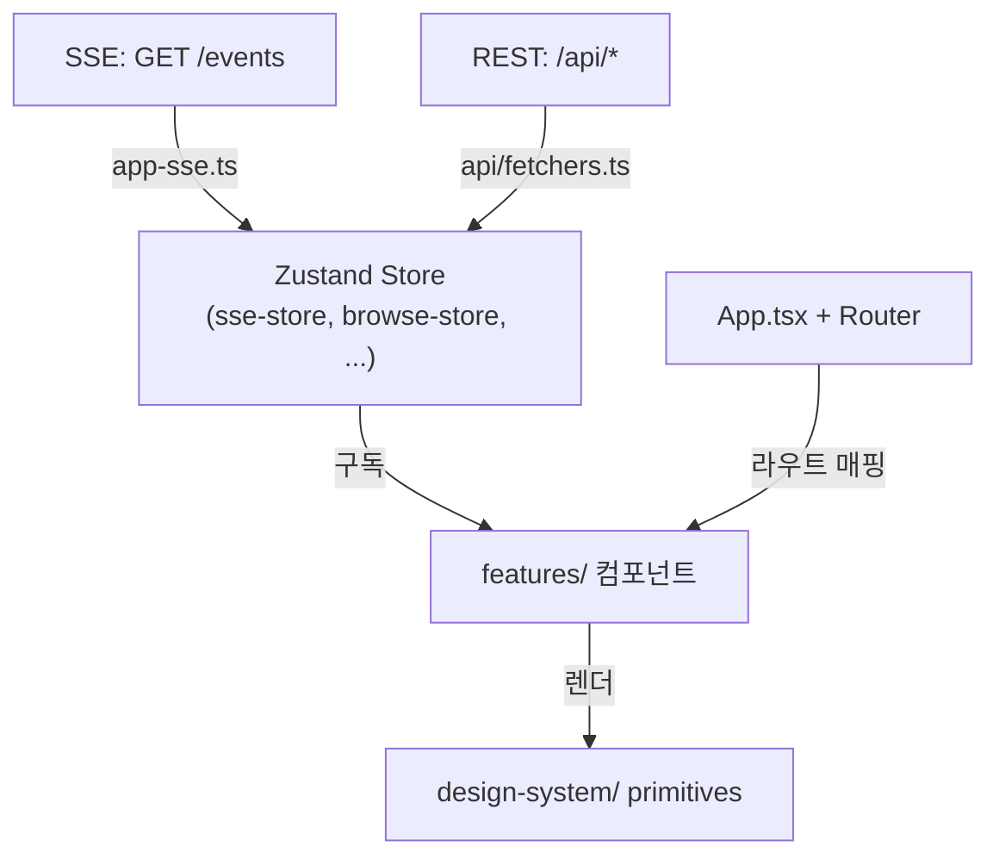

# 웹 대시보드 (Web Dashboard)

> React 18 + Vite 기반 SPA. Zustand 상태관리, React Router v6, react-i18next. 실시간 피드, 차트, 메타 문서 Flow를 제공합니다.

---

## 문서 기준

| 항목 | 값 |
|------|-----|
| 시각 | 2026-06-06 16:44:03 KST |
| 커밋 | `4ea9686` |
| 태그 | `v4.4.0` |

---

## 1. 기술 스택

| 계층 | 선택 | 이유 |
|------|------|------|
| 런타임 | React 18 | 선언적 UI + concurrent features |
| 빌드 | Vite | 빠른 HMR, Rollup 기반 프로덕션 번들 |
| 상태 | Zustand | 보일러플레이트 없는 글로벌 store. SSE 이벤트를 구독하는 store 패턴에 적합 |
| 라우팅 | React Router v6 | `/browse`, `/meta-docs`, `/settings` 등 SPA 내 라우팅 |
| i18n | react-i18next | ko/en/ja/zh 다국어. 서버와 동일한 JSON 구조 공유 |
| 차트 | Custom Canvas | 30분 슬라이딩 윈도우 실시간 차트 |
| 테스트 | vitest | Vite 기반 테스트 러너 |

---

## 2. 디렉토리 구조

```
packages/web/
├── index.html
├── favicon.svg
├── locales/                  — i18n JSON (ko/en/ja/zh)
├── vite.config.ts
├── tsconfig.json
└── src/
    ├── main.tsx              — 진입점. ReactDOM.createRoot + Router + I18nProvider
    ├── api/
    │   └── fetchers.ts       — fetch wrapper, dashboard/sessions/requests/metrics 호출
    ├── app/
    │   ├── App.tsx           — 루트 컴포넌트. 라우트 매핑 + 글로벌 레이아웃
    │   ├── AppShell.tsx      — 전체 쉘(헤더 + 사이드바 + 메인 + 푸터)
    │   ├── AppRail.tsx       — 좌측 56px 모드 전환 레일(browse/meta-docs/settings)
    │   ├── BrowseLayout.tsx  — 탐색 모드 레이아웃
    │   ├── MetaDocsLayout.tsx — 메타 문서 모드 레이아웃
    │   ├── SettingsLayout.tsx — 설정 모드 레이아웃
    │   ├── app-sse.ts        — SSE 연결 관리 + Zustand store dispatch
    │   ├── app-mode-route.ts — 모드 ↔ 라우트 동기화
    │   ├── browse-data.ts    — 프로젝트/세션/요청 데이터 페칭
    │   ├── compute-range.ts  — 시간 범위 계산
    │   ├── use-keyboard-shortcuts.ts — 전역 단축키
    │   ├── KeyboardHelpModal.tsx
    │   ├── ErrorBanner.tsx
    │   └── Footer.tsx
    ├── components/
    │   ├── Chart.tsx           — Canvas 기반 실시간 차트
    │   ├── chart-data.ts       — 차트 데이터 가공
    │   ├── DateRangeDropdown.tsx
    │   ├── FilterBar.tsx
    │   ├── search-box.tsx
    │   ├── LangSwitcher.tsx
    │   └── design-system/      — 재사용 primitive
    │       ├── badges/
    │       ├── chips/
    │       ├── icons/
    │       └── feedback/
    ├── features/
    │   ├── browse/             — 프로젝트/세션 탐색, 피드, 사이드바
    │   ├── dashboard/          — 대시보드 카드, 메트릭, 캐시 패널
    │   ├── session-detail/     — 세션 상세, turn 인터리빙, 컨텍스트 차트
    │   ├── meta-docs/          — Behavior Definitions 카탈로그, 통합 Flow
    │   ├── settings/           — 설정 패널 UI
    │   ├── llm-input/          — LLM 입력 뷰
    │   └── sse/                — SSE store, 이벤트 핸들러
    ├── stores/
    │   ├── app-store.ts        — 글로벌 앱 상태(모드, 선택 세션 등)
    │   ├── sse-store.ts        — SSE 이벤트 수신 및 피드/프록시 상태
    │   ├── expand-store.ts     — 피드 행 펼침 상태
    │   ├── anomaly-store.ts    — 이상치 표시 상태
    │   ├── tooltip-store.ts    — 툴팁 위치·내용
    │   └── version-store.ts    — 버전 체크·업데이트 배지
    └── lib/
        └── (유틸리티)
```

---

## 3. 아키텍처

### 3.1 데이터 흐름



### 3.2 모드 전환

좌측 `AppRail`은 3가지 모드를 제공합니다.

| 모드 | 라우트 | 기능 |
|------|--------|------|
| **browse** (기본) | `/` | 프로젝트/세션 탐색, 라이브 피드, 차트 |
| **metadocs** | `/meta-docs` | Behavior Definitions 카탈로그, 통합 Flow |
| **settings** | `/settings` | 설정 패널 (hooks/proxy/graph/sqlite/logs) |

모드 전환은 `AppRail` 클릭 → `navigate()` → `app-mode-route.ts`에서 `body[data-app-mode]` 속성 동기화 → 레이아웃 컴포넌트 교체.

### 3.3 SSE 연결

`packages/web/src/app/app-sse.ts`의 `buildAppSSECallbacks`가 SSE 콜백을 합성합니다.

```ts
const callbacks = buildAppSSECallbacks({
  onOpen: () => { /* 초기 데이터 페칭 */ },
  onError: () => { /* 연결 상태 표시 */ },
});
// callbacks는 useSSE 훅에 주입되어 EventSource 생성 시 사용
```

`features/sse/`의 `createSSEStoreCallbacks`가 데이터 3채널을 Zustand store로 dispatch합니다.

- `onNewRequest` → `sse-store` 액션 → `browse-store` prepend/update
- `onNewProxyRequest` → `sse-store` proxy 액션
- `onSessionUpdate` → `browse-store` 세션 상태 갱신

`event_phase` discriminator:
- `'created'` — store에 prepend, 피드에 행 추가
- `'updated'` — 동일 `id` 행 in-place 갱신

연결 실패 시 5초 후 재연결. 재연결 성공 시 `fetchDashboard + fetchAllSessions` 즉시 호출.

### 3.4 실시간 피드 갱신

`features/browse/`의 피드 컴포넌트는 Zustand store를 구독합니다.

- 동일 `id` 존재 시 **인플레이스 갱신(위치 보존)**.
- 없으면 최상단 prepend.
- `event_phase='updated'`면 `row-flash-update` 펄스.

---

## 4. 주요 기능

### 4.1 라이브 피드

- 최근 요청 목록. 페이지네이션 + 실시간 prepend.
- 툴 아이콘, Target 셀, 상태 배지, 토큰, 소요 시간 컬럼.
- 필터 바(프로젝트, 타입, 날짜 범위) + 검색 박스.

### 4.2 세션 상세

- `features/session-detail/`이 담당.
- Turn 인터리빙 카드: prompt → tool* → response.
- 컨텍스트 사용량 차트, 시스템 프롬프트 팝오버.
- 평면 행 뷰 / turn 그룹 뷰 전환.

### 4.3 메타 문서 카탈로그 및 Flow

- `features/meta-docs/`가 담당.
- Behavior Definitions(SKILL.md / agents.md / commands) 카탈로그.
- **통합 Flow**: `/api/graph/unified-flow` 응답을 SVG 셸 안에 inject.
  - 좌 ancestor + center + 우 descendant + turn-after 컬럼 + 시간 layer 색조.
  - pan/zoom 카메라 제공.

### 4.4 대시보드 위젯

- Burn Rate, Cache Trend, Tool Categories, Activity Heatmap.
- 24h/7d/30d 범위 선택.
- `features/dashboard/`가 담당.

---

## 5. 캡슐화 원칙

- **동일 판단 로직은 한 곳에만** — 호출 측에서 `boolean`으로 재계산하지 말고, raw data를 함수에 전달하고 판단은 함수 내부에서 처리.
- **기존 렌더링 함수를 반드시 재사용** — 아이콘·배지·행(row) 등 UI 요소는 기존 함수를 거치지 않고 직접 JSX 작성 금지.

---

## 6. 빌드 및 개발

```bash
# 개발 서버 (Vite, 5173, /api → 9999 프록시)
bun run web:dev

# 프로덕션 빌드 (dist/)
bun run web:build
```

서버는 `packages/web/dist/`를 정적 서빙합니다. `vite.config.ts`의 `base`와 `build.outDir`을 참조하세요.

---

> **문서 기준**
> - 시각: 2026-06-06 16:44:03 KST
> - 커밋: `4ea9686`
> - 태그: `v4.4.0`
