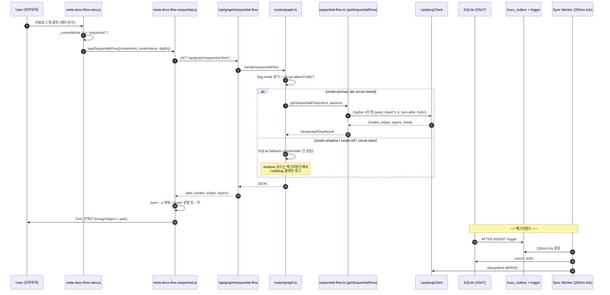

# Sequential Flowchart — 풀스택 구현 작업 문서

> 작성: 2026-05-25
> 범위: KuzuDB(Ladybug fork) 기반 그래프 DB 도입 + "메타 문서 연관 순서도" 시각화 추가.
> 시리즈: [06 마스터 플랜](../../.claude/.tmp/plans/spyglass/graph-db-research/06-sequential-flowchart.md) 의 후속 실현 단계.
>
> 라벨링 규칙: 사용자 노출 한국어 = **메타 문서** (영문은 *Behavior Definitions* 허용).

---

## 0. 한 페이지 요약

- **백엔드**: `@spyglass/storage-graph` 신규 패키지 + SQLite 마이그레이션 049(outbox+trigger) + Bun 서버 부팅 시 200ms 틱 sync worker + `/api/graph/*` 4종 엔드포인트.
- **프론트엔드**: 기존 ego-graph 모드 보존 + 토글 버튼으로 **인과 순서도(Sequential Flowchart)** 모드 추가. 3종 헬퍼(camera/highlight/sequential 렌더러) 분리.
- **테스트**: 단위 + 통합 56 pass / 0 fail. mock 클라이언트로 알고리즘 무결성 100% 검증 (실제 native Ladybug binding 의존 없음).
- **운영 모드**: 기본 `SPYGLASS_GRAPH_MODE=shadow` — SQLite 응답이 사용자에게 가고 Ladybug 는 백그라운드 비교만. 3중 안전망(회로 차단기, kill switch, throw-away rebuild) 영구 가동.

---

## 1. 변경 영향 매트릭스

| 영역 | 파일 | 종류 | 비고 |
|---|---|---|---|
| **storage-graph 신규 패키지** | `packages/storage-graph/src/*` | 신규 16개 | SRP — SQLite SSoT 와 격리된 graph projection 레이어 |
| **SQLite 마이그레이션** | `packages/storage/migrations/049-kuzu-outbox.sql` | 신규 | outbox table + AFTER INSERT trigger × 2 |
| **서버 부팅** | `packages/server/src/runtime/lifecycle.ts` | 수정 (2줄) | startGraphSyncWorker / stopGraphSyncWorker |
| **서버 라우터** | `packages/server/src/api.ts` | 수정 (1라우터 등록) | graphRouter async chain |
| **서버 라우터 본체** | `packages/server/src/routes/graph.ts` | 신규 | 4개 엔드포인트 + shadow/primary/off 분기 + 회로 |
| **서버 의존성** | `packages/server/package.json` | 수정 | `@spyglass/storage-graph` workspace dep 추가 |
| **Electron 패키징** | `packages/desktop/electron-builder.yml` | 수정 | asarUnpack + storage-graph native 동봉 |
| **프론트 통합** | `packages/web/assets/js/meta-docs-flow-view.js` | 수정 (얇은 토글 분기) | 기존 ego-graph 로직 100% 보존 |
| **프론트 신규** | `packages/web/assets/js/meta-docs-flow-sequential.js` | 신규 | 순서도 모드 렌더러 + 노드 expand |
| **프론트 헬퍼** | `packages/web/assets/js/meta-docs-flow-camera.js` | 신규 | viewBox 카메라 이동 (rAF cubic ease) |
| **프론트 헬퍼** | `packages/web/assets/js/meta-docs-flow-highlight.js` | 신규 | 엣지 hover 인과 경로 강조 |
| **CSS** | `packages/web/assets/css/flow-diagram.css` | append | 모드 토글 + 순서도 노드 + 강조 룰 |
| **i18n** | `packages/web/locales/{en,ko,ja,zh}/ui.json` | 수정 (각 10키) | 모드 라벨 + 노드 액션 |
| **테스트** | `packages/storage-graph/src/__tests__/*` | 신규 5개 | flag / circuit-breaker / ddl / topological-sort / sequential-flow |
| **샘플 시드** | `packages/storage-graph/src/__tests__/seed-mocks/*` | 신규 5개 | mock-client + 세트 A/B/C + barrel |

---

## 2. 아키텍처 다이어그램

### 2.1 CQRS 데이터 흐름 (Read Path)



### 2.2 안전망 (회로 차단기 + Kill Switch)

```
┌──────────────────────────────────────────────────────────────────────┐
│ Request 1건 도착                                                       │
└────────────────────────────────────┬─────────────────────────────────┘
                                     │
                       ┌─────────────▼─────────────┐
                       │ getGraphMode()             │
                       │ off | shadow | primary     │
                       └──┬─────────────────────┬───┘
                          │                     │
              ┌───────────▼──────────┐  ┌──────▼────────┐
              │  off                 │  │  shadow       │
              │  → SQLite path 100%  │  │  → SQLite 응답  │
              └──────────────────────┘  │  → 백그라운드   │
                                        │     Ladybug 비교 │
                                        └───────────────┘
                  ┌──────────────────────┐
                  │  primary             │
                  │  → circuit.allows?   │
                  └───┬──────────────────┘
                      │                     ┌─────────┐
              ┌───────▼────────┐       Yes  │ Ladybug │
              │ CLOSED         ├──────────► │ query   │
              │ (정상 통과)     │            └────┬────┘
              └────────────────┘                 │
                                                 │ 실패
                                                 │
                                       ┌─────────▼────────┐
                                       │ recordFailure    │
                                       │ 3-strike?        │
                                       └────────┬─────────┘
                                                │
                                       ┌────────▼─────────┐
                                       │ OPEN (1h)        │
                                       │ → SQLite fallback│
                                       └──────────────────┘
```

---

## 3. 운영 모드 가이드

| `SPYGLASS_GRAPH_MODE` | 사용자 응답 | 백그라운드 Ladybug | 회로 차단기 |
|---|---|---|---|
| `off` | SQLite 100% | 워커 dormant (native dlopen 없음) | 비활성 |
| `shadow` (기본) | SQLite 100% | tick 200ms 로 sync + 응답 비교 로그 | 활성 |
| `primary` | Ladybug (실패 시 SQLite fallback) | tick 200ms 로 sync | 활성 |

전환 방법:
```bash
# 즉시 dormant — graph 코드 완전 비활성
SPYGLASS_GRAPH_MODE=off bun run dev

# 정확성 검증용 — shadow diff 로그만 누적
SPYGLASS_GRAPH_MODE=shadow bun run dev   # default

# 본격 사용 — Ladybug 응답 우선
SPYGLASS_GRAPH_MODE=primary bun run dev
```

런타임 상태 확인:
```bash
curl http://localhost:9999/api/graph/status | jq
# { mode, circuit: { state, consecutiveFailures, fallbackRate },
#   sync: { running, totalProcessed, cursor, lastError, circuitState } }
```

---

## 4. 검증 결과

### 4.1 자동화 테스트

```
packages/storage-graph    56 pass / 0 fail  (5 files, 352 expect calls, 50ms)
packages/storage         194 pass / 0 fail  (049 migration 회귀 없음)
packages/server          224 pass / 3 fail  (3 fail 모두 pre-existing, 회귀 0)
```

### 4.2 검증 매트릭스 — V-1 ~ V-5 × {A, B, C}

| 검증 | 세트 A (10 노드) | 세트 B (depth 7) | 세트 C (25 fan-out) |
|---|---|---|---|
| V-1 direct child | ✅ 3개 (skill/agent/skill) | (depth 1 단일) | ✅ 25개 |
| V-2 가변 깊이 chain | ✅ 8개 자손 | ✅ 9개 자손 + 분기 2 | ✅ 25개 |
| V-3 temporal sort | ✅ started_at ASC | ✅ Kahn 단조 증가 | ✅ 100ms 간격 25 결정성 |
| V-4 turn-after | ✅ changelog-update | (해당 없음) | (해당 없음) |
| V-5 self-loop 격하 | ✅ count=0 | ✅ count=0 | ✅ count=0 |
| Kahn 안정성 | ✅ layer 분리 | ✅ 분기 2 같은 layer | ✅ 25 모두 layer 1 |

---

## 5. 다음 단계 (현재 PR 범위 밖)

- [ ] Ladybug native binding 의 실제 dlopen spike (Bun 1.2 + macOS arm64) — `SPYGLASS_GRAPH_MODE=primary` 로 30분 테스트
- [ ] BFS 결과를 `getMetaFlowEgo` 와 1:1 diff CI gate (shadow mode 검증 자동화)
- [ ] Cold rebuild UX — 사용자 첫 부팅 시 progress overlay
- [ ] React Flow 도입 검토 ([03.md](../../.claude/.tmp/plans/spyglass/graph-db-research/03-frontend-visualization.md))
- [ ] DuckPGQ 비교 spike — Ladybug fork supply chain 위험 회피 옵션

---

## 6. 관련 문서

- [06 마스터 플랜 — 메타 문서 연관 순서도 설계](../../.claude/.tmp/plans/spyglass/graph-db-research/06-sequential-flowchart.md)
- [00 통합 보고서 — Graph DB 도입 의사 결정](../../.claude/.tmp/plans/spyglass/graph-db-research/00-FINAL-INTEGRATED-REPORT.md)
- [02 Electron 런타임 — native 패키징 위험](../../.claude/.tmp/plans/spyglass/graph-db-research/02-electron-runtime.md)
- [05 마이그레이션 전략 — Outbox + Cursor + Kill Switch](../../.claude/.tmp/plans/spyglass/graph-db-research/05-migration-strategy.md)
- [설치 가이드 (개선됨)](../install-guide.md)
