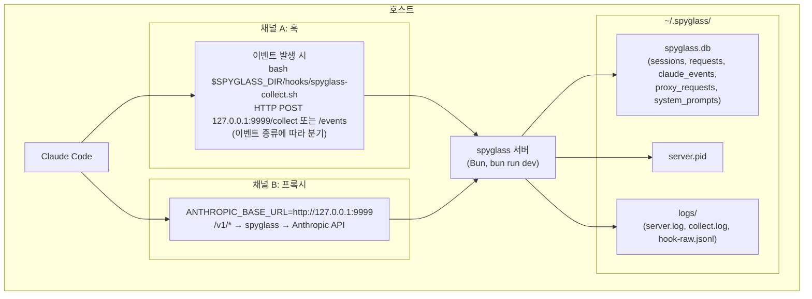

# spyglass 설치 가이드

> **문서 버전**: v4.4.1  
> **최종 갱신**: 2026-06-06

Claude Code 실행 과정을 가시화하는 spyglass를 설치하는 절차입니다.
비개발자도 단계를 따라 설치할 수 있도록 구성했습니다.

> 모든 명령은 그대로 실행 가능하며, 사용자 환경에 따라 치환해야 하는 값은 `<...>` 형태로 명시합니다.

---

## 목차

1. [구성 개요](#1-구성-개요)
2. [필수 조건](#2-필수-조건)
3. [설치 절차](#3-설치-절차)
4. [Claude Code 훅 설정](#4-claude-code-훅-설정)
5. [Claude Code 프록시 설정](#5-claude-code-프록시-설정)
6. [동작 확인](#6-동작-확인)
7. [관리 명령어](#7-관리-명령어)
8. [업데이트](#8-업데이트)
9. [문제 해결](#9-문제-해결)

---

## 1. 구성 개요

spyglass는 호스트에서 **Bun 프로세스로 직접 실행**되며, 두 가지 채널로 데이터를 수집합니다.



| 채널 | 수집 데이터 | 설정 방법 |
|------|------------|----------|
| **훅** | 툴 호출·세션 이벤트·타입·소요 시간 | `~/.claude/settings.json` 훅 등록 |
| **프록시** | API 토큰·비용·시스템 프롬프트·응답 메타 | `ANTHROPIC_BASE_URL` 환경변수 |

두 채널 모두 활성화하면 대시보드에서 훅 타임라인과 실제 API 비용을 함께 확인할 수 있습니다.

**원칙**

- 훅은 **반드시 글로벌 사용자 설정 `~/.claude/settings.json`** 에만 등록합니다. 프로젝트 로컬 설정에는 등록하지 않습니다.
- 모든 데이터는 `~/.spyglass/` 아래에 저장되며, 저장소 클론 디렉토리와 독립적입니다.
- 서버는 `bun run dev`로 기동되며 터미널을 점유하는 포그라운드 Bun 프로세스로 동작합니다. PID는 `~/.spyglass/server.pid`에 기록되며, 백그라운드 실행이 필요하면 `nohup bun run dev > /dev/null 2>&1 &` 형태로 사용자가 분리해야 합니다.

---

## 2. 필수 조건

| 구성요소 | 버전 | 확인 명령 |
|---------|------|----------|
| **Bun** | 1.2.0 이상 | `bun --version` |
| **Git** | 2.x 이상 | `git --version` |
| **Claude Code** | 최신 | `claude --version` |
| **curl** | 호스트 기본 | `curl --version` |
| **jq** (권장) | 1.6 이상 | `jq --version` — `~/.claude/settings.json` 자동 병합용 |

### Claude Code 미설치 시

```bash
# macOS / Linux / WSL — 권장 (자동 업데이트 포함)
curl -fsSL https://claude.ai/install.sh | bash

# macOS Homebrew (수동 업그레이드 필요)
brew install --cask claude-code
```

### Bun 미설치 시

```bash
curl -fsSL https://bun.sh/install | bash
exec $SHELL -l   # PATH 갱신
bun --version
```

### jq 미설치 시 (선택)

```bash
# macOS
brew install jq

# Linux (Debian/Ubuntu)
sudo apt-get install -y jq
```

---

## 3. 설치 절차

### 3.1 저장소 클론

```bash
# 권장 위치: ~/.spyglass-src
git clone <repository-url> "${HOME}/.spyglass-src"
cd "${HOME}/.spyglass-src"
```

> `<repository-url>` 은 spyglass 저장소의 git URL로 치환합니다. 비공개 저장소라면 SSH(`git@github.com:<org>/<repo>.git`) 또는 HTTPS+토큰(`.netrc` / git credential helper)으로 인증합니다.

### 3.2 의존성 설치

```bash
cd "${HOME}/.spyglass-src"
bun install
```

bun 워크스페이스(`packages/*`)가 한 번에 설치됩니다.

> **Graph DB(LadybugDB) 안내**
>
> v4.x 에서는 그래프 프로젝션 레이어 (`@spyglass/storage-graph`) 가 포함되며,
> `bun install` 시 `@ladybugdb/core` 의 platform 별 native binding 이 자동으로 설치됩니다.
> macOS arm64/x64 + Linux arm64/x64 + Windows x64 prebuilt 가 npm 에서 다운로드되므로
> 사용자 머신에서 별도 컴파일 단계는 없습니다. 다음 디렉토리에서 확인할 수 있습니다:
>
> ```bash
> ls packages/storage-graph/node_modules/@ladybugdb/
> ```
>
> 만약 prebuilt 가 다운로드되지 않으면 (네트워크/방화벽 등) `cmake>=3.15` + `python>=3.9` +
> `clang(C++20)` 으로 소스 컴파일이 trigger 됩니다. 본 경로는 권장하지 않으며 대신
> `SPYGLASS_GRAPH_MODE=off` 로 graph 기능 자체를 dormant 상태로 비활성화해 사용할 수
> 있습니다 (§5.2 운영 모드 참조).

### 3.3 서버 기동

```bash
cd "${HOME}/.spyglass-src"
bun run dev
```

`bun run dev`는 `restart` 동작입니다 — 기존에 실행 중이던 spyglass 서버 프로세스가 있으면 종료 후 재기동하고, stale PID 파일이 있으면 자동으로 정리합니다. **터미널을 점유하는 포그라운드 프로세스**이므로 별도 셸/탭에서 실행하거나 `nohup ... &`로 분리해야 합니다. PID는 `~/.spyglass/server.pid`에 기록됩니다.

기본 바인딩: `127.0.0.1:9999` (loopback only).

### 3.4 헬스체크

```bash
curl -sf http://127.0.0.1:9999/health && echo OK
# OK
```

`OK`가 출력되면 서버가 정상 기동된 상태입니다.

---

## 4. Claude Code 훅 설정

> **반드시 `~/.claude/settings.json`(글로벌 사용자 설정)** 에 등록합니다. 프로젝트 단위 설정에 등록하면 다른 프로젝트에서 데이터 공백이 발생합니다.

### 방법 A: 대시보드 자동 설치 (권장)

서버 기동 후 브라우저에서 설정 페이지를 엽니다:

```bash
# macOS
open http://127.0.0.1:9999/settings

# Linux
xdg-open http://127.0.0.1:9999/settings
```

**연동(Integration)** 탭으로 이동한 뒤, 상단 **"Hook · Proxy 한 번에 설치"** 버튼을 클릭합니다.


이 버튼 하나로 다음 작업이 모두 처리됩니다:

1. **Hook (이벤트 수집)** — `~/.claude/settings.json`에 `env.SPYGLASS_DIR`과 전체 이벤트 훅을 자동 병합
2. **Proxy (API 메트릭 수집)** — 사용 중인 셸(zsh/bash 등) 프로필에 조건부 프록시 함수를 자동 등록
3. 구문 검증(valid JSON / 셸 문법 체크) 및 백업 자동 정리

설치 후 Claude Code를 **완전히 종료하고 다시 실행**해야 훅이 로드됩니다.

> 버튼 클릭 시 실시간 진행 로그가 화면에 표시되며, 각 단계의 성공/실패 여부를 바로 확인할 수 있습니다.

### 방법 B: 수동 병합 (jq 사용 — 고급)

자동 설치가 실패하거나 기존 설정과 충돌할 경우 수동으로 병합합니다.

#### 4.1 SPYGLASS_DIR 확인

훅 명령은 `$SPYGLASS_DIR` 환경변수를 참조합니다. 이 값은 `~/.claude/settings.json`의 `env` 키에 설정하며, Claude Code가 훅 실행 시 자동으로 주입합니다.

저장소를 클론한 절대 경로를 확인합니다:

```bash
# 예: ~/.spyglass-src 에 클론한 경우
cd "${HOME}/.spyglass-src" && pwd
# /Users/alice/.spyglass-src
```

훅 스크립트 실행 권한 확인:

```bash
SPYGLASS_DIR="$(cd "${HOME}/.spyglass-src" && pwd)"
test -x "$SPYGLASS_DIR/hooks/spyglass-collect.sh" && echo OK || chmod +x "$SPYGLASS_DIR/hooks/spyglass-collect.sh"
```

#### 4.2 기존 설정 백업

```bash
mkdir -p "${HOME}/.claude"
if [ -f "${HOME}/.claude/settings.json" ]; then
  cp "${HOME}/.claude/settings.json" "${HOME}/.claude/settings.json.bak-$(date +%Y%m%d-%H%M%S)"
fi
```

#### 4.3 훅 프로파일 (full 단일 — 선택 아님)

spyglass 는 **full 프로파일을 기본이자 유일한 권장 구성**으로 제공합니다. 일부 이벤트만 등록하면
시각화·통계·관계 흐름 그래프가 불완전해지므로, 전체 HOOK_EVENTS 를 등록하는 full 을 사용하세요.
(대시보드 설정 → **연동** 탭의 **"Hook · Proxy 한 번에 설치"** 버튼이 이 full 프로파일을 원클릭으로 적용합니다.)

| 프로파일 | 훅 수 | 수집 범위 | 예제 |
|---------|------|----------|------|
| **full** (기본) | 전체 | Subagent / Task / Permission / Compact / Worktree / FileChanged / CwdChanged 등 전체 HOOK_EVENTS | [`docs/examples/settings.hooks.full.json`](./examples/settings.hooks.full.json) |

#### 4.4 자동 병합 (jq 사용 — 권장)

기존 `~/.claude/settings.json`의 `model`, `enabledPlugins`, `statusLine` 등 다른 키를 보존하면서 `env.SPYGLASS_DIR`과 `hooks` 키만 병합합니다.

```bash
SPYGLASS_DIR="$(cd "${HOME}/.spyglass-src" && pwd)"
PROFILE="${HOME}/.spyglass-src/docs/examples/settings.hooks.full.json"   # full 단일 (선택 아님)
SETTINGS="${HOME}/.claude/settings.json"

# 기존 settings.json이 없으면 빈 객체로 시작
[ -f "$SETTINGS" ] || echo '{}' > "$SETTINGS"

# env.SPYGLASS_DIR을 실제 절대 경로로 치환한 프로파일을 메모리에 로드 → 기존 설정과 병합
TMP="$(mktemp)"
jq --arg dir "$SPYGLASS_DIR" --slurpfile profile "$PROFILE" '
  . as $orig
  | $profile[0] as $p
  | $orig
  | .env  = ((.env  // {}) + ($p.env  // {}) + {SPYGLASS_DIR: $dir})
  | .hooks = ((.hooks // {}) + ($p.hooks // {}))
' "$SETTINGS" > "$TMP" && mv "$TMP" "$SETTINGS"

# 병합 결과 검증
jq '.env.SPYGLASS_DIR, (.hooks | keys | length)' "$SETTINGS"
# "/Users/alice/.spyglass-src"
# 30   (full 전체 이벤트)
```

#### 4.5 수동 병합 (jq 미사용 시)

`~/.claude/settings.json`을 텍스트 에디터로 열고 다음 두 키를 추가/병합합니다.

```jsonc
{
  // 기존 model, enabledPlugins, statusLine, autoMemoryEnabled 등은 그대로 유지

  "env": {
    "SPYGLASS_DIR": "/Users/<your-name>/.spyglass-src"
    // 기존 env가 있으면 다른 키와 함께 보존
  },
  "hooks": {
    // 예제 파일(docs/examples/settings.hooks.full.json)의
    // hooks 객체 내용을 그대로 추가
  }
}
```

규칙:
- `SPYGLASS_DIR` 값은 **절대 경로**여야 합니다. `~`는 일부 환경에서 해석되지 않을 수 있습니다.
- 기존 `hooks` 키와 충돌하는 이벤트 키가 있으면 배열을 병합합니다(둘 다 실행되도록).
- 파일 전체를 예제로 **덮어쓰지 마세요** — 다른 훅·MCP 서버·권한 설정이 사라집니다.

### 4.6 환경변수

모든 spyglass 환경변수는 `~/.claude/settings.json`의 `env` 키에서 설정합니다. Claude Code가 훅 실행 시 자동으로 주입하므로 shell profile(`.zshrc` 등)에 따로 추가할 필요 없습니다.

```jsonc
// ~/.claude/settings.json
{
  "env": {
    "SPYGLASS_DIR": "/Users/alice/.spyglass-src",   // 필수
    "SPYGLASS_HOST": "localhost",                    // 선택, 기본값: localhost
    "SPYGLASS_PORT": "9999",                         // 선택, 기본값: 9999
    "SPYGLASS_TIMEOUT": "1"                          // 선택, 기본값: 1 (초)
  }
}
```

| 변수 | 설명 | 기본값 |
|------|------|--------|
| `SPYGLASS_DIR` | 클론된 저장소 절대 경로 | **필수** |
| `SPYGLASS_HOST` | 서버 호스트 | `localhost` |
| `SPYGLASS_PORT` | 서버 포트 | `9999` |
| `SPYGLASS_TIMEOUT` | 훅 → 서버 HTTP 타임아웃(초) | `1` |

### 4.7 Claude Code 재시작

`~/.claude/settings.json` 변경 후 Claude Code를 **완전히 종료**하고 다시 실행해야 훅이 로드됩니다.

### 4.8 주의사항

- Claude Code는 이벤트 키 수준의 `"*"` 와일드카드를 **지원하지 않습니다**. 이벤트는 **개별 등록**해야 합니다.
- `matcher: "*"`는 `PreToolUse` / `PostToolUse` / `PostToolUseFailure`의 **도구 매칭 전용**입니다.
- `type: "command"` 필드가 없으면 Claude Code가 훅을 무시합니다.
- `async: true`와 `timeout: 1`은 **서로 다른 층위의 타임아웃**입니다.
  - `timeout: 1` (settings.json): Claude Code가 동기 훅을 1초까지 기다리는 한도. `async: true`이면 Claude Code가 결과를 기다리지 않으므로 사실상 무의미합니다.
  - `SPYGLASS_TIMEOUT` (환경변수, 기본 1초): `spyglass-collect.sh`가 내부적으로 `curl --max-time`에 적용하는 값. 서버 응답이 늦어도 훅이 1초 안에 종료됩니다.
  - 결과적으로 두 값을 모두 1초로 두면 "Claude Code는 즉시 다음 단계 진행 + 훅 스크립트는 1초 안에 자기 정리" 라는 의도된 비동기 동작이 됩니다.

---

## 5. Claude Code 프록시 설정

> 프록시 채널은 **선택 사항**입니다. 훅만으로도 동작하지만, 프록시를 함께 활성화하면 실제 API 비용·토큰 수·시스템 프롬프트 전문이 `proxy_requests` 테이블에 기록되어 대시보드 정확도가 크게 향상됩니다.

### 5.1 동작 원리

spyglass 서버는 `/v1/*` 경로의 요청을 **투명 프록시**로 처리합니다.

```
Claude Code  →  spyglass:9999/v1/messages  →  https://api.anthropic.com/v1/messages
                     │ 메타 기록
                     └→ proxy_requests 테이블
```

- 클라이언트의 API 키(`x-api-key` / `Authorization`)는 그대로 Anthropic에 전달됩니다. spyglass는 키를 저장하지 않습니다.
- 스트리밍(`stream: true`)과 비스트리밍 모두 지원합니다.
- 응답 내용(텍스트)은 저장하지 않으며, 토큰 수·시스템 프롬프트 해시 등 메타만 기록합니다.

### 5.2 활성화 방법

#### 방법 1 — 대시보드 자동 설치 (권장)

§4의 **"Hook · Proxy 한 번에 설치"** 버튼을 사용하면 Proxy 설정도 동시에 완료됩니다.

설치 후 터미널을 **재시작**하거나 `source ~/.zshrc` (또는 `~/.bashrc`)를 실행해야 셸 함수가 로드됩니다.

#### 방법 2 — 조건부 셸 함수 (수동)

서버가 실행 중일 때만 경유하도록 헬스체크를 포함합니다. `.zshrc` / `.bashrc` 에 추가:

```bash
# spyglass가 실행 중이면 프록시 경유, 아니면 직접 연결
claude() {
  if curl -sf http://localhost:9999/health > /dev/null 2>&1; then
    ANTHROPIC_BASE_URL=http://localhost:9999 command claude "$@"
  else
    command claude "$@"
  fi
}
```

또는 kimi(Moonshot) 같은 서드파티 모델도 함께 경유할 경우:

```bash
kimi() {
  local model="kimi-k2.6"
  if curl -sf http://localhost:9999/health > /dev/null 2>&1; then
    ANTHROPIC_BASE_URL=http://localhost:9999 \
    ANTHROPIC_AUTH_TOKEN="<moonshot-api-key>" \
    ANTHROPIC_MODEL="$model" \
    command claude --dangerously-skip-permissions "$@"
  else
    ANTHROPIC_BASE_URL="https://api.moonshot.ai/anthropic" \
    ANTHROPIC_AUTH_TOKEN="<moonshot-api-key>" \
    ANTHROPIC_MODEL="$model" \
    command claude --dangerously-skip-permissions "$@"
  fi
}
```

#### 방법 3 — settings.json env 등록 (항상 경유)

Claude Code가 실행될 때마다 자동으로 프록시를 경유합니다.

```jsonc
// ~/.claude/settings.json
{
  "env": {
    "SPYGLASS_DIR": "/Users/alice/.spyglass-src",
    "ANTHROPIC_BASE_URL": "http://localhost:9999"
  }
}
```

> ⚠️ **주의**: spyglass 서버가 꺼진 상태에서 Claude Code를 실행하면 API 연결이 실패합니다. 항상 `bun run dev`로 서버를 먼저 기동하거나, 방법 2처럼 조건부 처리를 추가하세요.

### 5.3 upstream 환경변수

서버 측에서 다음 환경변수로 upstream 대상을 조정할 수 있습니다.

| 변수 | 설명 | 기본값 |
|------|------|--------|
| `ANTHROPIC_UPSTREAM_URL` | 기본 Anthropic upstream | `https://api.anthropic.com` |
| `MOONSHOT_UPSTREAM_URL` | `kimi-` prefix 모델용 | `https://api.moonshot.ai/anthropic` |
| `CUSTOM_UPSTREAMS` | 추가 prefix 매핑 (`prefix1=url1,prefix2=url2`) | 없음 |

서버를 기동할 때 환경변수로 전달합니다:

```bash
ANTHROPIC_UPSTREAM_URL=https://my-custom-gateway.example.com \
  bun run dev
```

### 5.4 동작 확인

서버 기동 후 Claude Code를 한 번 실행한 뒤:

```bash
sqlite3 "${HOME}/.spyglass/spyglass.db" \
  "SELECT id, timestamp, model, tokens_input, tokens_output FROM proxy_requests ORDER BY timestamp DESC LIMIT 5;"
```

행이 쌓이면 프록시가 정상 동작 중입니다.

---

## 6. 동작 확인

### 6.1 doctor (자동 검증)

```bash
cd "${HOME}/.spyglass-src"
bun run doctor
```

다음 항목들을 자동 점검합니다 (총 15개 체크):

- **환경**: Bun 런타임/버전, `~/.claude/settings.json` 파싱, 훅 등록 여부, 훅 스크립트 실행 권한·SPYGLASS_DIR 경로
- **DB**: `~/.spyglass/` 디렉토리 권한, 스키마 마이그레이션 버전, 최근 수집 활동
- **서버**: 포트 LISTEN 상태 및 헬스체크
- **무결성**: orphan row, zero-response 턴, 비정상적으로 긴 응답, 중복 응답, 턴 ID 불일치, 미연결 도구 호출, orphan proxy tool use

문제가 발견되면 어느 단계인지와 함께 수정 가이드를 출력합니다.

### 6.2 훅 수집 로그

Claude Code 세션을 한 번 실행한 뒤:

```bash
# 훅 스크립트 실행 로그
tail -n 20 "${HOME}/.spyglass/logs/collect.log"

# raw 이벤트 (전체 훅 페이로드)
tail -n 20 "${HOME}/.spyglass/logs/hook-raw.jsonl"
```

### 6.3 이벤트 분포 확인

```bash
# bun으로 (별도 sqlite3 설치 불필요)
bun -e 'const {Database} = require("bun:sqlite");
  const db = new Database(`${process.env.HOME}/.spyglass/spyglass.db`);
  console.table(db.query("SELECT event_type, COUNT(*) as count FROM claude_events GROUP BY event_type ORDER BY count DESC").all());'
```

또는 호스트에 `sqlite3`이 있으면:

```bash
sqlite3 "${HOME}/.spyglass/spyglass.db" \
  "SELECT event_type, COUNT(*) FROM claude_events GROUP BY event_type ORDER BY 2 DESC;"
```

### 6.4 대시보드

```bash
# macOS
open http://127.0.0.1:9999

# Linux
xdg-open http://127.0.0.1:9999
```

최소 한 번의 Claude Code 세션이 수집되면 세션 목록·실시간 피드·통계가 표시됩니다.


---

## 7. 관리 명령어

모든 명령은 클론된 저장소(`~/.spyglass-src`) 디렉토리에서 실행합니다.

| 작업 | 명령어 | 비고 |
|------|--------|------|
| 기동 / 재시작 | `bun run dev` | PID 파일이 있으면 기존 프로세스 종료 후 재기동 |
| 중지 | `bun run stop` | PID 파일 기준 SIGTERM |
| 상태 확인 | `bun run status` | PID·포트·헬스 한 줄 요약 |
| 환경 검증 | `bun run doctor` | 5단계 점검 |
| 타입 체크 | `bun run typecheck` | `tsc --noEmit` |
| 테스트 | `bun test` | 워크스페이스 전체 테스트 |
| TUI (선택) | `bun run tui` | 터미널 대시보드 |

### 7.1 데이터 위치

| 항목 | 경로 |
|------|------|
| DB | `~/.spyglass/spyglass.db` |
| WAL/SHM | `~/.spyglass/spyglass.db-wal`, `~/.spyglass/spyglass.db-shm` |
| 훅 로그 | `~/.spyglass/logs/collect.log` |
| 훅 원본 페이로드 | `~/.spyglass/logs/hook-raw.jsonl` |
| 서버 PID | `~/.spyglass/server.pid` |

### 7.2 오래된 데이터 정리

DB가 너무 커지면 오래된 행을 삭제하고 VACUUM으로 파일 크기를 줄입니다.

```bash
# 예: 오늘 자정 이전 데이터 전부 삭제 (spyglass 서버 중지 후 실행)
CUTOFF=$(date -j -f "%Y-%m-%d %H:%M:%S" "$(date +%Y-%m-%d) 00:00:00" "+%s")000   # macOS
# CUTOFF=$(date -d "today 00:00" "+%s")000                                         # Linux

sqlite3 "${HOME}/.spyglass/spyglass.db" <<SQL
BEGIN;
DELETE FROM requests       WHERE timestamp < $CUTOFF;
DELETE FROM claude_events  WHERE timestamp < $CUTOFF;
DELETE FROM proxy_requests WHERE timestamp < $CUTOFF;
DELETE FROM sessions
 WHERE started_at < $CUTOFF
   AND id NOT IN (SELECT DISTINCT session_id FROM requests       WHERE session_id IS NOT NULL)
   AND id NOT IN (SELECT DISTINCT session_id FROM claude_events  WHERE session_id IS NOT NULL)
   AND id NOT IN (SELECT DISTINCT session_id FROM proxy_requests WHERE session_id IS NOT NULL);
DELETE FROM system_prompts
 WHERE last_seen_at < $CUTOFF
   AND hash NOT IN (SELECT DISTINCT system_hash FROM proxy_requests WHERE system_hash IS NOT NULL);
COMMIT;
SQL
sqlite3 "${HOME}/.spyglass/spyglass.db" "VACUUM; ANALYZE;"
```

> 서버가 실행 중이면 먼저 `bun run stop`으로 중지한 뒤 실행하세요.

---

## 8. 업데이트

```bash
cd "${HOME}/.spyglass-src"
git pull
bun install
bun run dev   # 자동으로 기존 프로세스 종료 후 재기동
```

DB 마이그레이션은 서버 기동 시 자동 적용됩니다(`PRAGMA user_version`으로 추적).

---

## 9. 데이터 디렉토리 (`~/.spyglass/`) 와 그래프 DB

spyglass 가 사용하는 모든 로컬 데이터는 `~/.spyglass/` 하위에 격리됩니다.

### 9.1 디렉토리 구조

```
~/.spyglass/
├── spyglass.db                 # 메인 SQLite DB (source of truth, 영구 보존)
├── spyglass.db-wal             # SQLite Write-Ahead Log
├── spyglass.db-shm             # SQLite shared memory
├── spyglass.db.backup-*        # 마이그레이션 사전 자동 백업
├── server.pid                  # 현재 서버 프로세스 PID
├── pricing.json                # 모델 단가 캐시
├── logs/                       # 모든 로그 파일
│   ├── collect.log             # collect 명령 출력
│   ├── server.log              # 서버 stdout/stderr 미러
│   └── hook-raw.jsonl          # hook 원본 페이로드 (DIAG 모드)
└── graph/                      # LadybugDB 그래프 프로젝션 (throw-away cache)
    ├── KUZU_README.txt         # "이 폴더는 throw-away cache" 안내
    ├── spyglass.lbug           # Ladybug DB 파일 (자동 생성)
    └── sync_state.json         # sync worker cursor 메타
```

### 9.2 그래프 DB 운영 모드

환경변수 `SPYGLASS_GRAPH_MODE` 로 제어합니다.

| 모드 | 사용자 영향 | Ladybug native 로드 | 권장 시나리오 |
|---|---|---|---|
| `off` | SQLite 100% (변경 없음) | 안 함 (완전 dormant) | 그래프 기능 비활성, 안전 폴백 |
| `shadow` (기본) | SQLite 100% | 백그라운드 sync + 비교 로그만 | 신규 설치, 정확성 검증 |
| `primary` | Ladybug 응답 (실패 시 자동 SQLite fallback) | 활성 | 본격 graph 시각화 |

```bash
# 기본 shadow 모드 (사용자 영향 0, 백그라운드 sync 만)
bun run dev

# 모든 그래프 기능 끄기 — 이전 버전과 동일 동작
SPYGLASS_GRAPH_MODE=off bun run dev

# Ladybug 응답 우선 사용 (실패 시 SQLite 자동 폴백)
SPYGLASS_GRAPH_MODE=primary bun run dev
```

운영 상태 확인:

```bash
curl http://localhost:9999/api/graph/status | jq
# {
#   "mode": "shadow",
#   "circuit": { "state": "CLOSED", "consecutiveFailures": 0, "fallbackRate": 0 },
#   "sync":    { "running": true, "totalProcessed": 1234, "cursor": 5678, "circuitState": "CLOSED" }
# }
```

### 9.3 그래프 폴더 안전성 (throw-away cache)

`~/.spyglass/graph/` 는 **언제든 삭제 가능한 캐시** 입니다:

```bash
# 안전한 초기화 — 다음 서버 부팅 시 SQLite로부터 자동 재구축
rm -rf ~/.spyglass/graph
```

**SQLite (`spyglass.db`) 만 source of truth** 입니다. 백업 시 `spyglass.db` 한 파일만 복사하면 충분하며,
그래프 폴더는 복사할 필요 없습니다.

### 9.4 그래프 DB 로그 위치

별도 로그 파일을 만들지 않습니다. 모든 그래프 관련 로그는 **표준 출력 → `~/.spyglass/logs/server.log`** 로
미러링됩니다.

```bash
# 모드 / 회로 / 워커 로그 실시간 모니터
tail -f ~/.spyglass/logs/server.log | grep -E '\[graph-(circuit|sync|shadow|route|flag)\]'

# 예시 출력:
# [graph-flag] cached mode=shadow (SPYGLASS_GRAPH_MODE=shadow)
# [graph-sync] worker starting (mode=shadow, tick=200ms)
# [graph-sync] tick batch=42 processed=42 cursor=12345
# [graph-circuit] state: CLOSED → OPEN (consecutive_failures=3 ...)
# [graph-shadow] result nodes=12 edges=8
```

### 9.5 다운그레이드 시나리오

v4.4.1 이상에서 이전 버전으로 다운그레이드 시:

1. **SQLite 는 무영향** — 추가 컬럼/테이블만 있고 기존 스키마 변경은 없으므로 호환됩니다.
2. **`~/.spyglass/graph/` 는 무시됨** — 이전 버전은 본 폴더를 읽지 않으므로 그대로 두거나 삭제해도 무관합니다.

---

## 10. 문제 해결

### 10.1 `curl http://127.0.0.1:9999/health`가 실패

```bash
# 1) 서버 상태 확인
cd "${HOME}/.spyglass-src" && bun run status

# 2) 포트 충돌 확인 (다른 프로세스가 9999를 점유 중인지)
lsof -iTCP:9999 -sTCP:LISTEN

# 3) 그냥 재기동 — bun run dev 가 stale PID 파일을 자동 정리합니다
cd "${HOME}/.spyglass-src" && bun run dev
```

### 10.2 Claude Code 세션을 실행해도 데이터가 수집되지 않음

```bash
# 자동 진단
cd "${HOME}/.spyglass-src" && bun run doctor
```

수동 체크리스트:

1. **글로벌 설정 확인** — `jq '.env.SPYGLASS_DIR, (.hooks|keys|length)' ~/.claude/settings.json`
2. **훅 스크립트 실행 권한** — `ls -l "$(jq -r '.env.SPYGLASS_DIR' ~/.claude/settings.json)/hooks/spyglass-collect.sh"`
3. **Claude Code 재시작 여부** — 설정 변경 후 반드시 재시작
4. **서버 실행 여부** — `curl -sf http://127.0.0.1:9999/health`
5. **훅 로그** — `tail "${HOME}/.spyglass/logs/collect.log"` 에 오류가 있는지

### 10.3 프록시 경유 시 API 요청이 실패

```bash
# 1) spyglass 서버 동작 확인
curl -sf http://localhost:9999/health && echo OK

# 2) ANTHROPIC_BASE_URL 값 확인 (trailing slash 금지)
echo "$ANTHROPIC_BASE_URL"
# http://localhost:9999  (/ 없이)

# 3) proxy_requests 테이블에 행이 쌓이는지 확인
sqlite3 "${HOME}/.spyglass/spyglass.db" \
  "SELECT COUNT(*), MAX(timestamp) FROM proxy_requests;"
```

서버가 꺼져 있으면 `ANTHROPIC_BASE_URL`을 해제하거나 서버를 기동한 뒤 재시도합니다:

```bash
unset ANTHROPIC_BASE_URL   # 현재 셸에서 임시 해제
```

### 10.4 `~/.spyglass` 권한 오류

서버는 DB를 열 때마다 `~/.spyglass/` 디렉토리에 `chmod 0o700`을 자동 적용합니다. 따라서 정상적인 흐름에서는 권한 문제가 생기지 않습니다.

소유자 불일치(예: 과거 root로 생성됨)로 권한 자동 복구가 실패하는 경우에만 수동 수정합니다:

```bash
sudo chown -R "$(id -u):$(id -g)" "${HOME}/.spyglass"
# 이후 bun run dev 한 번이면 chmod 700 까지 자동 복구
```

### 10.5 DB 마이그레이션 확인

```bash
bun -e 'const {Database}=require("bun:sqlite");
  const db = new Database(`${process.env.HOME}/.spyglass/spyglass.db`);
  console.log(db.query("PRAGMA user_version").get());'
# { user_version: 57 }   (업데이트마다 증가, 현재 최신값 기준)
```

### 10.6 완전 초기화

> ⚠️ **경고**: 이 명령은 모든 수집 데이터를 영구 삭제합니다.

```bash
cd "${HOME}/.spyglass-src" && bun run stop
rm -rf "${HOME}/.spyglass"
cd "${HOME}/.spyglass-src" && bun run dev
```

### 10.7 훅 등록 해제

`~/.claude/settings.json`에서 `env.SPYGLASS_DIR`과 spyglass 관련 `hooks` 항목을 제거하거나, 백업 파일로 복원합니다.

```bash
# 가장 최근 백업으로 복원
cp "$(ls -1t ${HOME}/.claude/settings.json.bak-* 2>/dev/null | head -1)" "${HOME}/.claude/settings.json"
```

---

## 11. 그래프 DB 자주 묻는 질문

### Q1. 그래프 DB 를 별도로 설치해야 하나요?

**아니요**. `bun install` 한 번이면 `@ladybugdb/core` 의 platform prebuilt binary 가 자동 다운로드됩니다.
시스템에 별도 패키지 설치 (brew/apt 등) 가 필요하지 않습니다.

### Q2. 그래프 DB 로그가 별도 파일로 나오나요?

**아니요**. 모든 그래프 관련 로그(`[graph-circuit]`, `[graph-sync]`, `[graph-shadow]`, `[graph-route]`,
`[graph-flag]`)는 spyglass 서버의 표준 출력으로 통합되어 `~/.spyglass/logs/server.log` 에 기록됩니다.

### Q3. 그래프 DB 가 죽으면 spyglass 가 멈추나요?

**아니요**. 3-strike 회로 차단기가 자동으로 OPEN 으로 전이해 SQLite path 로 자동 폴백합니다. 사용자에게
보이는 화면은 변하지 않습니다. 1시간 후 자동 HALF_OPEN 시도, 성공 시 CLOSED 복귀.

### Q4. 디스크 사용량이 늘어나나요?

`~/.spyglass/graph/` 에 데이터 규모의 30% 정도가 추가됩니다 *(추정)*. payload BLOB 은 복제하지 않고
포인터만 보관하므로 절대값은 크지 않습니다. 디스크가 부담되면 `SPYGLASS_GRAPH_MODE=off` 로 graph
폴더 자체를 비워둘 수 있습니다.

### Q5. 그래프 DB 가 망가지면 데이터 손실 위험이 있나요?

**없습니다**. SQLite 가 영구 source of truth 이고, Ladybug 폴더는 throw-away cache 입니다. `rm -rf
~/.spyglass/graph` 한 줄로 모두 초기화하면 다음 부팅에서 자동 재구축됩니다. 사용자 데이터는 모두
`spyglass.db` 안에 있습니다.

### Q6. 이전 버전으로 돌아갈 때 안전한가요?

**예**. §9.5 참조 — SQLite 스키마는 호환되며, 그래프 폴더는 이전 버전이 무시합니다.

---

## 참고

- [README.md](../README.md) — 프로젝트 개요와 기능 설명
- [examples/settings.hooks.full.json](./examples/settings.hooks.full.json) — 기본(전체) 훅 프로파일 — 선택 아님
